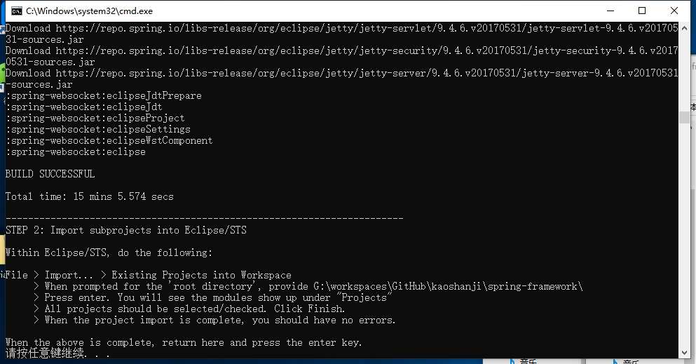

# Java 框架

读 Java 框架的一点理解，看别人的东西还是需要思考一下。

抽象：数据支撑、逻辑驱动

主要内容：
- 角度：如果让你实现上述框架，你该怎么做？
- 控制源码

##  角度

如果让你实现上述框架，你该怎么做？

怎么才算读懂了框架？把流程走通了？了解某些功能的实现？出现问题能准确的定位？好像算是吧，但是比较难以验证，自我感觉是不够的，所以，最简单直接验证的方式是，`自己实现一遍`！你就都了解了，方方面面的细节，虽然有所剪裁，但是，整体也是足够理解。

为什么公司业务项目，出现了问题，或者新需求，丝毫不慌，按部就班即可，那么是不是可以联想一下呢?只能说那代码的结构复杂度有限，也能直接感受到是做什么，一句话概括就是CRUD，然后就是怎样实现的一个过程，把相关实体抽象出来，逻辑线串联起来，基本大概就是这么多，至于代码流程，这是一个模仿复制的过程。

分析一下编码的过程，套路到这里来。

第一步：定位，解决什么问题

第二步：示例，使用演示

1.  了解需求：提供哪些功能，每个功能由那些组件组成，组件对功能的支撑，主要的技术点

2.  业务流程：有那几条逻辑线，完成某功能的过程，可能有几条线会交织在一起

3.  一步一步：每个流程有哪些阶段，每个阶段的逻辑有哪些环节，每个环节应该起到什么作用

4.  对象元素：某流程里需要那些元素实体支撑，实体属性和之间的关系

5.  整体结构：架构结构，代码从何写起，模块怎么划分，接口、类和方法的组织定义，可能有哪些扩展

##  控制源码

在该项目的GitHub里 `Fork` 到自己的账户下，并且依据指定版本创建一个自定义分支，后面代码阅读就是以这个分支为依据，比如：调试、修改、添加注释等。

示例：[spring-framework](https://github.com/spring-projects/spring-framework)，Fork 到自己的[账户](https://github.com/kaoshanji/spring-framework)下，选择分支 `v4.3.24.RELEASE` 作为指定分支，并创建[自己的分支](https://github.com/kaoshanji/spring-framework/tree/kaoshanji-4.3.24)，如此一来，这个分支就由我完全控制了，并不会被官方更新，版本环境被固定，后面就可以进行了。

`测试类`是很好的验证调试方式

- Spring framework 源码编译

安装 JDK 1.8，网络可以观看 8M蓝光直播 最好。

进入文件夹 win/Linux 直接运行 import-into-eclipse.bat/.sh，一路下一步，记最为顺利的一次。

- MyBatis 3.5.1 源码编译

MyBatis 项目是一个 Maven 项目，由本身和父项目组成。

下载下来之后，在 pom.xml 看看 `parent` 指定的版本，也下载到同级目录

然后，当做普通 Maven 项目导入即可，最好使用 IDEA。

