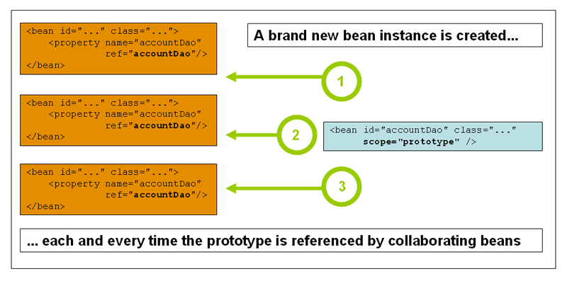

# 7.5 Bean作用域

创建bean定义时，可以创建用于创建由该bean定义定义的类的实际实例的*配方*。bean定义是一个配方的想法很重要，因为它意味着，与一个类一样，您可以从一个配方创建许多对象实例。

您不仅可以控制要插入到从特定bean定义创建的对象的各种依赖项和配置值，还可以控制从特定bean定义创建的对象的*范围*。这种方法功能强大且灵活，您可以*选择*通过配置创建的对象的范围，而不必在Java类级别烘焙对象的范围。可以将Bean定义为部署在多个范围之一中：开箱即用，Spring Framework支持七个范围，其中五个范围仅在您使用Web感知时才可用`ApplicationContext`。

开箱即用支持以下范围。您还可以创建 自定义范围。

**表7.3。Bean范围**

| 范围            | 描述                                                         |
| --------------- | ------------------------------------------------------------ |
| 单例            | （默认）将每个Spring IoC容器的单个bean定义范围限定为单个对象实例。 |
| 原型            | 将单个bean定义范围限定为任意数量的对象实例。                 |
| 请求            | 将单个bean定义范围限定为单个HTTP请求的生命周期; 也就是说，每个HTTP请求都有自己的bean实例，它是在单个bean定义的后面创建的。仅在具有Web感知功能的Spring环境中有效`ApplicationContext`。 |
| 会话            | 将单个bean定义范围限定为HTTP的生命周期`Session`。仅在具有Web感知功能的Spring环境中有效`ApplicationContext`。 |
| globalSession的 | 将单个bean定义范围限定为全局HTTP的生命周期`Session`。通常仅在Portlet上下文中使用时有效。仅在具有Web感知功能的Spring环境中有效`ApplicationContext`。 |
| 应用            | 将单个bean定义范围限定为的生命周期`ServletContext`。仅在具有Web感知功能的Spring环境中有效`ApplicationContext`。 |
| WebSocket       | 将单个bean定义范围限定为a的生命周期`WebSocket`。仅在具有Web感知功能的Spring环境中有效`ApplicationContext`。 |

从Spring 3.0开始，*线程范围*可用，但默认情况下未注册。有关更多信息，请参阅文档 [`SimpleThreadScope`](https://docs.spring.io/spring-framework/docs/4.3.24.RELEASE/javadoc-api/org/springframework/context/support/SimpleThreadScope.html)。

### 7.5.1单例范围

只管理单个bean的一个*共享*实例，并且对具有与该bean定义匹配的id或id的bean的所有请求都会导致Spring容器返回一个特定的bean实例。

换句话说，当您定义bean定义并将其作为单一作用域时，Spring IoC容器只创建该bean定义定义的对象的*一个*实例。此单个实例存储在此类单例bean的缓存中，并且该命名Bean的*所有后续请求和引用*都将返回缓存对象。


Spring的单例bean概念不同于Gang of Four（GoF）模式书中定义的Singleton模式。GoF Singleton对对象的范围进行硬编码，使得*每个ClassLoader*创建一个*且只有一个*特定类的实例。Spring单例的范围最好*按容器和每个bean*描述。这意味着如果在单个Spring容器中为特定类定义一个bean，则Spring容器将创建该bean定义所定义的类的一个*且仅一个*实例。*单例范围是Spring中的默认范围*。要将bean定义为XML中的单例，您可以编写，例如：

```xml
<bean id="accountService" class="com.foo.DefaultAccountService"/>

<!-- the following is equivalent, though redundant (singleton scope is the default) -->
<bean id="accountService" class="com.foo.DefaultAccountService" scope="singleton"/>
```

### 7.5.2原型范围

bean的非单例原型范围部署导致每次发出对该特定bean的请求时都会*创建一个新的bean实例*。也就是说，bean被注入另一个bean，或者通过`getBean()`对容器的方法调用来请求它。通常，对所有有状态bean使用原型范围，对无状态bean使用单例范围。

下图说明了Spring原型范围。数据访问对象（DAO）通常不配置为原型，因为典型的DAO不保持任何会话状态; 这个作者更容易重用单例图的核心。



以下示例将bean定义为XML中的原型：

```xml
<bean  id = “accountService”  class = “com.foo.DefaultAccountService”  scope = “prototype” />
```

与其他作用域相比，Spring不管理原型bean的完整生命周期：容器实例化，配置和组装原型对象，并将其交给客户端，而不再记录该原型实例。因此，尽管无论范围如何都在所有对象上调用*初始化*生命周期回调方法，但在原型的情况下，*不会*调用已配置的*销毁* 生命周期回调。客户端代码必须清理原型范围的对象并释放原型bean所持有的昂贵资源。要让Spring容器释放原型范围的bean所拥有的资源，请尝试使用自定义bean后处理器，它包含对需要清理的bean的引用。

在某些方面，Spring容器关于原型范围bean的角色是Java `new`运算符的替代品。超过该点的所有生命周期管理必须由客户端处理。

### 7.5.3具有原型bean依赖关系的单例bean

当您使用具有依赖于原型bean的单例作用域bean时，请注意 *在实例化时解析依赖项*。因此，如果依赖项将原型范围的bean注入到单例范围的bean中，则会实例化一个新的原型bean，然后将依赖注入到单例bean中。原型实例是唯一提供给单例范围bean的实例。

但是，假设您希望单例范围的bean在运行时重复获取原型范围的bean的新实例。您不能将原型范围的bean依赖注入到您的单例bean中，因为当Spring容器实例化单例bean并解析和注入其依赖项时，该注入只发生 *一次*。如果您需要在运行时多次使用原型bean的新实例，请参见第7.4.6节“方法注入”。

### 7.5.4请求，会话，全局会话，应用程序和WebSocket范围

`request`，`session`，`globalSession`，`application`，和`websocket`范围是 *仅*如果使用基于web的Spring可`ApplicationContext`实现（如`XmlWebApplicationContext`）。如果你将这些范围与常规的Spring IoC容器一起使用`ClassPathXmlApplicationContext`，那么`IllegalStateException`会抛出抱怨未知的bean范围。

#### 初始Web配置

为了支持bean的范围界定在`request`，`session`，`globalSession`， `application`，和`websocket`（即具有web作用域bean），定义你的bean之前，需要做少量的初始配置。（这是初始设置*不* 必需的标准范围，`singleton`和`prototype`）。

如何完成此初始设置取决于您的特定Servlet环境。

如果您访问效果Spring Web MVC框架内范围的bean类，即由Spring处理的请求中`DispatcherServlet`或`DispatcherPortlet`，则没有特殊的设置是必要的：`DispatcherServlet`与`DispatcherPortlet`已公开所有相关的状态。

如果您使用Servlet 2.5 Web容器，并且在Spring之外处理请求 `DispatcherServlet`（例如，使用JSF或Struts时），则需要注册`org.springframework.web.context.request.RequestContextListener` `ServletRequestListener`。对于Servlet 3.0+，可以通过`WebApplicationInitializer` 接口以编程方式完成。或者，或者对于旧容器，将以下声明添加到Web应用程序的`web.xml`文件中：

```xml
<web-app>
    ...
    <listener>
        <listener-class>
            org.springframework.web.context.request.RequestContextListener
        </listener-class>
    </listener>
    ...
</web-app>
```

或者，如果您的侦听器设置存在问题，请考虑使用Spring `RequestContextFilter`。过滤器映射取决于周围的Web应用程序配置，因此您必须根据需要进行更改。

```xml
<web-app>
    ...
    <filter>
        <filter-name>requestContextFilter</filter-name>
        <filter-class>org.springframework.web.filter.RequestContextFilter</filter-class>
    </filter>
    <filter-mapping>
        <filter-name>requestContextFilter</filter-name>
        <url-pattern>/*</url-pattern>
    </filter-mapping>
    ...
</web-app>
```

`DispatcherServlet`，`RequestContextListener`和`RequestContextFilter`所有做同样的事情，即将HTTP请求对象绑定到`Thread`为该请求提供服务的对象。这使得请求和会话范围的bean可以在调用链的下游进一步使用。

#### 请求范围

考虑bean定义的以下XML配置：

```xml
<bean id="loginAction" class="com.foo.LoginAction" scope="request"/>
```

Spring容器`LoginAction`通过`loginAction`对每个HTTP请求使用bean定义来创建bean 的新实例。也就是说， `loginAction`bean的范围是HTTP请求级别。您可以根据需要更改创建的实例的内部状态，因为从同一个`loginAction`bean定义创建的其他实例将不会在状态中看到这些更改; 它们特别针对个人要求。当请求完成处理时，将放弃作用于请求的bean。

使用注释驱动的组件或Java Config时，`@RequestScope`注释可用于将组件分配给`request`范围。

```Java
@RequestScope
@Component
public class LoginAction {
    // ...
}
```

#### 会话范围

考虑bean定义的以下XML配置：

```xml
<bean id="userPreferences" class="com.foo.UserPreferences" scope="session"/>
```

Spring容器`UserPreferences`通过在`userPreferences`单个HTTP的生存期内使用bean定义来创建bean 的新实例`Session`。换句话说，`userPreferences`bean在HTTP `Session`级别上有效地作用域。与`request-scoped`bean一样，您可以根据需要更改创建的实例的内部状态，因为知道`Session`同样使用从同一`userPreferences`bean定义创建的实例的其他HTTP 实例在状态中看不到这些更改，因为它们是特定的个人HTTP `Session`。当`Session`最终丢弃HTTP时`Session`，也将丢弃作用于该特定HTTP的bean 。

使用注释驱动的组件或Java Config时，`@SessionScope`注释可用于将组件分配给`session`范围。

```java
@SessionScope
@Component
public class UserPreferences {
    // ...
}
```

#### 全局会话范围

考虑以下bean定义：

```xml
<bean id="userPreferences" class="com.foo.UserPreferences" scope="globalSession"/>
```

`globalSession`范围是类似于标准HTTP `Session`范围（[如上所述](beans.html#beans-factory-scopes-session)），并且只适用于基于portlet的web应用程序的上下文。portlet规范定义`Session`了构成单个portlet Web应用程序的所有portlet之间共享的全局概念 。在`globalSession`作用域中定义的Bean 的作用域（或绑定）到全局portlet的生存期`Session`。

如果编写基于Servlet的标准Web应用程序并将一个或多个bean定义为具有`globalSession`作用域，`Session`则使用标准HTTP 作用域，并且不会引发错误。

#### 应用范围

考虑bean定义的以下XML配置：

```xml
<bean id="appPreferences" class="com.foo.AppPreferences" scope="application"/>
```

Spring容器`AppPreferences`通过`appPreferences`对整个Web应用程序使用一次bean定义来创建bean 的新实例。也就是说， `appPreferences`bean在该`ServletContext`级别作用域，存储为常规 `ServletContext`属性。这有点类似于Spring单例bean，但在两个重要方面有所不同：它是一个单独的`ServletContext`，不是每个Spring的'ApplicationContext'（在任何给定的Web应用程序中可能有几个），它实际上是暴露的，因此是可见的作为一个`ServletContext`属性。

使用注释驱动的组件或Java Config时，`@ApplicationScope` 注释可用于将组件分配给`application`范围。

```java
@ApplicationScope
@Component
public class AppPreferences {
    // ...
}
```

#### 作为依赖关系的范围bean

Spring IoC容器不仅管理对象（bean）的实例化，还管理协作者（或依赖关系）的连接。如果要将（例如）HTTP请求作用域bean注入到具有较长寿命范围的另一个bean中，您可以选择注入AOP代理来代替作用域bean。也就是说，您需要注入一个代理对象，该对象公开与范围对象相同的公共接口，但也可以从相关范围（例如HTTP请求）中检索真实目标对象，并将方法调用委托给真实对象。

您还可以`<aop:scoped-proxy/>`在作用域的bean之间使用`singleton`，然后通过引用然后通过可序列化的中间代理，从而能够在反序列化时重新获取目标单例bean。

当声明`<aop:scoped-proxy/>`范围的bean时`prototype`，共享代理上的每个方法调用都将导致创建一个新的目标实例，然后该调用将被转发到该目标实例。

此外，范围代理不是以生命周期安全的方式从较短范围访问bean的唯一方法。您也可以简单地将注入点（即构造函数/ setter参数或自动装配字段）声明为`ObjectFactory<MyTargetBean>`允许`getObject()`调用，以便在每次需要时按需检索当前实例 - 无需保留实例或单独存储它。

作为扩展变体，您可以声明`ObjectProvider<MyTargetBean>`哪些提供了多种其他访问变体，包括`getIfAvailable`和`getIfUnique`。

调用JSR-330的变体`Provider`，与`Provider<MyTargetBean>` 声明和`get()`每次检索尝试的相应调用一起使用。有关JSR-330整体的更多详细信息。

以下示例中的配置只有一行，但了解“为什么”以及它背后的“如何”非常重要。

```xml
<?xml version="1.0" encoding="UTF-8"?>
<beans xmlns="http://www.springframework.org/schema/beans"
    xmlns:xsi="http://www.w3.org/2001/XMLSchema-instance"
    xmlns:aop="http://www.springframework.org/schema/aop"
    xsi:schemaLocation="http://www.springframework.org/schema/beans
        https://www.springframework.org/schema/beans/spring-beans.xsd
        http://www.springframework.org/schema/aop
        https://www.springframework.org/schema/aop/spring-aop.xsd">

    <!-- an HTTP Session-scoped bean exposed as a proxy -->
    <bean id="userPreferences" class="com.foo.UserPreferences" scope="session">
        <!-- instructs the container to proxy the surrounding bean -->
        <aop:scoped-proxy/>
    </bean>

    <!-- a singleton-scoped bean injected with a proxy to the above bean -->
    <bean id="userService" class="com.foo.SimpleUserService">
        <!-- a reference to the proxied userPreferences bean -->
        <property name="userPreferences" ref="userPreferences"/>
    </bean>
</beans>
```

要创建这样的代理，请将子`<aop:scoped-proxy/>`元素插入到作用域bean定义中（请参阅“选择要创建的代理类型”一节和 第41章*基于XML模式的配置*）。为什么豆的定义在作用域`request`，`session`， `globalSession`和自定义范围水平要求`<aop:scoped-proxy/>`元素？让我们检查下面的单例bean定义，并将其与您需要为上述范围定义的内容进行对比（请注意，以下`userPreferences`bean定义*不完整*）。

```xml
<bean id="userPreferences" class="com.foo.UserPreferences" scope="session"/>

<bean id="userManager" class="com.foo.UserManager">
    <property name="userPreferences" ref="userPreferences"/>
</bean>
```

在前面的示例中，单例bean `userManager`注入了对HTTP `Session`-scoped bean 的引用`userPreferences`。这里的重点是 `userManager`bean是一个单例：它将在每个容器中实例化*一次*，并且它的依赖项（在这种情况下只有一个，`userPreferences`bean）也只注入一次。这意味着`userManager`bean只能在完全相同的`userPreferences`对象上运行，即最初注入的对象。

当将一个寿命较短的scoped bean注入一个寿命较长的scoped bean时，这*不是*你想要的行为，例如将一个HTTP `Session`-scoped协作bean作为依赖注入singleton bean。相反，您需要一个`userManager` 对象，并且在HTTP的生命周期中`Session`，您需要一个`userPreferences`特定于所述HTTP 的对象`Session`。因此，容器创建一个对象，该对象公开与`UserPreferences`该类完全相同的公共接口（理想情况下*是一个* `UserPreferences`实例的对象），该`UserPreferences`对象可以从作用域机制中获取真实 对象（HTTP请求`Session`等）。容器将这个代理对象注入到`userManager`bean中，而不知道这个`UserPreferences`引用是代理。在此示例中，当`UserManager` 实例在依赖注入`UserPreferences`对象上调用方法时，它实际上是在代理上调用方法。然后，代理 `UserPreferences`从（在这种情况下）HTTP中`Session`获取真实`UserPreferences`对象，并将方法调用委托给检索到的真实对象。

因此，在将注入和bean注入协作对象时`request-`，需要以下正确和完整的配置 ：`session-``globalSession-scoped`

```xml
<bean id="userPreferences" class="com.foo.UserPreferences" scope="session">
    <aop:scoped-proxy/>
</bean>

<bean id="userManager" class="com.foo.UserManager">
    <property name="userPreferences" ref="userPreferences"/>
</bean>
```

##### 选择要创建的代理类型

默认情况下，当Spring容器为使用该`<aop:scoped-proxy/>`元素标记的bean创建代理时，将创建*基于CGLIB的类代理*。

CGLIB代理只拦截公共方法调用！不要在这样的代理上调用非公开方法; 它们不会被委托给实际的作用域目标对象。

或者，您可以通过指定元素属性`false`的值，将Spring容器配置为为此类作用域bean创建基于JDK接口的标准代理。使用基于JDK接口的代理意味着您不需要在应用程序类路径中使用其他库来实现此类代理。但是，这也意味着scoped bean的类必须至少实现一个接口，并且注入scoped bean的*所有*协作者必须通过其中一个接口引用bean。`proxy-target-class``<aop:scoped-proxy/>`

```xml
<!-- DefaultUserPreferences implements the UserPreferences interface -->
<bean id="userPreferences" class="com.foo.DefaultUserPreferences" scope="session">
    <aop:scoped-proxy proxy-target-class="false"/>
</bean>

<bean id="userManager" class="com.foo.UserManager">
    <property name="userPreferences" ref="userPreferences"/>
</bean>
```

有关选择基于类或基于接口的代理的更多详细信息，请参见第11.6节“代理机制”。

### 7.5.5自定义范围

bean作用域是可扩展的; 您可以定义自己的范围，甚至可以重新定义现有范围，尽管后者被认为是不好的做法，您*无法*覆盖内置`singleton`和`prototype`范围。

#### 创建自定义范围

要将自定义作用域集成到Spring容器中，需要实现`org.springframework.beans.factory.config.Scope`本节中描述的 接口。有关如何实现自己的作用域的想法，请参阅`Scope` Spring Framework本身和[`Scope`javadocs](https://docs.spring.io/spring-framework/docs/4.3.24.RELEASE/javadoc-api/org/springframework/beans/factory/config/Scope.html)提供的实现 ，它们解释了您需要更详细地实现的方法。

该`Scope`接口有四种方法可以从作用域中获取对象，从作用域中删除它们，并允许它们被销毁。

以下方法从基础范围返回对象。例如，会话范围实现返回会话范围的bean（如果它不存在，则该方法在将其绑定到会话以供将来参考之后返回该bean的新实例）。

```java
Object get(String name, ObjectFactory objectFactory)
```

以下方法从基础范围中删除对象。例如，会话范围实现从基础会话中删除会话范围的bean。应返回该对象，但如果找不到具有指定名称的对象，则可以返回null。

```Java
Object remove(String name)
```

以下方法注册范围应在销毁时或在范围中指定的对象被销毁时应执行的回调。有关销毁回调的更多信息，请参阅javadocs或Spring作用域实现。

```Java
void registerDestructionCallback(String name, Runnable destructionCallback)
```

以下方法获取基础范围的对话标识符。每个范围的标识符都不同。对于会话范围的实现，该标识符可以是会话标识符。

```java
String getConversationId()
```

#### 使用自定义范围

在编写并测试一个或多个自定义`Scope`实现之后，需要让Spring容器知道您的新范围。以下方法是`Scope`使用Spring容器注册new的核心方法：

```java
void registerScope(String scopeName, Scope scope);
```

此方法在`ConfigurableBeanFactory`接口上声明，该接口在`ApplicationContext`Spring通过BeanFactory属性提供的大多数具体实现中都可用。

该`registerScope(..)`方法的第一个参数是与范围关联的唯一名称; Spring容器本身的这些名称的例子是`singleton`和 `prototype`。该`registerScope(..)`方法的第二个参数是`Scope`您希望注册和使用的自定义实现的实际实例。

假设您编写自定义`Scope`实现，然后按如下所示进行注册。

下面的示例使用`SimpleThreadScope`Spring中包含的示例，但默认情况下未注册。您自己的自定义`Scope` 实现的说明是相同的。

```java
Scope threadScope = new SimpleThreadScope();
beanFactory.registerScope("thread", threadScope);
```

然后，您创建符合自定义的作用域规则的bean定义`Scope`：

```xml
<bean id="..." class="..." scope="thread">
```

使用自定义`Scope`实现，您不仅限于范围的编程注册。您还可以`Scope`使用以下`CustomScopeConfigurer`类以声明方式进行注册 ：

```xml
<?xml version="1.0" encoding="UTF-8"?>
<beans xmlns="http://www.springframework.org/schema/beans"
    xmlns:xsi="http://www.w3.org/2001/XMLSchema-instance"
    xmlns:aop="http://www.springframework.org/schema/aop"
    xsi:schemaLocation="http://www.springframework.org/schema/beans
        https://www.springframework.org/schema/beans/spring-beans.xsd
        http://www.springframework.org/schema/aop
        https://www.springframework.org/schema/aop/spring-aop.xsd">

    <bean class="org.springframework.beans.factory.config.CustomScopeConfigurer">
        <property name="scopes">
            <map>
                <entry key="thread">
                    <bean class="org.springframework.context.support.SimpleThreadScope"/>
                </entry>
            </map>
        </property>
    </bean>

    <bean id="bar" class="x.y.Bar" scope="thread">
        <property name="name" value="Rick"/>
        <aop:scoped-proxy/>
    </bean>

    <bean id="foo" class="x.y.Foo">
        <property name="bar" ref="bar"/>
    </bean>

</beans>
```

放置`<aop:scoped-proxy/>`在`FactoryBean`实现中时，工厂bean本身是作用域的，而不是从中返回的对象`getObject()`。
