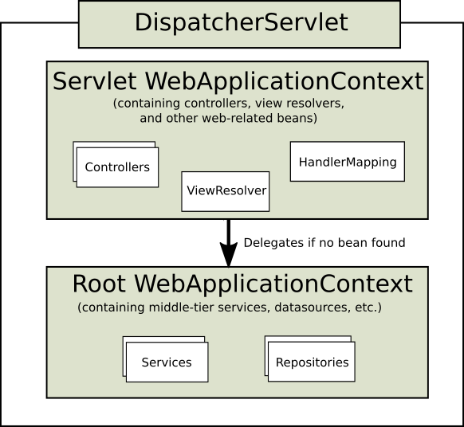

# 22.2 DispatcherServlet

与许多其他Web MVC框架一样，Spring的Web MVC框架是围绕中央Servlet设计的请求驱动的，该Servlet向控制器发送请求并提供便于Web应用程序开发的其他功能。`DispatcherServlet`然而，春天 不仅仅是那个。它与Spring IoC容器完全集成，因此允许您使用Spring拥有的所有其他功能。

Spring Web MVC的请求处理工作流程`DispatcherServlet`如下图所示。精通模式的读者将认识到它 `DispatcherServlet`是“前端控制器”设计模式的表达（这是Spring Web MVC与许多其他领先的Web框架共享的模式）。

**图22.1。Spring Web MVC中的请求处理工作流程（高级）**


它`DispatcherServlet`是一个实际的`Servlet`（它继`HttpServlet`承自基类），因此在您的Web应用程序中声明。您需要`DispatcherServlet`使用URL映射来映射您要处理的请求。以下是Servlet 3.0+环境中的标准Java EE Servlet配置：

```java
public class MyWebApplicationInitializer implements WebApplicationInitializer {

    @Override
    public void onStartup(ServletContext container) {
        ServletRegistration.Dynamic registration = container.addServlet("example", new DispatcherServlet());
        registration.setLoadOnStartup(1);
        registration.addMapping("/example/*");
    }
}
```

在前面的示例中，所有以请求开头的请求`/example`都将由`DispatcherServlet`名为的实例处理 `example`。

`WebApplicationInitializer`是Spring MVC提供的接口，可确保检测到基于代码的配置并自动用于初始化任何Servlet 3容器。这个接口的抽象基类实现命名`AbstractAnnotationConfigDispatcherServletInitializer`使得`DispatcherServlet`通过简单地指定它的servlet映射和列出配置类来更容易注册 - 它甚至是建议你设置Spring MVC应用程序的方法。有关更多详细信息，请参阅[基于代码的Servlet容器初始化](mvc.html#mvc-container-config)

它`DispatcherServlet`是一个实际的`Servlet`（它继`HttpServlet`承自基类），因此`web.xml`在您的Web应用程序中声明。您需要`DispatcherServlet`使用同一`web.xml`文件中的URL映射来映射您要处理的请求。这是标准的Java EE Servlet配置; 以下示例显示了这样的`DispatcherServlet`声明和映射：

下面是`web.xml`相当于上面代码的示例：

```xml
<web-app>
    <servlet>
        <servlet-name>example</servlet-name>
        <servlet-class>org.springframework.web.servlet.DispatcherServlet</servlet-class>
        <load-on-startup>1</load-on-startup>
    </servlet>

    <servlet-mapping>
        <servlet-name>example</servlet-name>
        <url-pattern>/example/*</url-pattern>
    </servlet-mapping>

</web-app>
```

正如详述[第7.15节“ApplicationContext中的其他功能”](beans.html#context-introduction)，`ApplicationContext`在春实例可以作用域。在Web MVC框架中，每个框架`DispatcherServlet`都有自己的 框架，`WebApplicationContext`它继承了根中已经定义的所有bean `WebApplicationContext`。根`WebApplicationContext`应该包含应该在其他上下文和Servlet实例之间共享的所有基础结构bean。可以在特定于servlet的作用域中重写这些继承的bean，并且可以为给定的Servlet实例定义新的作用域特定的bean。

**图22.2。Spring Web MVC中的典型上下文层次结构**



在初始化a时`DispatcherServlet`，Spring MVC 在Web应用程序的目录中查找名为 *[servlet-name] -servlet.xml*的`WEB-INF`文件，并创建在那里定义的bean，覆盖在全局范围内使用相同名称定义的任何bean的定义。

考虑以下`DispatcherServlet`Servlet配置（在`web.xml`文件中）：

```xml
<web-app>
    <servlet>
        <servlet-name>golfing</servlet-name>
        <servlet-class>org.springframework.web.servlet.DispatcherServlet</servlet-class>
        <load-on-startup>1</load-on-startup>
    </servlet>
    <servlet-mapping>
        <servlet-name>golfing</servlet-name>
        <url-pattern>/golfing/*</url-pattern>
    </servlet-mapping>
</web-app>
```

使用上面的Servlet配置，您需要`/WEB-INF/golfing-servlet.xml`在应用程序中调用一个文件 ; 此文件将包含所有Spring Web MVC特定组件（bean）。您可以通过Servlet初始化参数更改此配置文件的确切位置（有关详细信息，请参阅下文）。

对于单个DispatcherServlet方案，也可以只有一个根上下文。


**图22.3。Spring Web MVC中的单根上下文**


这可以通过设置一个空的contextConfigLocation servlet init参数来配置，如下所示：

```xml
<web-app>
    <context-param>
        <param-name>contextConfigLocation</param-name>
        <param-value>/WEB-INF/root-context.xml</param-value>
    </context-param>
    <servlet>
        <servlet-name>dispatcher</servlet-name>
        <servlet-class>org.springframework.web.servlet.DispatcherServlet</servlet-class>
        <init-param>
            <param-name>contextConfigLocation</param-name>
            <param-value></param-value>
        </init-param>
        <load-on-startup>1</load-on-startup>
    </servlet>
    <servlet-mapping>
        <servlet-name>dispatcher</servlet-name>
        <url-pattern>/*</url-pattern>
    </servlet-mapping>
    <listener>
        <listener-class>org.springframework.web.context.ContextLoaderListener</listener-class>
    </listener>
</web-app>
```

它`WebApplicationContext`是plain的扩展`ApplicationContext`，具有Web应用程序所需的一些额外功能。它与普通的不同之处 `ApplicationContext`在于它能够解析主题（参见 [第22.9节“使用主题”](mvc.html#mvc-themeresolver)），并且它知道它与哪个Servlet相关联（通过链接到它`ServletContext`）。它`WebApplicationContext`受到限制`ServletContext`，并且通过在`RequestContextUtils`类上使用静态方法，`WebApplicationContext`如果需要访问它，您可以随时查找它。

请注意，我们可以使用基于java的配置实现相同的功能：

```java
public class GolfingWebAppInitializer extends AbstractAnnotationConfigDispatcherServletInitializer {

    @Override
    protected Class<?>[] getRootConfigClasses() {
        // GolfingAppConfig defines beans that would be in root-context.xml
        return new Class<?>[] { GolfingAppConfig.class };
    }

    @Override
    protected Class<?>[] getServletConfigClasses() {
        // GolfingWebConfig defines beans that would be in golfing-servlet.xml
        return new Class<?>[] { GolfingWebConfig.class };
    }

    @Override
    protected String[] getServletMappings() {
        return new String[] { "/golfing/*" };
    }
}
```

### 22.2.1 WebApplicationContext中的特殊Bean类型

Spring `DispatcherServlet`使用特殊bean来处理请求并呈现适当的视图。这些bean是Spring MVC的一部分。您可以通过简单地在其中配置一个或多个来选择要使用的特殊bean `WebApplicationContext`。但是，您最初不需要这样做，因为如果您不配置任何默认Bean，则Spring MVC会维护一个默认Bean列表。更多内容将在下一节中介绍。首先看下面列出了`DispatcherServlet`依赖的特殊bean类型。


**表22.1。WebApplicationContext中的特殊bean类型**

| 豆类型                                                       | 说明                                                         |
| ------------------------------------------------------------ | ------------------------------------------------------------ |
| [HandlerMapping](mvc.html#mvc-handlermapping)                | 根据某些标准将传入请求映射到处理程序以及预处理器和后处理器列表（处理程序拦截器），其详细信息因`HandlerMapping` 实现而异。最流行的实现支持带注释的控制器，但也存在其他实现。 |
| HandlerAdapter                                               | `DispatcherServlet`无论是否实际调用了处理程序，都可以帮助调用映射到请求的处理程序。例如，调用带注释的控制器需要解析各种注释。因此，a的主要目的`HandlerAdapter`是保护`DispatcherServlet`这些细节。 |
| [HandlerExceptionResolver](mvc.html#mvc-exceptionhandlers)   | 将异常映射到视图也允许更复杂的异常处理代码。                 |
| [ViewResolver](mvc.html#mvc-viewresolver)                    | 将基于逻辑字符串的逻辑视图名称解析为实际`View`类型。         |
| [LocaleResolver](mvc.html#mvc-localeresolver)和[LocaleContextResolver](mvc.html#mvc-timezone) | 解析客户端正在使用的区域设置以及可能的时区，以便能够提供国际化视图 |
| [ThemeResolver的](mvc.html#mvc-themeresolver)                | 解析Web应用程序可以使用的主题，例如，提供个性化布局          |
| [MultipartResolver](mvc.html#mvc-multipart)                  | 解析多部分请求，例如支持从HTML表单处理文件上载。             |
| [FlashMapManager](mvc.html#mvc-flash-attributes)             | 存储和检索“输入”和“输出” `FlashMap`，可用于将属性从一个请求传递到另一个请求，通常是通过重定向。 |

### 22.2.2默认DispatcherServlet配置

正如上一节中针对每个特殊bean所提到的，`DispatcherServlet` 维护一个默认使用的实现列表。此信息保存在`DispatcherServlet.properties`包中的文件中`org.springframework.web.servlet`。

所有特殊bean都有一些合理的默认值。迟早虽然你需要定制这些bean提供的一个或多个属性。例如，将`InternalResourceViewResolver`其`prefix` 属性的设置配置为视图文件的父位置是很常见的。

无论细节如何，这里要理解的重要概念是，一旦你配置了一个特殊的bean，比如`InternalResourceViewResolver`你的 `WebApplicationContext`，你就会有效地覆盖那些特殊bean类型所使用的默认实现列表。例如，如果配置a `InternalResourceViewResolver`，`ViewResolver` 则忽略默认的实现列表。

在[第22.16节“配置Spring MVC”中，](mvc.html#mvc-config)您将了解配置Spring MVC的其他选项，包括MVC Java配置和MVC XML命名空间，这两个选项都提供了一个简单的起点，并且对Spring MVC的工作原理知之甚少。无论您如何选择配置应用程序，本节中介绍的概念都应该对您有所帮助。

### 22.2.3 DispatcherServlet处理序列

设置a后`DispatcherServlet`，请求进入该特定 `DispatcherServlet`，`DispatcherServlet`开始处理请求，如下所示：

- 在`WebApplicationContext`被搜索并在请求作为在过程控制器和其它元件可以利用一个属性的约束。它默认绑定在密钥下`DispatcherServlet.WEB_APPLICATION_CONTEXT_ATTRIBUTE`。
- 语言环境解析器绑定到请求，以使进程中的元素能够解析处理请求时使用的语言环境（呈现视图，准备数据等）。如果您不需要区域设置解析，则不需要它。
- 主题解析器绑定到请求，以允许视图等元素确定要使用的主题。如果您不使用主题，则可以忽略它。
- 如果指定了多部分文件解析程序，则会检查请求的多部分; 如果找到多部分，则请求被包装在`MultipartHttpServletRequest`进程中的其他元素的进一步处理中。有关多部分处理的更多信息[，](mvc.html#mvc-multipart)请参见[第22.10节“Spring的多部分（文件上载）支持”](mvc.html#mvc-multipart)。
- 搜索适当的处理程序。如果找到处理程序，则执行与处理程序（预处理程序，后处理程序和控制器）关联的执行链以准备模型或呈现。
- 如果返回模型，则呈现视图。如果没有返回模型（可能是由于预处理器或后处理器拦截请求，可能是出于安全原因），则不会呈现任何视图，因为该请求可能已经完成。

`WebApplicationContext`在处理请求期间抛出的拾取异常中声明的处理程序异常解析程序。使用这些异常解析器可以定义自定义行为以解决异常。

Spring `DispatcherServlet`还支持返回 *最后修改日期*，由Servlet API指定。确定特定请求的最后修改日期的过程很简单： `DispatcherServlet`查找适当的处理程序映射并测试找到的处理程序是否实现*LastModified*接口。如果是，则将接口`long getLastModified(request)`方法的值 `LastModified`返回给客户端。

您可以`DispatcherServlet`通过将Servlet初始化参数（`init-param`元素）添加到`web.xml`文件中的Servlet声明来自 定义单个实例。有关支持的参数列表，请参阅下表。


**表22.2。DispatcherServlet初始化参数**

| 参数                    | 说明                                                         |
| ----------------------- | ------------------------------------------------------------ |
| `contextClass`          | 实现`ConfigurableWebApplicationContext`，由此Servlet实例化和本地配置的类。默认情况下，`XmlWebApplicationContext`使用。 |
| `contextConfigLocation` | 传递给上下文实例（由其指定`contextClass`）的字符串，用于指示可以在何处找到上下文。该字符串可能包含多个字符串（使用逗号作为分隔符）以支持多个上下文。如果多个上下文位置的bean定义了两次，则最新位置优先。 |
| `namespace`             | 命名空间`WebApplicationContext`。默认为`[servlet-name]-servlet`。 |

