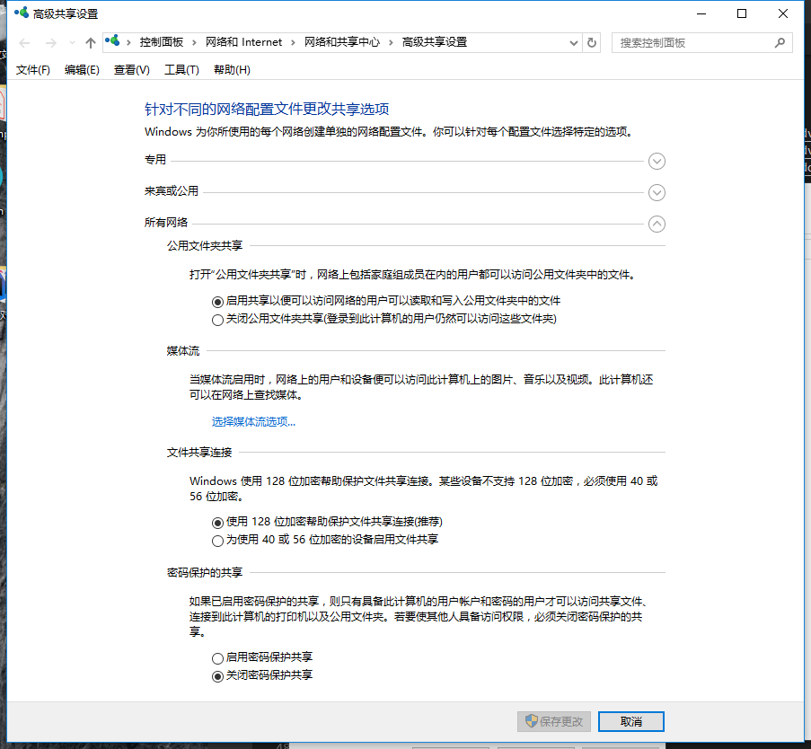
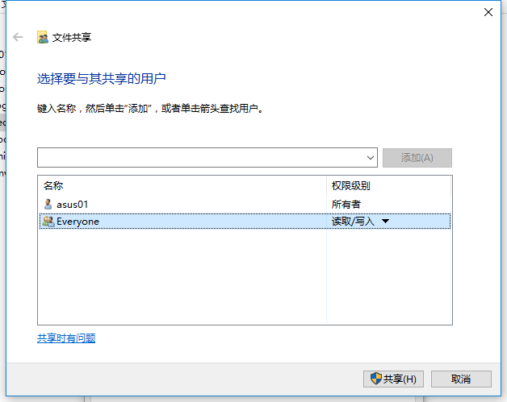

#   win/mac/linux 共享文件

##  win/Mac 共享

-   win

1.  
选择`共享`
2.  
3.  
4.  

-   Mac

----

##  Linux(CentOS) 共享：Samba[来源](http://blog.51cto.com/lybing/1676515)

### 前提条件
- 查看 Windows 网络信息
```
    net config workstation
```
- 
- Windows 机器必须和这台CentOS7在同一个工作组
- 查看及安装 samba
```
sudo rpm -qa | grep samba
// CentOS 7 安装了 samba-client samba-common
// 安装 samba 服务器部分
sudo yum install samba
```
- 备份Samba配置文件
```
sudo cp /etc/samba/smb.conf /etc/samba/smb.conf.bak
// /etc/samba 是 samba配置目录，里面有个配置示例文件
```

### Samba匿名共享
- 清除掉里面配置
```
sudo vi /etc/samba/smb.conf
```

- 复制下面的内容
```
[global]
workgroup = WORKGROUP
server string = Samba Server %v
netbios name = centos
security = user
map to guest = bad user
dns proxy = no
#============================ Share Definitions ============================== 
[Anonymous]
path = /samba/anonymous
browsable =yes
writable = yes
guest ok = yes
read only = no
 
:wq#保存并退出
```

- 创建文件夹
```
sudo mkdir -p /samba/anonymous
```

- 重启`smb`
```
sudo systemctl enable smb.service
sudo systemctl enable nmb.service
sudo systemctl restart smb.service
sudo systemctl restart nmb.service
```

- 防火墙
```
sudo firewall-cmd --permanent --zone=public --add-service=samba
sudo firewall-cmd --reload
```

- 匿名用户文件夹权限
```
cd /samba
sudo chmod -R 0755 anonymous/
sudo chown -R nobody:nobody anonymous/
```

- 配置Selinux
```
chcon -t samba_share_t anonymous/
```

- Windows 访问
    - 打开命令行
    - \\\centos


----

