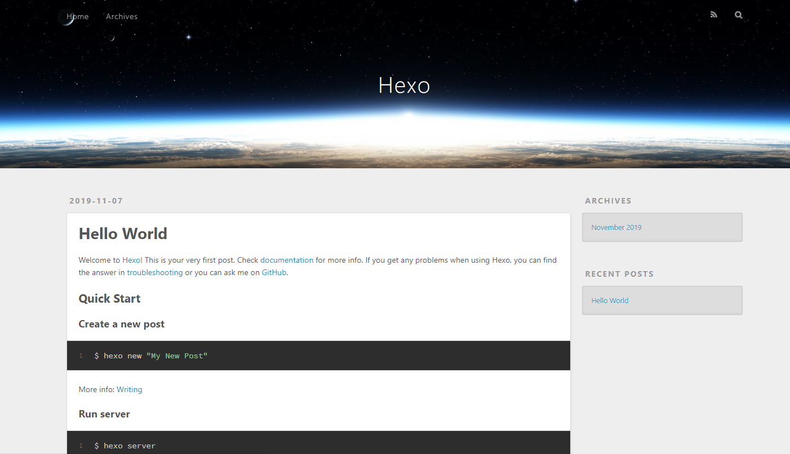
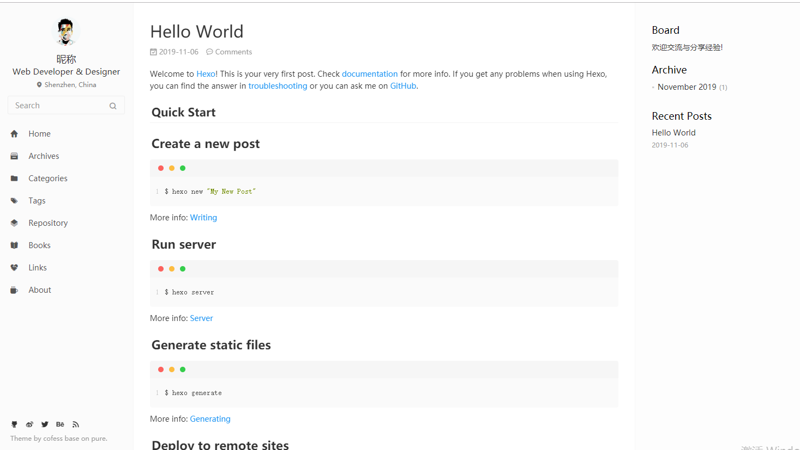
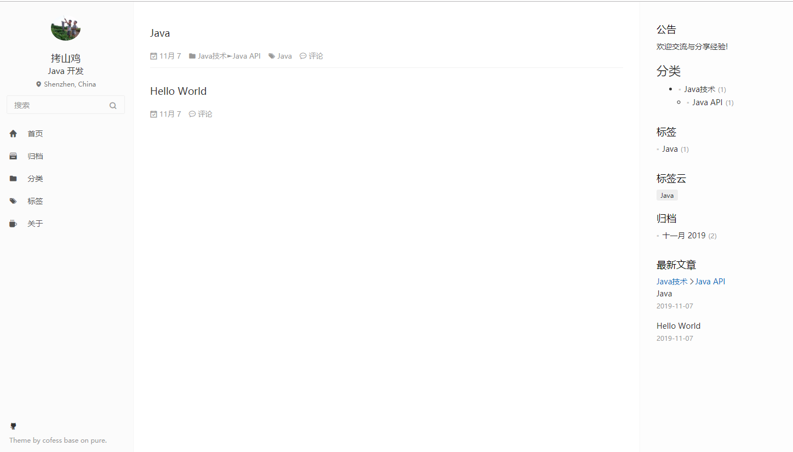
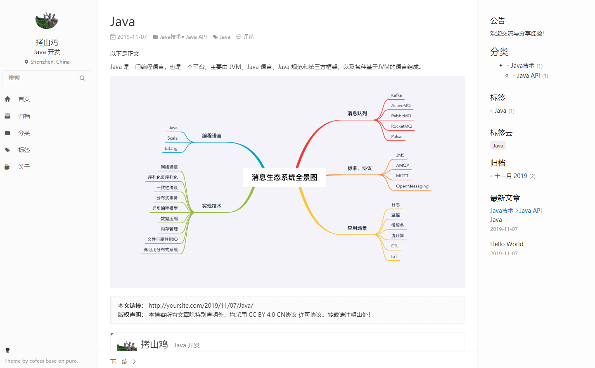

# Hexo 搭建个人博客

- 目录
  - 准备和预览
  - 主题
  - 完善网站
  - 部署 GitHub
  - 源文件


##  准备和预览

[Hexo](https://hexo.io/zh-cn/) 使用 NodeJs 制作的工具，功能是将md文件等转换为html，通过主题个性化界面，再集成一些其他插件提供各种功能，配合完成个人博客系统。

大概流程是：在本地安装 Hexo，生成md文件写作再本地预览，发布到服务器或者GitHub上，就可以了。

- 使用的工具：
  - [NodeJs](http://nodejs.cn/)：运行环境
  - [Git](https://git-scm.com/)：版本管理，发布到GitHub还需要一个账号
  - [vs code](https://code.visualstudio.com/)：md文件写作
- 安装 Hexo：打开cmd

```
npm install -g hexo-cli
```

- 初始化博客

```
// 选择某个空文件夹 myblog ，在里面打开 git Bash
hexo init    // 初始化
hexo g       // 转换生成，多出了 public 文件夹
hexo s       // 启动运行
```

打开浏览器，http://localhost:4000/ ，看到的大概是这样



使用的是默认主题： landscape

- 主要配置文件
  - 博客文件夹下：myblog/_config.yml(网站配置文件)，管理全局
  - 主题文件夹下：myblog/themes/xxx/_config.yml(主题配置文件)，指定主题

接下来就是改造了，我选择的主题是：[hexo-theme-pure](https://github.com/cofess/hexo-theme-pure)，以下操作都是在 git Bash 界面操作。


##  主题

1. 安装主题

```
cd themes/                 // 移动到 主题 文件夹下
pwd                        // 确认一下
  // 输出 /g/workspaces/myblog/themes  // 博客文件夹下的themes目录
git clone https://github.com/cofess/hexo-theme-pure.git  // 下载主题
cd ../  回到博客文件夹下
```

2. 修改配置

配置文件里具体参数可以查看官方文档

- 网站配置文件

```
// Site 其他参数自己修改就行
language： zh-CN             // 国际化 themes\hexo-theme-pure\languages 文件名称
timezone: 'UTC'              // 时区 

// Writing
new_post_name: :year/:month/:title  // 文件按照年月分类

// Themes 配置主题
theme: hexo-theme-pure      // themes 目录下文件夹名称

```

- 启动运行

```
hexo clean                  // 清理，public 文件夹会被删除
hexo g
hexo s
```

看到的大概是这样



- 主题配置文件

```
// 去掉一些菜单，也可以留着，先最小化使用
// menu
   Home: /
#  Repository: repository  # github repositories
#  Books: books  # 豆瓣书单
#  Links: links  # 友链

// menu_icons
#  repository: icon-project
#  books: icon-book-fill
#  links: icon-friendship

# rss
# rss: /atom.xml

# site 右上角显示的信息

// donate 打赏信息，在文章详情页显示出来了
  enable: false

// share 分享
  enable: false

// github github地址
  username: kaoshanji(改成自己的)

// profile
profile:
  enabled: true # Whether to show profile bar
  avatar: images/avatar.jpg
  gravatar: # Gravatar email address, if you enable Gravatar, your avatar config will be overriden
  author: 拷山鸡
  author_title: Java 开发
  author_description: 人丑多读书
  location: Shenzhen, China
  follow: https://github.com/kaoshanji
  # Social Links
  social:
    links:
      github: https://github.com/kaoshanji
      # weibo: http://weibo.com/cofess
      # twitter: https://twitter.com/iwebued
      # facebook: /
      # dribbble: /
      # behance: https://www.behance.net/cofess
      # rss: atom.xml
    link_tooltip: true # enable the social link tooltip, options: true, false
  # My Skills 
#   skills:
#     Git: ★★★☆☆
#     Gulp: ★★★☆☆
#     Javascript: ★★★☆☆
#     HTML+CSS: ★★★☆☆
#     Bootstrap: ★★★☆☆
#     ThinkPHP: ★★★☆☆
#     平面设计: ★★★☆☆
  # My Personal Links
#  links:
#     Github: https://github.com/cofess
#     Blog: http://blog.cofess.com
#     微博: http://weibo.com/cofess
#     花瓣: http://huaban.com/cofess
#     Behance: https://www.behance.net/cofess
  # My Personal Labels
#   labels:
#     - 前端
#     - 前端开发
#     - 前端重构
#     - Web前端
#     - 网页重构
  # My Personal Works
#   works:
#     name:
#       link: http://www.example.com
#       date: 2016

# My Personal Projects
#  projects:
#    cofess/gulp-startpro: https://github.com/cofess/gulp-startpro
#    cofess/hexo-theme-pure: https://github.com/cofess/hexo-theme-pure

```

更换头像： `myblog\themes\hexo-theme-pure\source\images\avatar.jpg`

删掉: `myblog\themes\hexo-theme-pure\.git、.gitignore`

再次启动运行


##  完善网站

网站主要是用来写博客，因此，分类、标签等等功能都需要能使用，右边也应该出现树形的分类，创建文章也需要能正常访问。


1.  左边栏

```
// myblog 目录下

hexo new page "about"
hexo new page "tags"
hexo new page "categories"

```

在 myblog/source 目录下会创建对应的文件夹和文件，分别修改
```

// source/about/index.md

---
title: 关于
date: 2019-11-07 14:07:19
type: "about"
layout: "about"
---

// source/categories/index.md

---
title: 分类
date: 2019-11-07 14:07:47
type: "categories"
layout: "categories"
---

// source/tags/index.md

---
title: 标签
date: 2019-11-07 14:07:37
type: "tags"
layout: "tags"
---

```

2. 文章模板

在 myblog/scaffolds 这三个文件是创建文章指定格式，分别代表不同的模式，不过，全都改成一样，设置文章 标签和分类。

```

---
title: {{ title }}
date: {{ date }}
tags:
categories:
---

```

3. 创建文章

```
hexo new Java                    // Java 是文件名称也是标题
  --> myblog\source\_posts\2019\11\Java.md     创建的文件都是放在_posts目录下，现在已经被改成年月存放，不会出现一个目录出现太多文件了

```

编辑 `Java.md` 文件，注意空格，分类应该是 `Java技术 -> Java API` 成树形

图片路径：source\images ，这个放置图片，也可以分类，这样编辑在vscode没有正常显示。

```
---
title: Java
date: 2019-11-07 14:17:36
tags: Java
categories: 
- Java技术
- Java API
---

以下是正文

Java 是一门编程语言，也是一个平台，主要由 JVM、Java 语言、Java 规范和第三方框架，以及各种基于JVM的语言组成。


```

md 文件可以使用 vsCode 编写，符合md格式就行。

运行一下

`categories` 下是两级目录，但是呈现并列显示

4. 分类树形显示

样式格式的原因

```
// themes\hexo-theme-pure\layout\_widget\category.ejs
// 覆盖替换掉

<% if (site.categories.length){ %>
<div class="category-block">
  <h3 class="asidetitle"><%= __('widget.categories') %></h3>
	 <%- list_categories(site.categories) %>
</div>
<% } %>

```

```
// themes\hexo-theme-pure\source\css\style.css
// 最下面添加

//categories
.category-block>ul>li
  border-bottom 1px solid #ccc
.category-block li
  margin-bottom 8px
.category-list
  @media mini
    width 45%
    float left
    margin 0 5% 0 0
  @media tablet
    width 100%
    float none
    margin .5em 0 0
  .categoriy-list-item
    padding .5em 5%
  .category-list-count
    top -.5em
    padding-left .3em
    font-size 75%
    line-height 0
    position relative
    vertical-align baseline
  ul, ol, dl
    list-style none
  ul, ol, dl
    background-color #f9f9fa
    margin-left 20px
    li
      border-bottom 1px dashed #ccc
  .category-list-child
    border-top 1px dashed #ccc
    margin-bottom 8px

```

现在就树形显示了

5. 最终效果

- 首页
  - 
- 文章详情
  - 

##  部署 GitHub

在GitHub上创建一个与你的名字一样的 `repository`.

我的用户名是 kaoshanji，就创建名为`kaoshanji.github.io` 的 repository。

```
// 网站配置文件
deploy:
  type: git
  repo: https://github.com/YourgithubName/YourgithubName.github.io.git
  branch: master
```

```
// myblog 目录下
npm install hexo-deployer-git --save

hexo clean
hexo generate
hexo deploy

// 弹出框填写 GitHub 用户名和密码
```

浏览器中输入 http://yourgithubname.github.io 就可以看到你的个人博客


##  源文件

部署 GitHub 上面时，只是提交生成之后的文件，其他文件特别是 source 目录下的生成的源文件没有被提交，这些也需要被管理起来，正好也可以使用 GitHub。

[hexo 多终端同步博客](https://www.jianshu.com/p/1ae341483683)


