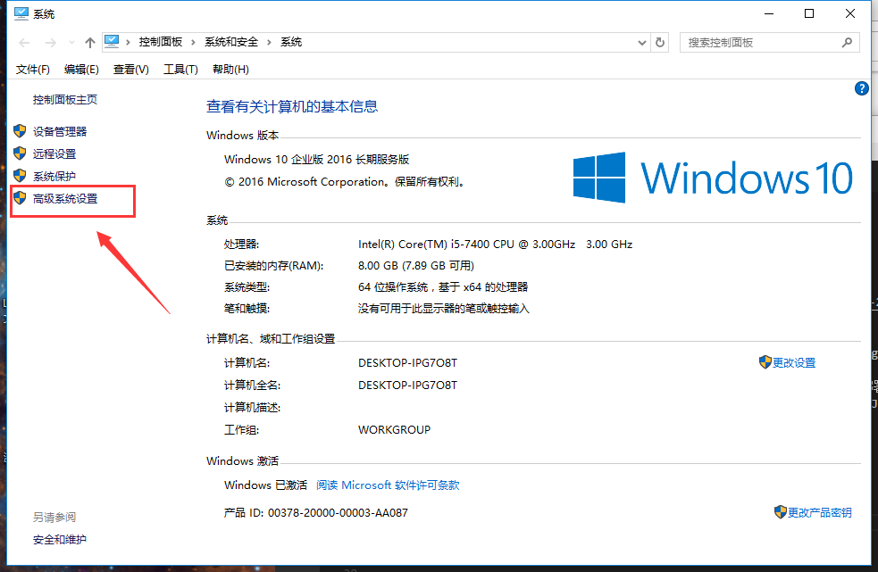
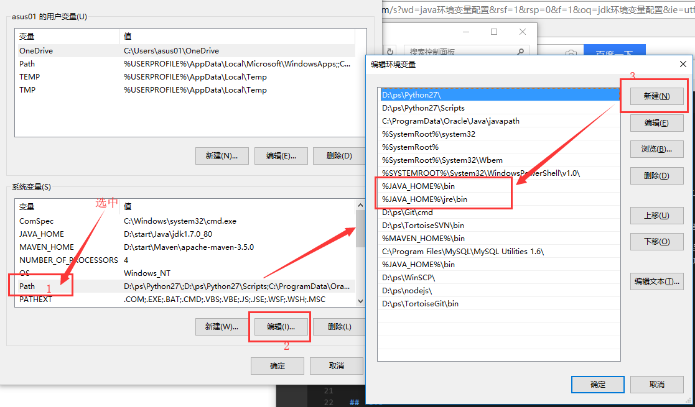
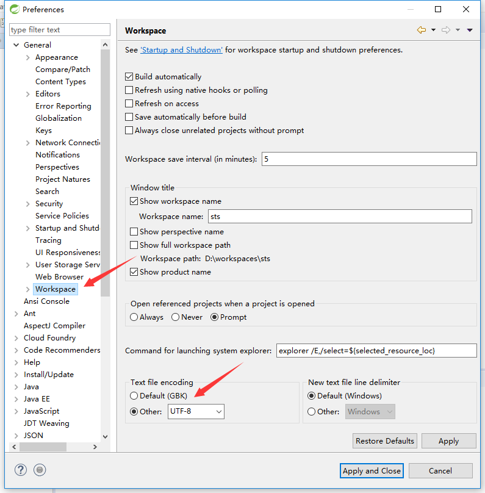
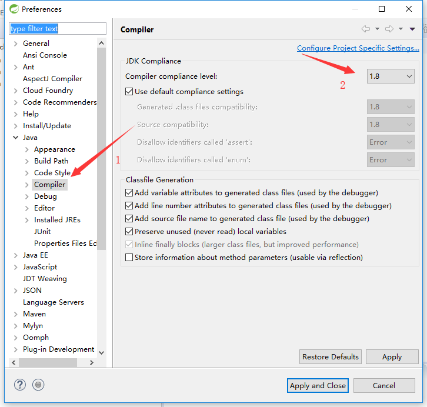
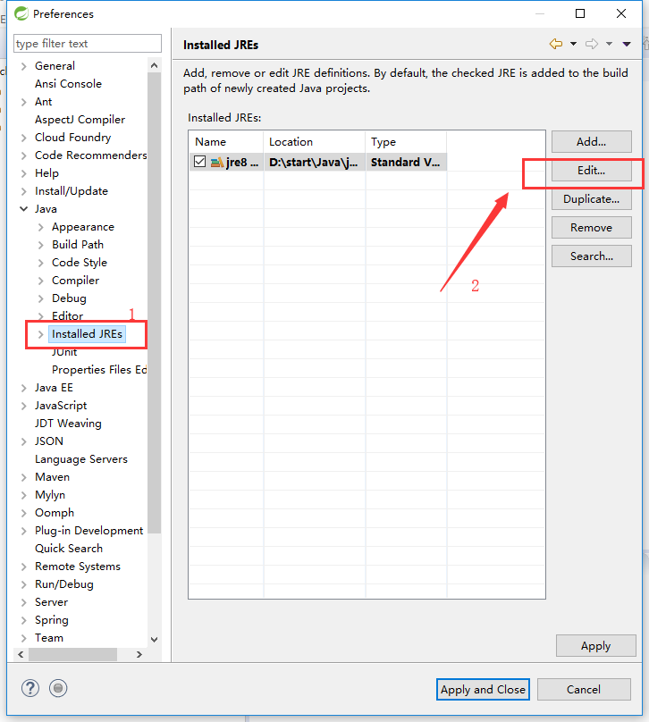
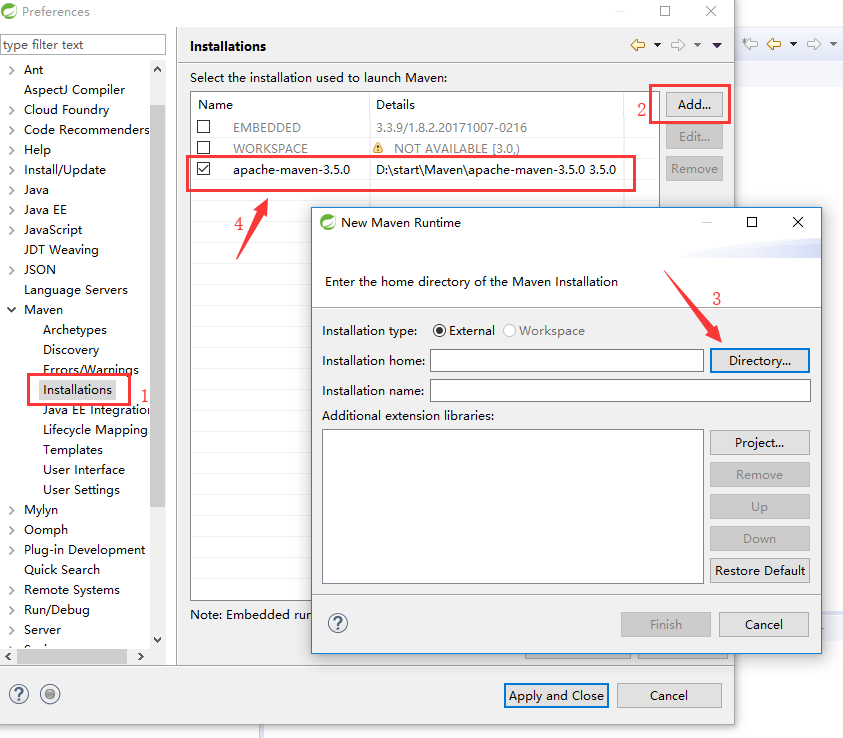
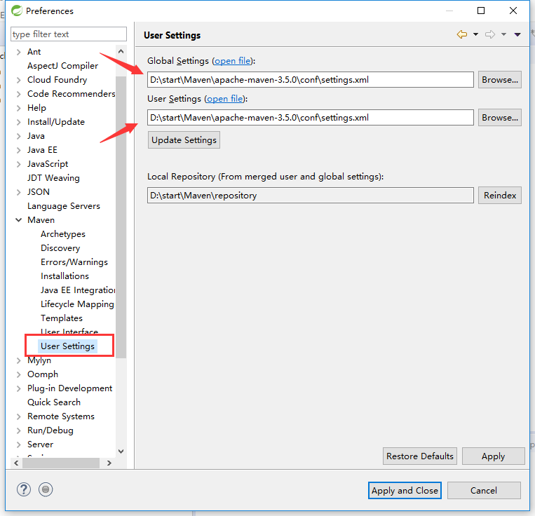
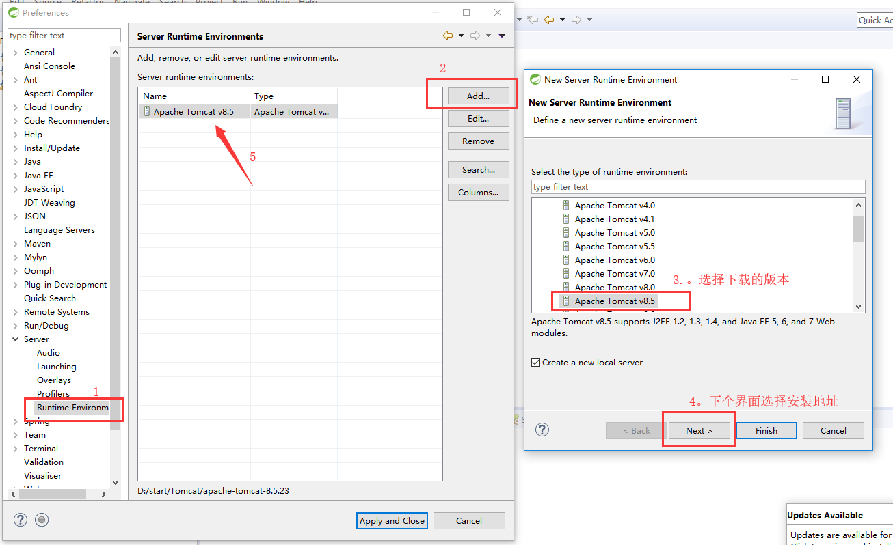
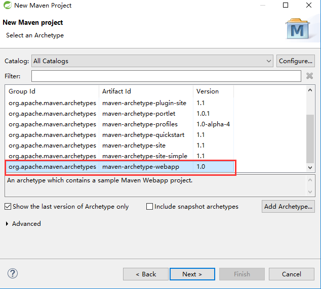
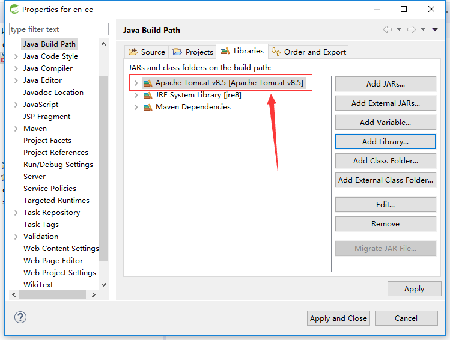

#   搭建Java  本地开发环境

流程：OS完善 --> 下载软件 --> 安装 --> 配置环境 --> HelloWord

##  OS完善

[操作系统安装](002.md)

对系统升级、安装驱动、删掉一些自带的东西，硬件资源查看、优化启动项、目录磁盘规划、清理垃圾

-   Win：[腾讯管家](https://guanjia.qq.com/)，他都给搞定了
-   Ubuntu，u盘安装过程中，选择`最小安装`、`安装时更新`，这样安装完成之后就不需要删东西

``` bash
// 更新资源
sudo apt-get  update

// 软件升级
sudo  apt-get  upgrade

// 安装系统更新。。如果是长期版本就不要升了，并设置更新：`软件和更新` --> 更新 --> 有新版本时通知我，改为 '适用长期支持版本'
sudo  apt-get  dist-upgrade

```

-   浏览器，先用自带浏览器打开
    -   [火狐](https://www.mozilla.org/zh-CN/firefox/new/)，不要用.com.cn这个网站，就像是原版ubantu与优麒麟一样，不是一个团队搞得
        -   同步服务器并不兼容，前者是全球，可以在任意系统使用，后者是中国大陆，需要特别设置才会切换到全球
        -   用火狐就是因为同步啊，很少看到广告
    -   [谷歌](https://www.google.cn/chrome/)，居然可以下载浏览器，但是不能搜索
-   目录规划
    -   选择某个盘建：app 文件夹，作为根目录
    -   app/GitHub，GitHub 拉下来的项目，以账户名作为下级目录，如：app/GitHub/kaoshanji，里面就是项目，再有 GitLab 等同级
    -   app/tool，放置下载下来涉及到开发的软件，某软件以来的文件夹也放在里面，如 Maven仓库：app/tool/maven-repo
    -   works：工作空间，某软件工作空间，不会上传，如： vscode
    -   tmp：备份目录，保留一下

----

##  软件清单
|名称|版本|描述|下载|备注|
|----|----|----|----|----|
|JDK|11|Java平台环境|[地址](https://www.oracle.com/technetwork/java/javase/downloads/jdk11-downloads-5066655.html)|选择OS对应版本，长期至此版本|
|Eclipse|最新版|Java开发工具|[地址](https://www.eclipse.org/downloads/packages/)|Java应用开发|
|IDEA|最新版|Java开发工具|[地址](http://www.jetbrains.com/idea/)|Java应用开发|
|STS|最新版|Java开发工具|[地址](https://spring.io/tools/sts/)|Spring应用开发|
|Maven|最新版|Java依赖包管理|[地址](https://maven.apache.org/)|第三方包管理，部署打包|
|Ant|最新版|Java依赖包管理|[地址](http://ant.apache.org/)|tomcat编译需要|
|Tomcat|最新版|Java Web运行环境|[地址](http://tomcat.apache.org/)|Java Servlet规范实现|
|datagrip|最新版|多种数据库客户端|[地址](http://www.jetbrains.com/datagrip/)|Jetbrains出品|
|CLion|最新版|开发工具|[地址](http://www.jetbrains.com/clion/)|C/C++应用开放，JVM是个C++项目|
|[Git](002.md)|最新版|版本控制|[地址](https://git-scm.com/)|win下载下来安装，ubantu在线安装|
|vsCode|最新版|开发工具|[地址](https://code.visualstudio.com/)|微软出品|

----

ubantu 下解压就安装了..win，一路下一步，注意安装路径

----

##  配置环境

>   变量是软件安装目录

### win

-   环境变量配置："此电脑/计算机"-->属性(右键)
-   
-   
-   系统变量--新建，上面是名，下面是值

-   JDK
    -   与普通软件安装一样，注意选择路径
    -   
    -   
    ```
    JAVA_HOME= xxx    // 安装的路径 JDK 11没有jre目录
    %JAVA_HOME%\bin
    ```

-   maven、ant，加入环境配置与JDK相同
    -   MAVEN_HOME=xxx  // 安装的路径
    -   ANT_HOME=xxx  // 安装的路径

### ubantu

```
// 删除自带JDK

sudo dpkg --list | grep -i jdk
sudo apt-get purge openjdk*

// 打开配置环境 文件
sudo gedit  /etc/profile

# JDK
export JAVA_HOME=/home/kaoshanji/app/tool/jdk-11.0.5
export CLASSPATH=.:$JAVA_HOME/lib
export PATH=$JAVA_HOME/bin:$PATH

# ANT 
export ANT_HOME=/home/kaoshanji/app/tool/apache-ant-1.10.7
export PATH=${ANT_HOME}/bin:$PATH

# MAVEN
export MAVEN_HOME=/home/kaoshanji/app/tool/apache-maven-3.6.3
export MAVEN_OPTS="-Xms256m -Xmx512m"
export PATH=$MAVEN_HOME/bin:$PATH

// 刷新一下
sudo su     //需要切换到 root 用户下
source /etc/profile
```

### 验证

命令窗口
```
java  --version

ant  -version

mvn  --version

```

-   maven中央仓库
    -   打开`apache-maven-3.3.9\conf`目录，编辑`settings.xml`
    ```
    // 设置jar包路径
    修改：<localRepository>/opt/apache/maven</localRepository>

    // 中央仓库
    <mirrors>
        <mirror>
            <id>alimaven</id>
            <name>aliyun maven</name>
            <url>http://maven.aliyun.com/nexus/content/groups/public/</url>
            <mirrorOf>central</mirrorOf>
        </mirror>
    </mirrors>
    ```

##  HelloWord

操作系统在这部分是相同的，首先设置开发工具`编码`：UTF-8

### STS/Eclipse配置
-   Window --> Preferences
-   设置编码
    -   
    -   
-   设置JDK编译版本
    -   
-   设置JDK，选择安装位置
    -   
    -   
-   设置Maven
    -   
    -   `3`选择安装位置 
    -   
-   设置Tomcat
    -   

### 新建 项目
-   Java SE 项目
    -   File --> New --> Maven Project
    -   
    -   
    -   
-   Java Web项目
    -   第一步与第三步相同
    -   
-   设置jdk项目环境
    -   点击项目 -- > Build Path -- > Configure Build Path
    -   
-   设置tomcat
    -   
    -   
    -   

----