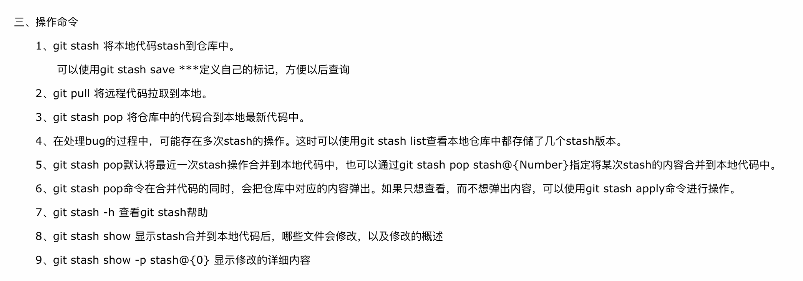

#   Git简单实用-v.0.1.6

>   安装与设置

##  设置账户
-   设置本设备用户名
    ```
    git config --global user.name 'kaoshanji-X550JX'(使用用户名-设备名…当使用多台电脑时,这也算预留)
    ```
-   设置邮箱
    ```
    git config --global user.email 'email@qq.com'
    ```
-   设置命令行
    ```
    git config --global color.ui auto
    ```
-   生成秘钥
    ```
    ssh-keygen -t rsa -C 'email@qq.com'
    ```
-   在账户里添加
    -   [登录GitHub](https://github.com/)
    -   点击主页图标下`settings`,选择`SSH and GPG keys`
    -   点击`New SSK key`
    -   填写标题，复制生成的密钥目录下`id_rsa.pub`文件里的数据
    -   建议标题使用上面`设置本设备用户名`,这样,比较好对应
-   验证
    -   输入
    ```
    ssh -T git@github.com
    ```
    -   在上面填写的邮箱里会收到一封邮件

----

## 基本使用
>   默认使用主分支：master
-   初始化
    ```
    某目录Github 下 
    git clone git@… // 下载主分支。。默认会下载项目的完整历史版本
    // 指定分支
    //git clone -b v2.2 git@… // 下载 v2.2 分支
    // 指定tag
    git clone --branch [tags标签] [git地址]
    ```
-   添加到暂存区
    ```
    git add/rm (./加全部)
    ```
-   提交至版本区
    ```
    git commit -m '说明'
    ```
-   查看提交文件
    ```
    git log --name-only -1
    ```
-   推送服务器
    ```
    git push
    ```
-   拉取最新
    ```
    git pull
    ```

----

##  从GitHub上下载很慢
-   把 GitHub 项目导向 [Gitee](https://gitee.com/)，再下载，满速
-   VPN
-   下载官方压缩包..
-   Git 命令

```
   // 有时clone 很慢或者文件数量多时会特别慢..你只关心最新版的代码，而不关心之前的历史信息
    git   clone   --depth=1    git@…    // 浅复制功能   只下载最近一次的版本
      git fetch --unshallow      //  如果之后又想获取 完整历史信息
```

## 线上版本
>   系统上线后，切割出一个分支保留，主分支可以继续，当线上出现问题时，可以在对应的分支上修改而不影响主分支
-   创建分支
    ```
    直接在网上上创建..
    // git branch v2.1
    // git checkout -b dev // 切换指定分支
    ```
-   查看分支
    ```
    git branch // 前面有 * 是当前分支
    ```
-   切换分支
    ```
    git checkout xxx(分支名称)
    // 更新、提交与上面操作一致
    ```
-   分支提交和合并
    ```
    // 提交
    git add ./
    git commit -m '说明'
    git push  -f origin HEAD:v2.1(指定分支名称)
    // 合并
    git checkout master // 切换到主分支
    git merge origin/v2.1 // 把v2.1更改的合并到主分支里
    git push origin master // 更新主分支
    ```

----


##  处理冲突
>   有时在更新更新线上时会出现冲突，这是因为该文件被其他人修改并已经提交了，如果希望保存本地改动并拉下最新服务器代码

-   


##  资源、参考
-   [Pro Git中文版(第二版)](https://progit.bootcss.com/)
-   [官网](https://git-scm.com/)
-   [来源](https://www.cnblogs.com/huanyou/p/6654813.html)
-   [git clone 太慢怎么办？](https://www.aneasystone.com/archives/2015/08/git-clone-faster.html)

----