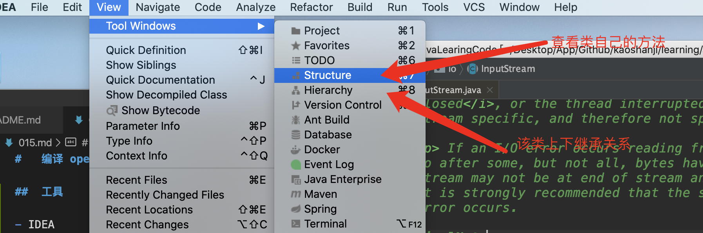
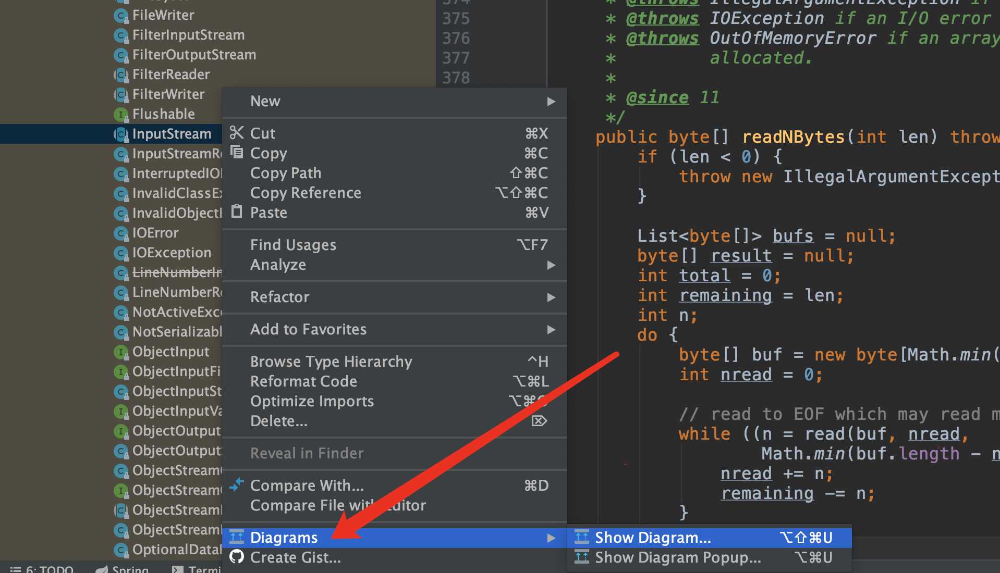
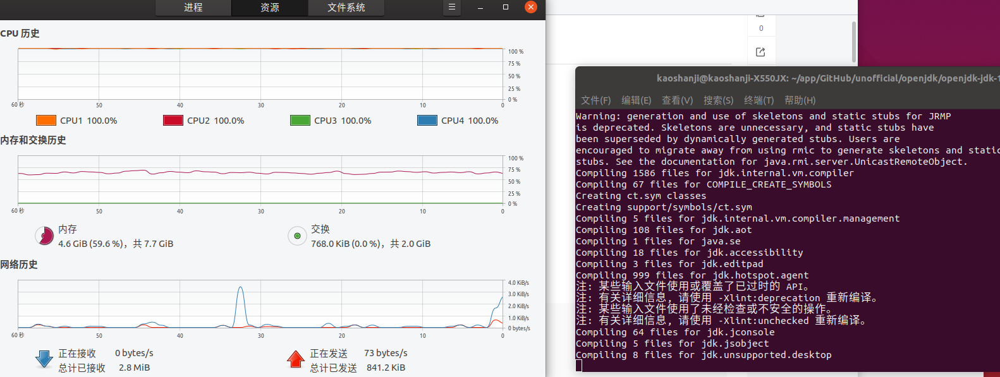
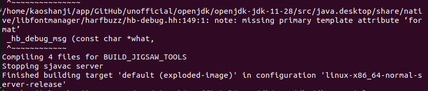
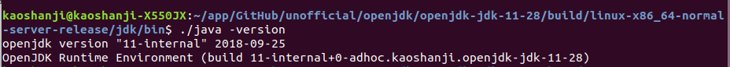

#   编译 openJDK 及Java框架

##  阅读准备

源码环境是一个工作空间，但是还需要一个框架使用示例项目，作为演示。

选择一个线索，最好是能从头开始出现，串联各个环节的那种。

框架类/接口继承关系图可以从IDEA获取，方法调用之类 IDEA/STS 都可以

导入项目之前设置IDE`编码`，`编码`vc，切换电脑可能会导致乱码，比如STS从win切换到mac下，所以，请统一设置成`UTF-8`!

----

##  工具

- IDEA

类方法及继承关系



类UML图



----

##  编译 openJDK 11

对于openJDK，只是本地编译学习研究，不需要版本控制(各种分支下载下来编译都不过)。

openJDK11 需要 jdk-11 编译，本地JDK版本与待编译版本要对应

-   环境准备

[openJDK11地址](https://github.com/unofficial-openjdk/openjdk/archive/jdk-11+28.tar.gz)，下载下来解压。

-   OS：Ubuntu 18.10、64 位、Intel® Core™ i5-4200H CPU @ 2.80GHz × 4、固态硬盘
-   bootstrap JDK

```
export JAVA_HOME=/home/kaoshanji/app/tool/jdk-11.0.5
export CLASSPATH=.:$JAVA_HOME/lib
export PATH=$JAVA_HOME/bin:$PATH
```

-   编译

在 openjdk 源码目录下
```
bash ./configure --disable-warnings-as-errors
// 根据提示安装依赖，可能需要几次

make  // 这个需要一会，等了半天都不动

```



最后的结果..



-   验证

编译后的 `bin` 目录下



openjdk-jdk-11-28 是解压后的原目录

-   参考
    -   [ubuntu下编译openJDK11](https://blog.csdn.net/sjhuangx/article/details/95247836)
    -   [Java虚拟机（JVM源码）：编译OpenJDK源码](https://blog.csdn.net/wd2014610/article/details/81664062)

    ----

##  控制源码

在该项目的GitHub里 `Fork` 到自己的账户下，并且依据指定版本创建一个自定义分支，后面代码阅读就是以这个分支为依据，比如：调试、修改、添加注释等。

示例：[spring-framework](https://github.com/spring-projects/spring-framework)，Fork 到自己的[账户](https://github.com/kaoshanji/spring-framework)下，选择分支 `v4.3.24.RELEASE` 作为指定分支，并创建[自己的分支](https://github.com/kaoshanji/spring-framework/tree/kaoshanji-4.3.24)，如此一来，这个分支就由我完全控制了，并不会被官方更新，版本环境被固定，后面就可以进行了。

`测试类`是很好的验证调试方式

----

##  Java框架产品


- MyBatis 3.5.1 源码编译

MyBatis 项目是一个 Maven 项目，由本身和父项目组成。

下载下来之后，在 pom.xml 看看 `parent` 指定的版本，也下载到同级目录

然后，当做普通 Maven 项目导入即可，最好使用 IDEA。

- Spring framework 4.3.24 源码编译

安装 JDK 1.8，网络可以观看 8M蓝光直播 最好。

进入文件夹 win/Linux 直接运行 import-into-eclipse.bat/.sh，一路下一步，记最为顺利的一次。


- Tomcat  9.x

[Tomcat9源代码浅析-环境搭建](https://blog.csdn.net/daiwuliang/article/details/101674451)


