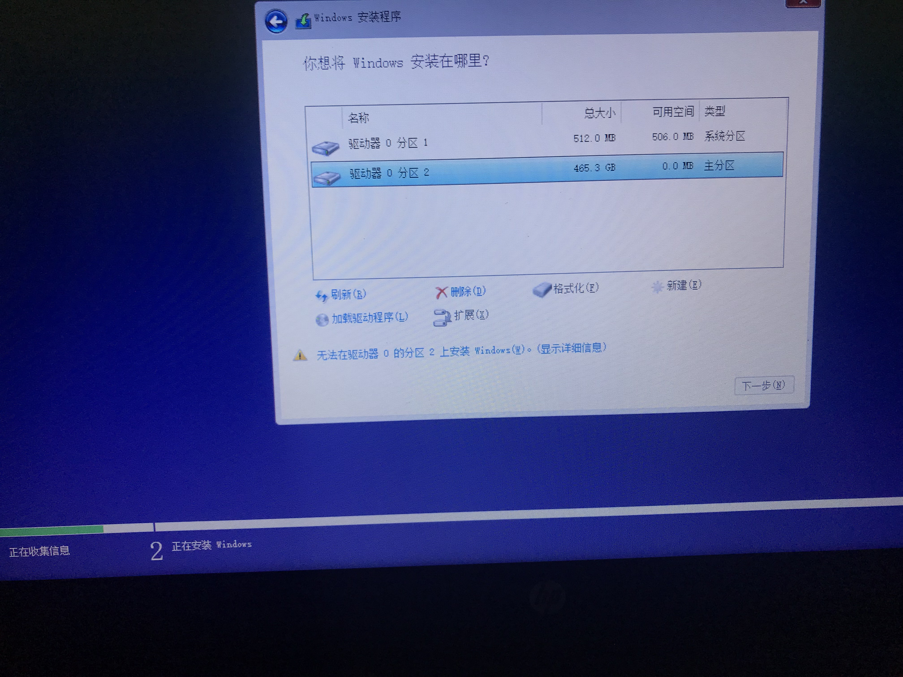
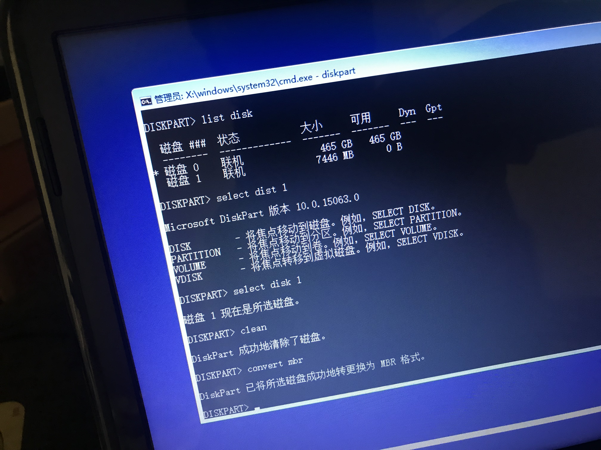

#   win/linux系统U盘安装

##  win安装
-   windows10企业版2016长期服务版的官方名称叫Windows 10企业LTSB版，根据微软支持生命周期页面显示Win10的扩展支持周期延长1年时间。它与其他版本相比，无Edge浏览器、小娜，无磁铁，可选是否下载和安装补丁，其它版都不能自选补丁，适合办公
-   ```
    win10 2016 长期服务版的ISO文件中本身就带有KMS激活KEY，不用输入任何KEY，连接网络，以管理员身份进入CMD，只要一一输入：
    slmgr /skms kms.digiboy.ir
    slmgr /ato
    这两条命令，就可以KMS激活。
    ```
-   下载地址
    -   [32位镜像](ed2k://|file|cn_windows_10_enterprise_2016_ltsb_x86_dvd_9057089.iso|2817034240|67C3865D03E765BDD4845BA2CB7649F8|/)
    -   [64位镜像](ed2k://|file|cn_windows_10_enterprise_2016_ltsb_x64_dvd_9060409.iso|3821895680|FF17FF2D5919E3A560151BBC11C399D1|/)
    -   [U盘制作](https://www.microsoft.com/zh-cn/software-download/windows10)  

-   系统不能识别磁盘格式
    -   
    -   在当前安装界面按住Shift+F10调出命令提示符窗口
    -   输入diskpart，按回车执行
    -     

----

##  Linux安装
-   U盘安装 [CentOS](https://www.centos.org/) 系统需要使用USBWriter软件
-   U盘安装 [ubuntu](https://ubuntu.com/) 系统用ultraiso

----


##  常见问题
-   U盘因为某种原因可以识别但是不能打开也不能格式化而且空间也变小了，`解决`：老毛桃 "初始化U盘"
-   各个平台通用文件传输：[send-anywhere](https://send-anywhere.com/)，除了 CentOS

----