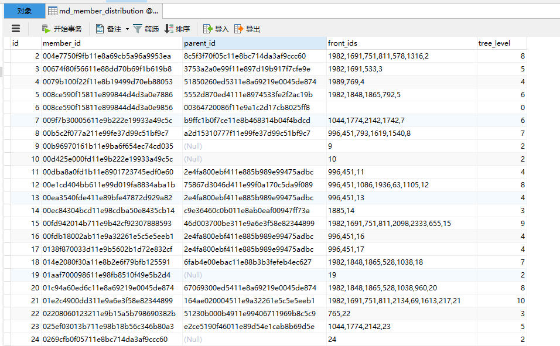

# 初始化用户关联关系

根据父子节点数据初始化用户关系网

主要内容：
- 背景
- 表分析
- 代码思路
- 实践一下


##  背景

接到一个社交电商分佣计算的项目功能开发，但是账户表仅保存了上级Id。

社交分佣电商，有个特点，就是某用户消费之后，会根据某种规则计算他的上级的上级的上级等等几级分别分佣多少，一人消费，多人获利。

为了计算分佣路线方便，就需要建立整个用户关系网，从顶点一路向下，形同树一样，每个用户只有一个上级，每个用户可能有多个下级，彼此关联建立树装的网。

效果是这样 

每个用户(节点)可以明确定位自己的位置。

----

##  表分析

数据库表结构观察再观察 

表结构做了裁剪，仅保留几个关键字段。

member_id、parent_id 是已有的，而且 member_id 还是主键，但是嫌弃字段太长了就增加了自增 id 作为主键，后面两个字段 front_ids(推荐网络:前面这条线所有的用户Id，包括自己的id)、 tree_level(树节点层级) 都是新增，用来构建关系。

parent_id 字段有数据说明他不是顶级节点，属于某个下级，没有数据说明是顶级节点，没有上级。

这个关系网结构是从上往下，一级一级构建出来。

如果有唯一的 root 节点，那么 tree_level = 1，front_ids = id(它自己的)，但是这个表里没有，因此，可以把 parent_id 没有值得可以作为 2 级节点并首先处理，依次延伸下去，这样就可以理顺关系了，后续可以选择某个节点作为root节点，或者干脆就是公司账户，毕竟他分钱最多。

最终的目的是有规律的更新 front_ids 和 tree_level 这两个字段。

front_ids 表示 X0Y2 到 W 节点所有沿线节点，tree_level 表示处于的节点的级别，X0Y2 的是 7，表示他前面有 6个节点。 

效果：

第 6 条数据不对，

``` sql 
SELECT * FROM md_member_distribution WHERE member_id = '00364720086f11e9a1c2d17cb8025ff8' 
``` 

没有数据。

----

##  代码思路

把整个关系结构看做是两层，父子节点，有子节点必定是有父节点，然后循环，可以使用递归，但是容易出现死循环异常，可以给个最大级别数，比如30，关系节点有个十几层就很复杂了。

1.  查询 parent_id 是空的记录作为父节点，是第一批处理的数据，直接设置front_ids 和 tree_level字段的值，但同时保留 父节点的 member_id、front_ids、tree_level。

2.  member_id 是查询直接下级的条件，子节点的 front_ids和tree_level 是在父节点的基础上修改，front_ids 继承父节点的再加上自己的 id， tree_level 是在父节点的基础上加1。

3.  JDBC操作只是支撑，查询需要转换成对象，批量更新语句，这两个方法属于辅助方法，不应该放在主要逻辑里。

----

##  实践一下

导入 [md_member_distribution](image/md_member_distribution.sql) 文件到MySql。

数据库配置需要与JDBC配置保持一致，是在 JbdcUtil#getConnection()，直接写死的。

运行 `MemberDistributionInit` 类的 `main` 方法就行。

[参考代码](/JavaLearingCode/src/main/java/top/kaoshanji/learning/scenes/memberfront/MemberDistributionInit.java)


----
