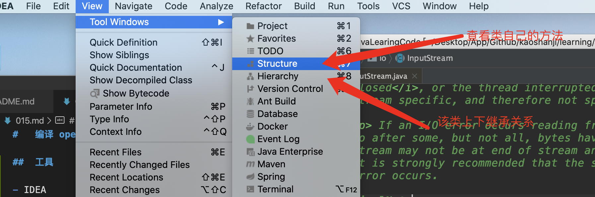
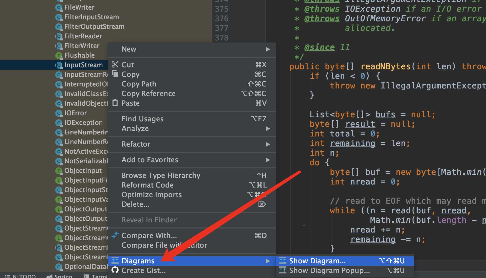
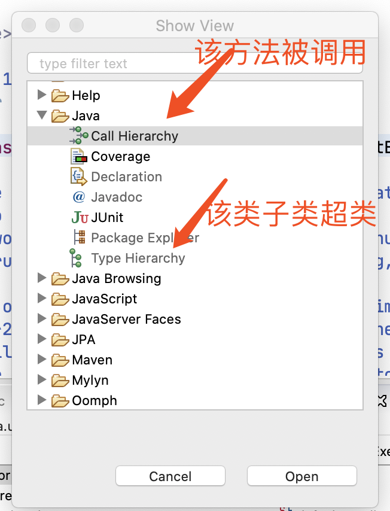
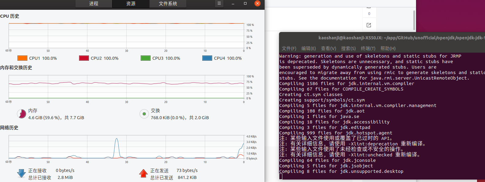
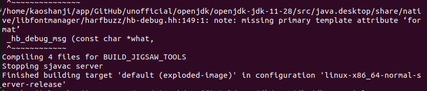
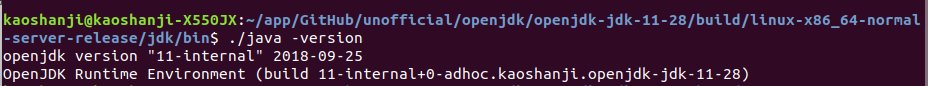
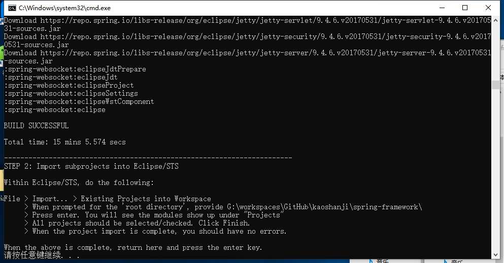
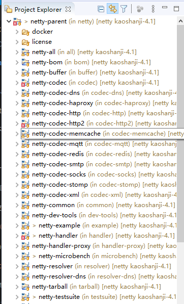
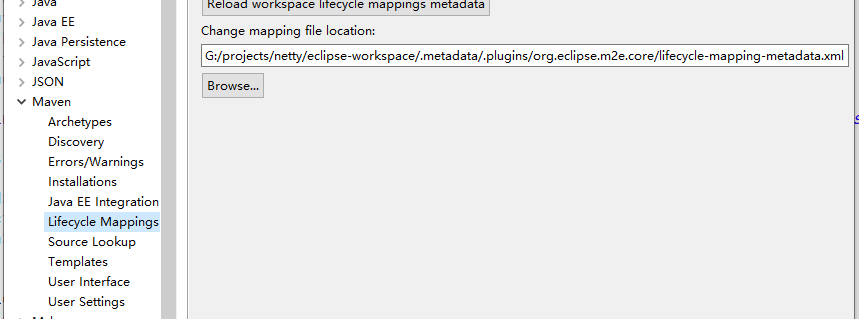
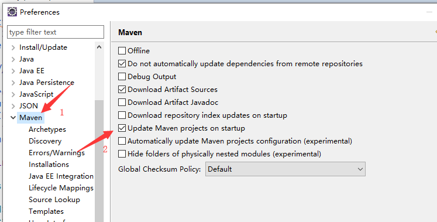

#   编译 openJDK 及Java框架

##  阅读准备

源码环境是一个工作空间，但是还需要一个框架使用示例项目，作为演示。

选择一个线索，最好是能从头开始出现，串联各个环节的那种。

框架类/接口继承关系图可以从IDEA获取，方法调用之类 IDEA/STS 都可以

导入项目之前设置IDE`编码`，`编码`vc，切换电脑可能会导致乱码，比如STS从win切换到mac下，所以，请统一设置成`UTF-8`!

----

##  工具

- IDEA

类方法及继承关系



类UML图



- Eclipse

类继承、方法调用



----

##  编译 openJDK 11

对于openJDK，只是本地编译学习研究，不需要版本控制(各种分支下载下来编译都不过)。

openJDK11 需要 jdk-11 编译，本地JDK版本与待编译版本要对应

-   环境准备

[openJDK11地址](https://github.com/unofficial-openjdk/openjdk/archive/jdk-11+28.tar.gz)，下载下来解压。

-   OS：Ubuntu 18.10、64 位、Intel® Core™ i5-4200H CPU @ 2.80GHz × 4、固态硬盘
-   bootstrap JDK

```
export JAVA_HOME=/home/kaoshanji/app/tool/jdk-11.0.5
export CLASSPATH=.:$JAVA_HOME/lib
export PATH=$JAVA_HOME/bin:$PATH
```

-   编译

在 openjdk 源码目录下
```
bash ./configure --disable-warnings-as-errors
// 根据提示安装依赖，可能需要几次

make  // 这个需要一会，等了半天都不动

```



最后的结果..



-   验证

编译后的 `bin` 目录下



openjdk-jdk-11-28 是解压后的原目录

-   参考
    -   [ubuntu下编译openJDK11](https://blog.csdn.net/sjhuangx/article/details/95247836)
    -   [Java虚拟机（JVM源码）：编译OpenJDK源码](https://blog.csdn.net/wd2014610/article/details/81664062)

    ----

##  控制源码

在该项目的GitHub里 `Fork` 到自己的账户下，并且依据指定版本创建一个自定义分支，后面代码阅读就是以这个分支为依据，比如：调试、修改、添加注释等。

示例：[spring-framework](https://github.com/spring-projects/spring-framework)，Fork 到自己的[账户](https://github.com/kaoshanji/spring-framework)下，选择分支 `v4.3.24.RELEASE` 作为指定分支，并创建[自己的分支](https://github.com/kaoshanji/spring-framework/tree/kaoshanji-4.3.24)，如此一来，这个分支就由我完全控制了，并不会被官方更新，版本环境被固定，后面就可以进行了。

显示为当前需要指定的分支，然后输入新的分支名字，就会以当前分支创建新的分支。


`测试类`是很好的验证调试方式

----

##  Java框架产品

- OS：64
- JDK：1.8/64
- IDE：64


### Spring framework 4.3.24 源码编译

网络可以观看 8M蓝光直播 最好。

配置 gradle-2.14.1

speing 目录下 build.gradle

```
// 配置 阿里云仓库
	repositories {
		maven { url "https://repo.spring.io/plugins-release" }
		maven { url "http://maven.aliyun.com/nexus/content/groups/public/"}
	}
```

进入文件夹 win/Linux 直接运行 import-into-eclipse.bat/.sh，一路下一步，记最为顺利的一次。




### Netty 4.1.37  源码编译

Netty 项目是个树形结构，父项目：netty-parent ，就是下载下来目录第一层的 pom.xml 

使用 Eclipse 导入，选择下载下来的文件夹一次性导入，结果界面大概这样：



当然开始时会有一些异常，下面就是来解决。

首先把 netty-parent/pom.xml properties --> maven.compiler.* 改成 1.8

-   Maven项目POM文件错误

```
Plugin execution not covered by lifecycle configuration: org.codehaus.mojo:xml-maven-plugin:1.0.1:check-format (execution: check-style, phase: validate)
```

按照 [Maven项目POM文件错误](https://www.cnblogs.com/AmilyLin/p/amilyLin.html) 解决。



lifecycle-mapping-metadata.xml 一般是不在上图文件夹下，可以从 ..\eclipse\plugins\org.eclipse.m2e.lifecyclemapping.defaults_xxxxxx.jar  文件里复制过去(拷贝该jar包出去解压就有了)

然后根据错误提示的插件进行修改

``` xml
	<pluginExecution>
      <pluginExecutionFilter>
        <groupId>org.codehaus.mojo</groupId>
        <artifactId>xml-maven-plugin</artifactId>
        <versionRange>[1.0.1,)</versionRange>
        <goals>
          <goal>testCompile</goal>
          <goal>check-format</goal>
        </goals>
      </pluginExecutionFilter>
      <action>
        <ignore/>
      </action>
    </pluginExecution>
	
	<pluginExecution>
      <pluginExecutionFilter>
        <groupId>org.codehaus.gmaven</groupId>
        <artifactId>groovy-maven-plugin</artifactId>
        <versionRange>[2.0,)</versionRange>
        <goals>
          <goal>testCompile</goal>
          <goal>execute</goal>
        </goals>
      </pluginExecutionFilter>
      <action>
        <ignore/>
      </action>
    </pluginExecution>
```



kaoshanji/neety(kaoshanji-4.1) 下 lifecycle-mapping-metadata.xml

-   io.netty:netty-tcnative 没有

按照 [从github检出netty项目，编译遇到问题总结](https://www.iteye.com/blog/donald-draper-2382829) 解决

把 netty-parent/pom.xml 里 properties --> tcnative.classifier 注释掉

```xml
    <tcnative.version>2.0.25.Final</tcnative.version>
    <!-- <tcnative.classifier>${os.detected.classifier}</tcnative.classifier> -->
```

一些子项目的 pom.xml 在 下面节点处提示错误就改成这样：

``` xml
    <dependency>
      <groupId>${project.groupId}</groupId>
      <artifactId>${tcnative.artifactId}</artifactId>
      <!-- <classifier>${tcnative.classifier}</classifier> -->
      <version>${tcnative.version}</version>
      <scope>test</scope>
    </dependency>
```

-   io.netty.util.collection.IntObjectHashMap 类没有

类似的是 xxxxObjectHashMap 没有，可能在多个地方提示

按照 [Netty 分享之动态生成重复性的代码](https://www.jianshu.com/p/9160684f134b) 解决

用命令行进入 common 项目文件夹，执行

```base
mvn clean && mvn package -Dcheckstyle.skip=true
```

再刷新项目，嗯，就有了。。

-   测试类里 assertEquals 


