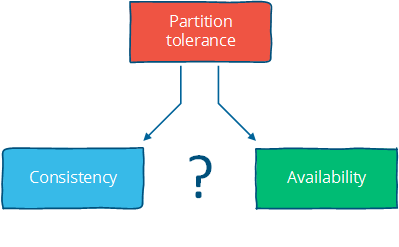

# 抽象

在本章中，我们将在抽象层次上下移动，查看一些不可能性结果（CAP和FLP），然后为了性能而向下移动。

如果您已经完成了任何编程，那么抽象级别的概念可能对您来说很熟悉。您将始终在某种抽象级别工作，通过某些API与较低级别层接口，并可能为您的用户提供一些更高级别的API或用户界面。七层[计算机网络的OSI模型](http://en.wikipedia.org/wiki/OSI_model)就是一个很好的例子。

我断言，分布式编程在很大程度上处理了分发的后果（呃！）。也就是说，存在许多节点的现实与我们对“像单个系统一样工作”的系统的需求之间存在着紧张关系。这意味着要找到一个好的抽象，以平衡可能与可理解和高效的东西。

当说X比Y更抽象时，我们的意思是什么？首先，X不会引入任何新的或与Y基本不同的东西。事实上，X可能会删除Y的某些方面或以一种使它们更易于管理的方式呈现它们。其次，X在某种意义上比Y更容易掌握，假设X从Y中移除的东西对于手头的事情并不重要。

正如[尼采](http://oregonstate.edu/instruct/phl201/modules/Philosophers/Nietzsche/Truth_and_Lie_in_an_Extra-Moral_Sense.htm)写道：

> 每个概念都源于我们将不平等的东西等同起来。没有叶子完全等于另一个叶子，“叶子”这个概念是通过对这些个体差异的任意抽象，通过忘记区别而形成的; 现在它产生了这样的想法：在自然界中可能存在除了叶子之外还有“叶子”的东西 - 某种原始形式，之后所有的叶子都被编织，标记，复制，着色，卷曲和涂漆，但是由不熟练的手，所以没有副本证明是原始形式的正确，可靠和忠实的形象。

从根本上说，抽象是假的。每种情况都是独特的，每个节点都是如此。但是抽象使得世界变得易于管理：更简单的问题陈述 - 没有现实 - 更易于分析，只要我们不忽视任何必要的东西，解决方案就可以广泛应用。

实际上，如果我们保留的东西是必不可少的，那么我们可以得出的结果将是广泛适用的。这就是不可能性结果如此重要的原因：它们采用最简单的问题形式，并证明在某些约束或假设中无法解决。

所有抽象都忽略了一些有利于将事物等同于事物的东西。诀窍是摆脱一切不重要的东西。你怎么知道什么是必要的？好吧，你可能不知道先验。

每次我们从系统规范中排除系统的某些方面时，我们都会冒险引入错误源和/或性能问题。这就是为什么有时我们需要走向另一个方向，并有选择地介绍真实硬件和现实世界问题的某些方面。重新引入一些特定的硬件特性（例如物理顺序性）或其他物理特性可能足以使系统运行良好。

考虑到这一点，我们可以保留最少量的现实，同时仍然可以使用仍然可以识别为分布式系统的东西？系统模型是我们认为重要的特征的规范; 如果指定了一个，我们就可以看看一些不可能的结果和挑战。

## 系统模型

分布式系统的关键属性是分布。更具体地说，分布式系统中的程序：

- 在独立节点上并发运行...
- 通过可能引入不确定性和消息丢失的网络连接......
- 没有共享内存或共享时钟。

有很多含义：

- 每个节点同时执行一个程序
- 知识是本地的：节点只能快速访问其本地状态，任何有关全局状态的信息都可能过时
- 节点可能会失败并独立地从故障中恢复
- 消息可能会延迟或丢失（与节点故障无关;区分网络故障和节点故障并不容易）
- 并且节点不跨节点同步（本地时间戳与全局实时顺序不对应，不容易观察到）

系统模型列举了与特定系统设计相关的许多假设。

- 系统模型

  关于实现分布式系统的环境和设施的一组假设

系统模型对环境和设施的假设各不相同。这些假设包括：

- 节点具有哪些功能以及它们可能如何失败
- 通信链路如何运作以及它们如何失效
- 整个系统的属性，例如关于时间和顺序的假设

一个强大的系统模型是做出最弱假设的模型：为这样一个系统编写的任何算法都能够很好地容忍不同的环境，因为它只做很少和非常弱的假设。

另一方面，我们可以通过做出强有力的假设来创建一个易于推理的系统模型。例如，假设节点没有失败意味着我们的算法不需要处理节点故障。然而，这种系统模型是不现实的，因此难以应用于实践中。

让我们更详细地看一下节点，链接以及时间和顺序的属性。

### 我们系统模型中的节点

节点充当计算和存储的主机。他们有：

- 执行程序的能力
- 能够将数据存储到易失性存储器（可能在发生故障时丢失）并进入稳定状态（可在故障后读取）
- 时钟（可能会或可能不会被认为是准确的）

节点执行确定性算法：本地计算，计算后的本地状态以及发送的消息由接收到的消息和接收消息时的本地状态唯一确定。

有许多可能的故障模型描述了节点失败的方式。在实践中，大多数系统都采用崩溃恢复故障模型：即，节点只能通过崩溃而失败，并且可能（可能）在稍后崩溃后恢复。

另一种选择是假设节点可能以任意方式行为不端而失败。这被称为[拜占庭容错](http://en.wikipedia.org/wiki/Byzantine_fault_tolerance)。在现实世界的商业系统中很少处理拜占庭故障，因为对任意故障具有弹性的算法运行起来更昂贵并且实现起来更复杂。我不会在这里讨论它们。

### 我们的系统模型中的通信链接

通信链路将各个节点相互连接，并允许以任一方向发送消息。讨论分布式算法的许多书籍假设每对节点之间存在单独的链接，链接为消息提供FIFO（先进先出）顺序，它们只能传递已发送的消息，并且发送的消息可以是丢失。

一些算法假设网络是可靠的：消息永远不会丢失，永远不会无限延迟。对于某些真实世界的设置，这可能是合理的假设，但一般来说，最好考虑网络不可靠并受到消息丢失和延迟的影响。

当网络出现故障而节点本身仍然可以运行时，会发生网络分区。发生这种情况时，消息可能会丢失或延迟，直到修复网络分区。某些客户端可以访问分区节点，因此必须与崩溃节点区别对待。下图说明了节点故障与网络分区的关系：

很少对通信链接做出进一步的假设。我们可以假设链路仅在一个方向上工作，或者我们可以为不同的链路引入不同的通信成本（例如，由于物理距离引起的延迟）。但是，除了长距离链接（WAN延迟）之外，这些在商业环境中很少受到关注，所以我不会在这里讨论它们。更详细的成本和拓扑模型允许以复杂性为代价进行更好的优化。

### 时间/排序假设

物理分配的后果之一是每个节点以独特的方式体验世界。这是不可避免的，因为信息只能以光速传播。如果节点彼此处于不同的距离，则从一个节点发送到其他节点的任何消息将在不同的时间到达，并且可能在其他节点处以不同的顺序到达。

时间假设是一种方便的简写，用于捕捉关于我们将这一现实考虑在内的程度的假设。两个主要的替代方案是：

- 同步系统模型

  进程以锁步执行; 消息传输延迟有一个已知的上限; 每个过程都有一个准确的时钟

- 异步系统模型

  没有时间假设 - 例如，流程以独立的速率执行; 消息传输延迟没有限制; 有用的时钟不存在

同步系统模型对时间和顺序施加了许多约束。它基本上假定节点具有相同的体验：发送的消息总是在特定的最大传输延迟内接收，并且该进程在锁定步骤中执行。这很方便，因为它允许您作为系统设计者对时间和顺序进行假设，而异步系统模型则不然。

异步性是一种非假设：它只是假设你不能依赖于时间（或“时间传感器”）。

解决同步系统模型中的问题更容易，因为关于执行速度，最大消息传输延迟和时钟精度的假设都有助于解决问题，因为您可以根据这些假设做出推断，并通过假设它们永远不会发生来排除不方便的故障情况。

当然，假设同步系统模型不是特别现实。现实世界的网络容易出现故障，并且消息延迟没有硬性限制。真实世界的系统最多是部分同步的：它们偶尔可以正常工作并提供一些上限，但有时候消息会无限延迟并且时钟不同步。我不会在这里讨论同步系统的算法，但是你可能会在许多其他介绍性书籍中遇到它们，因为它们在分析上更容易（但不切实际）。

### 共识问题

在本文的其余部分，我们将改变系统模型的参数。接下来，我们将看看如何改变两个系统属性：

- 网络分区是否包含在故障模型中，以及
- 同步与异步时序假设

通过讨论两个不可能性结果（FLP和CAP）来影响系统设计选择。

当然，为了进行讨论，我们还需要引入一个问题来解决。我要讨论的[问题](http://en.wikipedia.org/wiki/Consensus_(computer_science))是[共识问题](http://en.wikipedia.org/wiki/Consensus_(computer_science))。

如果几个计算机（或节点）都同意一些价值，那么它们就会达成共识。更正式的：

1. 协议：每个正确的流程必须就相同的价值达成一致。
2. 完整性：每个正确的过程最多决定一个值，如果它决定某个值，那么它必须由某个过程提出。
3. 终止：所有流程最终都会做出决定。
4. 有效性：如果所有正确的过程提出相同的值V，那么所有正确的过程决定V.

共识问题是许多商业分布式系统的核心。毕竟，我们需要分布式系统的可靠性和性能，而不必处理分布的后果（例如节点之间的分歧/分歧），并且解决共识问题可以解决几个相关的，更高级的问题，例如原子广播和原子提交。

### 两个不可能的结果

第一个不可能性结果，称为FLP不可能性结果，是不可能的结果，与设计分布式算法的人特别相关。第二个 - CAP定理 - 是一个与从业者更相关的相关结果; 需要在不同系统设计之间进行选择但不直接关注算法设计的人。

## FLP不可能的结果

我只会简要总结一下[FLP的不可能性结果](http://en.wikipedia.org/wiki/Consensus_(computer_science)#Solvability_results_for_some_agreement_problems)，尽管它在学术界被认为[更为重要](http://en.wikipedia.org/wiki/Dijkstra_Prize)。FLP不可能性结果（以作者，Fischer，Lynch和Patterson命名）检查异步系统模型下的共识问题（技术上，协议问题，这是共识问题的一种非常弱的形式）。假设节点只能通过崩溃来失败; 网络是可靠的，并且异步系统模型的典型时序假设成立：例如，消息延迟没有界限。

在这些假设下，FLP结果表明“在存在故障的异步系统中，对于共识问题不存在（确定性）算法，即使消息永远不会丢失，最多一个进程可能会失败，并且它只能崩溃失败（停止执行）“。

这个结果意味着没有办法在一个非常小的系统模型下以一种不能永远延迟的方式解决共识问题。争论的焦点是，如果存在这样的算法，那么可以通过延迟消息传递（在异步系统模型中允许）来设计该算法的执行，其中它将在任意时间量内保持未定（“二价”）。因此，这种算法不可能存在。

这种不可能性结果很重要，因为它突出了假设异步系统模型导致权衡：解决共识问题的算法必须在有关消息传递边界的保证不成立时放弃安全性或活跃性。

这种洞察力与设计算法的人特别相关，因为它对我们知道在异步系统模型中可解决的问题施加了严格的约束。CAP定理是一个与从业者更相关的相关定理：它做出略微不同的假设（网络故障而非节点故障），并且对于在系统设计之间进行选择的从业者具有更明确的含义。

## CAP定理

CAP定理最初是由计算机科学家Eric Brewer提出的猜想。在系统设计的保证中考虑权衡是一种流行且相当有用的方法。它甚至还有[吉尔伯特](http://www.comp.nus.edu.sg/~gilbert/biblio.html)和[林奇](http://en.wikipedia.org/wiki/Nancy_Lynch)的[正式证明](https://www.google.com/search?q=Brewer's+conjecture+and+the+feasibility+of+consistent%2C+available%2C+partition-tolerant+web+services)，不然，尽管[特定的讨论网站](http://news.ycombinator.com/)认为，[Nathan Marz](http://nathanmarz.com/)并未对其进行揭穿。

该定理指出了这三个属性：

- 一致性：所有节点同时看到相同的数据。
- 可用性：节点故障不会阻止幸存者继续运行。
- 分区容差：尽管由于网络和/或节点故障导致消息丢失，系统仍继续运行

只有两个可以同时满足。我们甚至可以将它绘制成一个漂亮的图表，从三个中选择两个属性为我们提供了三种类型的系统，它们对应于不同的交叉点：

注意，该定理表明中间件（具有所有三个属性）是不可实现的。然后我们得到三种不同的系统类型：

- CA（一致性+可用性）。示例包括完全严格的仲裁协议，例如两阶段提交。
- CP（一致性+分区容差）。示例包括多数分区协议，其中少数分区不可用，例如Paxos。
- AP（可用性+分区容差）。示例包括使用冲突解决的协议，例如Dynamo。

CA和CP系统设计都提供相同的一致性模型：强一致性。唯一的区别是CA系统不能容忍任何节点故障; CP系统可以容忍非拜占庭故障模型中`f`给定`2f+1`节点的故障（换句话说，`f`只要大多数节点`f+1`保持运行，它就可以容忍少数节点的故障）。原因很简单：

- CA系统不区分节点故障和网络故障，因此必须停止在任何地方接受写入以避免引入分歧（多个副本）。它无法判断远程节点是否已关闭，或者网络连接是否已关闭：因此唯一安全的做法是停止接受写入。
- CP系统通过在分区的两侧强制不对称行为来防止分歧（例如，维持单拷贝一致性）。它只保留多数分区，并要求少数分区变得不可用（例如，停止接受写入），这保留了一定程度的可用性（多数分区）并仍然确保单拷贝一致性。

当我讨论Paxos时，我将在关于复制的章节中更详细地讨论这个问题。重要的是CP系统将网络分区合并到其故障模型中，并使用Paxos，Raft或viewstamped replication等算法区分多数分区和少数分区。CA系统不支持分区，并且在历史上更常见：它们通常使用两阶段提交算法，并且在传统的分布式关系数据库中很常见。

假设发生了分区，该定理简化为可用性和一致性之间的二元选择。

我认为应该从CAP定理中得出四个结论：

首先，*早期分布式关系数据库系统中使用的许多系统设计没有考虑分区容差*（例如，它们是CA设计）。分区容差是现代系统的一个重要特性，因为如果系统在地理上分布（如同许多大型系统那样），则网络分区变得更加可能。

其次，*在网络分区期间，强一致性和高可用性之间存在紧张关系*。CAP定理说明了强保证和分布式计算之间的权衡。

从某种意义上说，承诺由不可预测的网络连接的独立节点组成的分布式系统“以一种与非分布式系统无法区分的方式”是非常疯狂的。

强一致性保证要求我们在分区期间放弃可用性。这是因为在继续接受分区两侧的写入的同时，无法防止两个不能彼此通信的副本之间的分歧。

我们如何解决这个问题？通过加强假设（假设没有分区）或削弱担保。可以根据可用性（以及离线可访问性和低延迟的相关功能）来交换一致性。如果“一致性”被定义为小于“所有节点同时看到相同数据”的东西，那么我们可以同时具有可用性和一些（弱）一致性保证。

第三，*在正常操作中强烈的一致性和性能之间存在紧张关系*。

强一致性/单拷贝一致性要求节点在每个操作上进行通信并达成一致。这导致正常操作期间的高延迟。

如果您可以使用除经典模型之外的一致性模型，一致性模型允许副本滞后或发散，那么您可以减少正常操作期间的延迟并在存在分区时保持可用性。

当涉及的消息更少且节点更少时，操作可以更快地完成。但实现这一目标的唯一方法是放宽保证：让一些节点的联系频率降低，这意味着节点可以包含旧数据。

这也使异常发生成为可能。您不再保证获得最新价值。根据所提供的保证类型，您可能会读取比预期更早的值，甚至会丢失一些更新。

第四 - 有点间接 - *如果我们不想在网络分区期间放弃可用性，那么我们需要探索除了强一致性之外的一致性模型是否可用于我们的目的*。

例如，即使用户数据被地理复制到多个数据中心，并且这两个数据中心之间的链接暂时出现故障，在许多情况下我们仍然希望允许用户使用网站/服务。这意味着稍后协调两组不同的数据，这既是技术挑战，也是业务风险。但是，技术挑战和业务风险通常都是可管理的，因此最好提供高可用性。

一致性和可用性并非真正的二元选择，除非您将自己局限于强一致性。但强一致性只是一种一致性模型：您必须放弃可用性以防止多个数据副本处于活动状态。正如[布鲁尔自己所指出的那样](http://www.infoq.com/articles/cap-twelve-years-later-how-the-rules-have-changed)，“ [三分之二](http://www.infoq.com/articles/cap-twelve-years-later-how-the-rules-have-changed) ”的解释具有误导性。

如果你从这个讨论中只拿走一个想法，就这样说：“一致性”不是一个单一的，明确的属性。记得：

> [ACID](http://en.wikipedia.org/wiki/ACID)一致性！= 
> [CAP](http://en.wikipedia.org/wiki/CAP_theorem)一致性！= 
> [燕麦片的](http://en.wikipedia.org/wiki/Oatmeal)一致性

相反，一致性模型是数据存储为使用它的程序提供的保证 - 任何保证。

- 一致性模型

  程序员和系统之间的契约，其中系统保证如果程序员遵循某些特定规则，数据存储上的操作结果将是可预测的

CAP中的“C”是“强一致性”，但“一致性”不是“强一致性”的同义词。

我们来看看一些替代的一致性模型。

## 与其他一致性模型的一致性强

一致性模型可以分为两类：强一致性模型和弱一致性模型：

- 强一致性模型（能够维护单个副本）
  - 可线性一致性
  - 顺序一致性
- 弱一致性模型（不强）
  - 以客户为中心的一致性模型
  - 因果一致性：最强的模型可用
  - 最终的一致性模型

强一致性模型可确保更新的明显顺序和可见性等同于非复制系统。另一方面，弱一致性模型不能做出这样的保证。

请注意，这绝不是一个详尽的清单。同样，一致性模型只是程序员和系统之间的任意契约，因此它们几乎可以是任何东西。

### 强一致性模型

强一致性模型可以进一步划分为两个相似但略有不同的一致性模型：

- *可线性化一致性*：在线性化一致性下，所有操作似乎都按照与全局实时操作顺序一致的顺序原子执行。（Herlihy＆Wing，1991）
- *顺序一致性*：在顺序一致性下，所有操作似乎都以某种顺序原子执行，这与在各个节点上看到的顺序一致，并且在所有节点上都是相等的。（Lamport，1979）

关键的区别在于可线性化的一致性要求操作生效的顺序等于操作的实际实时排序。只要在每个节点上观察到的顺序保持一致，顺序一致性就允许对操作进行重新排序。有人可以区分两者的唯一方法是，他们是否可以观察进入系统的所有输入和时间; 从客户端与节点交互的角度来看，两者是等价的。

差异似乎并不重要，但值得注意的是顺序一致性并不构成。

强一致性模型允许您作为程序员用分布式节点集群替换单个服务器，而不会遇到任何问题。

所有其他一致性模型都有异常（与保证强一致性的系统相比），因为它们的行为方式与非复制系统不同。但通常这些异常是可以接受的，要么是因为我们不关心偶然的问题，要么是因为我们编写的代码在以某种方式发生后处理不一致。

请注意，弱一致性模型确实没有任何通用类型，因为“不是一个强一致性模型”（例如“在某种程度上可以与非复制系统区分开”）几乎可以是任何东西。

### 以客户为中心的一致性模型

*以客户为中心的一致性模型*是一致性模型，它以某种方式涉及客户端或会话的概念。例如，以客户端为中心的一致性模型可能保证客户端永远不会看到数据项的旧版本。这通常通过在客户端库中构建其他缓存来实现，这样，如果客户端移动到包含旧数据的副本节点，则客户端库将返回其缓存值，而不是复制副本中的旧值。

客户端仍然可以看到旧版本的数据，如果它们所在的副本节点不包含最新版本，但是它们永远不会看到旧版本的值重新出现的异常（例如，因为它们连接到不同的副本）。请注意，有许多种以客户为中心的一致性模型。

### 最终的一致性

该*最终一致性*模型说，如果你不再变化值，那么在一段不确定的量毕竟副本将在相同的值一致。暗示在此之前复制品之间的结果在某种不确定的方式上是不一致的。由于它是[微不足道的](http://www.bailis.org/blog/safety-and-liveness-eventual-consistency-is-not-safe/)（只有活力属性），没有补充信息就没用了。

说一些事情只是最终是一致的就像说“人们最终死了”。这是一个非常弱的约束，我们可能想要至少对两件事进行更具体的表征：

首先，“最终”有多长？具有严格的下限，或者至少对于系统收敛到相同值通常需要多长时间的一些想法是有用的。

其次，复制品如何就价值达成一致？始终返回“42”的系统最终是一致的：所有副本都同意相同的值。它只是没有收敛到有用的值，因为它只是保持返回相同的固定值。相反，我们希望更好地了解该方法。例如，一种决定方法是使具有最大时间戳的值始终获胜。

因此，当供应商说“最终的一致性”时，他们的意思是一些更精确的术语，例如“最终最后作者获胜，同时读取最新观察值”的一致性。“怎么样？” 很重要，因为糟糕的方法会导致写入丢失 - 例如，如果一个节点上的时钟设置不正确并且使用了时间戳。

我将在弱一致性模型的复制方法一章中更详细地研究这两个问题。

------

## 进一步阅读

- [Brewer的猜想和一致，可用，分区容忍的Web服务的可行性](http://lpd.epfl.ch/sgilbert/pubs/BrewersConjecture-SigAct.pdf) - Gilbert＆Lynch，2002
- [在一个错误的过程中不可能达成分布式共识](http://scholar.google.com/scholar?q=Impossibility+of+distributed+consensus+with+one+faulty+process) --Fischer，Lynch和Patterson，1985
- [关于CAP定理的观点](http://scholar.google.com/scholar?q=Perspectives+on+the+CAP+Theorem) - 吉尔伯特和林奇，2012
- [CAP十二年后：“规则”如何改变](http://www.infoq.com/articles/cap-twelve-years-later-how-the-rules-have-changed) - Brewer，2012
- [统一的共识比共识更难](http://scholar.google.com/scholar?q=Uniform+consensus+is+harder+than+consensus) - Charron-Bost＆Schiper，2000
- [通过棒球解释复制数据一致性](http://pages.cs.wisc.edu/~remzi/Classes/739/Papers/Bart/ConsistencyAndBaseballReport.pdf) - 特里，2011年
- [分布式交易之外的生活：Apostate的观点](http://scholar.google.com/scholar?q=Life+Beyond+Distributed+Transactions%3A+an+Apostate's+Opinion) - Helland，2007
- [如果你有太多的数据，那么“足够好”就足够了](http://dl.acm.org/citation.cfm?id=1953140) --Helland，2011
- [以流沙为基础](http://scholar.google.com/scholar?q=Building+on+Quicksand) - Helland＆Campbell，2009