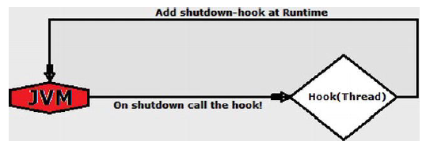

# 创建文件和目录的技术

临时目录是存储临时文件的目录。 

临时目录的位置取决于操作系统。 

在Windows中，通过TEMP设置临时目录环境变量，通常为 `C:\Temp，％Windows％\Temp` 或“本地”中每个用户的临时目录设置\温度。 

在Linux/Unix中，全局临时目录为 `/tmp` 和`/var/tmp`。

##  创建一个临时目录

在NIO.2中，您可以使用createTempDirectory（）方法创建一个临时目录。 

创建一个默认操作系统位置的临时目录可以通过调用具有两个参数的createTempDirectory（）方法：用于生成目录名称（可以为null），以及在创建目录时自动设置的文件属性的可选列表目录。

以下代码段创建了两个临时目录，一个带有前缀，另一个没有前缀：

```Java
String tmp_dir_prefix = "nio_";
try {
    //passing null prefix
    Path tmp_1 = Files.createTempDirectory(null);
    System.out.println("TMP: " + tmp_1.toString());
    //set a prefix
    Path tmp_2 = Files.createTempDirectory(tmp_dir_prefix);
    System.out.println("TMP: " + tmp_2.toString());
} catch (IOException e) {
    System.err.println(e);
}
```

以下是可能的输出：

```base
TMP: C:\Users\Leo\AppData\Local\Temp\3238630399269555448

TMP: C:\Users\Leo\AppData\Local\Temp\nio_1097550355199661257
```

如果您不知道临时目录的默认位置是什么，则可以使用以下代码：

```Java
//output: C:\Users\Leo\AppData\Local\Temp\
String default_tmp = System.getProperty("java.io.tmpdir");
System.out.println(default_tmp);
```

更进一步，您可以指定默认目录，通过该目录在其中创建临时目录调用另一个createTempDirectory（）方法。

除了临时目录前缀和可选列表对于属性，此方法还将获取一个Path，该Path表示临时目录的默认目录。

以下示例在 `C:\rafaelnadal\tmp` 目录中创建一个临时目录：

```Java
Path basedir = FileSystems.getDefault().getPath("C:/rafaelnadal/tmp/");
String tmp_dir_prefix = "rafa_";
…
try {
//create a tmp directory in the base dir
    Path tmp = Files.createTempDirectory(basedir, tmp_dir_prefix);
    System.out.println("TMP: " + tmp.toString());
} catch (IOException e) {
    System.err.println(e);
}
```

以下是可能的输出：

```base
C:\rafaelnadal\tmp\rafa_1753327229539718259
```

### 使用Shutdown-Hook删除临时目录

大多数操作系统都会自动删除临时目录（如果没有，您可以使用几种清洁软件）。 

但是，有时您可能需要以编程方式控制删除处理。 

createTempDirectory（）方法仅完成一半的工作，因为删除操作是您的责任。 

为此，您可以附加一个关闭挂机机制，这是一种用于执行必须在JVM关闭之前进行的所有资源清除或保存操作。 

这个钩子可以是实现为Java线程。 

挂钩时，将执行Thread的run（）方法在关闭时由JVM执行。 

图中显示了一个漂亮且简单的关机挂钩流程 4-1。



将图4-1所示的图放入代码行中，将提供以下框架代码：

```Java
Runtime.getRuntime().addShutdownHook(new Thread() {

@Override
public void run() {
    System.out.println("Shutdown-hook activated ...");
    //… here, cleanup/save resources
    System.out.println("Shutdown-hook successfully executed ...");
    }
});

```

请注意，将关闭挂机作为线程添加到运行时可以作为匿名内部完成类，如前面的代码中所述，或作为实现Runnable或扩展Thread的单独类。

shutdown-hook是在JVM关闭时删除临时目录的不错的解决方案，但是，您可能知道，如果目录不为空，则无法删除该目录； 

因此，您需要循环通过临时目录内容并删除每个条目，然后再删除临时目录本身。 

至此，您知道了如何仅向下一级循环浏览目录的内容，所以假设现在，您的临时目录仅包含临时文件（在许多实际情况下都是如此）
和其他空的临时目录。 

在本书的后面，您将看到如何实现递归用于浏览层次结构所有级别的操作。

以下示例结合了上一节中用于列出目录内容的代码，关机钩：

```Java
final Path basedir = FileSystems.getDefault().getPath("C:/rafaelnadal/tmp/");
final String tmp_dir_prefix = "rafa_";

try {
    //create a tmp directory in the base dir
    final Path tmp_dir = Files.createTempDirectory(basedir, tmp_dir_prefix);
    Runtime.getRuntime().addShutdownHook(new Thread() {
        @Override
        public void run() {
            System.out.println("Deleting the temporary folder ...");
        try (DirectoryStream<Path> ds = Files.newDirectoryStream(tmp_dir)) {
            for (Path file : ds) {
            Files.delete(file);
        }
            Files.delete(tmp_dir);
        } catch (IOException e) {
            System.err.println(e);
        }
            System.out.println("Shutdown-hook completed...");
        }
});
//simulate some I/O operations over the temporary file by sleeping 10 seconds
//when the time expires, the temporary file is deleted
Thread.sleep(10000);
//operations done
} catch (IOException | InterruptedException e) {
    System.err.println(e);
}
```

前面的示例使用Thread.sleep（）方法在创建时间之间添加了一个延迟。临时目录和JVM关闭。 

显然，您将提供替代以下内容的业务逻辑：使用为其创建作业的临时目录。

### 使用deleteOnExit（）方法删除临时目录

删除临时目录的另一种解决方案是调用deleteOnExit（）方法。 

这个方法是在java.io.File类中可用（不是特定于NIO.2），它将删除传递的文件或目录JVM关闭时。 

因为必须为每个临时文件或目录调用此方法，所以它是被认为是最没有吸引力的选择，因为它将占用每个临时实体的内存。

如果您的系统长时间处于活动状态，或者创建了许多临时文件或目录在短时间内，然后使用deleteOnExit（）是个坏主意！ 

在选择使用deleteOnExit（）之前，考虑到它可以使用大量的内存，直到JVM终止，这些内存才会释放。

以下代码段显示了如何使用deleteOnExit（）：

```Java
Path basedir = FileSystems.getDefault().getPath("C:/rafaelnadal/tmp/");
String tmp_dir_prefix = "rafa_";

try {
//create a tmp directory in the base dir
    Path tmp_dir = Files.createTempDirectory(basedir, tmp_dir_prefix);
    File asFile = tmp_dir.toFile();
    asFile.deleteOnExit();
//simulate some I/O operations over the temporary file by sleeping 10 seconds
//when the time expires, the temporary file is deleted
//EACH CREATED TEMPORARY ENTRY SHOULD BE REGISTERED FOR DELETE ON EXIT
    Thread.sleep(10000);
//operations done
} catch (IOException | InterruptedException e) {
    System.err.println(e);
}
```

##  创建临时文件

本节将仔细研究临时文件及其NIO.2方法。

在现实世界中在应用程序中，临时文件通常会提供非常有用的帮助。

当您需要文件时，它们可以很好地工作不能缩进以在应用程序或应用程序执行之外使用。

用Java已知作为“工作文件”，它们可以放置在从应用程序选择的任何目录中或默认位置中由Java属性java.io.tmpdir返回。

在NIO.2中，您可以使用createTempFile（）方法创建一个临时文件。

创建一个临时默认操作系统位置中的文件可以通过调用createTempFile（）完成具有三个参数的方法：在文件名前面串联的前缀字符串（可以是null），一个后缀字符串，要在文件名的末尾连接（可以为null；默认值为.tmp），以及在创建文件时自动设置的文件属性的可选列表。

以下代码段创建两个临时文件，一个不带前缀和后缀，一个带指定的前缀和后缀：

```Java
String tmp_file_prefix = "rafa_";
String tmp_file_sufix=".txt";

try {
    //passing null prefix/suffix
    Path tmp_1 = Files.createTempFile(null,null);
    System.out.println("TMP: " + tmp_1.toString());
    //set a prefix and a suffix
    Path tmp_2 = Files.createTempFile(tmp_file_prefix, tmp_file_sufix);
    System.out.println("TMP: " + tmp_2.toString());
} catch (IOException e) {
    System.err.println(e);
}
```

输出将是操作系统默认位置中的两个空的临时文件：

```base
TMP: C:\Users\Leo\AppData\Local\Temp\6873427319542945524.tmp

TMP: C:\Users\Leo\AppData\Local\Temp\rafa_6168226983257408796.txt
```

如果您不知道临时文件的默认位置是什么，则可以使用以下代码：

```Java
//output: C:\Users\Leo\AppData\Local\Temp\
String default_tmp = System.getProperty("java.io.tmpdir");
```

更进一步，您可以通过调用以下命令指定在其中创建临时文件的默认目录另一个createTempFile（）方法。 

除了临时文件的前缀和后缀以及可选的列表属性，此方法还会获取一个路径，该路径表示临时文件的默认目录。 

以下是在 `C:\rafaelnadal\tmp` 目录中创建一个临时文件的示例：

```Java
Path basedir = FileSystems.getDefault().getPath("C:/rafaelnadal/tmp");
String tmp_file_prefix = "rafa_";
String tmp_file_sufix=".txt";

try {
    Path tmp_3 = Files.createTempFile(basedir, tmp_file_prefix, tmp_file_sufix);
    System.out.println("TMP: " + tmp_3.toString());
} catch (IOException e) {
    System.err.println(e);
}
```

输出将是 `C:\rafaelnadal\tmp` 目录中的一个空临时文件：

```
TMP: C:\rafaelnadal\tmp\rafa_512352743612949417.txt
```

### 使用Shutdown-Hook删除临时文件

临时文件只是一个简单的文件，除非您确保它是真正的临时文件，这意味着自动机制必须定期或在指定时间删除临时文件。 

关机钩该机制在前面的“删除临时目录”小节中已介绍

对于临时文件，该机制的工作方式相同，因此我们将跳过该机制。

在这里演示，直接进入代码示例。以下代码段将在C：\ rafaelnadal \ tmp目录中创建一个临时文件，请等待10
秒（模拟某些文件的使用），并在JVM通过shutdownhook关闭时删除文件机制：

```Java
Path basedir = FileSystems.getDefault().getPath("C:/rafaelnadal/tmp");
String tmp_file_prefix = "rafa_";
String tmp_file_sufix = ".txt";

try {
    final Path tmp_file = Files.createTempFile(basedir, tmp_file_prefix, tmp_file_sufix);
    Runtime.getRuntime().addShutdownHook(new Thread() {

        @Override
        public void run() {
            System.out.println("Deleting the temporary file ...");
            try {
                Files.delete(tmp_file);
            } catch (IOException e) {
                System.err.println(e);
            }
                System.out.println("Shutdown hook completed...");
            }
        });
        //simulate some I/O operations over the temporary file by sleeping 10 seconds
        //when the time expires, the temporary file is deleted
        Thread.sleep(10000);
        //operations done
        } catch (IOException | InterruptedException e) {
            System.err.println(e);
    }

```

前面的代码使用Thread.sleep（）方法在创建时间之间增加了一个延迟。

临时文件和JVM关闭。 显然，您将提供使用以下内容的业务逻辑：为其创建作业的临时文件

### 使用deleteOnExit（）方法删除临时文件

删除临时文件的另一种解决方案是调用deleteOnExit（）方法。 

该机制是在上一节“使用deleteOnExit（）方法删除临时目录”中详细介绍了

临时文件的工作方式相同，因此我们将在此处跳过并直接转到代码示例。

以下代码段将在`C:\rafaelnadal\tmp` 目录中创建一个临时文件，请等待10秒（模拟某些文件的使用），并在JVM通过deleteOnExit（）关闭时将其删除机制：

```Java
Path basedir = FileSystems.getDefault().getPath("C:/rafaelnadal/tmp");
String tmp_file_prefix = "rafa_";
String tmp_file_sufix = ".txt";

try {
    final Path tmp_file = Files.createTempFile(basedir, tmp_file_prefix, tmp_file_sufix);
    File asFile = tmp_file.toFile();
    asFile.deleteOnExit();
    //simulate some I/O operations over the temporary file by sleeping 10 seconds
    //when the time expires, the temporary file is deleted
    Thread.sleep(10000);
    //operations done
    } catch (IOException | InterruptedException e) {
    System.err.println(e);
}
```

由于deleteOnExit（）适用于文件实例，而不适用于路径，因此您需要通过以下方式将路径转换为文件调用Path.toFile（）方法。

### 使用DELETE_ON_CLOSE删除临时文件

删除临时文件的一种巧妙方法是使用DELETE_ON_CLOSE选项。 

作为它的名字建议，关闭流时，此选项将删除文件。 

例如，下面的代码片段使用createTempFile（）方法在 `C:\rafaelnadal\tmp` 目录中创建一个临时文件，然后
在显式指定DELETE_ON_CLOSE的情况下为其打开流，因此在关闭流时，文件应该删除：

```Java
Path basedir = FileSystems.getDefault().getPath("C:/rafaelnadal/tmp");
String tmp_file_prefix = "rafa_";
String tmp_file_sufix = ".txt";
Path tmp_file = null;

try {
    tmp_file = Files.createTempFile(basedir, tmp_file_prefix, tmp_file_sufix);
} catch (IOException e) {
    System.err.println(e);
}

try (OutputStream outputStream = Files.newOutputStream(tmp_file,StandardOpenOption.DELETE_ON_CLOSE);
BufferedWriter writer = new BufferedWriter(new OutputStreamWriter(outputStream))) {
    //simulate some I/O operations over the temporary file by sleeping 10 seconds
    //when the time expires, the temporary file is deleted
    Thread.sleep(10000);
    //operations done
} catch (IOException | InterruptedException e) {
    System.err.println(e);
}
```

此外，即使不调用createTempFile（）方法，也可以模拟临时文件。

只需定义一个文件名，然后将DELETE_ON_CLOSE选项与CREATE选项结合使用，如下所示在以下代码段中显示（效果与前面的示例相同）：

```Java
String tmp_file_prefix = "rafa_";
String tmp_file_sufix = ".txt";
Path tmp_file = null;

tmp_file = FileSystems.getDefault().getPath("C:/rafaelnadal/tmp", tmp_file_prefix + "temporary" + tmp_file_sufix);

try (OutputStream outputStream = Files.newOutputStream(tmp_file, StandardOpenOption.CREATE,StandardOpenOption.DELETE_ON_CLOSE);

BufferedWriter writer = new BufferedWriter(new OutputStreamWriter(outputStream))) {
    //simulate some I/O operations over the temporary file by sleeping 10 seconds
    //when the time expires, the temporary file is deleted
    Thread.sleep(10000);
    //operations done
} catch (IOException | InterruptedException e) {
    System.err.println(e);
}
```

##  删除、复制和移动目录和文件

删除，复制和移动是文件和目录上最常用的三种操作。 

NIO.2提供专用方法来维持对这些操作的不同方法。 

他们大多数来从Files类中获取，如本节所述。

### 删除文件和目录

NIO.2提供了两种删除文件或目录的方法，即Files.delete（）和Files.deleteIfExits（）。

他们两个都使用单个参数表示要删除的路径，但是Files.delete（）返回void，而Files.deleteIfExits（）返回表示删除成功或失败的布尔值处理。 

delete（）方法尝试删除传递的路径，并在失败的情况下抛出其中一个以下异常：NoSuchFileException（如果传递的Path不存在），DirectoryNotEmptyException（如果传递的Path是一个不为空的目录），IOException（如果I / O错误）或SecurityException（如果删除访问被拒绝）。

以下代码段从 `C:\rafaelnadal\photos\` 目录中删除了文件rafa_1.jpg（文件必须存在）：

```Java
Path path = FileSystems.getDefault().getPath("C:/rafaelnadal/photos", "rafa_1.jpg");
//delete the file
try {
    Files.delete(path);
} catch (NoSuchFileException | DirectoryNotEmptyException | IOException | SecurityException e) {
    System.err.println(e);
}
```

顾名思义，Files.deleteIfExists（）方法仅在文件存在的情况下删除该文件。

表示如果无法删除该文件，则返回的布尔值将为false。

存在（而不是引发NoSuchFileException异常）。 

当您有多个时，这很有用线程删除文件，并且您不希望仅仅因为一个线程先这样做而引发异常。

请记住，前面的代码刚刚删除了rafa_1.jpg文件，下面的代码将返回 false:：

```Java
try {
    boolean success = Files.deleteIfExists(path);
    System.out.println("Delete status: " + success);
} catch (DirectoryNotEmptyException | IOException | SecurityException e) {
    System.err.println(e);
}
```

如果删除的资源是目录，则它必须为空。 

删除整个目录内容（可能包含其他目录，文件等）是通常以递归方式实现的任务操作。 

此操作在第5章中介绍。

如果文件是符号链接，则将删除符号链接本身而不是链接的最终目标。

### 复制文件和目录

在NIO.2中复制文件和目录是小菜一碟。 

它提供了三个Files.copy（）方法来完成此任务并提供一组用于控制复制过程的选项-这些方法需要这些选项表示的varargs参数。 
这些选项在StandardCopyOption和LinkOption枚举，在此处列出：

-   REPLACE_EXISTING：如果复制的文件已经存在，则将其替换（对于一个非空目录，则抛出FileAlreadyExistsException）。 交易时使用符号链接时，不会复制链接的目标； 仅链接被复制。
-   COPY_ATTRIBUTES：复制具有其相关属性的文件（至少，支持并复制lastModifiedTime属性）。
-   NOFOLLOW_LINKS：不应遵循符号链接

如果您不熟悉枚举类型，则应该知道可以将它们导入到应用如下。 

这些称为静态导入，可以导入任何静态字段或方法，而不能导入只是枚举类型的字段（例如，java.lang.Math中的方法）。

```Java
import static java.nio.file.StandardCopyOption.REPLACE_EXISTING;
import static java.nio.file.StandardCopyOption.COPY_ATTRIBUTES;
import static java.nio.file.LinkOption.NOFOLLOW_LINKS;
```

默认情况下，复制符号链接时，将复制该链接的目标。

仅复制链接本身可以通过REPLACE_EXISTING和NOFOLLOW_LINKS选项可以完成。 

而且，文件属性不是需要复制。

尝试复制非空目录将导致目录为空，通常这是一个任务

如第5章所述，将其实现为递归操作。

此外，复制文件不是原子操作操作，这意味着即使目标文件也可以引发IOException异常并中止复制不完整或属性未完全复制。

### 在两条路径之间复制

通常，在复制文件时，需要源路径（从中复制）和目标路径（从中复制）。 

基于在这种简单的情况下，NIO.2提供了Files.copy（）方法，该方法采用要复制的文件的路径，即路径目标文件，以及用于控制复制过程的一组选项。 

它返回目标文件的路径。

如果未指定任何选项，则仅在目标文件不存在且目标文件为不是符号链接。 

否则，除非源和目标不是目标，否则将引发异常。

相同（isSameFile（）方法返回true）。

以下代码段将从以下位置复制文件draw_template.txt：C：\ rafaelnadal \ grandslam \ AustralianOpen 到C：\ rafaelnadal \ grandslam \ USOpen（该文件必须存在）。

它替换现有文件，将源属性复制到目标，并且不遵循链接。

```Java
Path copy_from = Paths.get("C:/rafaelnadal/grandslam/AustralianOpen", "draw_template.txt");
Path copy_to= Paths.get("C:/rafaelnadal/grandslam/USOpen",copy_from.getFileName().toString());

try {
    Files.copy(copy_from, copy_to, REPLACE_EXISTING, COPY_ATTRIBUTES, NOFOLLOW_LINKS);
} catch (IOException e) {
    System.err.println(e);
}
```

### 从输入流复制到文件

当需要将所有字节从输入流复制到文件时，可以调用Files.copy（）方法获取要读取的输入流，文件的路径以及用于控制副本的一组选项处理。 

它返回读取或写入的字节数。 默认情况下，如果目标文件已存在，则复制失败存在或为符号链接。

以下代码段将从以下位置复制文件draw_template.txt：C：\ rafaelnadal \ grandslam \ Australian通过输入打开对C：\ rafaelnadal \ grandslam \ Wimbledon的访问流（文件必须存在）。

它将替换现有文件。

```Java
Path copy_from = Paths.get("C:/rafaelnadal/grandslam/AustralianOpen", "draw_template.txt");
Path copy_to = Paths.get("C:/rafaelnadal/grandslam/Wimbledon", "draw_template.txt");

try (InputStream is = new FileInputStream(copy_from.toFile())) {
    Files.copy(is, copy_to, REPLACE_EXISTING);
} catch (IOException e) {
    System.err.println(e);
}
```

可以以其他方式提取输入流。 

例如，下面的代码片段将得到来自Internet URL的输入流（它将URL指示的图片复制到仅在文件不存在时C：\ rafaelnadal \ photos目录）：

```Java
Path copy_to = Paths.get("C:/rafaelnadal/photos/rafa_winner_2.jpg");
URI u = URI.create("https://lh6.googleusercontent.com/--udGIidomAM/Tl8KTbYd34I/AAAAAAAAAZw/j2nH24PaZyM/s800/rafa_winner.jpg");

try (InputStream in = u.toURL().openStream()) {
    Files.copy(in, copy_to);
} catch (IOException e) {
    System.err.println(e);
}
```

强烈建议您在发生I / O发生错误后立即关闭输入流。

### 从文件复制到输出流

需要将所有字节从文件复制到输出流时，可以调用Files.copy（）方法获取文件路径和要写入的输出流。 

它将返回读取的字节数或书面。

以下代码段从以下位置复制文件draw_template.txt：C：\ rafaelnadal \ grandslam \ AustralianOpen to C：\ rafaelnadal \ grandslam \ RolandGarros。 

目标文件是表示为输出流（如果存在，将替换目标）。

```Java
Path copy_from = Paths.get("C:/rafaelnadal/grandslam/AustralianOpen", "draw_template.txt");
Path copy_to = Paths.get("C:/rafaelnadal/grandslam/RolandGarros", "draw_template.txt");

try (OutputStream os = new FileOutputStream(copy_to.toFile())) {
    Files.copy(copy_from, os);
} catch (IOException e) {
    System.err.println(e);
}
```

强烈建议您在发生I / O发生错误后立即关闭输入流。

### 移动文件和文件夹

在本节中，您将看到如何使用Files.move（）方法移动文件和目录。 

这个方法获取要移动的文件的路径，目标文件的路径以及控制选项的一组选项移动过程。 

这些选项在StandardCopyOption枚举下提供，并在此处列出：

-   REPLACE_EXISTING：如果目标文件已经存在，则仍然执行移动并替换目标。 处理符号链接时，符号链接为已替换，但指向的内容不受影响。
-   ATOMIC_MOVE：文件移动将作为原子操作执行，保证任何监视文件目录的进程都可以访问完整文件。

同样，可以将这些枚举类型导入到这样的应用程序中：

```Java
import static java.nio.file.StandardCopyOption.REPLACE_EXISTING;
import static java.nio.file.StandardCopyOption.ATOMIC_MOVE;
```

默认情况下（未明确指定任何选项时），move（）方法尝试将文件移至目标文件，如果目标文件存在（抛出FileAlreadyExistsException），则失败，除非源文件和目标是同一文件（isSameFile（）方法返回true），在这种情况下此方法无效。

默认情况下，移动符号链接时，符号链接本身将被移动，而不是该链接的目标。

move（）方法还可用于移动空目录。 

试图移动非空目录是通常通过递归复制操作实现的任务，正如您将在第5章中看到的那样。

如果不需要移动目录中的条目，则可以移动不为空的目录。 

在一些如果目录中包含创建目录时创建的特殊文件（例如链接）的条目，并且该目录仅包含那些条目，它被认为是空的。

以下代码段尝试将名为rafa_2.jpg的文件（该文件必须存在）从 C：\ rafaelnadal到C：\ rafaelnadal \ photos。 

如果目标已经存在，则将其替换，因为指定了REPLACE_EXISITING选项。

```Java
Path movefrom = FileSystems.getDefault().getPath("C:/rafaelnadal/rafa_2.jpg");
Path moveto = FileSystems.getDefault().getPath("C:/rafaelnadal/photos/rafa_2.jpg");

try {
    Files.move(movefrom, moveto, StandardCopyOption.REPLACE_EXISTING);
} catch (IOException e) {
    System.err.println(e);
}
```

您可以使用Path.resolve（）跳过在moveto路径中对文件名进行硬编码。

使用这种方法，您可以通过提取文件名来移动文件直接从movefrom路径（不要忘记在C：\ rafaelnadal之前还原rafa_2.jpg文件测试此代码）：

```Java
Path movefrom = FileSystems.getDefault().getPath("C:/rafaelnadal/rafa_2.jpg");
Path moveto_dir = FileSystems.getDefault().getPath("C:/rafaelnadal/photos");

try {
    Files.move(movefrom, moveto_dir.resolve(movefrom.getFileName()),
    StandardCopyOption.REPLACE_EXISTING);
} catch (IOException e) {
    System.err.println(e);
}
```

##  文件重命名

最后，通过一点技巧，您可以使用Files.move（）和Path.resolveSibling（）重命名文件方法。 

以下代码段在文件中将文件rafa_2.jpg重命名为rafa_renamed_2.jpg。C：\ rafaelnadal \ photos目录。 

如果您已经测试了前面的代码，则rafa_2.jpg应该是存在于此目录中。

```Java
Path movefrom = FileSystems.getDefault().getPath("C:/rafaelnadal/photos/rafa_2.jpg");

try {
    Files.move(movefrom, movefrom.resolveSibling("rafa_2_renamed.jpg"),StandardCopyOption.REPLACE_EXISTING);
} catch (IOException e) {
    System.err.println(e);
}
```

----