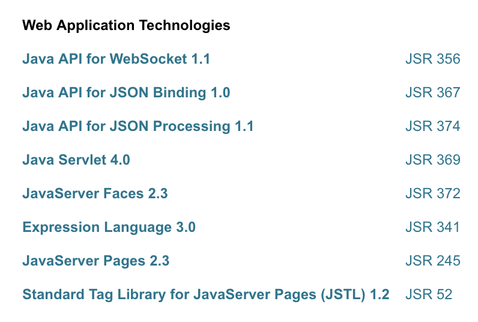
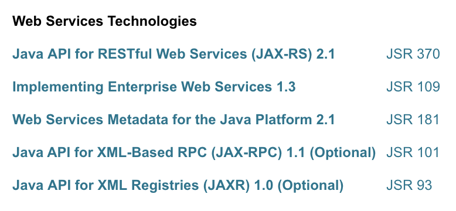
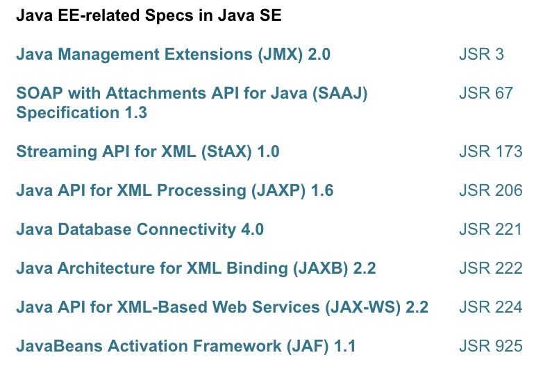

# Java EE 8 谷歌翻译

Java 企业应用开发

-   版本：v8

Java EE 是社区驱动的企业软件标准。Java EE 是利用 Java Community Process 开发的，业界专家、商业组织和开源组织、Java 用户组以及数不清的个人为此做出了巨大贡献。每个版本都集成了符合业界需求的新特性，提高了应用可移植性，提高了开发人员的工作效率

[Glassfish](https://javaee.github.io/glassfish/documentation) 是 Java EE的参考实现.

常见Web应用规范实现：[Tomcat](../JavaFramework/apache_tomcat_doc_zh_9/README.md)、[Jetty](http://www.eclipse.org/jetty/)

##  内容
-    
-   
-   
-   
-   

##  当前内容
- [Servlet](servlet/README.md)

##  资料
-   [GitHub](https://javaee.github.io/)
-   [入门实践](action/README.md)
    -   版本：8
    -   [官网](https://www.oracle.com/technetwork/java/javaee/overview/index.html)
-   文档
    -   [tutorial](https://javaee.github.io/tutorial/)
    -   [描述](https://www.oracle.com/technetwork/java/javaee/tech/index.html)
    -   [API](https://javaee.github.io/javaee-spec/javadocs/)
    -   [javaee8-samples](https://github.com/javaee-samples/javaee8-samples)
    -   [Java EE平台规范](https://github.com/javaee/javaee-spec)
    -   [Eclipse EE4J](https://projects.eclipse.org/projects/ee4j)
-   项目
    -   [Tomcat](http://tomcat.apache.org/)

