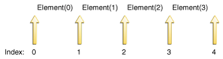

# List接口

A [`List`](https://docs.oracle.com/javase/8/docs/api/java/util/List.html)是有序的 [`Collection`](https://docs.oracle.com/javase/8/docs/api/java/util/Collection.html)（有时称为*序列*）。列表可能包含重复元素。除了继承的操作外`Collection`，该`List`接口还包括以下操作：

- `Positional access` - 根据列表中的数字位置操纵元素。这包括方法，例如`get`， `set`，`add`，`addAll`，和`remove`。
- `Search` - 搜索列表中的指定对象并返回其数字位置。搜索方法包括 `indexOf`和`lastIndexOf`。
- `Iteration`- 扩展`Iterator`语义以利用列表的顺序性。这些 `listIterator`方法提供了这种行为。
- `Range-view`- 该`sublist`方法对列表执行任意*范围操作*。

Java平台包含两个通用`List`实现。 [`ArrayList`](https://docs.oracle.com/javase/8/docs/api/java/util/ArrayList.html)，这通常是性能更好的实现，并且 [`LinkedList`](https://docs.oracle.com/javase/8/docs/api/java/util/LinkedList.html)在某些情况下可以提供更好的性能。

## 收集操作

`Collection`假设您已经熟悉它们，那么从所有人那里继承的操作都会对您期望他们做的事情做些什么。如果你不熟悉它们`Collection`，那么现在是阅读[The Collection Interface](collection.html)部分的好时机 。该`remove`操作始终从列表中删除指定元素*的第一个*匹配项。在`add`与`addAll`操作始终添加新的元素（S）到*最终*的名单。因此，以下习语将一个列表连接到另一个列表。

```java
list1.addAll(list2);
```

这是这个习语的非破坏性形式，它产生第三个`List`由第一个附加的第二个列表组成。

```java
List<Type> list3 = new ArrayList<Type>(list1);
list3.addAll(list2);
```

请注意，成语以其非破坏性形式利用了`ArrayList`标准转换构造函数。

这是一个例子（JDK 8及更高版本），它将一些名称聚合成`List`：

```java
List<String> list = people.stream()
.map(Person::getName)
.collect(Collectors.toList());
```

像 [`Set`](https://docs.oracle.com/javase/8/docs/api/java/util/Set.html)接口，`List`加强了对需求`equals`和`hashCode`使两种方法`List`的对象可以不考虑其实现类的逻辑相等性比较。`List`如果两个对象包含相同顺序的相同元素，则它们是相等的。

## 位置访问和搜索操作

其基本`positional access`操作是`get`，`set`，`add`和`remove`。（`set`和`remove`操作返回被覆盖或删除的旧值。）其他操作（`indexOf`和`lastIndexOf`）返回列表中指定元素的第一个或最后一个索引。

该`addAll`操作`Collection`将从指定位置开始插入指定的所有元素。元素按指定`Collection`迭代器返回的顺序插入。这个调用是位置访问模拟`Collection`的`addAll`操作。

这是一个在a中交换两个索引值的方法`List`。

```java
public static <E> void swap(List<E> a, int i, int j) {
    E tmp = a.get(i);
    a.set(i, a.get(j));
    a.set(j, tmp);
}
```

当然，这有一个很大的不同。这是一种多态算法：它将任意两个元素交换`List`，无论其实现类型如何。这是使用前面`swap`方法的另一种多态算法。

```java
public static void shuffle(List<?> list, Random rnd) {
    for (int i = list.size(); i > 1; i--)
        swap(list, i - 1, rnd.nextInt(i));
}
```

该算法包含在Java平台的 [`Collections`](https://docs.oracle.com/javase/8/docs/api/java/util/Collections.html)类中，使用指定的随机源随机置换指定的列表。它有点微妙：它从底部向上运行列表，反复地将随机选择的元素交换到当前位置。与大多数幼稚的洗牌尝试不同，它是*公平的*（所有排列都以相同的可能性发生，假设无偏见的随机源）和*快速*（需要完全`list.size()-1`交换）。以下程序使用此算法以随机顺序打印其参数列表中的单词。

```java
import java.util.*;

public class Shuffle {
    public static void main(String[] args) {
        List<String> list = new ArrayList<String>();
        for (String a : args)
            list.add(a);
        Collections.shuffle(list, new Random());
        System.out.println(list);
    }
}
```

事实上，这个程序可以更短，更快。的 [`Arrays`](https://docs.oracle.com/javase/8/docs/api/java/util/Arrays.html)类有称为静态工厂方法`asList`，其允许阵列作为被观看`List`。此方法不会复制数组。`List`写入到数组的更改，反之亦然。生成的List不是通用`List`实现，因为它没有实现（可选）`add`和`remove`操作：数组不可调整大小。利用`Arrays.asList`并调用`shuffle`使用默认随机源的库版本，您将获得以下 [`tiny program`](examples/Shuffle.java)行为与前一个程序相同的行为。

```java
import java.util.*;

public class Shuffle {
    public static void main(String[] args) {
        List<String> list = Arrays.asList(args);
        Collections.shuffle(list);
        System.out.println(list);
    }
}
```

## 迭代器

正如您所期望的那样，`Iterator`返回`List`的`iterator`操作以适当的顺序返回列表的元素。`List`还提供了一个更丰富的迭代器，称为a `ListIterator`，它允许您在任一方向上遍历列表，在迭代期间修改列表，并获取迭代器的当前位置。

`ListIterator`从`Iterator`（`hasNext`，`next`和`remove`）继承的三个方法在两个接口中完全相同。在`hasPrevious`和`previous`操作的准确类似物`hasNext`和`next`。前一个操作引用（隐式）游标之前的元素，而后者引用游标之后的元素。在`previous`操作光标向后移动，而`next`向前移动它。

这是在列表中向后迭代的标准习惯用法。

```java
for (ListIterator<Type> it = list.listIterator(list.size()); it.hasPrevious(); ) {
    Type t = it.previous();
    ...
}
```

注意`listIterator`前面成语中的参数。该`List`接口有两种形式的`listIterator`方法。没有参数的表单返回位于`ListIterator`列表开头的位置; 带有`int`参数的表单返回`ListIterator`指定索引处的位置。索引引用初始调用返回的元素`next`。初始调用`previous`将返回索引为的元素`index-1`。在长的名单`n`，有`n+1`有效值`index`，从`0`到`n`，包容性。

直观地说，光标始终是两个元素之间-这将通过调用返回到一个`previous`，并且将通过向调用返回的一个`next`。的`n+1`有效`index`值对应于`n+1`元件之间的间隙，从所述第一元件到最后一个之后的间隙之前的间隙。 下图显示了包含四个元素的列表中的五个可能的光标位置。




五个可能的光标位置。

呼叫`next`和`previous`可以混合，但你必须要小心。第一次调用`previous`返回与上次调用相同的元素`next`。类似地，在`next`一系列调用之后的第一次调用`previous`返回与上次调用相同的元素`previous`。

毫不奇怪，该`nextIndex`方法返回后续调用返回的元素的索引`next`，并`previousIndex`返回后续调用返回的元素的索引`previous`。这些调用通常用于报告找到某物的位置或记录其位置，`ListIterator`以便`ListIterator`可以创建具有相同位置的另一个。

同样地，返回的数字`nextIndex`总是大于返回的数字也就不足为奇了`previousIndex`。这意味着两种边界情况的行为：（1）调用`previousIndex`光标在初始元素返回之前的时间`-1`和（2）调用`nextIndex`光标在最终元素返回之后的时间`list.size()`。为了使所有这些具体化，以下是可能的实现`List.indexOf`。

```java
public int indexOf(E e) {
    for (ListIterator<E> it = listIterator(); it.hasNext(); )
        if (e == null ? it.next() == null : e.equals(it.next()))
            return it.previousIndex();
    // Element not found
    return -1;
}
```

请注意，即使它正在向前遍历列表，该`indexOf`方法`it.previousIndex()`也会返回。原因是`it.nextIndex()`返回我们要检查的元素的索引，并且我们想要返回我们刚检查的元素的索引。

该`Iterator`接口提供了`remove`手术取出返回的最后一个元素`next`从`Collection`。对于`ListIterator`此操作，删除由`next`或返回的最后一个元素`previous`。该`ListIterator`界面提供了两个额外的操作来修改列表 - `set`和`add`。该`set`方法将覆盖由返回的最后一个元素`next`或`previous`与指定的元素。以下多态算法用于`set`将一个指定值的所有出现替换为另一个。

```java
public static <E> void replace(List<E> list, E val, E newVal) {
    for (ListIterator<E> it = list.listIterator(); it.hasNext(); )
        if (val == null ? it.next() == null : val.equals(it.next()))
            it.set(newVal);
}
```

在这个例子中唯一的棘手问题是`val`和之间的相等性测试`it.next`。你需要特殊情况下的`val`值`null`来防止a `NullPointerException`。

该`add`方法在当前光标位置之前立即将新元素插入到列表中。此方法在以下多态算法中说明，以使用指定列表中包含的值序列替换指定值的所有出现。

```java
public static <E> 
    void replace(List<E> list, E val, List<? extends E> newVals) {
    for (ListIterator<E> it = list.listIterator(); it.hasNext(); ){
        if (val == null ? it.next() == null : val.equals(it.next())) {
            it.remove();
            for (E e : newVals)
                it.add(e);
        }
    }
}
```

## 范围视图操作

该`range-view`操作`subList(int fromIndex, int toIndex)`返回`List`此列表部分的视图，其索引范围从`fromIndex`（包括）到`toIndex`独占。这个*半开范围*反映了典型的`for`环路。

```java
for (int i = fromIndex; i < toIndex; i++) {
    ...
}
```

正如术语*视图*所暗示的那样，返回`List`由被调用的`List`on 来备份`subList`，因此前者的变化反映在后者中。

此方法消除了对显式范围操作（对于数组通常存在的排序）的需要。任何期望a的操作`List`都可以通过传递`subList`视图而不是整体来用作范围操作`List`。例如，以下习语从a中删除了一系列元素`List`。

```java
list.subList(fromIndex, toIndex).clear();
```

可以构造类似的习语以搜索范围中的元素。

```java
int i = list.subList(fromIndex, toIndex).indexOf(o);
int j = list.subList(fromIndex, toIndex).lastIndexOf(o);
```

请注意，前面的习语会返回找到的元素`subList`的索引，而不是返回支持中的索引`List`。

在a上运行的任何多态算法`List`（例如`replace`和`shuffle`示例）都与`List`返回的by一起使用`subList`。

这是一个多态算法，其实现用于`subList`处理来自牌组的牌。也就是说，它返回一个新的`List`（“手”），其中包含从指定结尾`List`（“甲板”）中取出的指定数量的元素。手中返回的元素将从卡座中移除。

```java
public static <E> List<E> dealHand(List<E> deck, int n) {
    int deckSize = deck.size();
    List<E> handView = deck.subList(deckSize - n, deckSize);
    List<E> hand = new ArrayList<E>(handView);
    handView.clear();
    return hand;
}
```

请注意，此算法将牌从牌组*末端*移开。对于许多常见的`List`实现，例如`ArrayList`，从列表末尾删除元素的性能明显优于从头开始删除元素的性能。

以下是 结合[`a program`](examples/Deal.java)使用该`dealHand`方法`Collections.shuffle`从正常的52张牌组生成牌局。该程序采用两个命令行参数：（1）交易手数和（2）每手牌数。

```java
import java.util.*;

public class Deal {
    public static void main(String[] args) {
        if (args.length < 2) {
            System.out.println("Usage: Deal hands cards");
            return;
        }
        int numHands = Integer.parseInt(args[0]);
        int cardsPerHand = Integer.parseInt(args[1]);
    
        // Make a normal 52-card deck.
        String[] suit = new String[] {
            "spades", "hearts", 
            "diamonds", "clubs" 
        };
        String[] rank = new String[] {
            "ace", "2", "3", "4",
            "5", "6", "7", "8", "9", "10", 
            "jack", "queen", "king" 
        };

        List<String> deck = new ArrayList<String>();
        for (int i = 0; i < suit.length; i++)
            for (int j = 0; j < rank.length; j++)
                deck.add(rank[j] + " of " + suit[i]);
    
        // Shuffle the deck.
        Collections.shuffle(deck);
    
        if (numHands * cardsPerHand > deck.size()) {
            System.out.println("Not enough cards.");
            return;
        }
    
        for (int i = 0; i < numHands; i++)
            System.out.println(dealHand(deck, cardsPerHand));
    }
  
    public static <E> List<E> dealHand(List<E> deck, int n) {
        int deckSize = deck.size();
        List<E> handView = deck.subList(deckSize - n, deckSize);
        List<E> hand = new ArrayList<E>(handView);
        handView.clear();
        return hand;
    }
}
```

运行程序会产生如下输出。

```bash
% java Deal 4 5

[8 of hearts, jack of spades, 3 of spades, 4 of spades,
    king of diamonds]
[4 of diamonds, ace of clubs, 6 of clubs, jack of hearts,
    queen of hearts]
[7 of spades, 5 of spades, 2 of diamonds, queen of diamonds,
    9 of clubs]
[8 of spades, 6 of diamonds, ace of spades, 3 of hearts,
    ace of hearts]
```

尽管`subList`操作非常强大，但在使用时必须小心。如果元素以除了返回之外的任何方式添加到支持或从支持中删除，则`List`返回的语义将`subList`变为未定义。因此，强烈建议您仅将返回的值用作临时对象 - 在后备上执行一个或一系列范围操作。使用实例的时间越长，通过直接修改支持或通过其他对象修改支持的可能性就越大。请注意，修改子列表的子列表并继续使用原始子列表（尽管不是并发）是合法的。`List``List``List``subList``List``subList``List``subList`

## 列表算法

`Collections`该类中的大多数多态算法专门适用于`List`。拥有所有这些算法可以很容易地操作列表。以下是这些算法的摘要，这些算法在“ [算法”](../algorithms/index.html)部分中有更详细的描述 。

- `sort`- `List`使用合并排序算法对a 进行排序，该算法提供快速，稳定的排序。（*稳定的排序*是不重新排序相同元素的排序。）
- `shuffle`- 随机置换a中的元素`List`。
- `reverse`- 颠倒a中元素的顺序`List`。
- `rotate`- 将a中`List`的所有元素旋转指定的距离。
- `swap`- 将元素交换到a中的指定位置`List`。
- `replaceAll` - 将所有出现的一个指定值替换为另一个。
- `fill`- `List`用指定的值覆盖a中的每个元素。
- `copy`- 将源复制`List`到目标`List`。
- `binarySearch`- `List`使用二进制搜索算法搜索有序元素。
- `indexOfSubList`- 返回第一个子列表的索引，该子列表`List`等于另一个子列表。
- `lastIndexOfSubList`- 返回与`List`另一个子列表相等的最后一个子列表的索引。