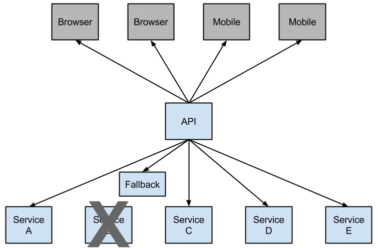

# 13. Circuit Breaker: Hystrix Clients

## 13.断路器：Hystrix客户

Netflix创建了一个名为[Hystrix](https://github.com/Netflix/Hystrix)的库，该库实现了[断路器模式](https://martinfowler.com/bliki/CircuitBreaker.html)。在微服务架构中，通常有多个服务调用层，如以下示例所示：

**图13.1。微服务图**


较低级别的服务中的服务故障可能会导致级联故障，直至用户。当在由（默认值：10秒）定义的滚动窗口中，对特定服务的调用超过`circuitBreaker.requestVolumeThreshold`（默认值：20个请求）并且失败百分比大于`circuitBreaker.errorThresholdPercentage`（默认值：> 50％）时`metrics.rollingStats.timeInMilliseconds`，电路断开并且不会进行调用。在错误和断路的情况下，开发人员可以提供后备功能。

**图13.2 Hystrix后备可防止级联故障**




开路可以停止级联故障，并让不堪重负的服务故障时间得以恢复。回退可以是另一个受Hystrix保护的调用，静态数据或合理的空值。可以将回退链接在一起，以便第一个回退进行其他业务调用，而后者又回退到静态数据。

## 13.1如何包括Hystrix

要将Hystrix包括在您的项目中，请使用组ID为`org.springframework.cloud` 和工件ID为的启动器`spring-cloud-starter-netflix-hystrix`。有关使用当前Spring Cloud Release Train设置构建系统的详细信息，请参见[Spring Cloud Project页面](https://projects.spring.io/spring-cloud/)。

以下示例显示了带有Hystrix断路器的最小型Eureka服务器：

```
@SpringBootApplication
@EnableCircuitBreaker
public class Application {

    public static void main(String[] args) {
        new SpringApplicationBuilder(Application.class).web(true).run(args);
    }

}

@Component
public class StoreIntegration {

    @HystrixCommand(fallbackMethod = "defaultStores")
    public Object getStores(Map<String, Object> parameters) {
        //do stuff that might fail
    }

    public Object defaultStores(Map<String, Object> parameters) {
        return /* something useful */;
    }
}
```

这`@HystrixCommand`是由一个名为[“ javanica ”](https://github.com/Netflix/Hystrix/tree/master/hystrix-contrib/hystrix-javanica)的Netflix contrib库提供的。Spring Cloud会自动将带有该批注的Spring bean包装在连接到Hystrix断路器的代理中。断路器计算何时断开和闭合电路，以及在发生故障时应采取的措施。

要配置，`@HystrixCommand`您可以将`commandProperties` 属性与`@HystrixProperty`注释列表一起使用。有关 更多详细信息，请参见 [此处](https://github.com/Netflix/Hystrix/tree/master/hystrix-contrib/hystrix-javanica#configuration)。有关 可用属性的详细信息，请参见[Hystrix Wiki](https://github.com/Netflix/Hystrix/wiki/Configuration)。

## 13.2传播安全上下文或使用Spring Scope

如果您希望某些线程本地上下文传播到中`@HystrixCommand`，则默认声明不起作用，因为它在线程池中执行命令（如果超时）。您可以通过配置或要求注释使用不同的“ 隔离策略 ”，将Hystrix切换为使用与调用方相同的线程或直接在注释中使用。以下示例演示了如何在注释中设置线程：

```java
@HystrixCommand(fallbackMethod = "stubMyService",
    commandProperties = {
      @HystrixProperty(name="execution.isolation.strategy", value="SEMAPHORE")
    }
)
...
```

如果您使用`@SessionScope`或，则同样适用`@RequestScope`。如果遇到运行时异常，提示它找不到范围内的上下文，则需要使用同一线程。

您还可以选择将`hystrix.shareSecurityContext`属性设置为`true`。这样做会自动配置一个Hystrix并发策略插件挂钩，以将其`SecurityContext`从您的主线程转移到Hystrix命令使用的线程。Hystrix不允许注册多个Hystrix并发策略，因此可以通过将自己声明`HystrixConcurrencyStrategy`为Spring Bean 来使用扩展机制。Spring Cloud在Spring上下文中寻找您的实现，并将其包装在自己的插件中。

## 13.3健康指标

连接的断路器的状态也`/health`显示在调用应用程序的端点中，如以下示例所示：

```json
{
    "hystrix": {
        "openCircuitBreakers": [
            "StoreIntegration::getStoresByLocationLink"
        ],
        "status": "CIRCUIT_OPEN"
    },
    "status": "UP"
}
```

## 13.4 Hystrix指标流

为了使猬度量流，包括在依赖关系`spring-boot-starter-actuator`和集 `management.endpoints.web.exposure.include: hystrix.stream`。这样做将`/actuator/hystrix.stream`as作为管理端点公开，如以下示例所示：

```xml
   <dependency>
        <groupId>org.springframework.boot</groupId>
        <artifactId>spring-boot-starter-actuator</artifactId>
    </dependency>
```