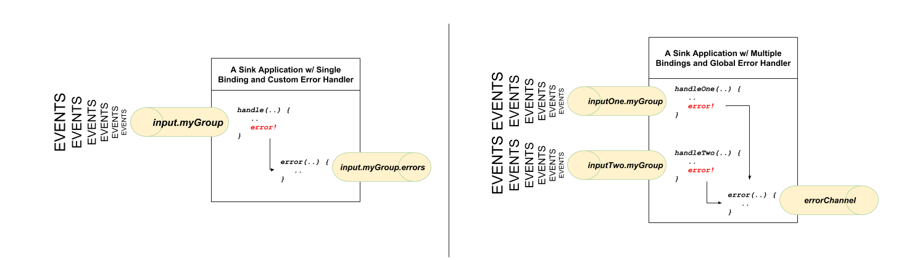

# 29. Programming Model

## 29.编程模型

要了解编程模型，您应该熟悉以下核心概念：

- **目标绑定器：**负责与外部消息传递系统集成的组件。
- **目的地绑定：**桥的外部消息系统和应用程序之间提供*生产者*和*消费者*的消息（由目的地粘合剂创建）。
- **消息：**生产者和消费者用来与目标绑定程序（以及因此通过外部消息传递系统进行其他应用程序）通信的规范数据结构。


## 29.1目标绑定

Destination Binders是Spring Cloud Stream的扩展组件，负责提供必要的配置和实现以促进与外部消息传递系统的集成。这种集成负责连接，委派和与生产者和消费者之间的消息路由，数据类型转换，用户代码调用等。

粘合剂要承担很多样板工作，否则这些工作就落在了您的肩膀上。但是，要实现这一点，活页夹仍然需要用户提供的一些简单但必需的说明形式的帮助，这些说明通常以某种类型的配置形式出现。

尽管讨论所有可用的活页夹和绑定配置选项（本手册的其余部分都涉及它们）不在本节的讨论范围之内，但 *目标绑定*确实需要特别注意。下一节将详细讨论。

## 29.2目标绑定

如前所述，*目标绑定*提供了外部消息传递系统与应用程序提供的*生产者*和*消费者*之间的桥梁。

将@EnableBinding批注应用于应用程序的一个配置类可定义目标绑定。该`@EnableBinding`注释本身是元注解为`@Configuration`和触发春季云溪基础设施的配置。

下面的示例显示了一个功能完整且运行良好的Spring Cloud Stream应用程序，该应用程序从`INPUT` 目标接收消息的有效负载作为一种`String`类型（请参阅[第32章，*内容类型协商*](https://cloud.spring.io/spring-cloud-static/Greenwich.SR3/multi/multi_content-type-management.html)部分），将其记录到控制台，并`OUTPUT`在转换后将其发送到目标大写。

```java
@SpringBootApplication
@EnableBinding(Processor.class)
public class MyApplication {

	public static void main(String[] args) {
		SpringApplication.run(MyApplication.class, args);
	}

	@StreamListener(Processor.INPUT)
	@SendTo(Processor.OUTPUT)
	public String handle(String value) {
		System.out.println("Received: " + value);
		return value.toUpperCase();
	}
}
```

如您所见，`@EnableBinding`注释可以将一个或多个接口类作为参数。这些参数称为*绑定*，它们包含表示*可绑定组件的*方法。这些组件通常是消息通道（请参阅[Spring Messaging](https://docs.spring.io/spring-boot/docs/current/reference/html/boot-features-messaging.html)），用于基于通道的活页夹（例如Rabbit，Kafka和其他）。但是，其他类型的绑定可以为相应技术的本机功能提供支持。例如，Kafka Streams活页夹（以前称为KStream）允许直接绑定到Kafka Streams（有关更多详细信息，请参见[Kafka Streams](https://docs.spring.io/autorepo/docs/spring-cloud-stream-binder-kafka-docs/1.1.0.M1/reference/htmlsingle/)）。

Spring Cloud Stream已经为典型的消息交换合同提供了*绑定*接口，其中包括：

- **水槽：**识别由提供来自该消息所消耗的目的地为所述消息用户的合同。
- **源：**通过提供将生成的消息发送到的目的地来标识消息生产者的合同。
- **处理器：**通过公开两个允许使用和产生消息的目的地，来封装接收器和源协定。

```java
public interface Sink {

  String INPUT = "input";

  @Input(Sink.INPUT)
  SubscribableChannel input();
}

public interface Source {

  String OUTPUT = "output";

  @Output(Source.OUTPUT)
  MessageChannel output();
}

public interface Processor extends Source, Sink {}

```

尽管前面的示例满足了大多数情况，但是您也可以通过定义自己的绑定接口并使用`@Input`和`@Output` 注释来标识实际的*可绑定组件*来定义自己的合同。

例如：

```java
public interface Barista {

    @Input
    SubscribableChannel orders();

    @Output
    MessageChannel hotDrinks();

    @Output
    MessageChannel coldDrinks();
}
```

使用前面的例子中示出为一个参数到接口`@EnableBinding`触发器三个入境信道的创建命名`orders`，`hotDrinks`以及`coldDrinks`分别。

您可以根据需要提供任意数量的绑定接口，作为`@EnableBinding`注释的参数，如以下示例所示：

```
@EnableBinding（值= {订单类，付款类 }）
```

在Spring Cloud Stream中，可绑定的`MessageChannel`组件是Spring Messaging `MessageChannel`（用于出站）及其扩展名`SubscribableChannel`，（用于入站）。

**可轮询的目标绑定**

尽管前面描述的绑定支持基于事件的消息使用，但是有时您需要更多控制，例如使用率。

从2.0版开始，您现在可以绑定可轮询的使用者：

以下示例显示了如何绑定可轮询的使用者：

```java
public interface PolledBarista {

    @Input
    PollableMessageSource orders();
	. . .
}
```

在这种情况下，的实现`PollableMessageSource`绑定到`orders`“通道”。有关更多详细信息[，](https://cloud.spring.io/spring-cloud-static/Greenwich.SR3/multi/multi__programming_model.html#spring-cloud-streams-overview-using-polled-consumers)请参见[第29.3.5节“使用轮询的使用者”](https://cloud.spring.io/spring-cloud-static/Greenwich.SR3/multi/multi__programming_model.html#spring-cloud-streams-overview-using-polled-consumers)。

**自定义频道名称**

通过使用`@Input`和`@Output`注释，您可以为频道指定自定义频道名称，如以下示例所示：

```java
public interface Barista {
    @Input("inboundOrders")
    SubscribableChannel orders();
}
```

在前面的示例中，创建的绑定通道名为`inboundOrders`。

通常，您不需要直接访问单个通道或绑定（除非通过`@EnableBinding`注释对其进行配置）。但是，您有时可能会遇到诸如测试或其他极端情况的情况。

除了为每个绑定生成通道并将其注册为Spring Bean之外，Spring Cloud Stream还为每个绑定接口生成一个实现该接口的bean。这意味着您可以通过在应用程序中自动接线来访问表示绑定或各个通道的接口，如以下两个示例所示：

*自动接线绑定界面*

```java
@Autowire
private Source source

public void sayHello(String name) {
    source.output().send(MessageBuilder.withPayload(name).build());
}
```

*自动连线个别频道*

```java
@Autowire
private MessageChannel output;

public void sayHello(String name) {
    output.send(MessageBuilder.withPayload(name).build());
}
```

`@Qualifier`对于自定义通道名称或在需要特定命名通道的多通道方案中，您也可以使用标准的Spring 注释。

下面的示例演示如何以这种方式使用@Qualifier批注：

```java
@Autowire
@Qualifier("myChannel")
private MessageChannel output;
```

## 29.3生产和消费消息

您可以使用Spring Integration批注或Spring Cloud Stream本机批注编写Spring Cloud Stream应用程序。

### 29.3.1 Spring集成支持

Spring Cloud Stream建立在[Enterprise Integration Patterns](http://www.enterpriseintegrationpatterns.com/)定义的概念和模式的基础上，并依赖于其内部实现，该内部实现依赖于Spring项目组合中已建立且流行的Enterprise Integration Patterns实现： [Spring Integration](https://projects.spring.io/spring-integration/)框架。

因此，它自然支持Spring Integration已经建立的基础，语义和配置选项。

例如，您可以将a的输出通道附加`Source`到a `MessageSource`并使用熟悉的`@InboundChannelAdapter`注释，如下所示：

```java
@EnableBinding(Source.class)
public class TimerSource {

  @Bean
  @InboundChannelAdapter(value = Source.OUTPUT, poller = @Poller(fixedDelay = "10", maxMessagesPerPoll = "1"))
  public MessageSource<String> timerMessageSource() {
    return () -> new GenericMessage<>("Hello Spring Cloud Stream");
  }
}
```

同样，可以在提供*处理器*绑定合同的消息处理程序方法的实现时使用@Transformer或@ServiceActivator ，如以下示例所示：

```java
@EnableBinding(Processor.class)
public class TransformProcessor {
  @Transformer(inputChannel = Processor.INPUT, outputChannel = Processor.OUTPUT)
  public Object transform(String message) {
    return message.toUpperCase();
  }
}
```

| ![[注意]](https://cloud.spring.io/spring-cloud-static/Greenwich.SR3/multi/images/note.png) |
| ------------------------------------------------------------ |
| 尽管这可能会略过一些，但重要的是要了解，当您使用`@StreamListener`注释从同一绑定中消费时，将使用pub-sub模型。带有注解的每种方法均`@StreamListener`收到其自己的消息副本，并且每种方法都有其自己的使用者组。但是，如果从相同的消耗使用Spring Integration的注解之一（如结合`@Aggregator`，`@Transformer`或`@ServiceActivator`），这些消耗于竞争模型。没有为每个订阅创建单独的消费者组。 |

### 29.3.2使用@StreamListener注释

为了补充其Spring Integration的支持下，春天的云流提供了自己的`@StreamListener`注释，其他春天消息的注解仿照（`@MessageMapping`，`@JmsListener`，`@RabbitListener`，等），并提供conviniences，如基于内容的路由等。

```java
@EnableBinding(Sink.class)
public class VoteHandler {

  @Autowired
  VotingService votingService;

  @StreamListener(Sink.INPUT)
  public void handle(Vote vote) {
    votingService.record(vote);
  }
}
```

与其他春天消息的方法，方法的参数可以进行批注`@Payload`，`@Headers`和`@Header`。

对于返回数据的方法，必须使用`@SendTo`批注为该方法返回的数据指定输出绑定目标，如以下示例所示：

```java
@EnableBinding(Processor.class)
public class TransformProcessor {

  @Autowired
  VotingService votingService;

  @StreamListener(Processor.INPUT)
  @SendTo(Processor.OUTPUT)
  public VoteResult handle(Vote vote) {
    return votingService.record(vote);
  }
}
```

### 29.3.3使用@StreamListener进行基于内容的路由

Spring Cloud Stream支持将消息调度到`@StreamListener`基于条件注释的多个处理程序方法。

为了有资格支持条件分派，一种方法必须满足以下条件：

- 它不能返回值。
- 它必须是单独的消息处理方法（不支持反应性API方法）。

该条件由`condition`注释参数中的SpEL表达式指定，并针对每条消息进行评估。所有与条件匹配的处理程序都在同一线程中调用，并且不必假设调用的顺序。

在以下`@StreamListener`带有调度条件的示例中，所有带有`type`带有值的标头的消息`bogey`都被调度到 `receiveBogey`方法，所有带有`type`带有值的标头的消息`bacall`都被调度到`receiveBacall`方法。

```java
@EnableBinding(Sink.class)
@EnableAutoConfiguration
public static class TestPojoWithAnnotatedArguments {

    @StreamListener(target = Sink.INPUT, condition = "headers['type']=='bogey'")
    public void receiveBogey(@Payload BogeyPojo bogeyPojo) {
       // handle the message
    }

    @StreamListener(target = Sink.INPUT, condition = "headers['type']=='bacall'")
    public void receiveBacall(@Payload BacallPojo bacallPojo) {
       // handle the message
    }
}
```

**内容上下文中的内容类型协商 `condition`**

重要的是要使用`condition`参数来了解基于内容的路由背后的一些机制`@StreamListener`，尤其是在整个消息类型的上下文中。如果您在继续之前熟悉[第32章，*内容类型协商*](https://cloud.spring.io/spring-cloud-static/Greenwich.SR3/multi/multi_content-type-management.html)[，](https://cloud.spring.io/spring-cloud-static/Greenwich.SR3/multi/multi_content-type-management.html)也可能会有所帮助。

请考虑以下情形：

```java
@EnableBinding(Sink.class)
@EnableAutoConfiguration
public static class CatsAndDogs {

    @StreamListener(target = Sink.INPUT, condition = "payload.class.simpleName=='Dog'")
    public void bark(Dog dog) {
       // handle the message
    }

    @StreamListener(target = Sink.INPUT, condition = "payload.class.simpleName=='Cat'")
    public void purr(Cat cat) {
       // handle the message
    }
}
```

前面的代码是完全有效的。它可以毫无问题地进行编译和部署，但是永远不会产生您期望的结果。

这是因为您正在测试的东西在您期望的状态下尚不存在。这是因为消息的有效负载尚未从有线格式（`byte[]`）转换为所需的类型。换句话说，它尚未经过[第32章，*内容类型协商*](https://cloud.spring.io/spring-cloud-static/Greenwich.SR3/multi/multi_content-type-management.html)中描述的类型转换过程。

因此，除非您使用SPeL表达式来评估原始数据（例如，字节数组中第一个字节的值），否则请使用基于消息标头的表达式（例如`condition = "headers['type']=='dog'"`）。

| ![[注意]](https://cloud.spring.io/spring-cloud-static/Greenwich.SR3/multi/images/note.png) |
| ------------------------------------------------------------ |
| 目前，`@StreamListener`仅基于通道的绑定程序支持（不支持反应式编程）支持按条件分派。 |

### 29.3.4 Spring Cloud Function支持

从Spring Cloud Stream v2.1开始，定义*流处理程序*和*源的*另一种选择是使用对[Spring Cloud Function的](https://cloud.spring.io/spring-cloud-function/)内置支持，其中可以将它们表示为type的bean `java.util.function.[Supplier/Function/Consumer]`。

要指定哪个功能bean绑定到绑定公开的外部目标，您必须提供`spring.cloud.stream.function.definition`属性。

这是Processor应用程序将消息处理程序公开为的示例 `java.util.function.Function`

```java
@SpringBootApplication
@EnableBinding(Processor.class)
public class MyFunctionBootApp {

	public static void main(String[] args) {
		SpringApplication.run(MyFunctionBootApp.class, "--spring.cloud.stream.function.definition=toUpperCase");
	}

	@Bean
	public Function<String, String> toUpperCase() {
		return s -> s.toUpperCase();
	}
}
```

在上面的代码中，我们仅定义了一个`java.util.function.Function`名为*toUpperCase*的bean，并将其标识为用作消息处理程序的bean，其“输入”和“输出”必须绑定到Processor绑定公开的外部目标。

以下是支持源，处理器和接收器的简单功能应用程序的示例。

这是定义为 `java.util.function.Supplier`

```java
@SpringBootApplication
@EnableBinding(Source.class)
public static class SourceFromSupplier {
	public static void main(String[] args) {
		SpringApplication.run(SourceFromSupplier.class, "--spring.cloud.stream.function.definition=date");
	}
	@Bean
	public Supplier<Date> date() {
		return () -> new Date(12345L);
	}
}
```

这是定义为 `java.util.function.Function`

```java
@SpringBootApplication
@EnableBinding(Processor.class)
public static class ProcessorFromFunction {
	public static void main(String[] args) {
		SpringApplication.run(ProcessorFromFunction.class, "--spring.cloud.stream.function.definition=toUpperCase");
	}
	@Bean
	public Function<String, String> toUpperCase() {
		return s -> s.toUpperCase();
	}
}
```

这是一个定义为 `java.util.function.Consumer`

```java
@EnableAutoConfiguration
@EnableBinding(Sink.class)
public static class SinkFromConsumer {
	public static void main(String[] args) {
		SpringApplication.run(SinkFromConsumer.class, "--spring.cloud.stream.function.definition=sink");
	}
	@Bean
	public Consumer<String> sink() {
		return System.out::println;
	}
}
```

#### 功能组成

使用此编程模型，您还可以从功能组合中受益，在该功能组合中，您可以从一组简单函数中动态组成复杂的处理程序。作为示例，让我们将以下函数bean添加到上面定义的应用程序中

```java
@Bean
public Function<String, String> wrapInQuotes() {
	return s -> "\"" + s + "\"";
}
```

并修改该`spring.cloud.stream.function.definition`属性以反映您打算从'toUpperCase'和'wrapInQuotes'组成新函数的意图。为此，Spring Cloud Function允许您使用`|`（管道）符号。因此，完成我们的示例，我们的属性现在将如下所示：

```bash
—spring.cloud.stream.function.definition=toUpperCase|wrapInQuotes
```

### 29.3.5使用轮询的使用者

#### 总览

使用轮询的使用者时，可以`PollableMessageSource`按需轮询。考虑以下受调查消费者的示例：

```java
public interface PolledConsumer {

    @Input
    PollableMessageSource destIn();

    @Output
    MessageChannel destOut();

}
```

给定上一个示例中的受调查消费者，您可以按以下方式使用它：

```java
@Bean
public ApplicationRunner poller(PollableMessageSource destIn, MessageChannel destOut) {
    return args -> {
        while (someCondition()) {
            try {
                if (!destIn.poll(m -> {
                    String newPayload = ((String) m.getPayload()).toUpperCase();
                    destOut.send(new GenericMessage<>(newPayload));
                })) {
                    Thread.sleep(1000);
                }
            }
            catch (Exception e) {
                // handle failure
            }
        }
    };
}
```

该`PollableMessageSource.poll()`方法带有一个`MessageHandler`参数（通常是lambda表达式，如此处所示）。它返回`true`是否已接收并成功处理该消息。

与消息驱动的使用者一样，如果`MessageHandler`引发异常，消息将发布到错误通道，如“ [???”中所述。](https://cloud.spring.io/spring-cloud-static/Greenwich.SR3/multi/multi__programming_model.html)”。

通常，该`poll()`方法在`MessageHandler`退出时确认消息。如果该方法异常退出，该消息将被拒绝（不重新排队），但请参阅[“处理错误”一节](https://cloud.spring.io/spring-cloud-static/Greenwich.SR3/multi/multi__programming_model.html#polled-errors)。您可以通过对确认负责来覆盖该行为，如以下示例所示：

```java
@Bean
public ApplicationRunner poller(PollableMessageSource dest1In, MessageChannel dest2Out) {
    return args -> {
        while (someCondition()) {
            if (!dest1In.poll(m -> {
                StaticMessageHeaderAccessor.getAcknowledgmentCallback(m).noAutoAck();
                // e.g. hand off to another thread which can perform the ack
                // or acknowledge(Status.REQUEUE)

            })) {
                Thread.sleep(1000);
            }
        }
    };
}
```

| ![[重要]](https://cloud.spring.io/spring-cloud-static/Greenwich.SR3/multi/images/important.png) | 重要 |
| ------------------------------------------------------------ | ---- |
| 您必须在某个时候`ack`（或`nack`）发送消息，以避免资源泄漏。  |      |

| ![[重要]](https://cloud.spring.io/spring-cloud-static/Greenwich.SR3/multi/images/important.png) | 重要 |
| ------------------------------------------------------------ | ---- |
| 一些消息传递系统（例如Apache Kafka）在日志中维护简单的偏移量。如果传递失败并重新排队`StaticMessageHeaderAccessor.getAcknowledgmentCallback(m).acknowledge(Status.REQUEUE);`，则重新传递任何以后成功确认的消息。 |      |

还有一个重载`poll`方法，其定义如下：

```
poll（MessageHandler处理程序，ParameterizedTypeReference <？>类型）
```

的`type`是转换提示，允许进入的消息有效负载将被转换，如图以下示例：

```java
boolean result = pollableSource.poll(received -> {
			Map<String, Foo> payload = (Map<String, Foo>) received.getPayload();
            ...

		}, new ParameterizedTypeReference<Map<String, Foo>>() {});
```

#### 处理错误

默认情况下，为可轮询源配置了一个错误通道。如果回调引发异常，则将an `ErrorMessage`发送到错误通道（`..errors`）；这个错误通道也桥接到了全局的Spring Integration `errorChannel`。

您可以使用订阅任何一个错误通道`@ServiceActivator`来处理错误；如果没有订阅，则将仅记录错误并确认消息成功。如果错误通道服务激活器引发异常，则该消息将被拒绝（默认情况下），并且不会重新发送。如果服务激活器抛出`RequeueCurrentMessageException`，该消息将在代理处重新排队，并在随后的轮询中再次检索。

如果侦听器`RequeueCurrentMessageException`直接抛出，则消息将如上所述重新排队，并且不会发送到错误通道。

## 29.4错误处理

错误会发生，Spring Cloud Stream提供了几种灵活的机制来处理它们。错误处理有两种形式：

- **应用程序：**错误处理在应用程序（自定义错误处理程序）中完成。
- **系统：**错误处理委托给联编程序（重新排队，DL和其他）。请注意，这些技术取决于绑定程序的实现和底层消息传递中间件的功能。

Spring Cloud Stream使用[Spring Retry](https://github.com/spring-projects/spring-retry)库来促进成功的消息处理。有关更多详细信息[，](https://cloud.spring.io/spring-cloud-static/Greenwich.SR3/multi/multi__programming_model.html#_retry_template)请参见[第29.4.3节“重试模板”](https://cloud.spring.io/spring-cloud-static/Greenwich.SR3/multi/multi__programming_model.html#_retry_template)。但是，当所有操作失败时，消息处理程序引发的异常将传播回绑定程序。那时，活页夹调用自定义错误处理程序或将错误传达回消息传递系统（重新排队，DLQ等）。

### 29.4.1应用程序错误处理

有两种类型的应用程序级错误处理。可以在每个绑定订阅中处理错误，或者全局处理程序可以处理所有绑定订阅错误。让我们查看详细信息。


**图29.1 具有自定义和全局错误处理程序的Spring Cloud Stream Sink应用程序**




对于每个输入绑定，Spring Cloud Stream创建具有以下语义的专用错误通道`.errors`。

| ![[注意]](https://cloud.spring.io/spring-cloud-static/Greenwich.SR3/multi/images/note.png) |
| ------------------------------------------------------------ |
| 在``由结合（如名称的`input`）和基团（如名称`myGroup`）。     |

考虑以下：

```java
@StreamListener(Sink.INPUT) // destination name 'input.myGroup'
public void handle(Person value) {
	throw new RuntimeException("BOOM!");
}

@ServiceActivator(inputChannel = Processor.INPUT + ".myGroup.errors") //channel name 'input.myGroup.errors'
public void error(Message<?> message) {
	System.out.println("Handling ERROR: " + message);
}
```

在前面的示例中，目标名称为`input.myGroup`，专用错误通道名称为`input.myGroup.errors`。

| ![[注意]](https://cloud.spring.io/spring-cloud-static/Greenwich.SR3/multi/images/note.png) |
| ------------------------------------------------------------ |
| @StreamListener批注的使用专门用于定义桥接内部通道和外部目标的绑定。鉴于目标特定的错误通道没有关联的外部目标，因此此类通道是Spring Integration（SI）的特权。这意味着必须使用SI处理程序注释之一（即@ ServiceActivator，@ Transformer等）定义用于此类目标的处理程序。 |

| ![[注意]](https://cloud.spring.io/spring-cloud-static/Greenwich.SR3/multi/images/note.png) |
| ------------------------------------------------------------ |
| 如果`group`未指定if，则使用匿名组（类似`input.anonymous.2K37rb06Q6m2r51-SPIDDQ`），这不适用于错误处理方案，因为在创建目标之前，您不知道它将是什么。 |

另外，如果您绑定到现有目的地，例如：

```properties
spring.cloud.stream.bindings.input.destination=myFooDestination
spring.cloud.stream.bindings.input.group=myGroup
```

完整的目标名称为`myFooDestination.myGroup`，然后专用错误通道名称为`myFooDestination.myGroup.errors`。

回到例子...

`handle(..)`预订名为的通道的方法`input`将引发异常。给定错误通道的一个订阅者，`input.myGroup.errors` 所有错误消息均由该订阅者处理。

如果您有多个绑定，则可能需要一个错误处理程序。通过将每个单独的错误通道桥接到名为的通道，Spring Cloud Stream自动为*全局错误通道*提供支持`errorChannel`，从而允许单个订阅者处理所有错误，如以下示例所示：

```java
@StreamListener("errorChannel")
public void error(Message<?> message) {
	System.out.println("Handling ERROR: " + message);
}
```

如果错误处理逻辑相同，则与哪个处理程序产生错误无关，这可能是一个方便的选择。

### 29.4.2系统错误处理

系统级错误处理意味着将错误传递回消息传递系统，并且鉴于并非每个消息传递系统都是相同的，因此各个粘合剂的功能可能有所不同。

也就是说，在本节中，我们解释了系统级错误处理背后的一般思想，并以Rabbit绑定程序为例。注意：尽管某些配置属性确实有所不同，但Kafka活页夹提供了类似的支持。另外，有关更多详细信息和配置选项，请参见各个活页夹的文档。

如果未配置内部错误处理程序，则错误将传播到绑定程序，而绑定程序随后会将这些错误传播回消息传递系统。根据消息传递系统的功能，这样的系统可能会*丢弃*该消息，*重新排队*该消息以进行重新处理或*将失败的消息发送给DLQ*。Rabbit和Kafka都支持这些概念。但是，其他联编程序可能没有，因此请参阅您单独的联编程序的文档，以获取有关受支持的系统级错误处理选项的详细信息。

#### 删除失败的消息

默认情况下，如果未提供其他系统级配置，则消息传递系统将丢弃失败的消息。尽管在某些情况下可以接受，但在大多数情况下是不可接受的，我们需要某种恢复机制来避免消息丢失。

#### DLQ-死信队列

DLQ允许将失败的消息发送到特殊目标：*-Dead Letter Queue*。

配置后，失败的消息将发送到此目标，以进行后续的重新处理或审核与对帐。

例如，继续前面的示例并使用Rabbit活页夹设置DLQ，您需要设置以下属性：

```bash
spring.cloud.stream.rabbit.bindings.input.consumer.auto-bind-dlq=true
```

请记住，在上述属性中，它`input`对应于输入目标绑定的名称。在`consumer`表明它是一个消费属性和`auto-bind-dlq`指示粘结剂配置DLQ为`input` 目标，这导致了额外的兔子队列命名`input.myGroup.dlq`。

配置完成后，所有失败的消息都会通过错误消息路由到此队列，类似于以下内容：

```properties
delivery_mode:	1
headers:
x-death:
count:	1
reason:	rejected
queue:	input.hello
time:	1522328151
exchange:
routing-keys:	input.myGroup
Payload {"name”:"Bob"}
```

从上面可以看到，原始消息会保留下来，以供进一步操作。

但是，您可能已经注意到的一件事是，有关消息处理的原始问题的信息有限。例如，您看不到与原始错误相对应的堆栈跟踪。要获取有关原始错误的更多相关信息，您必须设置一个附加属性：

```properties
spring.cloud.stream.rabbit.bindings.input.consumer.republish-to-dlq=true
```

这样做会强制内部错误处理程序拦截错误消息并向其添加其他信息，然后再将其发布到DLQ。配置完成后，您可以看到错误消息包含与原始错误有关的更多信息，如下所示：

```properties
delivery_mode:	2
headers:
x-original-exchange:
x-exception-message:	has an error
x-original-routingKey:	input.myGroup
x-exception-stacktrace:	org.springframework.messaging.MessageHandlingException: nested exception is
      org.springframework.messaging.MessagingException: has an error, failedMessage=GenericMessage [payload=byte[15],
      headers={amqp_receivedDeliveryMode=NON_PERSISTENT, amqp_receivedRoutingKey=input.hello, amqp_deliveryTag=1,
      deliveryAttempt=3, amqp_consumerQueue=input.hello, amqp_redelivered=false, id=a15231e6-3f80-677b-5ad7-d4b1e61e486e,
      amqp_consumerTag=amq.ctag-skBFapilvtZhDsn0k3ZmQg, contentType=application/json, timestamp=1522327846136}]
      at org.spring...integ...han...MethodInvokingMessageProcessor.processMessage(MethodInvokingMessageProcessor.java:107)
      at. . . . .
Payload {"name”:"Bob"}
```

这有效地结合了应用程序级和系统级的错误处理，以进一步协助下游故障排除机制。

#### 重新排队失败的消息

如前所述，当前受支持的活页夹（Rabbit和Kafka）依赖于`RetryTemplate`促进成功的消息处理。有关详细信息[，](https://cloud.spring.io/spring-cloud-static/Greenwich.SR3/multi/multi__programming_model.html#_retry_template)请参见[第29.4.3节“重试模板”](https://cloud.spring.io/spring-cloud-static/Greenwich.SR3/multi/multi__programming_model.html#_retry_template)。但是，对于`max-attempts`property设置为1的情况，将禁用消息的内部重新处理。此时，您可以通过指示消息传递系统重新排队失败的消息来促进消息的重新处理（重试）。重新排队后，失败的消息将被发送回原始处理程序，从而创建一个重试循环。

对于错误的性质与某些资源偶尔但短期不可用有关的情况，此选项可能是可行的。

为此，必须设置以下属性：

```properties
spring.cloud.stream.bindings.input.consumer.max-attempts=1
spring.cloud.stream.rabbit.bindings.input.consumer.requeue-rejected=true
```

在前面的示例中，`max-attempts`设置为1实质上禁用了内部重试，并且`requeue-rejected`（*重新排队拒绝消息的*简称）设置为`true`。设置后，失败的消息将重新提交给相同的处理程序，并连续循环或直到处理程序抛出`AmqpRejectAndDontRequeueException` 本质上允许您在处理程序本身内构建自己的重试逻辑。

### 29.4.3重试模板

该`RetryTemplate`是金[春重试](https://github.com/spring-projects/spring-retry)库。尽管涵盖本文档的所有功能超出了本文档的范围`RetryTemplate`，但我们将提到以下与以下内容特别相关的使用者属性`RetryTemplate`：

- maxAttempts

  处理消息的尝试次数。默认值：3。

- backOffInitialInterval

  重试时的退避初始间隔。默认值1000毫秒。

- backOffMaxInterval

  最大退避间隔。默认值10000毫秒。

- backOffMultiplier

  退避乘数。默认为2.0。

- defaultRetryable

  侦听器抛出的未在中列出的异常是否`retryableExceptions`可以重试。默认值：`true`。

- retryableExceptions

  键中Throwable类名称的映射，值中布尔值的映射。指定将要重试的那些异常（和子类）。另请参阅`defaultRetriable`。范例：`spring.cloud.stream.bindings.input.consumer.retryable-exceptions.java.lang.IllegalStateException=false`。默认值：空。

尽管上述设置足以满足大多数自定义要求，但它们可能无法满足某些复杂的要求，此时您可能需要提供自己的实例`RetryTemplate`。为此，将其配置为应用程序配置中的Bean。应用程序提供的实例将覆盖框架提供的实例。同样，为了避免冲突，您必须`RetryTemplate`将绑定程序要使用的实例的实例限定为`@StreamRetryTemplate`。例如，

```java
@StreamRetryTemplate
public RetryTemplate myRetryTemplate() {
    return new RetryTemplate();
}
```

从上面的示例中可以看到，`@Bean`由于`@StreamRetryTemplate`是合格的，因此无需注释`@Bean`。

## 29.5反应式编程支持

Spring Cloud Stream还支持使用反应式API，将传入和传出的数据作为连续的数据流进行处理。可通过获得对反应性API的支持`spring-cloud-stream-reactive`，需要将其显式添加到您的项目中。

具有反应式API的编程模型是声明性的。您可以使用描述从入站数据流到出站数据流的功能转换的运算符，而不是指定每个消息的处理方式。

目前，Spring Cloud Stream仅支持[Reactor API](https://projectreactor.io/)。将来，我们打算支持基于反应式流的更通用的模型。

反应式编程模型还使用`@StreamListener`注释来设置反应式处理程序。区别在于：

- 的`@StreamListener`注释不能指定的输入或输出，因为它们是从该方法的参数和返回值提供。
- 该方法的参数必须用`@Input`和注释`@Output`，分别指示传入和传出数据流连接到哪个输入或输出。
- 方法的返回值（如果有的话）带有注释`@Output`，指示应该将数据发送到的输入。

| ![[注意]](https://cloud.spring.io/spring-cloud-static/Greenwich.SR3/multi/images/note.png) |
| ------------------------------------------------------------ |
| 响应式编程支持需要Java 1.8。                                 |

| ![[注意]](https://cloud.spring.io/spring-cloud-static/Greenwich.SR3/multi/images/note.png) |
| ------------------------------------------------------------ |
| 从Spring Cloud Stream 1.1.1及更高版本（从发布系列Brooklyn.SR2开始）开始，反应式编程支持要求使用Reactor 3.0.4.RELEASE及更高版本。不支持较早的Reactor版本（包括3.0.1.RELEASE，3.0.2.RELEASE和3.0.3.RELEASE）。 `spring-cloud-stream-reactive`可传递地检索正确的版本，但是项目结构可以管理`io.projectreactor:reactor-core`早期版本的版本，尤其是在使用Maven时。对于使用Spring Initializr和Spring Boot 1.x生成的项目就是这种情况，该项目将Reactor版本覆盖为`2.0.8.RELEASE`。在这种情况下，您必须确保发布了正确版本的工件。您可以通过添加对项目`io.projectreactor:reactor-core`版本为`3.0.4.RELEASE`或更高版本的直接依赖来实现。 |

| ![[注意]](https://cloud.spring.io/spring-cloud-static/Greenwich.SR3/multi/images/note.png) |
| ------------------------------------------------------------ |
| 术语“ 反应式 ”的使用当前是指正在使用的反应式API，而不是指执行模型是反应式的（也就是说，绑定的端点仍使用“推”式而不是“拉式”模型）。尽管通过使用Reactor提供了一些反压支持，但我们确实打算在将来的版本中通过为连接的中间件使用本机反应性客户端来支持完全反应性管道。 |

### 29.5.1基于反应堆的处理程序

基于Reactor的处理程序可以具有以下参数类型：

- 对于带有注释的参数`@Input`，它支持Reactor `Flux`类型。入站Flux的参数化遵循与单个消息处理相同的规则：可以是整个`Message`，可以是`Message`有效负载的POJO或基于`Message`内容类型标头的转换结果的POJO 。提供了多个输入。
- 对于带有注释的参数`Output`，它支持`FluxSender`类型，该类型将`Flux`方法产生的结果与输出连接起来。一般而言，仅在该方法可以具有多个输出时才建议将输出指定为参数。

基于Reactor的处理程序支持的返回类型`Flux`。在这种情况下，必须使用注释`@Output`。我们建议在单个输出`Flux`可用时使用该方法的返回值。

以下示例显示了基于Reactor的`Processor`：

```java
@EnableBinding(Processor.class)
@EnableAutoConfiguration
public static class UppercaseTransformer {

  @StreamListener
  @Output(Processor.OUTPUT)
  public Flux<String> receive(@Input(Processor.INPUT) Flux<String> input) {
    return input.map(s -> s.toUpperCase());
  }
}
```

使用输出参数的同一处理器看起来像以下示例：

```java
@EnableBinding(Processor.class)
@EnableAutoConfiguration
public static class UppercaseTransformer {

  @StreamListener
  public void receive(@Input(Processor.INPUT) Flux<String> input,
     @Output(Processor.OUTPUT) FluxSender output) {
     output.send(input.map(s -> s.toUpperCase()));
  }
}
```

### 29.5.2反应源

Spring Cloud Stream反应性支持还提供了通过`@StreamEmitter`注释创建反应性源的功能。通过使用`@StreamEmitter`注释，可以将常规源转换为被动源。 `@StreamEmitter`是方法级别的注释，用于将方法标记为用声明的输出的发射器`@EnableBinding`。您不能将`@Input`批注与一起使用`@StreamEmitter`，因为带有此批注标记的方法不会监听任何输入。而是用标有的方法`@StreamEmitter`生成输出。遵循中使用的相同编程模型`@StreamListener`，这`@StreamEmitter`也允许灵活地使用`@Output`批注，这取决于该方法是否具有任何参数，返回类型和其他注意事项。

本节的其余部分包含使用`@StreamEmitter`各种样式的注释的示例。

以下示例`Hello, World`每毫秒发出一次消息，并将其发布到Reactor `Flux`：

```java
@EnableBinding(Source.class)
@EnableAutoConfiguration
public static class HelloWorldEmitter {

  @StreamEmitter
  @Output(Source.OUTPUT)
  public Flux<String> emit() {
    return Flux.intervalMillis(1)
            .map(l -> "Hello World");
  }
}
```

在前面的示例中，中的结果消息`Flux`被发送到的输出通道`Source`。

下一个示例是`@StreamEmmitter`发送Reactor的的另一种形式`Flux`。`Flux`以下方法使用`FluxSender`a `Flux`从源发送程序，而不是返回a ：

```java
@EnableBinding(Source.class)
@EnableAutoConfiguration
public static class HelloWorldEmitter {

  @StreamEmitter
  @Output(Source.OUTPUT)
  public void emit(FluxSender output) {
    output.send(Flux.intervalMillis(1)
            .map(l -> "Hello World"));
  }
}
```

下一个示例在功能和样式上与上述代码段完全相同。但是，不是`@Output`在方法上使用显式注释，而是在方法参数上使用注释。

```java
@EnableBinding(Source.class)
@EnableAutoConfiguration
public static class HelloWorldEmitter {

  @StreamEmitter
  public void emit(@Output(Source.OUTPUT) FluxSender output) {
    output.send(Flux.intervalMillis(1)
            .map(l -> "Hello World"));
  }
}
```

本节的最后一个示例是使用Reactive Streams Publisher API并利用[Spring Integration Java DSL](https://github.com/spring-projects/spring-integration-java-dsl/wiki/Spring-Integration-Java-DSL-Reference)对它的支持来编写反应源的另一种方式。在`Publisher`下面的例子仍然使用反应堆`Flux`的引擎盖下，但是，从应用的角度来看，这是对用户透明的，只需要无功流和Java DSL为Spring集成：

```java
@EnableBinding(Source.class)
@EnableAutoConfiguration
public static class HelloWorldEmitter {

  @StreamEmitter
  @Output(Source.OUTPUT)
  @Bean
  public Publisher<Message<String>> emit() {
    return IntegrationFlows.from(() ->
                new GenericMessage<>("Hello World"),
        e -> e.poller(p -> p.fixedDelay(1)))
        .toReactivePublisher();
  }
}
```