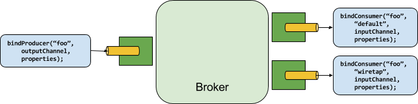

# 30. Binders

## 30.粘合剂

Spring Cloud Stream提供了一个Binder抽象，可用于连接到外部中间件上的物理目标。本节提供有关Binder SPI背后的主要概念，其主要组件以及特定于实现的详细信息。

## 30.1生产者和消费者

下图显示了生产者和消费者的一般关系：


**图30.1。生产者和消费者**




生产者是将消息发送到通道的任何组件。可以将通道绑定到具有`Binder`该代理实现的外部消息代理。调用该`bindProducer()`方法时，第一个参数是代理内目标的名称，第二个参数是生产者向其发送消息的本地通道实例，第三个参数包含要使用的属性（例如分区键表达式）在为该通道创建的适配器中。

使用者是从通道接收消息的任何组件。与生产者一样，消费者的渠道可以绑定到外部消息代理。调用该`bindConsumer()`方法时，第一个参数是目标名称，第二个参数提供逻辑消费者组的名称。由给定目标的使用者绑定表示的每个组都接收生产者发送到该目标的每条消息的副本（也就是说，它遵循常规的发布-订阅语义）。如果有多个使用相同组名绑定的使用者实例，那么消息将在这些使用者实例之间进行负载平衡，以便生产者发送的每条消息仅在每个组中的单个使用者实例中被使用（也就是说，它遵循正常的排队语义）。

## 30.2粘合剂SPI

Binder SPI由许多接口，现成的实用程序类和发现策略组成，这些策略提供了用于连接到外部中间件的可插拔机制。

SPI的关键是`Binder`接口，这是一种将输入和输出连接到外部中间件的策略。以下清单显示了`Binder`接口的定义：

```java
public interface Binder<T, C extends ConsumerProperties, P extends ProducerProperties> {
    Binding<T> bindConsumer(String name, String group, T inboundBindTarget, C consumerProperties);

    Binding<T> bindProducer(String name, T outboundBindTarget, P producerProperties);
}
```

该接口已参数化，提供了许多扩展点：

- 输入和输出绑定目标。从1.0版开始，仅`MessageChannel`受支持，但是将来打算用作扩展点。
- 扩展的使用者和生产者属性，允许特定的Binder实现添加可以以类型安全的方式支持的补充属性。

典型的活页夹实现包括以下内容：

- 一个实现`Binder`接口的类；

- 一个Spring `@Configuration`类，它`Binder`与中间件连接基础结构一起创建一个类型的bean 。

- 甲`META-INF/spring.binders`文件在含有一种或多种粘结剂的定义类路径发现，如图以下示例：

  ```
  卡夫卡：\
  org.springframework.cloud.stream.binder.kafka.config.KafkaBinderConfiguration
  ```

## 30.3活页夹检测

Spring Cloud Stream依赖于Binder SPI的实现来执行将通道连接到消息代理的任务。每个Binder实现通常都连接到一种消息传递系统。

### 30.3.1类路径检测

默认情况下，Spring Cloud Stream依靠Spring Boot的自动配置来配置绑定过程。如果在类路径上找到单个Binder实现，Spring Cloud Stream将自动使用它。例如，旨在仅绑定到RabbitMQ的Spring Cloud Stream项目可以添加以下依赖项：

```xml
<dependency>
  <groupId>org.springframework.cloud</groupId>
  <artifactId>spring-cloud-stream-binder-rabbit</artifactId>
</dependency>
```

有关其他活页夹依赖项的特定Maven坐标，请参阅该活页夹实现的文档。

## 30.4类路径上的多个绑定器

当类路径上存在多个绑定程序时，应用程序必须指示将哪个绑定程序用于每个通道绑定。每个活页夹配置都包含一个`META-INF/spring.binders`文件，该文件是一个简单的属性文件，如以下示例所示：

```properties
rabbit:\
org.springframework.cloud.stream.binder.rabbit.config.RabbitServiceAutoConfiguration
```

其他提供的活页夹实现（例如Kafka）也存在类似的文件，并且自定义活页夹实现也有望提供它们。关键字表示活页夹实现的标识名，而该值是用逗号分隔的配置类列表，每个配置类都包含一个且仅一个type类型的bean定义`org.springframework.cloud.stream.binder.Binder`。

活页夹选择既可以使用`spring.cloud.stream.defaultBinder`属性（例如`spring.cloud.stream.defaultBinder=rabbit`）在全局上执行，也可以通过在每个通道绑定上配置活页夹来单独执行。例如，从Kafka读取并写入RabbitMQ 的处理器应用程序（具有分别名为的通道`input`和`output`分别用于读取和写入的通道）可以指定以下配置：

```properties
spring.cloud.stream.bindings.input.binder=kafka
spring.cloud.stream.bindings.output.binder=rabbit
```

## 30.5连接到多个系统

默认情况下，活页夹共享应用程序的Spring Boot自动配置，以便创建在类路径上找到的每个活页夹的一个实例。如果您的应用程序应连接到多个相同类型的代理，则可以指定多个绑定程序配置，每个配置具有不同的环境设置。

| ![[注意]](https://cloud.spring.io/spring-cloud-static/Greenwich.SR3/multi/images/note.png) |
| ------------------------------------------------------------ |
| 打开显式活页夹配置将完全禁用默认的活页夹配置过程。如果这样做，则必须在配置中包括所有正在使用的活页夹。打算透明地使用Spring Cloud Stream的框架可以创建可按名称引用的绑定器配置，但它们不会影响默认的绑定器配置。为了这样做，活页夹配置可以将其`defaultCandidate`标志设置为false（例如`spring.cloud.stream.binders..defaultCandidate=false`）。这表示独立于默认绑定程序配置过程而存在的配置。 |

以下示例显示了连接到两个RabbitMQ代理实例的处理器应用程序的典型配置：

```properties
spring:
  cloud:
    stream:
      bindings:
        input:
          destination: thing1
          binder: rabbit1
        output:
          destination: thing2
          binder: rabbit2
      binders:
        rabbit1:
          type: rabbit
          environment:
            spring:
              rabbitmq:
                host: <host1>
        rabbit2:
          type: rabbit
          environment:
            spring:
              rabbitmq:
                host: <host2>
```

## 30.6绑定可视化和控制

从2.0版开始，Spring Cloud Stream支持通过Actuator端点进行绑定的可视化和控制。

从版本2.0执行器和Web开始，是可选的，您必须首先添加Web依赖项之一，然后手动添加执行器依赖项。下面的示例显示如何为Web框架添加依赖项：

```xml
<dependency>
     <groupId>org.springframework.boot</groupId>
     <artifactId>spring-boot-starter-web</artifactId>
</dependency>
```

下面的示例演示如何为WebFlux框架添加依赖项：

```xml
<dependency>
       <groupId>org.springframework.boot</groupId>
       <artifactId>spring-boot-starter-webflux</artifactId>
</dependency>
```

您可以添加执行器依赖项，如下所示：

```xml
<dependency>
    <groupId>org.springframework.boot</groupId>
    <artifactId>spring-boot-starter-actuator</artifactId>
</dependency>
```

| ![[注意]](https://cloud.spring.io/spring-cloud-static/Greenwich.SR3/multi/images/note.png) |
| ------------------------------------------------------------ |
| 要在Cloud Foundry中运行Spring Cloud Stream 2.0应用程序，必须将`spring-boot-starter-web`和添加`spring-boot-starter-actuator`到类路径中。否则，由于运行状况检查失败，该应用程序将无法启动。 |

您还必须`bindings`通过设置以下属性来启用执行器端点：`--management.endpoints.web.exposure.include=bindings`。

一旦满足这些先决条件。应用程序启动时，您应该在日志中看到以下内容：

```bash
: Mapped "{[/actuator/bindings/{name}],methods=[POST]. . .
: Mapped "{[/actuator/bindings],methods=[GET]. . .
: Mapped "{[/actuator/bindings/{name}],methods=[GET]. . .
```

要显示当前绑定，请访问以下URL： `http://:/actuator/bindings`

或者，要查看单个绑定，请访问类似于以下内容的URL之一： `http://:/actuator/bindings/myBindingName`

您还可以通过发布到同一URL并提供`state`JSON作为参数来停止，启动，暂停和恢复单个绑定，如以下示例所示：

curl -d'{“ state”：“ STOPPED”}'-H“内容类型：应用程序/ json” -X POST [http：// ： / actuator / bindings / myBindingName](http://:/actuator/bindings/myBindingName) curl -d'{ “ state”：“ STARTED”}'-H“内容类型：application / json” -X POST [http：// ： / actuator / bindings / myBindingName](http://:/actuator/bindings/myBindingName) curl -d'{“ state”：“ PAUSED“}'-H”内容类型：application / json“ -X POST [http：// ： / actuator / bindings / myBindingName](http://:/actuator/bindings/myBindingName) curl -d'{” state“：” RESUMED“}'- H“内容类型：application / json” -X POST [http：// <主机>：<端口> / actuator / bindings / myBindingName](http://:/actuator/bindings/myBindingName)

| ![[注意]](https://cloud.spring.io/spring-cloud-static/Greenwich.SR3/multi/images/note.png) |
| ------------------------------------------------------------ |
| `PAUSED`并且`RESUMED`仅在相应的活页夹及其底层技术支持时起作用。否则，您会在日志中看到警告消息。当前，仅Kafka活页夹支持`PAUSED`和`RESUMED`状态。 |

## 30.7活页夹配置属性

定制活页夹配置时，以下属性可用。这些属性通过`org.springframework.cloud.stream.config.BinderProperties`

它们必须以开头`spring.cloud.stream.binders.`。

- 类型

  资料夹类型。它通常引用在类路径上找到的绑定器之一，尤其是`META-INF/spring.binders`文件中的键。默认情况下，它具有与配置名称相同的值。

- 继承环境

  配置是否继承应用程序本身的环境。默认值：`true`。

- 环境

  根可用于定制活页夹环境的一组属性。设置此属性后，在其中创建活页夹的上下文不是应用程序上下文的子级。该设置允许在粘合剂组分和应用组分之间完全分离。默认值：`empty`。

- defaultCandidate

  活页夹配置是被视为默认活页夹的候选者，还是仅在明确引用时才可以使用。此设置允许添加活页夹配置，而不会干扰默认处理。默认值：`true`。