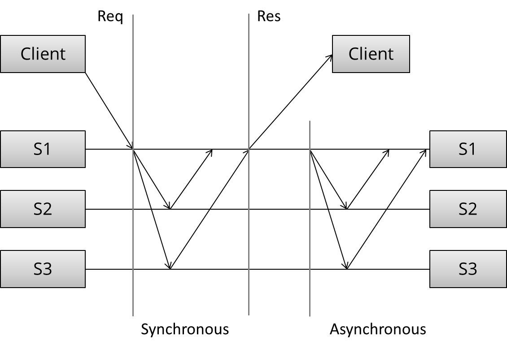
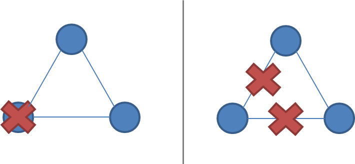

# 复制

复制问题是分布式系统中的许多问题之一。我选择专注于其他问题，例如领导者选举，失败检测，互斥，共识和全局快照，因为它通常是人们最感兴趣的部分。并行数据库区分的一种方式是例如，他们的复制功能。此外，复制为许多子问题提供了上下文，例如领导者选举，故障检测，共识和原子广播。

复制是一种群组通信问题。什么样的安排和沟通模式为我们提供了所需的性能和可用性特征？我们如何确保面对网络分区和同时节点故障时的容错，持久性和非分歧？

同样，有很多方法可以实现复制。我将在这里采用的方法只关注具有复制功能的系统可能采用的高级模式。从视觉上看这一点有助于使讨论集中在整体模式而不是所涉及的特定消息传递上。我的目标是探索设计空间，而不是解释每个算法的细节。

让我们首先定义复制的样子。我们假设我们有一些初始数据库，并且客户端发出更改数据库状态的请求。



然后可以将安排和通信模式分为几个阶段：

1. （请求）客户端向服务器发送请求
2. （同步）发生复制的同步部分
3. （响应）响应返回给客户端
4. （异步）发生复制的异步部分

这个模型基于[这篇文章](https://www.google.com/search?q=understanding+replication+in+databases+and+distributed+systems)。请注意，在任务的每个部分中交换的消息模式取决于特定的算法：我有意在不讨论特定算法的情况下试图通过。

鉴于这些阶段，我们可以创建什么样的沟通模式？我们选择的模式的性能和可用性含义是什么？

## 同步复制

第一种模式是同步复制（也称为活动，或急切，推送或悲观复制）。让我们画出看起来像什么：


在这里，我们可以看到三个不同的阶段：首先，客户端发送请求。接下来，我们称之为复制的同步部分。该术语指的是客户端被阻止的事实 - 等待系统的回复。

在同步阶段，第一台服务器联系其他两台服务器并等待，直到收到所有其他服务器的回复。最后，它向客户发送响应，通知它结果（例如成功或失败）。

这一切似乎都很简单。在没有在同步阶段讨论算法的细节的情况下，我们可以对通信模式的这种具体安排说些什么？首先，观察这是一种写N-of-N方法：在返回响应之前，必须由系统中的每个服务器查看和确认。

从性能角度来看，这意味着系统将与其中最慢的服务器一样快。系统对网络延迟的变化也非常敏感，因为它要求每个服务器在继续之前进行回复。

鉴于N-of-N方法，系统无法容忍任何服务器的丢失。当服务器丢失时，系统无法再写入所有节点，因此无法继续。它可能能够提供对数据的只读访问权限，但在此设计中节点出现故障后，不允许进行修改。

这种安排可以提供非常强大的持久性保证：客户端可以确定所有N个服务器在返回响应时已经接收，存储和确认了请求。为了丢失已接受的更新，所有N份副本都需要丢失，这是您可以做的最好的保证。

## 异步复制

让我们将其与第二种模式进行对比 - 异步复制（也称为被动复制，或拉动复制或延迟复制）。您可能已经猜到，这与同步复制相反：


这里，主（/ leader / coordinator）立即向客户端发回响应。它最多可以在本地存储更新，但它不会同步执行任何重要工作，并且客户端不会被迫等待服务器之间进行更多轮通信。

在稍后阶段，将发生复制任务的异步部分。这里，主设备使用某种通信模式联系其他服务器，其他服务器更新其数据副本。具体取决于使用的算法。

在不深入了解算法细节的情况下，我们可以对这一具体安排说些什么？好吧，这是一种写入1-of-N的方法：立即返回响应，并在稍后的某个时间发生更新传播。

从性能角度来看，这意味着系统速度很快：客户端不需要花费任何额外的时间来等待系统的内部工作。系统也更容忍网络延迟，因为内部延迟的波动不会导致客户端的额外等待。

这种安排只能提供弱的或概率的耐久性保证。如果没有出错，数据最终会复制到所有N台机器。但是，如果包含数据的唯一服务器在此之前丢失，则数据将永久丢失。

给定1-of-N方法，只要至少一个节点启动，系统就可以保持可用（至少在理论上，尽管在实践中负载可能太高）。像这样的纯粹懒惰的方法没有提供耐久性或一致性保证; 您可能被允许写入系统，但无法保证您可以在发生任何故障时回读您所写的内容。

最后，值得注意的是，被动复制无法确保系统中的所有节点始终包含相同的状态。如果您接受多个位置的写入并且不要求这些节点同步同意，那么您将面临分歧的风险：读取可能会返回不同位置的不同结果（特别是在节点发生故障和恢复之后），以及全局约束（需要通信）与大家一起）无法执行。

我没有在读取（而不是写入）期间真正提到通信模式，因为读取模式实际上是从写入模式开始的：在读取期间，您希望尽可能少地联系节点。我们将在法定人数的背景下进一步讨论这个问题。

我们只讨论了两种基本安排，没有讨论具体的算法。然而，我们已经能够弄清楚可能的通信模式以及它们的性能，耐用性保证和可用性特征。

## 主要复制方法的概述

讨论了两种基本的复制方法：同步和异步复制，让我们来看看主要的复制算法。

有许多不同的方法可以对复制技术进行分类。我要介绍的第二个区别（在同步与异步之后）介于：

- 防止分歧的复制方法（单拷贝系统）和
- 风险分歧的复制方法（多主系统）

第一组方法具有“行为类似于单个系统”的属性。特别是，当发生部分故障时，系统确保只有一个系统副本处于活动状态。此外，系统确保副本始终保持一致。这被称为共识问题。

如果几个进程（或计算机）都同意某些价值，那么它们就会达成共识。更正式的：

1. 协议：每个正确的流程必须就相同的价值达成一致。
2. 完整性：每个正确的过程最多决定一个值，如果它决定某个值，那么它必须由某个过程提出。
3. 终止：所有流程最终都会做出决定。
4. 有效性：如果所有正确的过程提出相同的值V，那么所有正确的过程决定V.

相互排斥，领导者选举，多播和原子广播都是更普遍的共识问题的实例。保持单一副本一致性的复制系统需要以某种方式解决共识问题。

保持单一副本一致性的复制算法包括：

- 1n条消息（异步主/备份）
- 2n条消息（同步主/备份）
- 4n条消息（2阶段提交，Multi-Paxos）
- 6n条消息（三阶段提交，Paxos重复领导者选举）

这些算法的容错性不同（例如，它们可以容忍的故障类型）。我只是根据执行算法期间交换的消息数量对这些进行了分类，因为我认为有必要找到一个问题的答案“我们用增加的消息交换购买什么？”

以下图表改编自[Google的](http://www.google.com/events/io/2009/sessions/TransactionsAcrossDatacenters.html) Ryan Barret ，描述了不同选项的一些方面：


上图中的一致性，延迟，吞吐量，数据丢失和故障转移特性实际上可以追溯到两种不同的复制方法：同步复制（例如，在响应之前等待）和异步复制。当你等待时，你会得到更糟糕的表现，但更有保障。当我们讨论分区（和延迟）容差时，2PC和仲裁系统之间的吞吐量差异将变得明显。

在该图中，强制弱（/最终）一致性的算法被归为一类（“八卦”）。但是，我将更详细地讨论弱一致性的复制方法 - 八卦和（部分）仲裁系统。“transactions”行实际上更多地指的是全局谓词评估，在一致性较弱的系统中不支持（尽管可以支持本地谓词评估）。

值得注意的是，强制执行弱一致性要求的系统具有较少的通用算法，并且可以选择性地应用更多技术。由于不强制执行单一副本一致性的系统可以自由地像由多个节点组成的分布式系统，因此需要修复的目标较少，而重点更多的是让人们了解他们拥有的系统特征。 。

例如：

- 以客户为中心的一致性模型试图在允许分歧的同时提供更可理解的一致性保证。
- CRDT（会聚和交换复制数据类型）利用某些状态和基于操作的数据类型的半格特性（关联性，可交换性，幂等性）。
- 汇流分析（如Bloom语言中）使用有关计算单调性的信息来最大限度地利用无序。
- PBS（概率上有界的陈旧性）使用从现实世界系统收集的模拟和信息来表征部分法定系统的预期行为。

首先，我将进一步讨论所有这些问题; 让我们看一下维护单拷贝一致性的复制算法。

## 主/备份复制

主/备份复制（也称为主副本复制主从复制或日志传送）可能是最常用的复制方法，也是最基本的算法。所有更新都在主服务器上执行，操作日志（或者更改）通过网络传送到备份副本。有两种变体：

- 异步主/备份复制和
- 同步主/备份复制

同步版本需要两条消息（“更新”+“确认收据”），而异步版本只能运行一条（“更新”）。

P / B很常见。例如，默认情况下，MySQL复制使用异步变体。MongoDB还使用P / B（带有一些额外的故障转移程序）。所有操作都在一个主服务器上执行，主服务器将它们序列化为本地日志，然后将其异步复制到备份服务器。

正如我们之前在异步复制环境中讨论的那样，任何异步复制算法都只能提供弱持久性保证。在MySQL复制中，这表现为复制滞后：异步备份始终至少在主要后面进行一次操作。如果主服务器出现故障，则尚未发送到备份的更新将丢失。

主/备份复制的同步变体确保在返回到客户端之前已将写入存储在其他节点上 - 代价是等待来自其他副本的响应。然而，值得注意的是，即使这种变体也只能提供弱保证。请考虑以下简单故障情形：

- 主服务器接收写入并将其发送到备份
- 备份持续存在并确认写入
- 然后在向客户端发送ACK之前主要失败

客户端现在假定提交失败，但备份已提交; 如果备份被提升为主要，则不正确。可能需要手动清理以协调发生故障的主备份或发散备份。

我当然在简化这里。虽然所有主/备复制算法都遵循相同的通用消息传递模式，但它们在故障转移处理方面存在差异，副本在长时间内处于脱机状态等等。但是，在该方案中，不可能对主要的不合时宜的故障具有弹性。

基于日志传送/主要/备份的方案的关键在于它们只能提供尽力而为的保证（例如，如果节点在不合适的时间失败，则它们容易丢失更新或不正确的更新）。此外，P / B方案容易受到裂脑影响，其中由于临时网络问题而导致备份故障转移并导致主要和备份同时处于活动状态。

防止不合时宜的故障导致违反一致性保证; 我们需要添加另一轮消息传递，这将使我们获得两阶段提交协议（2PC）。

## 两阶段提交（2PC）

[两阶段提交](http://en.wikipedia.org/wiki/Two-phase_commit_protocol)（2PC）是许多经典关系数据库中使用的协议。例如，MySQL Cluster（不要与常规MySQL混淆）使用2PC提供同步复制。下图说明了消息流：

```bash
[ Coordinator ] -> OK to commit?     [ Peers ]
                <- Yes / No

[ Coordinator ] -> Commit / Rollback [ Peers ]
                <- ACK
```

在第一阶段（投票）中，协调员将更新发送给所有参与者。每个参与者处理更新并投票决定是提交还是中止。投票提交时，参与者将更新存储到临时区域（预写日志）。在第二阶段完成之前，更新被视为临时更新。

在第二阶段（决定），协调员决定结果并通知每个参与者。如果所有参与者都投票提交，则更新将从临时区域获取并永久更新。

在提交被认为是永久性之前具有第二阶段是有用的，因为它允许系统在节点失败时回滚更新。相反，在主/备份（“1PC”）中，没有用于回滚在某些节点上失败并在其他节点上成功的操作的步骤，因此副本可能会发散。

2PC易于阻塞，因为单个节点故障（参与者或协调器）阻止进度直到节点恢复。由于第二阶段，恢复通常是可能的，在第二阶段期间，其他节点被告知系统状态。请注意，2PC假定每个节点的稳定存储中的数据永远不会丢失，并且没有节点永远崩溃。如果稳定存储中的数据在崩溃中损坏，则仍可能丢失数据。

节点故障期间恢复过程的细节非常复杂，因此我不会详细介绍。主要任务是确保写入磁盘是持久的（例如刷新到磁盘而不是缓存）并确保做出正确的恢复决策（例如，学习轮次的结果，然后在本地重做或撤消更新）。

正如我们在关于CAP的章节中所了解的那样，2PC是一个CA--它不是分区容忍的。2PC地址的故障模型不包括网络分区; 从节点故障中恢复的规定方法是等到网络分区恢复。如果失败，就没有安全的方法来促进新的协调员; 而是需要手动干预。2PC也具有相当的延迟敏感性，因为它是一种写入N-of-N的方法，在最慢的节点确认它们之前，写入不能进行。

2PC在性能和容错之间取得了不错的平衡，这就是它在关系数据库中流行的原因。然而，较新的系统通常使用分区容忍一致性算法，因为这样的算法可以提供从临时网络分区的自动恢复以及更加优雅地处理增加的节点间延迟。

接下来让我们看一下分区容忍一致性算法。

## 分区容忍一致性算法

就保持单拷贝一致性的容错算法而言，分区容忍一致性算法是我们要做的。还有一类容错算法：容忍[任意（拜占庭）故障的](http://en.wikipedia.org/wiki/Byzantine_fault_tolerance)算法; 这些包括因恶意行为而失败的节点。这种算法在商业系统中很少使用，因为它们运行起来更昂贵并且实现起来更复杂 - 因此我将它们排除在外。

当涉及分区容忍一致性算法时，最着名的算法是Paxos算法。然而，这是非常难以实现和解释的，所以我将重点关注Raft，这是一种最近（〜2013年初）算法，旨在更容易教学和实施。我们首先来看一下网络分区和分区容错一致性算法的一般特征。

### 什么是网络分区？

网络分区是指到一个或多个节点的网络链路故障。节点本身继续保持活动状态，甚至可以从网络分区一侧的客户端接收请求。正如我们之前所知 - 在CAP定理的讨论中 - 确实发生了网络分区，并非所有系统都能优雅地处理它们。

网络分区很棘手，因为在网络分区期间，无法区分发生故障的远程节点和无法访问的节点。如果发生网络分区但没有节点发生故障，则系统将分为两个同时处于活动状态的分区。下面的两个图说明了网络分区如何看起来与节点故障类似。

一个2节点的系统，具有故障与网络分区：


一个3个节点的系统，具有故障与网络分区：



强制执行单一副本一致性的系统必须有一些方法来破坏对称性：否则，它将分成两个独立的系统，这些系统可以彼此分离，不再能够保持单个副本的错觉。

对于实施单拷贝一致性的系统，网络分区容差要求在网络分区期间，系统中只有一个分区保持活动状态，因为在网络分区期间不可能防止分歧（例如CAP定理）。

### 多数决定

这就是分区容忍共识算法依赖于多数投票的原因。要求大多数节点 - 而不是所有节点（如2PC中） - 同意更新允许少数节点由于网络分区而关闭，缓慢或无法访问。只要`(N/2 + 1)-of-N`节点启动并可访问，系统就可以继续运行。

分区容忍一致性算法使用奇数个节点（例如3,5或7）。只有两个节点，故障后不可能有明显的多数。例如，如果节点数为3，则系统对一个节点故障具有弹性; 通过五个节点，系统可以适应两个节点故障。

发生网络分区时，分区的行为不对称。一个分区将包含大多数节点。少数分区将停止处理操作以防止在网络分区期间出现分歧，但多数分区可以保持活动状态。这可确保只有系统状态的单个副本保持活动状态。

多数也很有用，因为它们可以容忍分歧：如果存在扰动或失败，节点可能会以不同的方式进行投票。但是，由于只有一个多数决定，暂时的分歧最多会阻止协议继续进行（放弃活跃），但不能违反单拷贝一致性标准（安全属性）。

### 角色

可以通过两种方式构建系统：所有节点可以具有相同的职责，或者节点可以具有单独的不同角色。

用于复制的共识算法通常选择为每个节点设置不同的角色。拥有一个固定的领导者或主服务器是一种优化，使系统更有效率，因为我们知道所有更新必须通过该服务器。不是领导者的节点只需要将他们的请求转发给领导者。

请注意，具有不同的角色并不妨碍系统从领导者（或任何其他角色）的失败中恢复。仅仅因为角色在正常操作期间是固定的并不意味着通过在失败后重新分配角色（例如通过领导者选举阶段）无法从失败中恢复。节点可以重用领导者选举的结果，直到发生节点故障和/或网络分区。

Paxos和Raft都使用不同的节点角色。特别是，他们有一个领导者节点（Paxos中的“提议者”），负责在正常操作期间进行协调。在正常操作期间，其余节点是跟随者（Paxos中的“接受者”或“选民”）。

### 时代

Paxos和Raft中的每个正常操作时段称为时期（Raft中的“术语”）。在每个时期期间，只有一个节点是指定的领导者（[在日本使用](http://en.wikipedia.org/wiki/Japanese_era_name)类似的系统[，](http://en.wikipedia.org/wiki/Japanese_era_name)其中时代名称在皇家继承时改变）。


选举成功后，同一个领导者会协调，直到这个时代结束。如上图所示（来自筏纸），一些选举可能会失败，导致纪元立即结束。

Epoch充当逻辑时钟，允许其他节点识别过时节点何时开始通信 - 分区或不运行的节点将具有比当前节点更小的纪元号，并且忽略它们的命令。

### 领导者通过决斗改变

在正常操作期间，分区容忍一致性算法相当简单。正如我们之前看到的，如果我们不关心容错，我们可以使用2PC。大多数复杂性确实来自于确保一旦做出共识决定，它就不会丢失，并且协议可以处理由于网络或节点故障导致的领导者更改。

所有节点都以关注者身份开始; 一个节点在一开始就被选为领导者。在正常操作期间，领导者保持心跳，允许追随者检测领导者是否失败或被分割。

当一个节点检测到一个领导者已经变得没有响应时（或者，在最初的情况下，没有领导者存在），它会切换到一个中间状态（在Raft中称为“候选者”），它将术语/纪元值增加一个，发起领导人选举并竞争成为新的领导者。

为了当选为领导者，节点必须获得大多数选票。分配投票的一种方式是以先到先得的方式分配投票; 这样，领导者最终将当选。在尝试选举之间添加随机的等待时间将减少同时尝试当选的节点数量。

### 一个时代内的编号提案

在每个时代，领导者一次提出一个值进行投票。在每个时期内，每个提案都以唯一严格增加的数字编号。追随者（选民/接受者）接受他们收到的特定提案编号的第一个提案。

### 普通手术

在正常操作期间，所有提议都通过领导节点。当客户端提交提议（例如，更新操作）时，领导者联系仲裁中的所有节点。如果不存在竞争提议（基于来自追随者的回复），领导者会提出价值。如果大多数粉丝接受该值，则认为该值被接受。

由于另一个节点可能也试图充当领导者，我们需要确保一旦接受单个提案，其价值就永远不会改变。否则，已经被接受的提议可能例如由竞争领导者恢复。Lamport称这为：

> P2：如果`v`选择了具有值的提案，则所选的每个编号较高的提案都具有值`v`。

确保此属性保持不变要求跟随者和提议者都受到算法的限制，不会更改已被多数人接受的值。请注意，“值永远不会更改”是指协议的单个执行（或运行/实例/决策）的值。典型的复制算法将运行算法的多次执行，但算法的大多数讨论都集中在单次运行以保持简单。我们希望防止更改或覆盖决策历史记录。

为了强制执行此属性，提议者必须首先向关注者询问他们（编号最高）的提议和价值。如果提议者发现提案已经存在，那么它必须简单地完成协议的执行，而不是提出自己的提议。Lamport称这为：

> P2B。如果`v`选择了有价值的提案，那么任何提议者发布的每个更高编号的提案都有价值`v`。

进一步来说：

> P2C。对于任何`v`和`n`，如果[由领导者]发布了具有价值`v`和数量的提案`n`，则有一组`S`由大多数接受者[粉丝]组成，以便（a）没有接受者`S`接受任何编号小于的提案`n`，或（b）`v`是所有提案中编号最高的提案的价值，其编号低于以下`n`关注者所接受的`S`。

这是Paxos算法的核心，以及从中派生的算法。直到协议的第二阶段才选择要提出的值。建议者有时必须简单地重新转发先前做出的决定以确保安全（例如P2c中的条款b），直到他们知道他们可以自由施加他们自己的建议价值（例如条款a）。

如果存在多个先前提议，则建议使用编号最高的提议值。如果根本没有竞争性提案，提案人可能只会尝试强加自己的价值。

为了确保在提议者询问每个接受者关于其最新值的时间之间没有出现竞争提议，提议者要求关注者不接受提议编号低于当前提案的提案。

将各个部分放在一起，使用Paxos做出决定需要两轮沟通：

```bash
[ Proposer ] -> Prepare(n)                                [ Followers ]
             <- Promise(n; previous proposal number
                and previous value if accepted a
                proposal in the past)

[ Proposer ] -> AcceptRequest(n, own value or the value   [ Followers ]
                associated with the highest proposal number
                reported by the followers)
                <- Accepted(n, value)
```

准备阶段允许提议者了解任何竞争或以前的提议。第二阶段是建议新值或先前接受的值。在某些情况下 - 例如，如果两个提议者同时活跃（决斗）; 如果消息丢失; 或者如果大多数节点发生故障 - 那么大多数人都不会接受任何提案。但这是可以接受的，因为提议的值的决策规则会收敛到单个值（前一次尝试中具有最高提案编号的值）。

实际上，根据FLP不可能性结果，这是我们能做的最好的事情：解决共识问题的算法必须在信息传递边界的保证不成立时放弃安全性或活跃性。Paxos放弃了活跃性：它可能必须无限期地推迟决策，直到没有竞争领导者的时间点，并且大多数节点接受提议。这比违反安全保障更可取。

当然，实现这个算法比听起来要困难得多。即使在专家手中，也存在许多小问题，这些问题相当于相当多的代码。这些问题包括：

- 实际优化：
  - 避免通过领导租约（而不是心跳）重复领导人选举
  - 避免在领导者身份不变的稳定状态下重复建议消息
- 确保关注者和提议者不会丢失稳定存储中的项目，并且存储在稳定存储中的结果不会轻微损坏（例如，磁盘损坏）
- 使集群成员资格能够以安全的方式发生变化（例如，基础Paxos取决于多数集总是在一个节点中相交的事实，如果成员资格可以任意改变则不成立）
- 在崩溃，磁盘丢失或配置新节点后以安全有效的方式更新新副本的过程
- 快照和垃圾收集程序，以保证在一段合理时间后保证安全所需的数据（例如，平衡存储要求和容错要求）

Google的[Paxos Made Live](http://labs.google.com/papers/paxos_made_live.html)文章详细介绍了其中的一些挑战。

## 分区容忍一致性算法：Paxos，Raft，ZAB

希望这能让您了解分区容错一致性算法的工作原理。我鼓励您阅读下一部分中的一篇论文，以掌握不同算法的具体内容。

*Paxos*。Paxos是编写强一致的分区容错复制系统时最重要的算法之一。它在Google的许多系统中使用，包括[BigTable](http://research.google.com/archive/bigtable.html) / [Megastore](http://research.google.com/pubs/pub36971.html)使用的[Chubby锁管理器](http://research.google.com/archive/chubby.html)，Google文件系统以及[Spanner](http://research.google.com/archive/spanner.html)。

Paxos以希腊的Paxos岛命名，最初由Leslie Lamport于1998年在一篇名为“兼职议会”的论文中提出。它通常被认为难以实施，并且有一系列论文来自具有相当分布式系统专业知识的公司解释了更多实际细节（参见进一步阅读）你可能想在[这里](http://research.microsoft.com/en-us/um/people/lamport/pubs/pubs.html#lamport-paxos)和[这里](http://research.microsoft.com/en-us/um/people/lamport/pubs/pubs.html#paxos-simple)阅读Lamport对这个问题的评论。

这些问题主要涉及Paxos是根据一轮共识决策进行描述的事实，但实际工作实施通常希望有效地进行多轮共识。这导致了[对核心协议](http://en.wikipedia.org/wiki/Paxos_algorithm)的许多[扩展](http://en.wikipedia.org/wiki/Paxos_algorithm)的开发，任何对构建基于Paxos的系统感兴趣的人仍然需要消化。此外，还存在其他实际挑战，例如如何促进集群成员资格变更。

*扎布*。ZAB - Zookeeper Atomic Broadcast协议用于Apache Zookeeper。Zookeeper是一个为分布式系统提供协调原语的系统，并被许多以Hadoop为中心的分布式系统用于协调（例如[HBase](http://hbase.apache.org/)，[Storm](http://storm-project.net/)，[Kafka](http://kafka.apache.org/)）。Zookeeper基本上是开源社区的Chubby版本。从技术上讲，原子广播是一个与纯粹共识不同的问题，但它仍然属于确保强一致性的分区容错算法类别。

*筏子*。Raft是最近（2013年）这一系列算法的补充。它的设计比Paxos更容易教学，同时提供相同的保证。特别是，算法的不同部分更加清晰，文章还描述了集群成员变更的机制。它最近出现在受到ZooKeeper启发的[etcd中](https://github.com/coreos/etcd)。

## 具有强一致性的复制方法

在本章中，我们了解了强制一致性的复制方法。从同步工作和异步工作之间的对比开始，我们逐步采用能够容忍日益复杂的故障的算法。以下是每种算法的一些关键特征：

#### 主/备用

- 单，静态主
- 复制日志，从属不参与执行操作
- 复制延迟没有限制
- 不分区容忍
- 手动/临时故障转移，而不是容错，“热备份”

#### 2PC

- 一致投票：提交或中止
- 静态主人
- 在提交期间，2PC无法在协调器和节点同时发生故障
- 不分区容忍，尾部延迟敏感

#### 的Paxos

- 多数票
- 动态大师
- 作为协议的一部分，强大到n / 2-1同时失败
- 尾部延迟不太敏感

------

## 进一步阅读

#### 主备份和2PC

- [可用性的复制技术](http://scholar.google.com/scholar?q=Replication+techniques+for+availability) - Robbert van Renesse和Rachid Guerraoui，2010
- [数据库系统中的并发控制与恢复](http://research.microsoft.com/en-us/people/philbe/ccontrol.aspx)

#### Paxos

- [兼职议会](http://research.microsoft.com/users/lamport/pubs/lamport-paxos.pdf) - Leslie Lamport
- [Paxos简单](http://research.microsoft.com/users/lamport/pubs/paxos-simple.pdf) - Leslie Lamport，2001
- [Paxos实时 - 工程视角](http://research.google.com/archive/paxos_made_live.html) - Chandra等
- [Paxos Made Practical](http://scholar.google.com/scholar?q=Paxos+Made+Practical) - Mazieres，2007
- [重温Paxos算法](http://groups.csail.mit.edu/tds/paxos.html) - Lynch等
- [如何建立一个具有共识的高可用系统](http://research.microsoft.com/lampson/58-Consensus/Acrobat.pdf) - 巴特勒兰普森
- [重新配置状态机](http://research.microsoft.com/en-us/um/people/lamport/pubs/reconfiguration-tutorial.pdf) - Lamport等 - 更改集群成员资格
- [使用状态机方法实现容错服务：教程](http://citeseer.ist.psu.edu/viewdoc/summary?doi=10.1.1.20.4762) - Fred Schneider

#### 筏和ZAB

- [寻找](https://ramcloud.stanford.edu/wiki/download/attachments/11370504/raft.pdf)可理解的[共识算法](https://ramcloud.stanford.edu/wiki/download/attachments/11370504/raft.pdf)，Diego Ongaro，John Ousterhout，2013
- [筏讲座 - 用户研究](http://www.youtube.com/watch?v=YbZ3zDzDnrw)
- [一个简单的完全有序的广播协议](http://labs.yahoo.com/publication/a-simple-totally-ordered-broadcast-protocol/) - Junqueira，Reed，2008
- [ZooKeeper原子广播](http://labs.yahoo.com/publication/zab-high-performance-broadcast-for-primary-backup-systems/) - 里德，2011年