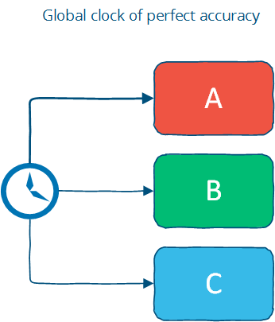
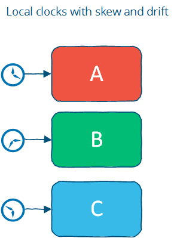
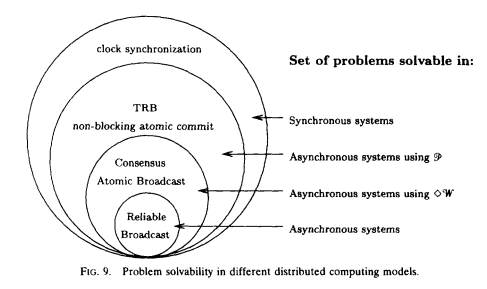

# 时间和秩序

什么是秩序，为什么重要？

你是什么意思“什么是秩序”？

我的意思是，为什么我们首先如此着迷于秩序呢？为什么我们关心A是否发生在B之前？为什么我们不关心其他一些属性，比如“颜色”？

好吧，我疯狂的朋友，让我们回到分布式系统的定义来回答这个问题。

您可能还记得，我将分布式编程描述为解决您可以在使用多台计算机的单台计算机上解决的相同问题的艺术。

事实上，这是对秩序的痴迷的核心。任何一次只能做一件事的系统都会创建一个完整的操作顺序。就像通过单门的人一样，每个操作都会有一个明确定义的前任和后继者。这基本上是我们努力保存的编程模型。

传统模型是：单个程序，一个进程，一个CPU上运行的一个内存空间。操作系统抽象出可能存在多个CPU和多个程序的事实，并且计算机上的内存实际上在许多程序之间共享。我不是说线程编程和面向事件的编程不存在; 只是它们是“一/一/一”模型之上的特殊抽象。程序编写为以有序的方式执行：从顶部开始，然后向下移动到底部。

作为一个属性的订单已经受到如此多的关注，因为定义“正确性”的最简单方法是说“它就像在一台机器上一样工作”。这通常意味着a）我们运行相同的操作，b）我们以相同的顺序运行它们 - 即使有多台机器。

保持顺序的分布式系统（如单个系统所定义）的好处在于它们是通用的。您无需关心操作是什么，因为它们将像在一台机器上一样执行。这很好，因为您知道无论操作是什么，您都可以使用相同的系统。

实际上，分布式程序在多个节点上运行; 有多个CPU和多个操作流进入。您仍然可以分配总订单，但它需要准确的时钟或某种形式的通信。您可以使用完全准确的时钟为每个操作添加时间戳，然后使用它来计算总订单。或者您可能拥有某种通信系统，可以按顺序分配顺序号码。

## 总订单和部分订单

分布式系统中的自然状态是[部分顺序](http://en.wikipedia.org/wiki/Partially_ordered_set)。网络和独立节点都不对相对顺序做出任何保证; 但在每个节点，您可以观察本地订单。

甲[总订单](http://en.wikipedia.org/wiki/Total_order)是一个二元关系，它定义为在某个集合的每个元素的顺序。

当其中一个元素大于另一个元素时，两个不同的元素是可比较的。在部分有序集合中，某些元素对不具有可比性，因此部分顺序不指定每个项目的确切顺序。

总顺序和部分顺序都是[传递](http://en.wikipedia.org/wiki/Transitive_relation)和[反对称的](http://en.wikipedia.org/wiki/Antisymmetric_relation)。以下语句同时包含X中所有a，b和c的总顺序和部分顺序：

```
如果a≤b且b≤a则a = b（反对称）;
如果a≤b且b≤c则a≤c（传递性）;
```

但是，总订单[总数为](http://en.wikipedia.org/wiki/Total_relation)：

```
a中所有a，b的a≤b或b≤a（总数）
```

而部分订单只是[反身](http://en.wikipedia.org/wiki/Reflexive_relation)：

```
对于X中的所有a，a≤a（反身性）
```

注意，总体意味着反身性; 因此，部分订单是总订单的较弱变量。对于部分顺序中的某些元素，整体属性不成立 - 换句话说，某些元素不具有可比性。

Git分支是部分顺序的一个例子。您可能知道，git版本控制系统允许您从单个基本分支创建多个分支 - 例如从主分支创建。每个分支代表基于共同祖先派生的源代码更改的历史记录：

```
[分支A（1,2,0）] [主（3,0,0）] [分支B（1,0,2）]
[分支A（1,1,0）] [主（2,0,0）] [分支B（1,0,1）]
                  \ [大师（1,0,0）] /
```

分支A和B来自共同的祖先，但它们之间没有确定的顺序：它们代表不同的历史，并且不能在没有额外工作（合并）的情况下简化为单个线性历史。当然，您可以将所有提交按任意顺序排列（例如，首先按祖先排序，然后通过在A之前的B或B之前对A进行排序来断开关系） - 但这会因强制不存在的总订单而丢失信息。

在由一个节点组成的系统中，根据需要出现总订单：执行指令并在单个程序中以特定的可观察顺序处理消息。我们开始依赖这个总订单 - 它使程序的执行变得可预测。这个订单可以在分布式系统上维护，但代价是：通信成本高，时间同步困难且易碎。

# 时间是什么？

时间是秩序的源泉 - 它允许我们定义操作的顺序 - 巧合地也有人们可以理解的解释（第二，一分钟，一天等）。

从某种意义上说，时间就像任何其他整数计数器一样。它恰好足够重要，大多数计算机都有专用的时间传感器，也称为时钟。非常重要的是，我们已经找到了如何使用一些不完美的物理系统（从蜡烛到铯原子）合成相同计数器的近似值。通过“合成”，我的意思是我们可以通过一些物理属性在物理上遥远的地方近似整数计数器的值而不直接传达它。

时间戳实际上是表示从宇宙开始到当前时刻的世界状态的简写值 - 如果在特定时间戳发生某些事情，那么它可能会受到之前发生的所有事情的影响。这个想法可以推广到一个明确跟踪原因（依赖关系）的因果时钟，而不是简单地假设时间戳之前的所有内容都是相关的。当然，通常的假设是我们应该只关心特定系统的状态而不是整个世界。

假设时间到处都以相同的速度进行 - 这是一个很大的假设，我将在稍后回归 - 时间和时间戳在程序中使用时有几个有用的解释。这三种解释是：

- 订购
- 持续时间
- 解释

*订单*。当我说时间是秩序的来源时，我的意思是：

- 我们可以将时间戳附加到无序事件来订购它们
- 我们可以使用时间戳来强制执行特定的操作顺序或消息的传递（例如，如果操作无序到达则延迟操作）
- 我们可以使用时间戳的值来确定某事物是否在其他事物之前按时间顺序发生

*解释* - 时间作为普遍可比的价值。时间戳的绝对值可以解释为日期，这对人们很有用。给定从日志文件开始停机的时间戳，您可以告诉它是上周六，当有[雷暴时](https://twitter.com/AWSFail/statuses/218915147060752384)。

*持续时间* - 及时测量的*持续*时间与现实世界有一定关系。算法通常不关心时钟的绝对值或其作为日期的解释，但是它们可能使用持续时间来进行一些判断调用。特别是，等待的时间量可以提供关于系统是分区还是仅仅经历高延迟的线索。

就其性质而言，分布式系统的组件不会以可预测的方式运行。他们不保证任何特定的订单，预付款或没有延迟。每个节点都有一些本地顺序 - 因为执行是（大致）顺序的 - 但这些本地顺序是相互独立的。

强加（或假设）订单是减少可能执行和可能发生的空间的一种方法。当事情以任何顺序发生时，人类很难推理事情 - 只有太多的排列需要考虑。

## 各地的时间是否以同样的速度发展？

基于我们作为个体的经验，我们都有一个直观的时间概念。不幸的是，这种直观的时间概念使得更容易描绘总订单而不是部分订单。更容易描绘事件一个接一个地发生的顺序，而不是同时发生。对于单个消息顺序的推理比推理以不同顺序到达并且具有不同延迟的消息更容易。

但是，在实施分配系统时，我们希望避免对时间和顺序做出强有力的假设，因为假设越强，系统对“时间传感器” - 或板载时钟的问题就越脆弱。此外，强加订单需要付出代价。我们可以容忍的时间性非确定性越多，我们就越能利用分布式计算。

问题是“每个地方的时间以相同的速度进步吗？”这三个问题有共同的答案。这些是：

- “全球时钟”：是的
- “本地时钟”：不，但是
- “没有时钟”：不！

这些大致对应于我在第二章中提到的三个时序假设：同步系统模型具有全局时钟，部分同步模型具有本地时钟，而在异步系统模型中，根本不能使用时钟。让我们更详细地看一下这些。

### 时间与“全球时钟”假设

全局时钟假设是有一个完全准确的全局时钟，并且每个人都可以访问该时钟。这是我们倾向于考虑时间的方式，因为在人类交互中，时间上的微小差异并不重要。



全局时钟基本上是总顺序的来源（所有节点上每个操作的确切顺序，即使这些节点从未进行过通信）。

然而，这是一个理想化的世界观：实际上，时钟同步只能达到有限的精度。这受到商品计算机中时钟精度不足的限制，如果使用诸如[NTP](http://en.wikipedia.org/wiki/Network_Time_Protocol)的时钟同步协议并且基本上由[时空性质引起](http://en.wikipedia.org/wiki/Time_dilation)的延迟。

假设分布式节点上的时钟完全同步意味着假设时钟从相同的值开始并且永远不会分开。这是一个很好的假设，因为您可以自由地使用时间戳来确定全局总顺序 - 受时钟漂移而非延迟的限制 - 但这是一个[非常重要的](http://queue.acm.org/detail.cfm?id=1773943)操作挑战和潜在的异常来源。有许多不同的场景，其中一个简单的故障 - 例如用户意外更改机器上的本地时间，或者加入群集的过时机器，或者以略微不同的速率漂移的同步时钟等等可能导致困难 - 追踪异常。

然而，有一些现实世界的系统可以做出这种假设。Facebook的[Cassandra](http://en.wikipedia.org/wiki/Apache_Cassandra)是假设时钟同步的系统的一个例子。它使用时间戳来解决写入之间的冲突 - 使用较新时间戳的写入获胜。这意味着如果时钟漂移，旧数据可能会忽略或覆盖新数据; 再次，这是一个操作挑战（从我所听到的，人们敏锐地意识到的）。另一个有趣的例子是Google的[Spanner](http://research.google.com/archive/spanner.html)：该论文描述了他们的TrueTime API，它同步时间但也估计最坏情况的时钟漂移。

### 时间与“本地时钟”假设

第二个也许更合理的假设是每台机器都有自己的时钟，但没有全局时钟。这意味着您无法使用本地时钟来确定是否在本地时间戳之前或之后发生了远程时间戳; 换句话说，你无法有意义地比较两台不同机器的时间戳。



本地时钟假设更接近于现实世界。它分配了一个部分顺序：每个系统上的事件都是有序的，但是只能使用时钟才能跨系统对事件进行排序。

但是，您可以使用时间戳在单个计算机上订购事件; 只要你小心不要让时钟跳转，你就可以在一台机器上使用超时。当然，在由最终用户控制的计算机上，这可能假设太多：例如，用户可能在使用操作系统的日期控件查找日期时意外地将其日期更改为其他值。

### 时间与“无时钟”假设

最后，有逻辑时间的概念。在这里，我们根本不使用时钟，而是以其他方式跟踪因果关系。请记住，时间戳只是世界状态的简写，因此我们可以使用计数器和通信来确定是否在其他事物之前，之后或同时发生了某些事情。

这样，我们可以确定不同机器之间的事件顺序，但不能说出间隔的任何内容，也不能使用超时（因为我们假设没有“时间传感器”）。这是一个部分顺序：事件可以使用计数器在单个系统上进行排序而不进行通信，但是跨系统排序事件需要进行消息交换。

分布式系统中引用次数最多的论文之一是Lamport关于[时间，时钟和事件排序的论文](http://research.microsoft.com/users/lamport/pubs/time-clocks.pdf)。矢量时钟，这个概念的概括（我将更详细地介绍），是一种在不使用时钟的情况下跟踪因果关系的方法。Cassandra的表兄弟Riak（Basho）和Voldemort（Linkedin）使用矢量时钟，而不是假设节点可以访问具有完美精度的全局时钟。这允许这些系统避免前面提到的时钟精度问题。

当不使用时钟时，可以在远程机器上排序事件的最大精度受通信延迟的限制。

## 如何在分布式系统中使用时间？

时间有什么好处？

1. 时间可以定义整个系统的顺序（没有通信）
2. 时间可以定义算法的边界条件

事件的顺序在分布式系统中很重要，因为分布式系统的许多属性是根据操作/事件的顺序定义的：

- 正确性取决于（协议）正确的事件排序，例如分布式数据库中的可序列化
- 当资源争用发生时，可以将订单用作平局判断器，例如，如果窗口小部件有两个订单，则执行第一个订单并取消第二个订单

全局时钟允许订购两台不同机器上的操作，而两台机器不直接通信。如果没有全局时钟，我们需要进行通信以确定顺序。

时间也可用于定义算法的边界条件 - 特别是区分“高延迟”和“服务器或网络链路断开”。这是一个非常重要的用例; 在大多数实际系统中，超时用于确定远程计算机是否出现故障，或者是否只是遇到高网络延迟。进行此确定的算法称为故障检测器; 我会很快讨论它们。

## 矢量时钟（因果订单的时间）

之前，我们讨论了有关分布式系统中时间进度的不同假设。假设我们无法实现准确的时钟同步 - 或者从我们的系统不应该对时间同步问题敏感的目标开始，我们如何订购？

Lamport时钟和矢量时钟是物理时钟的替代品，它依靠计数器和通信来确定分布式系统中事件的顺序。这些时钟提供了可在不同节点上进行比较的计数器。

*Lamport时钟*很简单。每个进程使用以下规则维护计数器：

- 只要进程有效，就增加计数器
- 每当进程发送消息时，包括计数器
- 收到消息时，将计数器设置为 `max(local_counter, received_counter) + 1`

表达为代码：

```javascript
function LamportClock() {
  this.value = 1;
}

LamportClock.prototype.get = function() {
  return this.value;
}

LamportClock.prototype.increment = function() {
  this.value++;
}

LamportClock.prototype.merge = function(other) {
  this.value = Math.max(this.value, other.value) + 1;
}
```

甲[兰波特时钟](http://en.wikipedia.org/wiki/Lamport_timestamps)允许计数器跨系统相比，具有一个警告：兰波特时钟定义的部分顺序。如果`timestamp(a) < timestamp(b)`：

- `a`可能发生在之前`b`或
- `a` 可能是无与伦比的 `b`

这称为时钟一致性条件：如果一个事件发生在另一个事件之前，则该事件的逻辑时钟先于其他事件。如果`a`和`b`来自相同的因果历史，例如，两个时间戳值都是在同一过程中产生的; 或者`b`是对发送的消息的响应`a`然后我们知道`a`之前发生的事情`b`。

直观地说，这是因为Lamport时钟只能携带有关一个时间线/历史的信息; 因此，比较从未相互通信的系统的Lamport时间戳可能会导致并发事件在不存在时被排序。

想象一下这样一个系统，它在一个初始阶段之后分成两个独立的子系统，这些子系统从不相互通信。

对于每个独立系统中的所有事件，如果a发生在b之前，那么`ts(a) < ts(b)`; 但如果您从不同的独立系统中获取两个事件（例如，非因果关系的事件），那么您不能对其相对顺序说任何有意义的事情。虽然系统的每个部分都为事件分配了时间戳，但这些时间戳彼此没有关系。即使它们不相关，也可能会出现两个事件。

然而-这仍然是一个有用的性质-从一台机器的角度来看，与发送的任何消息`ts(a)`将收到的响应`ts(b)`是`> ts(a)`。

*矢量时钟*是Lamport时钟的扩展，它保持`[ t1, t2, ... ]`N个逻辑时钟的数组- 每个节点一个。不是递增公共计数器，每个节点在每个内部事件上将其自身的逻辑时钟递增1。因此更新规则是：

- 只要进程有效，就增加向量中节点的逻辑时钟值
- 每当进程发送消息时，包括逻辑时钟的完整向量
- 收到消息时：
  - 更新向量中的每个元素 `max(local, received)`
  - 递增表示向量中当前节点的逻辑时钟值

再次，表示为代码：

```javascript
function VectorClock(value) {
  // expressed as a hash keyed by node id: e.g. { node1: 1, node2: 3 }
  this.value = value || {};
}

VectorClock.prototype.get = function() {
  return this.value;
};

VectorClock.prototype.increment = function(nodeId) {
  if(typeof this.value[nodeId] == 'undefined') {
    this.value[nodeId] = 1;
  } else {
    this.value[nodeId]++;
  }
};

VectorClock.prototype.merge = function(other) {
  var result = {}, last,
      a = this.value,
      b = other.value;
  // This filters out duplicate keys in the hash
  (Object.keys(a)
    .concat(b))
    .sort()
    .filter(function(key) {
      var isDuplicate = (key == last);
      last = key;
      return !isDuplicate;
    }).forEach(function(key) {
      result[key] = Math.max(a[key] || 0, b[key] || 0);
    });
  this.value = result;
};
```

此图（[源](http://en.wikipedia.org/wiki/Vector_clock)）显示了一个矢量时钟：


三个节点（A，B，C）中的每一个都跟踪矢量时钟。当事件发生时，它们用矢量时钟的当前值加上时间戳。检查矢量时钟等`{ A: 2, B: 4, C: 1 }`可让我们准确识别（可能）影响该事件的消息。

向量时钟的问题主要在于它们每个节点需要一个条目，这意味着对于大型系统它们可能变得非常大。已经应用了各种技术来减小矢量时钟的大小（通过执行周期性垃圾收集，或通过限制大小来降低精度）。

我们研究了如何在没有物理时钟的情况下跟踪秩序和因果关系。现在，让我们来看看持续时间如何用于截止。

## 故障检测器（截止时间）

正如我之前所说，等待的时间量可以提供关于系统是分区还是仅仅经历高延迟的线索。在这种情况下，我们不需要假设具有完美精度的全局时钟 - 只需足够可靠的本地时钟即可。

如果程序在一个节点上运行，它怎么能告诉远程节点出现故障？在没有准确信息的情况下，我们可以推断出在经过一段合理的时间后，无响应的远程节点已经失败。

但什么是“合理数额”？这取决于本地节点和远程节点之间的延迟。不是明确地指定具有特定值的算法（在某些情况下不可避免地会出错），处理合适的抽象会更好。

故障检测器是一种抽象精确时序假设的方法。故障检测器使用心跳消息和定时器实现。进程交换心跳消息。如果在超时发生之前未收到消息响应，则该进程怀疑另一个进程。

基于超时的故障检测器将具有过度激进（声明节点失败）或过度保守（花费很长时间来检测崩溃）的风险。故障检测器需要多准确才能使用它们？

[钱德拉等人。](http://www.google.com/search?q=Unreliable Failure Detectors for Reliable Distributed Systems)（1996）在解决共识的背景下讨论故障检测器 - 一个特别相关的问题，因为它是大多数复制问题的基础，其中复制品需要在具有延迟和网络分区的环境中达成一致。

它们使用两个属性，完整性和准确性来表征故障检测器：

- 强大的完整性。

  每个正确的过程最终都会怀疑每个崩溃的过程。

- 完整性差。

  一些正确的过程最终会怀疑每个崩溃的过程。

- 精确度很高。

  没有怀疑任何正确的过程。

- 准确性差。

  从不怀疑一些正确的过程。

完整性比准确性更容易实现; 事实上，所有重要的失败探测器都能实现它 - 你需要做的就是不要永远等待怀疑某人。钱德拉等人。请注意，具有较弱完整性的故障检测器可以转换为具有强完整性的故障检测器（通过广播有关可疑过程的信息），使我们能够专注于精确属性的范围。

除非您能够假设消息延迟存在硬性最大值，否则避免错误地怀疑非故障进程是很困难的。该假设可以在同步系统模型中进行 - 因此故障检测器在这样的系统中可以非常准确。在不对消息延迟施加硬限制的系统模型下，故障检测最多最终是准确的。

钱德拉等人。表明即使是非常弱的故障检测器 - 最终弱故障检测器⋄W（最终弱精度+弱完全性） - 可用于解决共识问题。下图（来自论文）说明了系统模型与问题可解决性之间的关系：



如您所见，如果没有异步系统中的故障检测器，某些问题就无法解决。这是因为没有故障检测器（或关于时间边界的强假设，例如同步系统模型），不可能判断远程节点是否已经崩溃，或者仅仅是在经历高延迟。这种区别对于任何旨在实现单拷贝一致性的系统都很重要：失败的节点可以被忽略，因为它们不会导致分歧，但是不能安全地忽略分区节点。

如何实现故障检测器？从概念上讲，简单的故障检测器并不多，它只是在超时到期时检测故障。最有趣的部分涉及如何判断远程节点是否出现故障。

理想情况下，我们希望故障检测器能够适应不断变化的网络条件并避免将超时值硬编码到其中。例如，Cassandra使用[应计故障检测器](https://www.google.com/search?q=The+Phi+accrual+failure+detector)，它是一个故障检测器，输出一个怀疑级别（0到1之间的值），而不是二进制“向上”或“向下”判断。这允许使用故障检测器的应用程序自己做出关于准确检测和早期检测之间折衷的决定。

## 时间，秩序和表现

早些时候，我暗示必须支付订单费用。我的意思是什么？

如果您正在编写分布式系统，那么您可能拥有多台计算机。世界的自然（和现实）观点是偏序，而不是总秩序。您可以将部分订单转换为总订单，但这需要通信，等待并施加限制，以限制在任何特定时间点可以工作的计算机数量。

所有时钟仅仅是由网络延迟（逻辑时间）或物理学限制的近似值。即使在多个节点上保持同步的简单整数计数器也是一个挑战。

虽然时间和秩序经常在一起讨论，但时间本身并不是一个有用的属性。算法并不关心时间，因为它们关心更抽象的属性：

- 事件的因果排序
- 故障检测（例如，消息传递的上限近似值）
- 一致的快照（例如，在某个时间点检查系统状态的能力;此处未讨论）

强加总订单是可能的，但价格昂贵。它要求您以共同（最低）速度前进。通常，确保以某种已定义的顺序传递事件的最简单方法是指定一个（瓶颈）节点，通过该节点传递所有操作。

时间/订单/同步性真的有必要吗？这取决于。在某些用例中，我们希望每个中间操作将系统从一个一致状态移动到另一个状态。例如，在许多情况下，我们希望来自数据库的响应代表所有可用信息，并且我们希望避免处理系统可能返回不一致结果时可能发生的问题。

但在其他情况下，我们可能不需要那么多时间/订单/同步。例如，如果您正在运行一个长时间运行的计算，并且直到最后才真正关心系统所做的事情 - 那么只要您能保证答案是正确的，您就不需要太多同步。

当只有一部分案例实际上对最终结果很重要时，同步通常被用作所有操作的钝工具。什么时候需要订单来保证正确性？CALM定理 - 我将在最后一章中讨论 - 提供了一个答案。

在其他情况下，可以给出仅代表最佳已知估计的答案 - 即，仅基于系统中包含的总信息的子集。特别是，在网络分区期间，可能需要回答只有系统的一部分可访问的查询。在其他用例中，最终用户无法真正区分可以廉价获得的相对较新的答案和保证正确且计算成本高的答案。例如，某个用户X或X + 1的Twitter关注者数量是多少？或者电影A，B和C是一些查询的绝对最佳答案？做一个更便宜，最正确的“尽力而为”是可以接受的。

在接下来的两章中，我们将研究容错强一致系统的复制 - 这些系统提供强有力的保证，同时对故障的抵抗力越来越强。这些系统为第一种情况提供解决方案：当您需要保证正确性并愿意为此付费时。然后，我们将讨论具有弱一致性保证的系统，这些系统可以在分区面前保持可用，但这只能为您提供“尽力而为”的答案。

------

## 进一步阅读

### Lamport时钟，矢量时钟

- [时间，时钟和分布式系统中的事件排序](http://research.microsoft.com/users/lamport/pubs/time-clocks.pdf) - Leslie Lamport，1978

### 故障检测

- [不可靠的故障检测器和可靠的分布式系统](http://scholar.google.com/scholar?q=Unreliable+Failure+Detectors+for+Reliable+Distributed+Systems) - Chandra和Toueg
- [延迟和带宽 - 最小化最佳故障检测器](http://www.cs.cornell.edu/people/egs/sqrt-s/doc/TR2006-2025.pdf) - So＆Sirer，2007
- [故障检测器抽象](http://scholar.google.com/scholar?q=The+failure+detector+abstraction)，Freiling，Guerraoui＆Kuznetsov，2011

### 快照

- [统一的全球分布式系统状态：基本概念和机制](http://scholar.google.com/scholar?q=Consistent+global+states+of+distributed+systems%3A+Fundamental+concepts+and+mechanisms)，Ozalp Babaogly和Keith Marzullo，1993
- [分布式快照：确定分布式系统的全局状态，](http://scholar.google.com/scholar?q=Distributed+snapshots%3A+Determining+global+states+of+distributed+systems) K。Mani Chandy和Leslie Lamport，1985

### 因果关系

- [检测分布式计算中的因果关系：寻找圣杯](http://www.vs.inf.ethz.ch/publ/papers/holygrail.pdf) - 施瓦茨和马特恩，1994
- [理解因果关系和完全有序交流的局限性](http://scholar.google.com/scholar?q=Understanding+the+limitations+of+causally+and+totally+ordered+communication) - Cheriton＆Skeen，1993