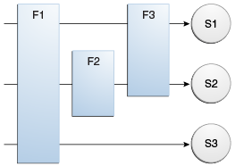

# 6.过滤请求和响应

过滤器是可以转换请求或响应的标头和内容（或两者）的对象。过滤器与Web组件的不同之处在于，过滤器本身通常不会创建响应。而是，过滤器提供了可以“附加”到任何类型的Web资源的功能。因此，过滤器不应依赖于其充当过滤器的Web资源。这样，它可以由多种类型的Web资源组成。

过滤器可以执行的主要任务如下。

- 查询请求并采取相应措施。
- 阻止请求和响应对进一步传递。
- 修改请求标头和数据。您可以通过提供请求的自定义版本来实现。
- 修改响应头和数据。您可以通过提供响应的自定义版本来执行此操作。
- 与外部资源进行交互。

过滤器的应用包括身份验证，日志记录，图像转换，数据压缩，加密，标记化流，XML转换等。

您可以将Web资源配置为按特定顺序由零个，一个或多个过滤器链过滤。该链在部署包含组件的Web应用程序时指定，并在Web容器加载组件时实例化。


### 编程过滤器

过滤API由定义`Filter`，`FilterChain`和 `FilterConfig`在所述接口`javax.servlet`包。您可以通过实现`Filter`接口来定义过滤器。

使用`@WebFilter`注释在Web应用程序中定义过滤器。此注释在类中指定，并且包含有关要声明的过滤器的元数据。带注释的过滤器必须指定至少一个URL模式。这是通过使用 注释上的`urlPatterns`或`value`属性来完成的。所有其他属性都是可选的，具有默认设置。使用`value`时，对注释的唯一属性是URL pattern属性; `urlPatterns`当还使用其他属性时，请使用该属性。

用`@WebFilter`注解注解的类必须实现该 `javax.servlet.Filter`接口。

要将配置数据添加到过滤器，请指定注释的`initParams` 属性`@WebFilter`。该`initParams`属性包含一个`@WebInitParam`注释。以下代码段定义了一个过滤器，并指定了一个初始化参数：

```java
import javax.servlet.Filter;
import javax.servlet.annotation.WebFilter;
import javax.servlet.annotation.WebInitParam;

@WebFilter(filterName = "TimeOfDayFilter",
urlPatterns = {"/*"},
initParams = {
    @WebInitParam(name = "mood", value = "awake")})
public class TimeOfDayFilter implements Filter {
    ...
```

`Filter`接口中最重要的方法是`doFilter`，该方法传递了请求，响应和筛选器链对象。此方法可以执行以下操作。

- 检查请求标头。
- 如果过滤器希望修改请求标头或数据，请自定义请求对象。
- 如果过滤器希望修改响应头或数据，请自定义响应对象。
- 调用过滤器链中的下一个实体。如果当前过滤器是链中以目标Web组件或静态资源结尾的最后一个过滤器，则下一个实体是链末的资源；否则，第二个实体为链的末尾。否则，它是WAR中配置的下一个过滤器。过滤器通过调用`doFilter`链对象上的方法来调用下一个实体，传入请求所调用的请求和响应，或者传递可能创建的包装版本。或者，过滤器可以选择不通过调用来调用下一个实体来阻止请求。在后一种情况下，过滤器负责填写响应。
- 调用链中的下一个过滤器后，检查响应头。
- 引发异常以指示处理中的错误。

除之外`doFilter`，还必须实现`init`和`destroy` 方法。`init`实例化过滤器时，容器将调用该方法。如果您希望将初始化参数传递给过滤器，请从`FilterConfig`传递给的对象中 检索它们`init`。


### 编写定制的请求和响应

过滤器可以通过多种方式修改请求或响应。例如，过滤器可以向请求添加属性，也可以在响应中插入数据。

修改响应的过滤器通常必须在将响应返回给客户端之前捕获该响应。为此，您需要将替代流传递给生成响应的servlet。替身流阻止servlet在完成时关闭原始响应流，并允许过滤器修改servlet的响应。

要将此替代流传递到Servlet，过滤器将创建一个响应包装，该包装将覆盖`getWriter`or `getOutputStream` 方法以返回该替代流。包装器将传递给`doFilter`过滤器链的 方法。包装方法默认情况下是调用包装的请求或响应对象。

要覆盖请求方法，请将请求包装在扩展为`ServletRequestWrapper`或的对象中`HttpServletRequestWrapper`。要覆盖响应方法，请将响应包装在`ServletResponseWrapper`或中扩展的对象中`HttpServletResponseWrapper`。


### 指定过滤器映射

Web容器使用过滤器映射来决定如何将过滤器应用于Web资源。过滤器映射按名称将过滤器与Web组件或URL模式与Web资源进行匹配。过滤器按照过滤器映射在WAR的过滤器映射列表中出现的顺序调用。您可以通过使用NetBeans IDE或使用XML手动编码为WAR在其部署描述符中指定过滤器映射列表。

如果您想将每个请求都记录到Web应用程序中，请将匹配计数器过滤器映射到URL模式`/*`。

您可以将过滤器映射到一个或多个Web资源，并且可以将多个过滤器映射到Web资源。这在示出 [图18-1](https://javaee.github.io/tutorial/servlets006.html#BNAGH)，其中，过滤器F1被映射到的servlets S1，S2，和S3; 过滤器F2被映射到servlet S2；过滤器F3映射到Servlet S1和S2。

**图18-1过滤器到Servlet的映射**



回想一下，过滤器链是传递给`doFilter`过滤器方法的对象之一 。此链由过滤器映射的手段间接地形成。过滤器在链中的顺序与过滤器映射在Web应用程序部署描述符中出现的顺序相同。

当过滤器映射到Servlet S1时，Web容器将调用`doFilter`F1 的 方法。`doFilter`S1的过滤器链中每个过滤器的方法均通过该方法由链中的前一个过滤器调用`chain.doFilter`。由于S1的过滤器链包含过滤器F1和F3，因此F1的调用将`chain.doFilter`调用`doFilter`过滤器F3 的方法。F3的`doFilter`方法完成后，控制权返回F1的`doFilter`方法。


#### 使用NetBeans IDE指定过滤器映射

1. 在“项目”选项卡中展开应用程序的项目节点。

2. 展开“项目”节点下的“网页”和“ WEB-INF”节点。

3. 双击`web.xml`。

4. 单击编辑器窗口顶部的过滤器。

5. 在编辑器窗口中展开“ Servlet筛选器”节点。

6. 单击“添加过滤器元素”以按名称或URL模式将过滤器映射到Web资源。

7. 在“添加Servlet过滤器”对话框中，在“过滤器名称”字段中输入过滤器的名称。

8. 单击浏览以找到过滤器所适用的servlet类。

   您可以包含通配符，以便可以将过滤器应用于多个servlet。

9. 单击确定。

10. 要限制如何将过滤器应用于请求，请按照下列步骤操作。

11. 展开“过滤器映射”节点。

12. 从过滤器列表中选择过滤器。

13. 单击添加。

14. 在“添加过滤器映射”对话框中，选择以下调度程序类型之一：

    - 请求：仅当请求直接来自客户端时

    - ASYNC：仅当异步请求来自客户端时

    - FORWARD：仅当请求已转发到组件时（请参阅 [将控制权转移到另一个Web组件](https://javaee.github.io/tutorial/servlets007.html#BNAGK)）

    - 包含：仅当请求由包含的组件处理时（请参阅[在响应中包括其他资源](https://javaee.github.io/tutorial/servlets007.html#BNAGJ)）

    - 错误：仅当使用错误页面机制处理请求时（请参阅[处理Servlet错误](https://javaee.github.io/tutorial/servlets002.html#BNAFN)）

      您可以通过选择多种调度程序类型，将过滤器定向到上述情况的任意组合。如果未指定任何类型，则默认选项为REQUEST。