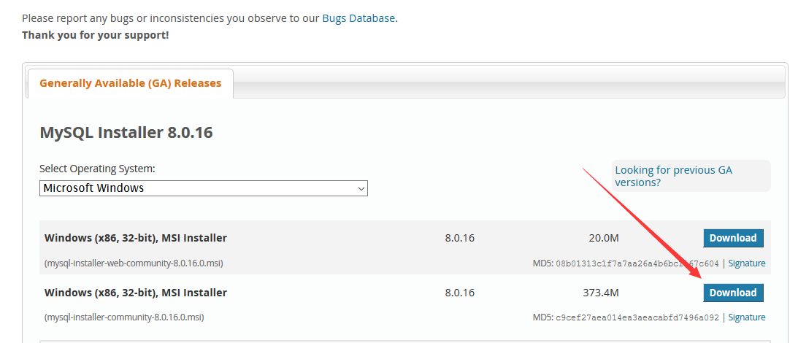
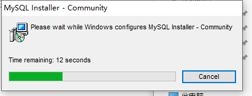
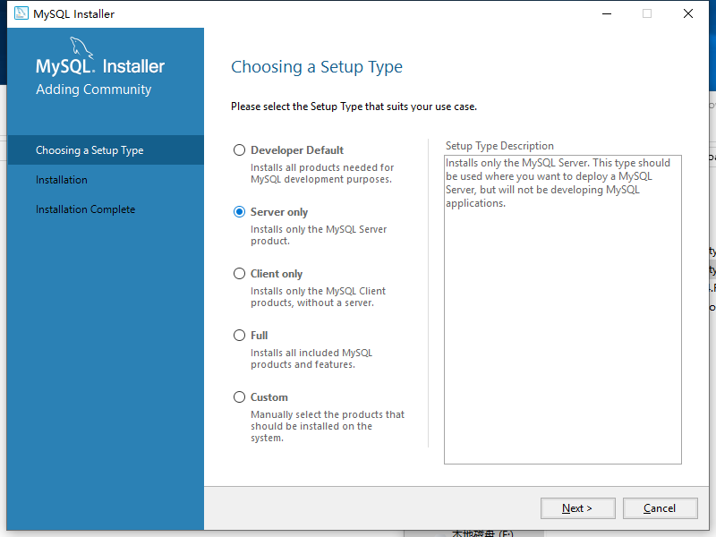
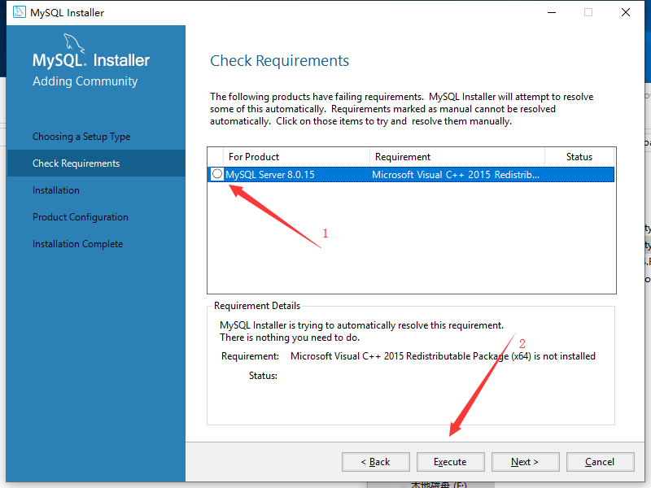
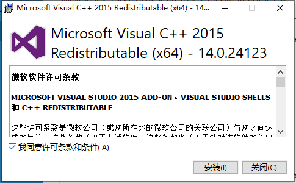
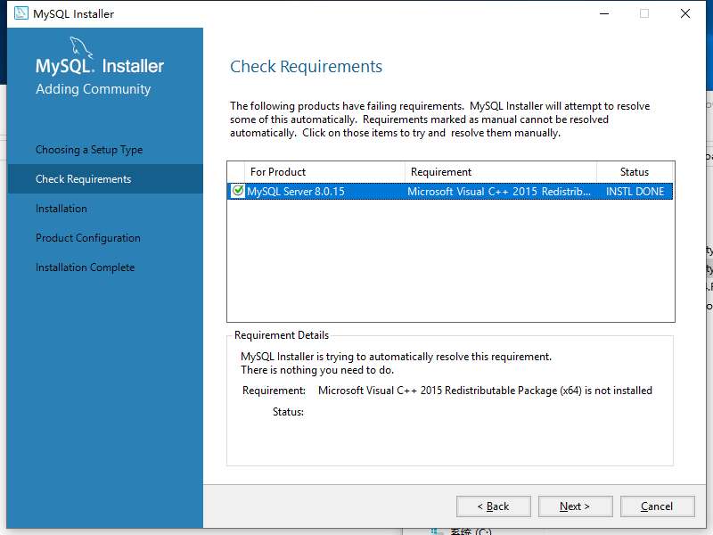
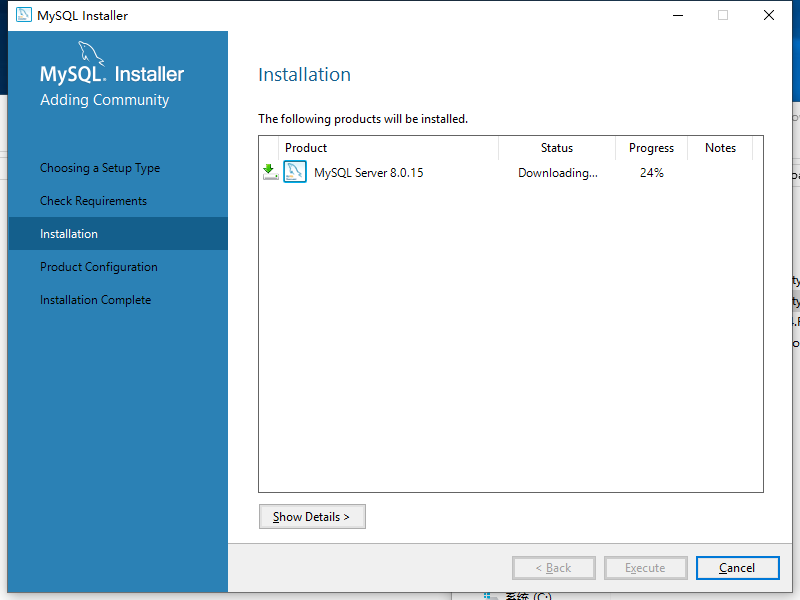
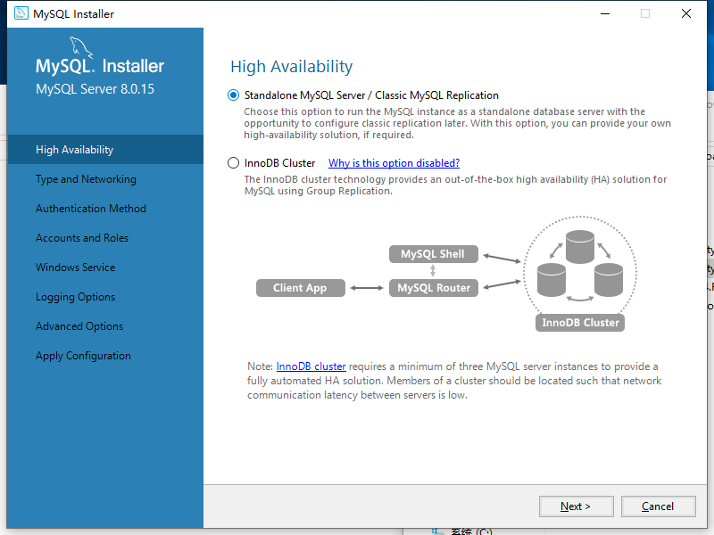
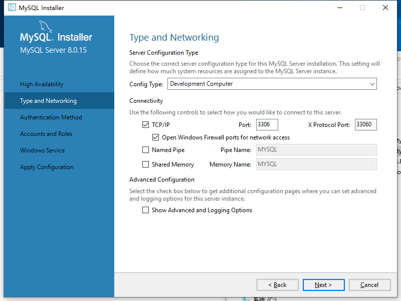
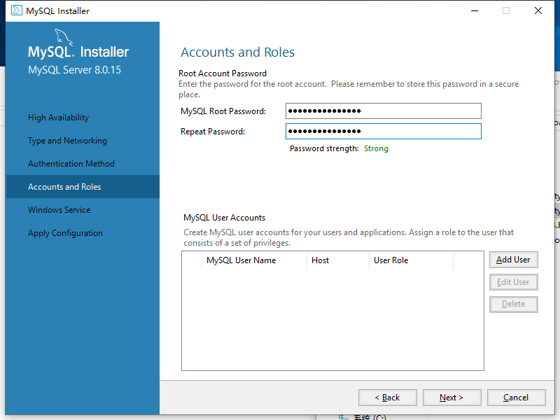

# 核心概念

##  安装

**`本地`：Windows 10 专业版**

先安装 mysql 8，没有成功，就安装5.7，成功了，然后卸载再装8，失败！再装 5.7还是成功，安装8失败百度说是 hosts文件下 localhost 127.0.0.1，但是这个机子根本就没有 hosts文件，复制过来也失败。

截的图是8，但是与5.7的过程是一样的，仅安装 MySql server 这部分，其他都没安装。

[mysql8地址](https://dev.mysql.com/downloads/windows/installer/8.0.html)，[mysql5.7地址](https://dev.mysql.com/downloads/windows/installer/5.7.html)，选择 mysql-installer-community版本，没有web。

- 
- 
- 
- 
- 
- 
- 
- 
- 
- 

一路`下一步`。

