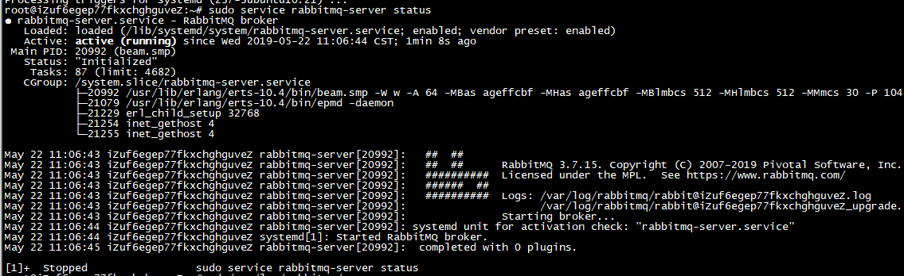
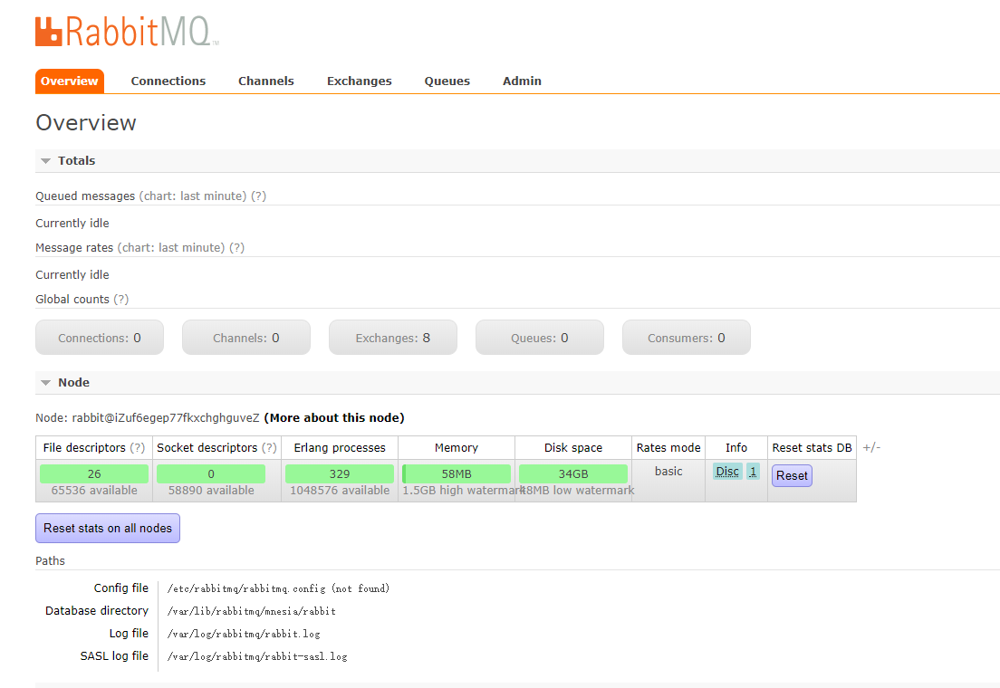

# 核心概念

##  消息通信概念：消费者、生产者和代理

应用程序从 RabbitMQ 获得的数据并不是由 Rabbit 产生的，他只是代管。

`生产者`创建消息，然后发布到代理服务器(RabbitMQ)上。

消息的组成：`有效载荷`和标签。有效载荷就是想要传输的数据，他可以是任何内容；标签描述有效载荷，RabbitMQ 用他来决定谁将获得消息的拷贝。

`消费者`，连接代理服务器，并订阅到队列上。每当消息到达特定的队列时，RabbitMQ 会将消息发送给其中一个订阅的/监听的消费者，接收到的内容只有有效载荷。

应用程序连接到 Rabbit才能消费或发布消息。这需要建立一条TCP连接，连接上之后应用程序就会创建一条AMQP`信道`。信道是建立在"真实的"TCP连接内的虚拟连接，AMQP命令都是通过信道发送出去的。可以每秒成百上千的创建信道而不会给操作系统的TCP栈造成压力。

##  AMQP元素：交换器、队列和绑定

AMQP消息路由必须由三部分：交换器、队列和绑定。

生产者把消息发布到交换器上；消息最终到达队列，并被消费者接收；绑定决定了消息如何从交换器路由到特定的队列。

生产者可以得到回执，消费者可以发送确认，这样可以保证消息发送/接收到了。

**交换器和绑定**

要将消息投递到队列时，通过把消息发送给交换器来完成。消息首先到达交换器，然后，根据确定的规则，RabbitMQ 会将决定消息该投递到那个队列，这些规则被称为路由键。

- 一对一：direct交换器

如果路由键匹配的话，消息就被投递到对应的队列。

当声明一个队列时，他会自动绑定到默认交换器，并以队列名称作为路由键。

- 一对多：fanout交换器

将收到的消息广播到绑定的队列上。

当发送一条消息到fanout交换器时，他会把消息投递给所有附加在此交换器上的队列。这可以实现对单条消息做出不同方式的响应。

- 多对一：topic交换器

将来自不同源头的消息能够到达同一个队列。

##  虚拟主机

每一个 RabbitMQ 服务器都能创建虚拟消息服务器，称之为虚拟主机(vhost)。

每个vhost本质上是一个mini版的RabbitMQ服务器，拥有自己的队列、交换器和绑定，也拥有自己的权限机制。

当在 Rabbit 里创建一个用户时，用户通常会被指派给至少一个vhost，并且只能访问被指派 vhost 内的队列、交换器和绑定。

##  消息持久化

Rabbit 里创建队列和交换器默认情况下在服务器重启就会消失。

能从 AMQP 服务器崩溃中恢复的消息，称之为持久化消息。

RabbitMQ 确保持久性消息能从服务器重启中恢复的方式是，将它们写入磁盘上的一个持久化日志文件，这样做会大大降低服务器性能，是为不可取。

考虑这个方案。

运行两种类型的 Rabbit 集群：非持久化消息通信的传统RabbitMQ集群和持久化消息通信的活动/热备非集群Rabbit服务器(使用负载均衡)。

与持久化相关的一个概念是AMQP事务。事务可以保证消息在持久化之后才确认完成，但这会降低性能，使得生产者应用程序`产生同步`，而使用消息通信就是想要避免同步。

**发送方确认模式**

一旦消息被投递给所有匹配的队列后，信道会发送一个发送方确认模式给生产者应用程序(包含消息的唯一ID)，这使得生产者知晓消息已经安全到达目标队列了。

这种模式最大的好处是他们是异步地。发布了一条消息，生产者应用程序就可以在等待确认的同时继续发送下一条。当确认消息最终受到的时候，生产者应用的回调方法就会被触发来处理该确认消息。如果Rabbit发生了内部错误从而导致了消息丢失，Rabbit会发送一条nack消息。

##  安装
- 阿里云OS
- 本地Ubuntu

**`阿里云OS`： Ubuntu 18.04 LTS**

````bash

sudo apt-key adv --keyserver "hkps.pool.sks-keyservers.net" --recv-keys "0x6B73A36E6026DFCA"

sudo tee /etc/apt/sources.list.d/bintray.rabbitmq.list <<EOF
deb https://dl.bintray.com/rabbitmq-erlang/debian bionic erlang-21.x
deb https://dl.bintray.com/rabbitmq/debian bionic main
EOF

sudo apt-get update -y

cd  /etc/apt/sources.list.d/

rm -f bintray.rabbitmq.list 

sudo apt-get install rabbitmq-server -y --fix-missing

````

**阿里云开放端口**

实例详情，右边：本实例安全组

添加安全组规则，放行端口15672和5672入方向规则。

`入方向` ，点击快速创建规则：自定义端口填写：15672/15672、授权对象填写： 0.0.0.0/0

浏览器： http://IP:15672/  admin/admin123456


**本地Ubuntu**

[待定](1111.md)，还未测试


----

**服务状态**
````bash

sudo service rabbitmq-server status

````





**远程访问**

启用 Management插件：sbin文件夹下，`./rabbitmq-plugins enable rabbitmq_management`，还需要重启应用。

````bash
// 修改配置
cd /etc/rabbitmq
sudo vim rabbitmq-env.conf

````

```` bash
// 内容去掉注释
# Defaults to rabbit. This can be useful if you want to run more than one node
# per machine - RABBITMQ_NODENAME should be unique per erlang-node-and-machine
# combination. See the clustering on a single machine guide for details:
# http://www.rabbitmq.com/clustering.html#single-machine
NODENAME=rabbit

# By default RabbitMQ will bind to all interfaces, on IPv4 and IPv6 if
# available. Set this if you only want to bind to one network interface or#
# address family. 阿里云的改成这个，不是127.0.0.1
NODE_IP_ADDRESS=0.0.0.0

# Defaults to 5672.
NODE_PORT=5672
````

```` bash

// 重启
sudo service rabbitmq-server restart

````

**创建用户**
````bash

rabbitmqctl add_user admin admin123456
rabbitmqctl set_user_tags admin administrator
rabbitmqctl set_permissions -p / admin ".*" ".*" ".*"

````

**远程登录**
````bash

rabbitmq-plugins enable rabbitmq_management

````

----

##  参考
- [ubuntu16.04安装配置rabbitmq](https://www.jianshu.com/p/a29f11e72897)
- [阿里云ubuntu16.0安装rabbitmq](https://blog.csdn.net/u010172714/article/details/84875453)