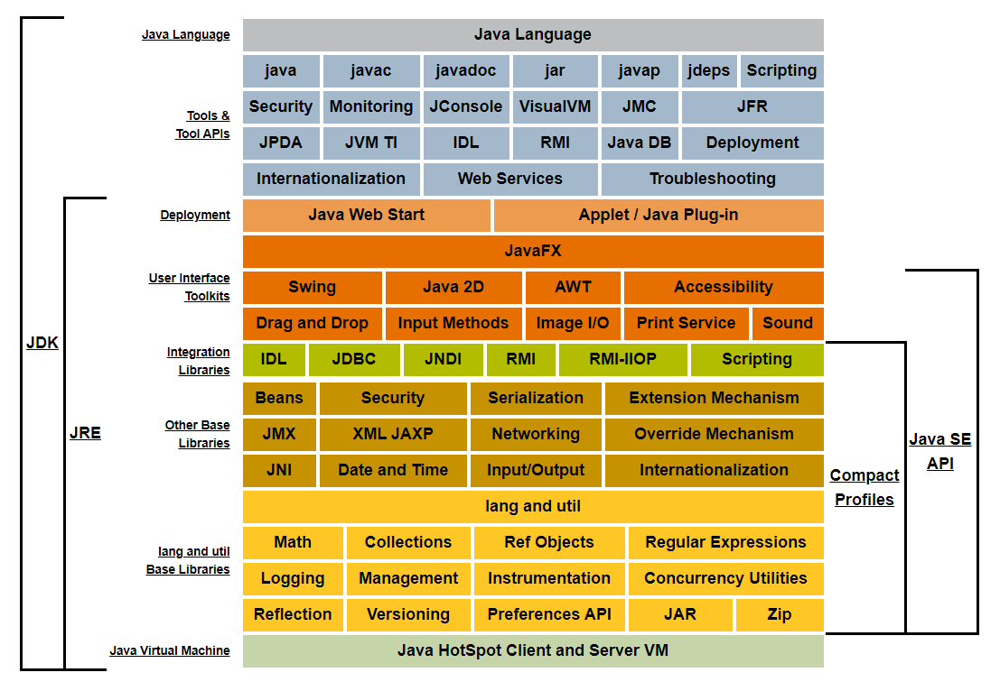

# Java 技术

>   对应 processon 里的`编程语言技术栈/Java技术栈`

>   来自 JDK API ，关注你需要关注的

每本书或网站都有各自的定位，这里是为了能够理解Java常见框架，这些框架是对Java特性的一种实践，而每种框架又是特定现实需求下的解决方案，框架里面基础支持都可以归纳到JDK里面来。

Java 每个特性或功能源自某个JCP，呈现方式是语法或包里，变更历史也记录在案，在这里开始，介绍的比较全面简洁直接。

----

##  目录
-   [API](j001/README.md)
-   [JVM](j002/README.md)
    -   内存模型
-   [需求：JCP](j003/README.md)
-   Java框架

----

##  权威权威权威
-   [Java SE 规范列表](https://docs.oracle.com/javase/specs/index.html)
-   Java SE 8
    -   [Java 虚拟机规范](https://docs.oracle.com/javase/specs/jvms/se8/html/index.html)
    -   [Java 语言规范](https://docs.oracle.com/javase/specs/jls/se8/html/index.html)
    -   [API](https://docs.oracle.com/javase/8/docs/api/index.html)
-   Java SE 11
    -   [Java 虚拟机规范](https://docs.oracle.com/javase/specs/jvms/se11/html/index.html)
    -   [Java 语言规范](https://docs.oracle.com/javase/specs/jls/se11/html/index.html)
    -   [API](https://docs.oracle.com/en/java/javase/11/docs/api/index.html)
-   Java EE 8
    -   [官网](https://www.oracle.com/technetwork/java/javaee/overview/index.html)
    -   [API](https://javaee.github.io/javaee-spec/javadocs/)
    -   [tutorial](https://javaee.github.io/tutorial/)
    -   [javaee8-samples](https://github.com/javaee-samples/javaee8-samples)
-   OpenJDK
    -   [官网](https://hg.openjdk.java.net/)
    -   [GitHub](https://github.com/openjdk/jdk)
    -   [Gitee]()
-   [Java SE 概念图，起点](https://docs.oracle.com/javase/8/docs/)

----

相对独立涉及又广的部分：API、经验分享、原理源码
