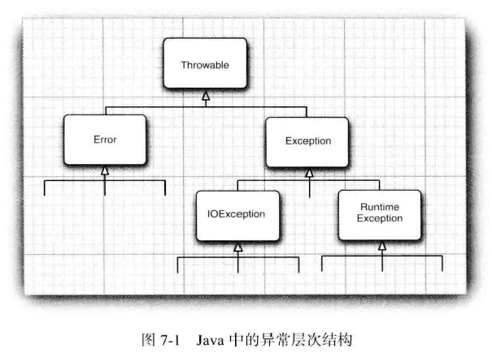

#   异常处理

假设在一个 Java 程序运行期间出现了一个错误。

这个错误可能是由于文件包含了错误信息，或者网络连接出现问题造成的，也有可能是因为使用无效的数组下标，或者试图使用一个没有被赋值的对象引用而造成的。用户期望在出现错误时，程序能够采用一些理智的行为。

如果由于出现错误而使得某些操作没有完成，程序应该：

-   返回到一种安全状态，并能够让用户执行一些其他命令
-   允许用户保存所有操作的结果，并以妥善的方式终止程序

要做到这些并不是一件很容易的事情。其原因是检查(或引发)错误条件的代码通常离那些能够让数据恢复到安全状态，或者能够保存用户的操作结果，并正常地退出程序的代码很远。

异常处理的任务就是将控制权从错误产生的地方转移给能够处理这种情况的错误处理器。

为了能够在程序中处理异常情况，必须研究程序中可能出现的错误和问题，以及哪类问题需要关注。

1.  用户输入错误

假设一个用户请求连接一个URL，而语法缺不正确。在程序代码中应该对此进行检查，如果没有检查，网络层就会出警告。

2.  设备错误

打印机可能被关掉了，网页可能临时性地不能浏览

3.  物理限制

磁盘满了，可用存储空间已被用完

4.  代码错误

程序方法有可能无法正确执行。例如，方法可能返回了一个错误的答案，或者错误地调用了其他的方法。计算的数组索引不合法，试图在散列表中查找一个不存在的记录，或者试图让一个空栈执行弹出操作，这些都属于代码错误。

如果某个方法不能够采用正常的途径完成他的任务，就可以通过另外一个路径退出方法。在这种情况下，方法并不返回任何值，而是抛出(throw)一个封装了错误信息的对象。这个方法将会立即退出，并不返回任何值。此外，调用这个方法的代码也将无法继续执行，取而代之的是，异常处理机制开始搜索能够处理这种异常状况的异常处理器。

异常具有自己的语法和特定的继承结构。

##  异常分类

在Java程序设计语言中，异常对象都是派生于 Throwable 类的一个实例。如果内置的异常类不能够满足需求，用户可以创建自己的异常类。

所有的异常都是由 Throwable 继承而来，但在下一层立即分解为两个分支： Error 和 Exception 。

### Error 类

Error 类层次结构描述了Java运行时系统的内部错误和资源耗尽错误。应用程序不应该抛出这种类型的异常，如果出现了这样的内部错误，除了通知用户，并尽力使程序安全地终止之外，再也无能为力，很少出现。

### Exception

在设计Java程序时，需要关注 Exception 层次结构。这个层次结构又分解为两个分支：一个分支派生于 RuntimeException ， 另一个分支包含其他异常。

划分两个分支的规则是：由程序错误导致的异常属于 RuntimeException ；而程序本身没有问题，但由于像 I/O 错误这类问题导致的异常属于其他异常。

派生于 RuntimeException 的异常包含下面几种情况：

-   错误的类型转换
-   数组访问越界
-   访问 null 指针

不是派生于 RuntimeException 的异常包括：

-   试图在文件尾部后面读取数据
-   试图打开一个不存在的文件
-   试图根据给定的字符串查找 Class 对象，而这个字符串表示的类并不存在

"如果出现 RuntimeException 异常，那么就一定是你的问题" 是一条相当有道理规则。

通过检测数组下标是否越界来避免 ArrayIndexOutOfBoundsException 异常；通过在使用变量之前检测是否为 null 来杜绝 NullPointerException 异常的发生。

Java语言规范将派生于 Error 类或 RuntimeException 类的所有异常称为 非受查异常(JVM不能处理)，所有其他的异常称为 受查异常(JVM能够处理，与环境相关)。

##  声明受查异常

267

##  如何抛出异常

##  创建异常类

----
