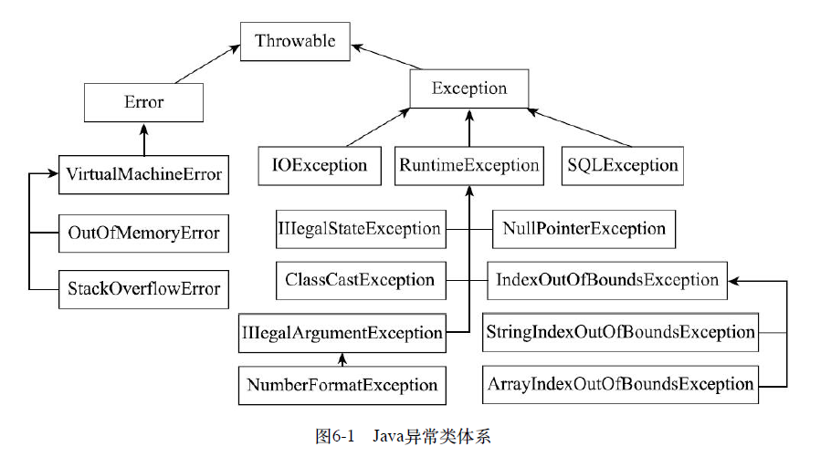

#   异常类

所有异常类都有一个共同的父类 Throwable 。

##  Throwable

NullPointerException 和 NumberFormatException 有一个共同的父类 Throwable，他有4个 public 构造方法：

```Java
public Throwable()
public Throwable(String message)
public Throwable(String message, Throwable cause)
public Throwable(Throwable cause)
```

Throwable 类有两个主要参数：一个是 message，表示异常消息；另一个是 cause，表示触发该异常的其他异常。异常可以形成一个异常链，上层的异常由底层异常触发， cause 表示底层异常。 Throwable 还有一个 public 方法用于设置 cause：

```Java
Throwable initCause(Throwable cause)
```

Throwable 的某些子类没有带 cause 参数的构造方法，就可以通过这个方法来设置，这个方法最多只能被调用一次。

在所有构造方法的内部，都有一句重要的函数调用：

```Java
fillInStackTrace();
```

他会将异常栈信息保存下来，这是我们能看到异常栈的关键。

Throwable 有一些常用方法用于获取异常信息，例如：

```Java
void printStackTrace() //打印异常栈信息到标准错误输出流
//打印栈信息到指定的流
void printStackTrace(PrintStream s)
void printStackTrace(PrintWriter s)
String getMessage() //获取设置的异常 message
Throwable getCause() //获取异常的cause
//获取异常栈每一层的信息, 每个  StackTraceElement 包含文件名、类名、函数号、行号等信息
StackTraceElement[] getStackTrace()
```

##  异常类体系

以 Throwable 为根，Java 定义了非常多的异常类，表示各种类型的异常，部分类如图所示：



Throwable 是所有异常的基类，他有两个子类： Error 和 Exception

Error 表示系统错误或资源耗尽，由Java系统自己使用，应用程序不应抛出和处理，如上图列出的虚拟机错误及其子类内存溢出错误和栈溢出错误

Exception 表示应用程序错误，他有很多子类，应用程序也可以通过继承 Exception 或其子类创建自定义异常，如上图列出的三个子类：  IOException (输入/输出I/O异常)、 RuntimeException (运行时异常)、 SQLException (数据库SQL异常)

RuntimeException 表示的含义是 未受检异常，Error 及其子类也是

Exception 除了 RuntimeException 子类和自身都是受检异常。

受检和未受检的区别在于 Java 如何处理这两种异常。对于受检异常，Java 会强制要求程序员进行处理，否则会有编译错误，而对于未受检异常则没有这个要求。

RuntimeException 也有很多子类，如下图所示：


如此多不同的异常类其实并没有比 Throwable 这个基类多多少属性和方法，大部分类在继承父类后只是定义了几个构造方法，这些构造方法也只是调用了父类的构造方法，并没有额外的操作。

这些多不同的类，主要是为了名字不同。异常类的名字本身就代表了异常的关键信息，无论是抛出还是捕获异常，使用合适的名字都有助于代码的可读性和可维护性。

##  自定义异常

除了Java API 中定义的异常类，也可以自己定义异常类，一般是继承 Exception 或者他的某个子类。

如果父类是 RuntimeException 或他的某个子类，则自定义异常也是未受检异常；如果是 Exception 或者 Exception 的其他子类，则自定义异常也是受检异常。

通过继承 Exception 来定义一个异常，如下所示：

```Java
public class AppException extends Exception {
    public AppException() {
        super();
    }
    public AppException(String message, Throwable cause) {
        super(message, cause);
    }
    public AppException(String message) {
        super(message);
    }
    public AppException(Throwable cause) {
        super(cause);
    }
}
```

没有定义额外的属性和代码，只是继承了 Exception，定义构造方法并调用了父类的构造方法。

----