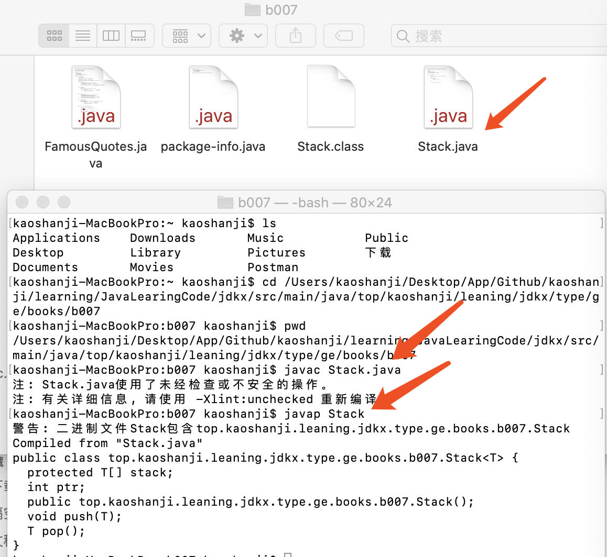

#   创建参数化的Stack类

学习如何创建类型ArrayList的参数化类型，考虑程序中用到的栈数据结构，栈可以用于压入和取出数据。

假设想要创建一种只能操作特定数据类型的栈，例如只希望压入和取出Integer或String类型的数据，希望栈类型安全一些，保证只能压入和取出这种类型的数据，视图操作其他类型会生成编译时错误。

##  声明语法

```Java
class ClassName<type> {
    ...
}
```

其中，type一般用单个大写字母表示，用于区分更具描述性的其他标识符。可以如下代码声明拥有单个参数的泛型类Stack：

```Java
class Stack<T> {
    ....
}
```

下面的语句用于实例化Stack类：

```Java
Stack<Integer> integerStack;
```

创建可操作多于一种数据类型的类，例如，映射数据结构需要两个元素--键与对应的值，映射在Java中的实现为HashMap类，定义如下：

```Java
class HashMap<K, V> {
    ....
}
```

其中，K指定映射要维护的键的类型，V指定映射的值的类型。实例化 HashMap 类的方法如下：

```Java
HashMap<String, Integer> map1 = new HashMap<String, Integer>();
HashMap<Integer, String> map2 = new HashMap<Integer, String>();
```

在map1中，键为String类型，值为Integer类型。在map2中，键为Integer类型，值为String类型。在实例化类时指定参数类型。

泛型类仍然可以接受任意数量的参数，泛型类的一般声明形式如下：

```Java
class className<paramList> {...}
```
className指定泛型类的名称，paramList包含一个或多个用逗号分隔的参数，实例化泛型类的一般语法：

```
className<ArgumentList> varName = new className<>(argList);
```

##  泛型类Stack

-   jdkx.type.ge.books.b007.Stack

声明用于实例化Stack类：

```Java
Stack<Float> floatStack;
```

当使用上述声明时，编译器会将Stack定义中的每一处T替换为Float。

##  检查中间代码



类型为T[]的stack类变量被替换为如下语句：

```Java
protected java.lang.Object[] stack;
```

声明接受参数类型为T的push方法现在接受的参数类型为 java.lang.Object，而返回T类型变量的pop方法现在返回类型为 java.lang.Object 类型的对象。

当使用 Integer 类型参数实例化Stack类时，真实的数据类型会替换类型参数T。

-   注意

编译器擦除所有的尖括号，并且替换类型变量为可与任何其他Java类型在运行时工作的Object类型，该特性叫做擦除。

-   提示

编译器在擦除类型信息时不会为实例化的每一个数据类型创建多个类；而是会在字节码中维护真实类型信息，并在需要时适当地进行类型转换。

-   注意

在编译阶段，虽然编译器会将每个参数化的类型参数看作完全不同的类型，但是只有一种实际类型在运行时存在。例如，Stack<Integer> 与 Stack<Float> 共享相同的普通Java类Stack。

Stack 叫做 Stack<T> 泛型类的原生类型。

##  测试Stack泛型类

-   jdkx.type.ge.books.b007.StackDemoApp

Long 数据类型是在变量声明时被指定的，push方法接收long类型参数，long类型参数会被自动装箱特性自动转换为Long数据类型，调用pop方法，从栈中弹出这些压入的条目，返回的Long数据类型会自动转换为long数据类型。如果试图往栈中压入其他数据类型，就会产生编译时错误。

一般来说，当数据存储在数组、栈或列表这样的数据结构中时，只有程序员知道存储的对象类型是什么，并且负责在获取对象时进行对应的类型转换。如果在类型转换时出错，就会产生运行时错误。

使用泛型可以在编译时检查到此类错误，继而让代码变得更加鲁棒。

----