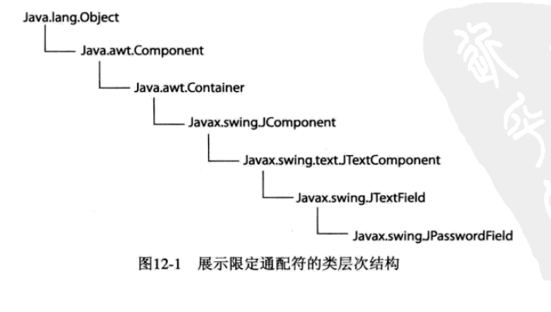

#   限定类型

使用泛型可以限定类能够操作的数据类型范围，这种类型叫做限定类型，看看如果创建这样的泛型类。

如果想限定 Stack 只能操作数值类型，该怎么办？为了放置这些约束，声明 Stack 泛型类如下所示：

```Java
class NumberStack<T extends Number>
```

NumberStack 类接受扩展自 Number 的名为T的参数。

-   注意

一般情况下，对于任何类来说，只要继承层次存在，T都可以扩展。

NumberStack 类可操作任何派生自Number类(Number是Java中所有数值类型的超类)的数据类型。

使用下列声明可以创建 NumberStack 类的实例：

```Java
NumberStack<Long> longStack;
NumberStack<Float> floatStack;
```

但是这样的语句：

```Java
NumberStack<Character> characterStack; // 异常..
```

编译器会抛出错误，指出 Character 没有继承自 Number，因此不在数值类型的范围之内。

-   jdkx.type.ge.books.b007.NumberStack

仅有的改动是替换所有的Object数组为Number类型数组：

```Java
private Number[] stack = (T[]) new Number[100];
```

剩下的类代码保持不变。

##  使用通配符

-   jdkx.type.ge.books.b007.NumberStackDemoApp

Number 是 NumberStack 类定义中所有实数类型的最小公共超类，所以在参数声明中使用 Number。

当 `dumpStack(NumberStack<Number> stack)` 时，添加 Long 类型的数据，dumpStack 方法是不会接受，即使 Long 是 Number 的子类，编译器在这里检查错误了。

当 `dumpStack(NumberStack<?> stack)` 时，就可以将任意类型的 NumberStack 对象传给给 dumpStack 方法了。

问号(?) 被称为`通配符`，用于告诉编译器接受拥有可操作数据类型的 NumberStack类的所有实例。


##  限定通配符

限定类型设置泛型中可用的类型为特定的类层次结构，通配符允许替换泛型中的参数类型为任何可用的类型。

在一些情况下，也想设置泛型中类型方位的上限与下限。



JPasswordField 类派生自若干超类，如果希望只接收处于 Container 与 JTextField 类范围内的组件(意味着只接受 Container、JComponent、JTextComponent与JTextField)，为了达到这个目的，需要为组件创建上限和下限。

为了完成目标，可以定义如下 CustomComponent 泛型类：

```Java
class CustomComponent<T>
```

定义泛型类时，当参数类型声明为上述例子中的T时，T可以被任何Java类替换，因为所有的Java类均派生自 java.lang.Object。

289


##  原生类型


----