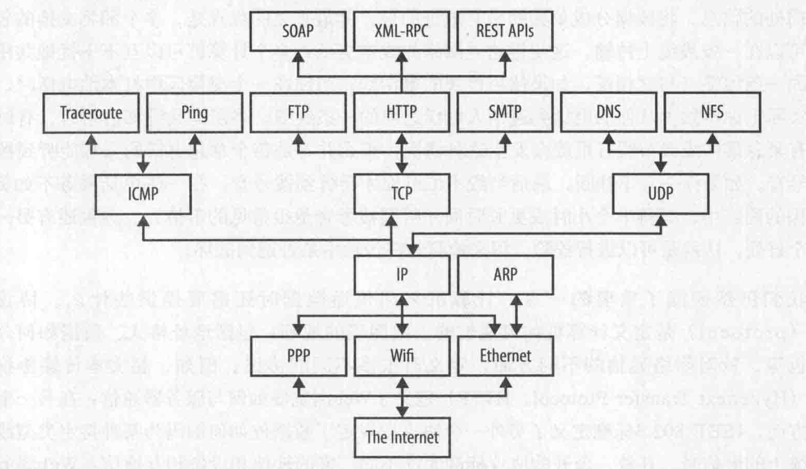
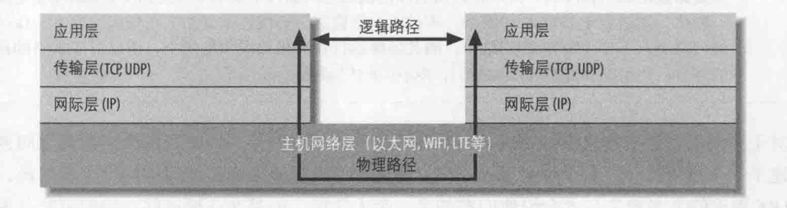
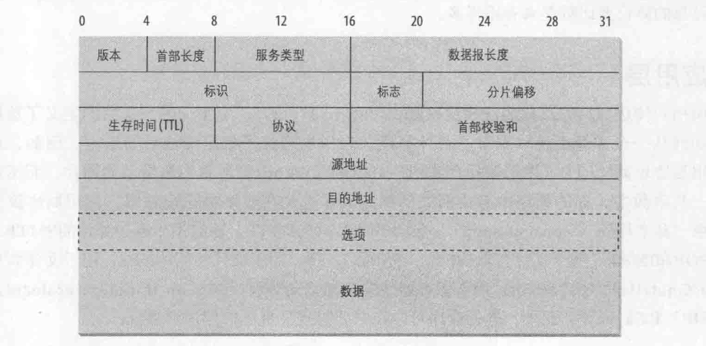

#   基本网络概念

##  内容提要

理解一些网络背景概念

-   网络

----

##  网络

`网络`是一种通信的方式，为了交换数据，其他的方式还有：烽火台、快递、电话和短信，都是借助某种媒介传递信息。

网络是相互发送和接收数据的计算机和其他设备的集合。

网络处于两个节点(发送和接收信息的设备)之间，通常用线缆连接，数据位转换为电磁波，通过线缆移动，无限网络使用无线电波传输数据，长距离的传输会使用玻璃纤维发送可见光的光线来完成。

网络中的每台机器称为一个节点，只要具备网络通信，比如：打印机、路由器、网桥、网关等等，但多数情况是与其他计算机对话。

具备完备功能的计算机节点也称为主机(host)。

每个网络节点都有`地址`，这是用于唯一标识节点的一个字节序列。不同的网络会以不同的方式分配地址。

以太网地址与物理以太网硬件关联。以太网硬件的生产厂家使用预分配的厂商编码确保他们的硬件地址或与其他厂家的硬件地址不冲突，每个厂商负责保证不会生产两块地址相同的以太网卡。

Internet 地址通常由负责分配地址的组织分配给计算机。

节点还有可以很好记的`名字`，如"www.qidian.com"或"www.jd.com"，某一时刻一个特定的名字通常就指示一个地址。但是，名字与地址并不绑定，都可以各自改变，一个地址可以与多个名字，一个名字也可以指示多个不同的地址。

所有现代计算机网络都是`包交换`(分组交换)网络：流经网络的数据分隔成小块，称为包(packet，也称为分组)，每个包都单独加以处理。每个包都包含了由谁发送和将发往何处的信息。将数据分成单独的带有地址的包，其最重要的有点是，多个即将交换的包可以在一条线缆上传输，建立网络成本更低，多个计算机可以互不干扰的共用同一条线缆。分包还有一个好处，可以进行效验，用来检测包在传输中是否遭到破坏。

`协议`(protocol)是定义计算机如何通信的一组明确的规则：包括地址格式、数据如何分包等。

`HTTP协议`(超文本传输协议)定义了Web浏览器如何与服务器通信，

##  网络的分层

通过网络发送数据是一项复杂的操作，必须仔细的协调网络的物理特征以及所发送数据的逻辑特征。通过网络发送数据的软件必须了解如何避免包的冲突，将数字数据转换为模拟信号，检测和修正错误，将包从一台主机路由到另外的主机等，需要支持多个操作系统以及添加异构网络线缆时，更加复杂。

为了对应用程序开发人员和最终用户隐藏这种复杂性，网络通信的不同方面被`分解为多个层`，面向对象???封装再封装！！

每一层表示为物理硬件(即线缆和电流)与所传输信息之间的不同抽象层次，在理论上，每一层只与紧挨其上和其下的层对话。将网络分层，这样就可以修改甚至替换某一层的软件，只要层与层之间的接口保持不变，就不会影响到其他层。

-   网络中可能存在的协议栈

如今在 Internet 上中间层协议相当稳定，但是上层和下层的协议变化很大，有些主机使用有线网、WiFi、PPP。

从栈的顶层来看，底层协议是什么并不重要，反之亦然，从底层来看，也不关心顶层协议是什么。

这些分层模型实现了应用协议与网络硬件物理特性以及网络连接拓扑结构的解耦合。

-   Internet的标准TCP/IP四层模型

应用程序如 Firefox 运行在应用层，只与传输层对话。传输层只与应用层和网际层对话，网际层则只与主机网络和传输层对话，绝不直接与应用层对话。主机网络层通过线缆、光线或其他介质将数据移动到远程系统的主机网络层。

例如，当Web浏览器向Web服务器发送获取网页的请求时，浏览器实际上只与本地客户机的传输层对话。传输层将请求分解为TCP分片，向数据添加序列号和效验和，然后将请求传递给本地网络层。网际层根据本地网络所需的大小将各TCP片分成IP数据报，并传递到主机网络层以便通过线缆传输数据。主机网络层将数字数据编码为适合特定物理介质的模拟信号，将请求发送到线缆，目标地址的远程系统的主机网络层可以由此读取请求。

### 主机网络层

主机网络层中，由连接不同计算机的硬件(线缆、光纤、无限电波)组成的部分有时称为网络的物理层，Java从来都看不到物理层。

需要考虑主机网络层和物理层的主要原因是性能，无论遇到哪一种物理链路，在这些网络上用来完成通信的API都是一样的，之所以能够做到这一点，就是因为有网际层。

### 网际层

在OSI模型中，网际层使用一个更一般的名字，称为网络层。网络层协议定义了数据位和字节如何组织为更大的分组，称为包，还定义了寻址机制，不同计算机要按这个寻址机制查找对方。网际协议(IP)是世界上使用最广泛的网络层协议，也是Java唯一理解的网络层协议。

这是两个协议：IPv4和IPv6，IPv4使用32位地址，IPv6使用128位地址，这是两个完全不同的网络协议，如果没有特殊的网关或隧道协议，即使在相同的网络上他们也无法做到互操作。

在IPv4和IPv6中，数据按包在网际层上传输，这些包称为数据报。每个IPv4数据报包含一个长度为20至60字节的首部，以及一个包含多达 65515 字节数据的有效载荷。

字节？？有效载荷？？包？？这算是网络传输里面的数据格式了？？有效载荷 --> RabbitMQ里的消息

除了路由和寻址，网际层的第二个作用是支持不同类型的主机网络层相互对话。

Internet路由器会完成WiFi和Ethernet、Ethernet和DSL、DSL和光纤往返等协议之间的转换，网际层负责使用同构协议将异构网络相互连接。

### 传输层

原始数据报有一些缺点，最显著的缺点是不能保证可靠传送，即使能传送也可能在传输中遭到破坏，也不一定会以发送时的顺序到达。

传输层负责确保各包以发送的顺序接收，并保证没有数据丢失或者破坏。

这一层上主要有两个协议，第一个是传输控制协议(TCP)，这是一个开销很高的协议，支持对丢失或破坏的数据进行重传，并按照发送时的顺序进行传送。

第二个协议是用户数据报协议(UDP)，他允许接收方检测被破坏的包，但不保证这些包以正确的顺序传送，但是UDP通常比TCP快。

### 应用层

向用户传送数据的层称为应用层，他下面的三层共同定义了数据如何从一台计算机传输到另一台计算机。应用层确定了数据传输后的操作。

HTTP可以确保Web浏览器将图像显式为图片，而不是一长串数字，电子邮件的SMTP、POP和IMAP；用于文件传输的FTP、FSP和TFTP；用于文件访问的NFS；用于文件共享的BitTorrent等等。

必要时定义自己的应用层协议。

##  IP、TCP和UDP

IP(网际协议)是冷战时期由军方资助开发的，包含大量军方关心的特性：必须健壮、必须开放，与平台无关。

TCP允许接收端的包按发送时的顺序重新组合在一起。如果数据的顺序不是特别重要，而且单个包丢失也不影响，可以考虑UDP。

##  IP地址和域名

IPv4网络中的每台计算机都由一个4字节的数字标识。当数据通过网络传输时，包的首部会包括要发往的机器地址(目的地址)和发送这个包的机器地址(源地址)。沿路的路由器通过检查目的地址来选择发送数据包的最佳路由，包括源地址是为了让接收方知道要向谁回复。

人类对于记忆数字不在行，就开发了域名系统(DNS)，用来将人类易于记忆的主机名(如www.jd.com)转换为数字Internet地址(如208.201.239.101)。

当Java程序访问网络时，需要同时处理数字地址和相应的主机名，这些由 java.net.InetAddress类实现。

有些计算机(尤其是服务器)有固定的地址，其他计算机(特别是局域网和无线连接上的客户端)可能每次启动时会收到不同的地址，这是由 DHCP 服务器提供。

##  端口

现代计算机同时要做很多不同的事情，电子邮件需要与FTP请求分开，而FTP又要与Web业务流分开，这是通过端口(port)实现的。

每台有IP地址的计算机都有几千个逻辑端口(每个传输层协议有65535个端口)，这些只是计算机内存中的抽象，不表示任何物理事物，与USB端口不同。每个端口由1到65535之间的一个数字标识，每个端口可以分配给一个特定的服务。

##  Internet

Internet是世界上最大的基于IP的网络，Internet上每台计算机都至少有一个标识此计算机的IP地址，大多数还有至少一个主机名映射到这个IP地址。

Internet不是唯一的基于IP的网络，但确实最大的一个，其他IP网络称为internet(首字母i小写)：例如没有连接Internet的高安全性内部网。

### Internet地址分块

区域Internet注册机构会为Internet服务提供商(ISP)分配IPv4地址块，每个地址块有固定的前缀。

##  网络地址转换

出于IP地址越来越稀缺，而对原始IP地址的需求越来越大，如今大多数网络都使用了网络地址转换(NAT)。基于NAT的网络中，大多数节点只有不可路由的本地地址。将本地网络连接到ISP的路由器会把这些本地地址转换为更小的一组可路由的地址。

路由器会监视出站和入站连接，调整IP包中的地址。对于出站的包，他将源地址改为路由器的外部地址。对于入站的包，他将目的地址改为一个本地地址。

外部地址和内部地址有可能不同。

##  防火墙

位于Internet和本地网络之间的一些硬件和软件会检查所有进出的数据，以保证其合法性，这就称为防火墙。

防火墙通常是将本地网络连接到更大的Internet的路由器的一部分，还可以完成其他任务，如网络地址转换。

##  代理服务器

代理服务器与防火墙有关，如果说防火墙会阻止一个网络上的主机与外界直接建立连接，那么代理服务器就起到了中间人的作用。这样一来，如果防火墙阻止一个机器连接外部网络，这个机器可以请求本地代理服务器的Web页面，而不是直接请求远程Web服务器的Web页面，然后代理服务器会请求Web服务器的页面，将相应转发给最初发出请求的机器。

代理还可以用于FTP服务器和其他链接，使用代理服务器的安全优势之一是外部主机只能看到代理服务器，而不会知道内部机器的主机名和IP地址，这就使得攻击内部网络更加困难。

防火墙一般工作于传输层或网际层，而代理服务器通常工作于应用层。代理服务器对一些应用层协议非常了解，如HTTP和FTP。

代理服务器还可以用来实现本地缓存。当请求Web服务器的文件时，代理服务器首先查看此文件是否已在缓存中，如果文件在缓存中，那么代理服务器将提供缓存中的文件，而不是Internet上的文件。

代理服务器最大的问题在于他无法应对所有协议，通常已有的协议如HTTP、FTP和SMTP允许通过，而更新的协议如BitTorrent则不允许通过。

##  客户/服务器模型

大多数现代网络编程都基于客户/服务器模型。

客户/服务器应用程序一般将大量数据存储在昂贵的高性能服务器或服务器云上，而大多数程序逻辑和用户界面由客户端软件处理，这些客户端软件运行在相对便宜的个人计算机上。

不是所有应用程序都简单的符合客户/服务器模型，例如，在网络游戏中，看起来两个玩家都能大致相同的来回发送数据，这种连接称为"对等"连接。电话系统就是典型的对等网络例子。

##  Internet标准

本书会讨论几种应用层Internet协议，最著名的是HTTP，如果需要关于某个协议的详细信息，权威的资源还是该协议的标准文档。

关于应用层网络编程和协议的大多数标准都由下面两个组织制定：IEIF(Internet工程任务组)和W3C(国际互联网协会)。

IEIF是不太正式的民间团体，标准包括 TCP/IP、MIME和SMTP

W3C是厂商组织，标准包括 HTTP、HTML和XML

----
