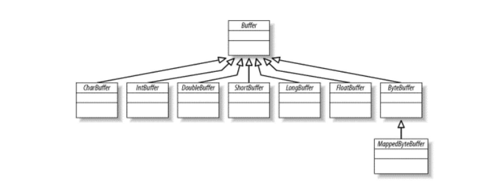
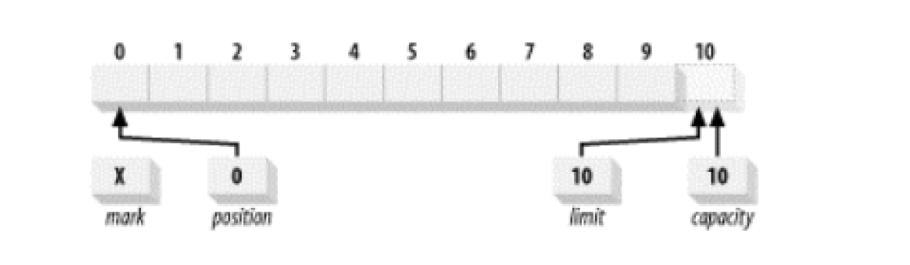
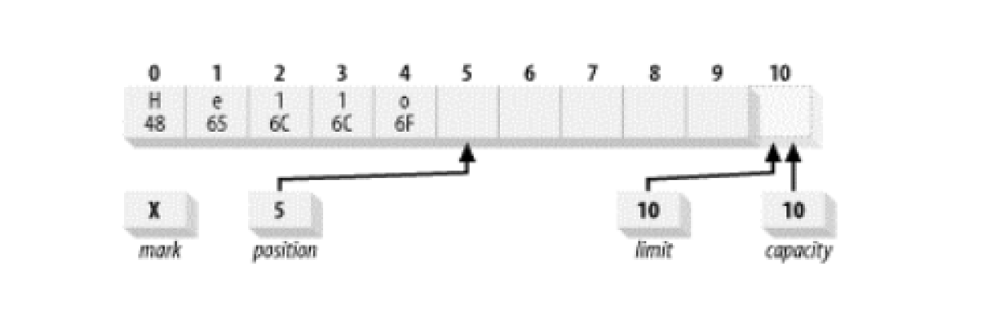
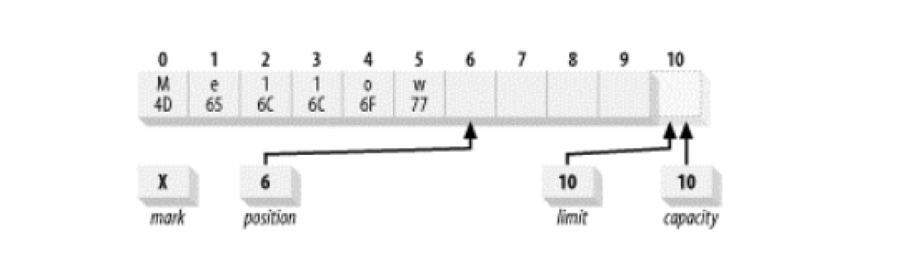
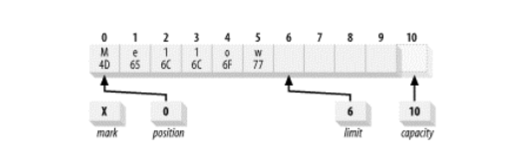
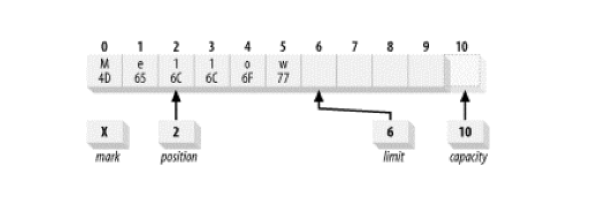
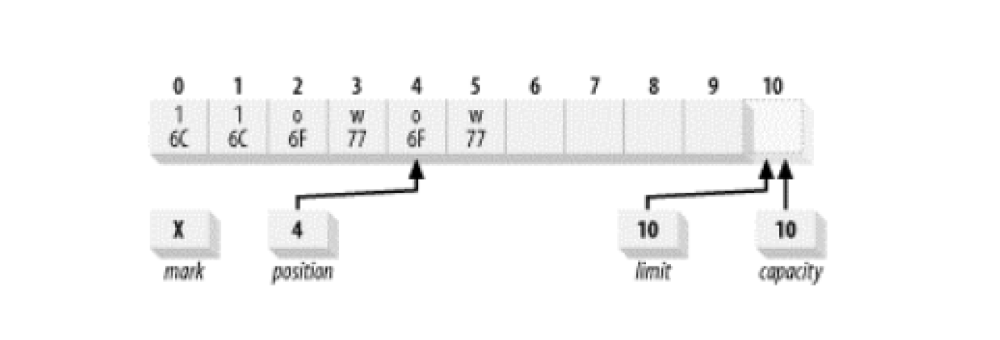
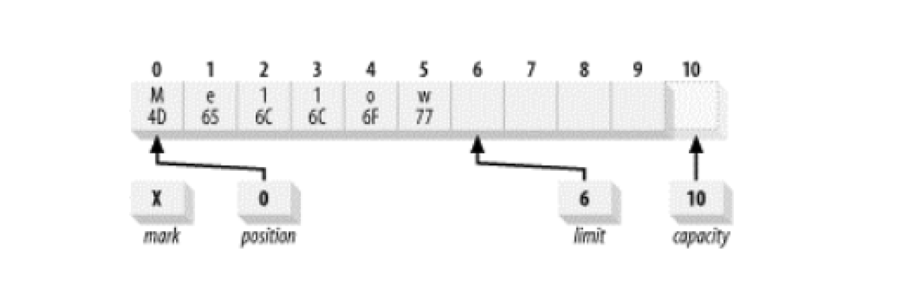
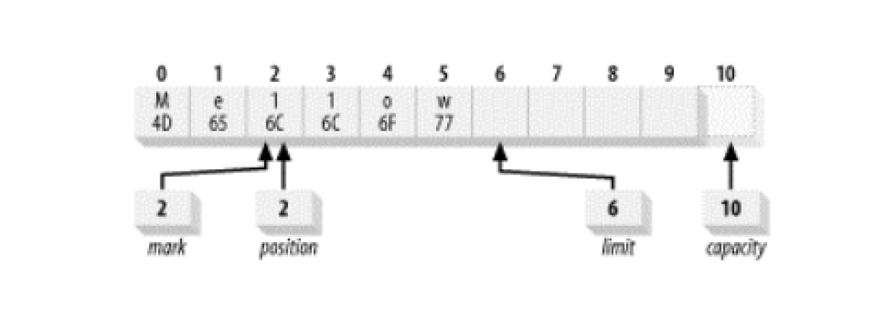

#   缓冲区

Buffer 类是 java.nio 的构造基础。

一个 Buffer 对象是固定数量的数据的容器，其作用是一个存储器，或者分段运输区，在这里数据可被存储并在之后用于检索。

对于每个非布尔原始数据类型都有一个缓冲区类，尽管缓冲区作用于他们存储的原始数据类型，但缓冲区十分倾向于处理字节。非字节缓冲区可以在后台执行从字节或到字节的转换。

缓冲区的工作与通道紧密联系，通道是 I/O 传输发生时通过的入口，而缓冲区是这些数据传输的来源或目标。

对于离开缓冲区的传输，想传递出去的数据被置于一个缓冲区，被传送到通道。对于传回缓冲区的传输，一个通道将数据放置在你所提供的缓冲区中。

-   Buffer 类的家谱



在顶部是通用 Buffer 类。 Buffer 定义所有缓冲区类型共有的操作，无论是他们所包含的数据类型还是可能具有的特定行为。

##  缓冲区基础

概念上，缓冲区是包在一个对象内的基本数据元素数组。

Buffer 类相比一个简单数组的优点是他将关于数据的数据内容和信息包含在一个单一的对象中。Buffer 类以及他专有的子类定义了一个用于处理数据缓冲区的 API。

1.  属性

-   所有的缓冲区都具有四个属性来提供关于其所包含的数据元素的信息：
    -   容量(Capacity)：缓冲区能够容纳的数据元素的最大数量，这一容量在缓冲区创建时被设定，并且永远不能被改变
    -   上界(Limit)：缓冲区的第一个不能被读或写的元素，或者说，缓冲区中现存元素的计数
    -   位置(Position)：下一个要被读或写的元素的索引。位置会自动由相应的 get() 和 put() 函数更新
    -   标记(Mark)：一个备忘位置。调用 mark() 来设定 mark = position，调用 reset() 设定 position = mark。标记在设定前是未定义的

这四个属性之间总是遵循以下关系： 0 <= mark <= position <= limit <= capacity

-   新创建的 ByteBuffer：展示了一个新创建的容量为 10 的 ByteBuffer 逻辑视图



位置被设为 0，而且容量和上界被设为 10，刚好经过缓冲区能够容纳的最后一个字节。

标记最初未定义，容量是固定的，但另外的三个属性可以在使用缓冲区时改变。

2.  缓冲区 API

API

3.  存取

缓冲区管理着固定数目的数据元素，但在任何特定的时刻，可能只对缓冲区中的一部分元素感兴趣。

清空缓冲区之前，可能只使用了缓冲区一部分，这时，需要能够追踪添加到缓冲区内的数据元素的数量，放入下一个元素的位置等等的方法。

位置属性做到这一点，他在调用 put() 时指出了下一个数据元素应该被插入的位置，或者当 get() 被调用时指出下一个元素应从何处检索。

每个 Buffer 子类都有 get() 或 put() 函数，他们所采用的参数类型，以及他们返回的数据类型，都是唯一的。

Get  和 put 可以是相对的或者是绝对的，相对方案是不带有索引参数的韩珊瑚，当相对函数被调用时，位置在返回时前进一。

绝对存取是有索引的函数，不会影响缓冲区的位置属性。

4.  填充

看个示例。

将代表 "Hello" 字符串的 ASCII 码载入一个名为 buffer 的 ByteBuffer 对象中。

执行代码：

```Java
buffer.put((byte)'H').put((byte)'e').put((byte)'l').put((byte)'l').put((byte)'o');
```

-   五次调用 put() 之后的缓冲区



因为存放的是字节而不是字符，每个字符都必须被强制转换为 byte。

在 Java 中，字符在内部以 Unicode 码表示，每个 Unicode 字符占 16 位，示例使用包含 ascii 字符集数值的字节。

如果想在不丢失位置的情况下进行一些更改，可以使用 put() 的绝对方案达到这一的目的，假如想将缓冲区中的内容从 "Hello" 的 ASCII 码更改为 "Mellow"，可以这样实现：

```Java
buffer.put(0,(byte)'M').put((byte)'w');
```

通过进行一次绝对方案的 put 将 0 位置的字节代替为十六进制数值 0x4d，将 0x77 放入当前位置(当前位置不会受到绝对 put() 的影响)的字节，并将位置属性加一，结果如下。

-   修改后的 buffer



5.  翻转

已经写满了缓冲区，现在必须准备将其清空，想把这个缓冲区传递给一个通道，以使内容能被全部写出。

如果通道现在在缓冲区上执行 get()，那么他将从刚刚插入的有用数据之外取出未定义数据。

如果将位置值重新设为 0，通道就会从正确位置开始获取，但是怎样知道何时到达所插入数据末端的呢？这就是上界属性被引入的目的。上界属性指明了缓冲区有效内容的末端，需要将上界属性设置为当前位置，然后将位置重置为 0，代码是这样：

```Java
buffer.limit(buffer.position()).position(0);
```

这种从填充到释放状态的缓冲区翻转是 API 设计者预先设计好了，提供了一个非常便利的函数：

```Java
Buffer.flip();
```

Flip()函数将一个能够继续添加数据元素的填充状态的缓冲区翻转成一个准备读出元数的释放状态。

-   在翻转之后，缓冲区属性值是这样：



Rewind()函数与flip()相似，但不影响上界属性。它只是将位置值设回0。

6.  释放

如果接收到一个在别处被填满的缓冲区，可能需要在检索内容之前将其翻转。

例如，如果一个通道的 read() 操作完成，而想要查看被通道放入缓冲区的数据，那么需要在调用 get() 之前翻转缓冲区。

通道对象在缓冲区上调用 put() 增加数据， put 和 read 可以随意混合使用。

布尔函数 hasRemaining() 会在释放缓冲区时告诉你是否已经达到缓冲区的上界，

```Java
// 一种将数据元素从缓冲区释放到一个数组的方法。。线程安全
for (int i = 0; buffer.hasRemaining( ), i++) {
     myByteArray [i] = buffer.get( ); 
}
```

作为选择，remaining() 函数告知你从当前位置到上界还剩余的元素数目。

```Java
int count = buffer.remaining( ); 

for (int i = 0; i < count, i++) {
     myByteArray [i] = buffer.get( ); 
}
```

一旦缓冲区对象完成填充并释放，就可以被重新使用了。

Clear() 函数将缓冲区重置为空状态，并不改变缓冲区中的任何数据元素，而是仅仅将上界设为容量的值，并把位置设回0，这使得缓冲区可以被重新填入。

7.  压缩

有时，可能只想从缓冲区中释放一部分数据，而不是全部，然后重新填充。

为了实现这一点，未读的数据元数需要下移以使第一个元素索引为0。API 对此提供了一个 compact() 函数，在复制数据时要比使用 get() 和 put() 函数高效得多。

-   被部分释放的缓冲区



这样操作：

```Java
buffer.compact();
```

-   压缩后的 buffer



数据元素 2-5 被复制到 0-3 位置，位置 4 和 5 不受影响。

缓冲区现在被定为在缓冲区中最后一个 "存活" 元素后插入数据的位置。

上界属性被设置为容量的值，因此缓冲区可以被再次填满。

调用 compact() 的作用是丢弃已经释放的数据，保留未释放的数据，并使缓冲区对重新填充容量准备就绪。

8.  标记

标记，使缓冲区能够记住一个位置并在之后将其返回。

缓冲区的标记在 mark() 函数被调用之前是未定义的，标记值 == 当前位置，reset() 函数，标记值 ==  位置。

-   没有被标记的缓冲区



执行代码：

```Java
buffer.position(2).mark().position(4);
```

-   被标记的缓冲区


如果这个缓冲区现在被传递给一个通道，两个字节("ow")将会被发送，而位置会前进到 6。

如果此时调用 reset()，位置将会被设为标记，再次将缓冲区传递给通道将导致四个字节("llow")被发送。

-   一个缓冲区位置被重设为标记



9.  比较

有时比较两个缓冲区所包含的数据是很有必要的，可以使用 equals()、compareTo() 函数比较

-   两个缓冲区被认为相等的充要条件是
    -   两个对象类型相同
    -   两个对象都剩余同样数量的元素，从位置到上界的数目必须相同
    -   每个缓冲区中应被 Get() 函数返回的剩余数据元数序列必须一致

10. 批量移动

缓冲区的设计目标就是为了能够高效传输数据， buffer API 提供了向缓冲区内外批量移动数据元素的函数。

有两种形式的 get() 可供从缓冲区到数组进行的数据复制使用，比较高效，因为实现能够利用本地代码或其他的优化来移动数据。

批量移动总是具有指定的长度。

```Java
// 缓冲区 --> 数组
char [] bigArray = new char [1000]; // 接受数据的数组
int length = buffer.remaining( ); // 缓冲区容量
buffer.get (bigArrray, 0, length); // 数据放在数组的 0--length 之间

// 数组 --> 缓冲区
buffer.put(myArray); // 等于 buffer.put(myArray,0,myArray.length); // 把数组 0--length 之间的数据移动到缓冲区
```

##  创建缓冲区

Buffer 类及子类都是抽象类，不能直接实例化，但是都包含静态工厂方法用来创建相应类的新实例。

新的缓冲区是由分配或包装操作创建的。分配操作创建一个缓冲区对象并分配一个私有的空间来存储容量大小的数据元素。包装操作创建一个缓冲区对象但是不分配任何空间来存储数据元素。他使用你提供的数组作为存储空间来存储缓冲区中的数据元素。

-   分配一个容量为 100 个 char 变量的 Charbuffer

``` Java
// 缓冲区通常是间接的
// 隐含从 堆空间 中分配了一个 char 型数组作为备份存储器来存储 100 个 char 变量
CharBuffer charBuffer = CharBuffer.allocate (100);
```

-   使用数组用作缓冲区的备份存储器

```Java
// 缓冲区通常是间接的
// 构造了一个新的缓冲区对象，但数据元素会存在于数组中，调用 put()函数、对数组改动都会相互可见
char [] myArray = new char [100]; 
CharBuffer charbuffer = CharBuffer.wrap (myArray);
```

##  复制缓冲区


##  字节缓冲区

1.  字节顺序

2.  直接缓冲区

3.  视图缓冲区

4.  数据元素视图

5.  存取无符号数据

6.  内存映射缓冲区


##  总结


