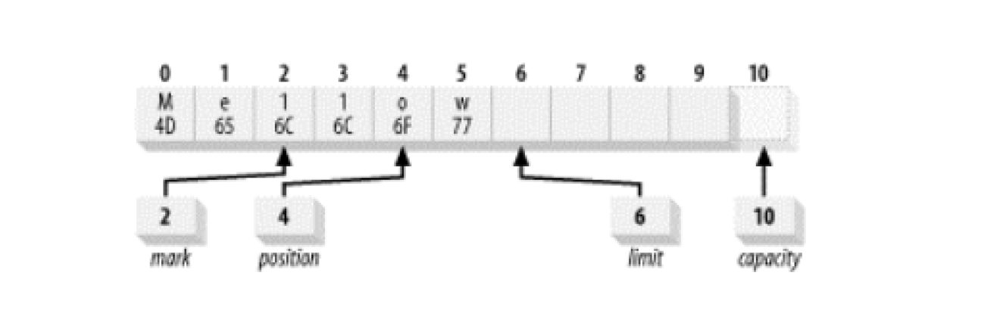
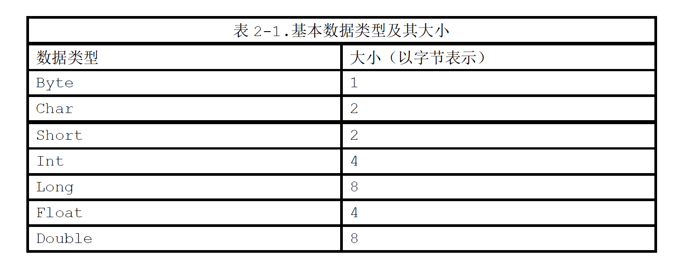

#   缓冲区

Buffer 类是 java.nio 的构造基础。

一个 Buffer 对象是固定数量的数据的容器，其作用是一个存储器，或者分段运输区，在这里数据可被存储并在之后用于检索。

对于每个非布尔原始数据类型都有一个缓冲区类，尽管缓冲区作用于他们存储的原始数据类型，但缓冲区十分倾向于处理字节。非字节缓冲区可以在后台执行从字节或到字节的转换。

缓冲区的工作与通道紧密联系，通道是 I/O 传输发生时通过的入口，而缓冲区是这些数据传输的来源或目标。

对于离开缓冲区的传输，想传递出去的数据被置于一个缓冲区，被传送到通道。对于传回缓冲区的传输，一个通道将数据放置在你所提供的缓冲区中。

-   Buffer 类的家谱


在顶部是通用 Buffer 类。 Buffer 定义所有缓冲区类型共有的操作，无论是他们所包含的数据类型还是可能具有的特定行为。

##  缓冲区基础

概念上，缓冲区是包在一个对象内的基本数据元素数组。

Buffer 类相比一个简单数组的优点是他将关于数据的数据内容和信息包含在一个单一的对象中。Buffer 类以及他专有的子类定义了一个用于处理数据缓冲区的 API。

1.  属性

-   所有的缓冲区都具有四个属性来提供关于其所包含的数据元素的信息：
    -   容量(Capacity)：缓冲区能够容纳的数据元素的最大数量，这一容量在缓冲区创建时被设定，并且永远不能被改变
    -   上界(Limit)：缓冲区的第一个不能被读或写的元素，或者说，缓冲区中现存元素的计数
    -   位置(Position)：下一个要被读或写的元素的索引。位置会自动由相应的 get() 和 put() 函数更新
    -   标记(Mark)：一个备忘位置。调用 mark() 来设定 mark = position，调用 reset() 设定 position = mark。标记在设定前是未定义的

这四个属性之间总是遵循以下关系： 0 <= mark <= position <= limit <= capacity

-   新创建的 ByteBuffer：展示了一个新创建的容量为 10 的 ByteBuffer 逻辑视图


位置被设为 0，而且容量和上界被设为 10，刚好经过缓冲区能够容纳的最后一个字节。

标记最初未定义，容量是固定的，但另外的三个属性可以在使用缓冲区时改变。

2.  缓冲区 API

API

3.  存取

缓冲区管理着固定数目的数据元素，但在任何特定的时刻，可能只对缓冲区中的一部分元素感兴趣。

清空缓冲区之前，可能只使用了缓冲区一部分，这时，需要能够追踪添加到缓冲区内的数据元素的数量，放入下一个元素的位置等等的方法。

位置属性做到这一点，他在调用 put() 时指出了下一个数据元素应该被插入的位置，或者当 get() 被调用时指出下一个元素应从何处检索。

每个 Buffer 子类都有 get() 或 put() 函数，他们所采用的参数类型，以及他们返回的数据类型，都是唯一的。

Get  和 put 可以是相对的或者是绝对的，相对方案是不带有索引参数的韩珊瑚，当相对函数被调用时，位置在返回时前进一。

绝对存取是有索引的函数，不会影响缓冲区的位置属性。

4.  填充

看个示例。

将代表 "Hello" 字符串的 ASCII 码载入一个名为 buffer 的 ByteBuffer 对象中。

执行代码：

```Java
buffer.put((byte)'H').put((byte)'e').put((byte)'l').put((byte)'l').put((byte)'o');
```

-   五次调用 put() 之后的缓冲区


因为存放的是字节而不是字符，每个字符都必须被强制转换为 byte。

在 Java 中，字符在内部以 Unicode 码表示，每个 Unicode 字符占 16 位，示例使用包含 ascii 字符集数值的字节。

如果想在不丢失位置的情况下进行一些更改，可以使用 put() 的绝对方案达到这一的目的，假如想将缓冲区中的内容从 "Hello" 的 ASCII 码更改为 "Mellow"，可以这样实现：

```Java
buffer.put(0,(byte)'M').put((byte)'w');
```

通过进行一次绝对方案的 put 将 0 位置的字节代替为十六进制数值 0x4d，将 0x77 放入当前位置(当前位置不会受到绝对 put() 的影响)的字节，并将位置属性加一，结果如下。

-   修改后的 buffer


5.  翻转

已经写满了缓冲区，现在必须准备将其清空，想把这个缓冲区传递给一个通道，以使内容能被全部写出。

如果通道现在在缓冲区上执行 get()，那么他将从刚刚插入的有用数据之外取出未定义数据。

如果将位置值重新设为 0，通道就会从正确位置开始获取，但是怎样知道何时到达所插入数据末端的呢？这就是上界属性被引入的目的。上界属性指明了缓冲区有效内容的末端，需要将上界属性设置为当前位置，然后将位置重置为 0，代码是这样：

```Java
buffer.limit(buffer.position()).position(0);
```

这种从填充到释放状态的缓冲区翻转是 API 设计者预先设计好了，提供了一个非常便利的函数：

```Java
Buffer.flip();
```

Flip()函数将一个能够继续添加数据元素的填充状态的缓冲区翻转成一个准备读出元数的释放状态。

-   在翻转之后，缓冲区属性值是这样：


Rewind()函数与flip()相似，但不影响上界属性。它只是将位置值设回0。

6.  释放

如果接收到一个在别处被填满的缓冲区，可能需要在检索内容之前将其翻转。

例如，如果一个通道的 read() 操作完成，而想要查看被通道放入缓冲区的数据，那么需要在调用 get() 之前翻转缓冲区。

通道对象在缓冲区上调用 put() 增加数据， put 和 read 可以随意混合使用。

布尔函数 hasRemaining() 会在释放缓冲区时告诉你是否已经达到缓冲区的上界，

```Java
// 一种将数据元素从缓冲区释放到一个数组的方法。。线程安全
for (int i = 0; buffer.hasRemaining( ), i++) {
     myByteArray [i] = buffer.get( ); 
}
```

作为选择，remaining() 函数告知你从当前位置到上界还剩余的元素数目。

```Java
int count = buffer.remaining( ); 

for (int i = 0; i < count, i++) {
     myByteArray [i] = buffer.get( ); 
}
```

一旦缓冲区对象完成填充并释放，就可以被重新使用了。

Clear() 函数将缓冲区重置为空状态，并不改变缓冲区中的任何数据元素，而是仅仅将上界设为容量的值，并把位置设回0，这使得缓冲区可以被重新填入。

7.  压缩

有时，可能只想从缓冲区中释放一部分数据，而不是全部，然后重新填充。

为了实现这一点，未读的数据元数需要下移以使第一个元素索引为0。API 对此提供了一个 compact() 函数，在复制数据时要比使用 get() 和 put() 函数高效得多。

-   被部分释放的缓冲区


这样操作：

```Java
buffer.compact();
```

-   压缩后的 buffer


数据元素 2-5 被复制到 0-3 位置，位置 4 和 5 不受影响。

缓冲区现在被定为在缓冲区中最后一个 "存活" 元素后插入数据的位置。

上界属性被设置为容量的值，因此缓冲区可以被再次填满。

调用 compact() 的作用是丢弃已经释放的数据，保留未释放的数据，并使缓冲区对重新填充容量准备就绪。

8.  标记

标记，使缓冲区能够记住一个位置并在之后将其返回。

缓冲区的标记在 mark() 函数被调用之前是未定义的，标记值 == 当前位置，reset() 函数，标记值 ==  位置。

-   没有被标记的缓冲区


执行代码：

```Java
buffer.position(2).mark().position(4);
```

-   被标记的缓冲区



如果这个缓冲区现在被传递给一个通道，两个字节("ow")将会被发送，而位置会前进到 6。

如果此时调用 reset()，位置将会被设为标记，再次将缓冲区传递给通道将导致四个字节("llow")被发送。

-   一个缓冲区位置被重设为标记


9.  比较

有时比较两个缓冲区所包含的数据是很有必要的，可以使用 equals()、compareTo() 函数比较

-   两个缓冲区被认为相等的充要条件是
    -   两个对象类型相同
    -   两个对象都剩余同样数量的元素，从位置到上界的数目必须相同
    -   每个缓冲区中应被 Get() 函数返回的剩余数据元数序列必须一致

10. 批量移动

缓冲区的设计目标就是为了能够高效传输数据， buffer API 提供了向缓冲区内外批量移动数据元素的函数。

有两种形式的 get() 可供从缓冲区到数组进行的数据复制使用，比较高效，因为实现能够利用本地代码或其他的优化来移动数据。

批量移动总是具有指定的长度。

```Java
// 缓冲区 --> 数组
char [] bigArray = new char [1000]; // 接受数据的数组
int length = buffer.remaining( ); // 缓冲区容量
buffer.get (bigArrray, 0, length); // 数据放在数组的 0--length 之间

// 数组 --> 缓冲区
buffer.put(myArray); // 等于 buffer.put(myArray,0,myArray.length); // 把数组 0--length 之间的数据移动到缓冲区
```

##  创建缓冲区

Buffer 类及子类都是抽象类，不能直接实例化，但是都包含静态工厂方法用来创建相应类的新实例。

新的缓冲区是由分配或包装操作创建的。分配操作创建一个缓冲区对象并分配一个私有的空间来存储容量大小的数据元素。包装操作创建一个缓冲区对象但是不分配任何空间来存储数据元素。他使用你提供的数组作为存储空间来存储缓冲区中的数据元素。

-   分配一个容量为 100 个 char 变量的 Charbuffer

``` Java
// 缓冲区通常是间接的
// 隐含从 堆空间 中分配了一个 char 型数组作为备份存储器来存储 100 个 char 变量
CharBuffer charBuffer = CharBuffer.allocate (100);
```

-   使用数组用作缓冲区的备份存储器

```Java
// 缓冲区通常是间接的
// 构造了一个新的缓冲区对象，但数据元素会存在于数组中，调用 put()函数、对数组改动都会相互可见
char [] myArray = new char [100]; 
CharBuffer charbuffer = CharBuffer.wrap (myArray);
```

##  复制缓冲区

可以创建描述从外部存储到数组中的数据元素的缓冲区对象，也能管理其他缓冲区中的外部数据。

当一个管理其他缓冲器所包含的数据元素的缓冲器被创建时，这个缓冲器被称为视图缓冲器。大多数的视图缓冲器都是 ByteBuffer 的视图。

视图存储器总是通过调用已存在的存储器实例中的函数来创建。使用已存在的存储器实例中的工厂方法意味着视图对象为原始存储器的内部实现细节私有。

数据元素可以直接存取，无论他们是存储在数组中还是以一些其他的方式，而不需经过原始缓冲区对象的 get()/put() API。

-   Duplicate()/asReadOnlyBuffer()/slice() 创建一个与原始缓冲区相似的新缓冲区

两个缓冲区共享数据元素，拥有同样的容量，但每个缓冲区拥有各自的位置，上界和标记属性。

对一个缓冲区内的数据元素所做的改变会反映在另外一个缓冲区上，这一副本缓冲区具有与原始缓冲区同样的数据视图。

如果原始的缓冲区为只读，或者为直接缓冲区，新的缓冲区将继承这些属性。

复制一个缓冲区会创建一个新的 Buffer 对象，但并不复制数据，原始缓冲区和副本都会操作同样的数据元素。

##  字节缓冲区

所有的基本数据类型都有相应的缓冲区类(布尔型除外)，但字节缓冲区有自己的独特之处。

字节是操作系统及其 I/O 设备使用的基本数据类型。当在 JVM 和 操作系统间传递数据时，将其他的数据类型拆分成构成他们的字节是十分必要的。

1.  字节顺序

非字节类型的基本类型，除了布尔型都是由组合在一起的几个字节组成的。

-   这些数据类型及其大小



每个基本数据类型都是以连续字节序列的形式存储在内存中。

尽管字节大小已经被确定，但字节顺序问题一直没有被广泛认同。字节顺序通常取决于硬件设计，Intel 处理器使用小端字节顺序涉及，摩托摩拉的 CPU 系列、SUN 的 Sparc 工作站，以及 PowerPC 的 CPU 架构都采用大端字节顺序。

多字节数值被存储在内存中的方式一般被称为 endian-ness(字节顺序)。

如果数字数值的最高字节 -- big end(大端)，位于低位地址，那么系统就是大端字节顺序

-   大端字节顺序


如果最低字节最先保存在内存中，那么小端字节顺序

-   小端字节顺序


字节顺序的问题甚至胜过 CPU 硬件设计，当 Internet 的设计者为互联各种类型的计算机而设计网际协议(IP)时，规定了 IP协议使用大端的网络字节顺序概念。所有在IP分组报文的协议部分中使用的多字节数值必须先在本地主机字节顺序和通用的网络字节顺序之间进行转换。

在 java.nio 中，字节顺序由 ByteOrder 类封装。

ByteOrder 类定义了决定从缓冲区中存储或检索多字节数值时使用那一字节顺序的常量。他定义了以其本身实例预初始化的两个 public 区域。

如果要知道 JVM 运行的硬件平台的固有字节顺序，调用静态类函数 nativeOrder()，他将返回两个已确定常量中的一个，调用 toString() 将返回一个不包含两个文字字符串 BIG_ENDIAN 或 LITTLE_ENDIAN 之一的 String。

对于除了 ByteOrder 之外的其他缓冲区类，字节顺序是一个只读属性，并且可能根据缓冲区的建立方式而采用不同的值。

除了 ByteBuffer ，其他通过分配或包装一个数组所创建的缓冲区将从 order() 返回与 ByteOrder.nativeOrder() 相同的数值。

ByteBuffer 类有所不同，默认字节顺序总是 ByteBuffer.BIG_ENDIAN，无论系统的固有字节顺序是什么。

Java 默认字节顺序是大端字节顺序，这允许类文件等以及串行化的对象可以在任何 JMV 中工作。

ByteBuffer 对象像其他基本数据类型一样，具有大量便利的函数用于获取和存放缓冲区内容，这些函数对字节进行编码或解码的方式取决于 ByteBuffer 当前字节顺序的设定。

2.  直接缓冲区

字节缓冲区跟其他缓冲区类型最明显的不同在于，他们可以成为通道所执行的 I/O 的源头和或目标，并且通道也只接收 ByteBuffer 作为参数。

I/O 操作是在操作系统的内存区域中进行，这些内存区域，就操作系统方面来说，是相连的字节序列，毫无疑问，只有字节缓冲区有资格参与 I/O 操作。

操作系统进行 I/O 操作的内存必须是连续的字节序列，在 JVM 中，字节数组可能不会在内存中连续存储，或者无用存储单元收集可能随时对其进行移动，在 Java 中，数组是对象，而数据存储在对象中的方式在不同的 JVM 实现中都各有不同。

直接缓冲区被用于与通道和固有 I/O 例程交互，他们通过使用固有代码来告知操作系统直接释放或填充内存区域，对用于通道直接或原始存取的内存区域的字节元数的存储尽了最大的努力。

直接字节缓冲区通常是 I/O 操作最好的选择，在设计方面，他们支持 JVM 可用的最高效 I/O 机制。

非直接字节缓冲区可以被传递给通道，但是这样可能导致性能损耗。通常非直接缓冲不可能成为一个本地 I/O 操作的目标。

-   如果向一个通道传递一个非直接 ByteBuffer 对象用于写入，通道肯能会在每次调用中隐含的进行下面的操作：
    -   创建一个临时的直接 ByteBuffer 对象
    -   将非直接缓冲区的内容复制到临时缓冲中
    -   使用临时缓冲区执行低层次 I/O 操作
    -   临时缓冲区对象离开作用域，并最终成为被回收的无用数据

直接缓冲区是 I/O 的最佳选择，但可能比创建非直接缓冲区要花费更高的成本。直接缓冲区使用的内存是通过调用本地操作系统方面的代码分配的，绕过了标准 JVM 堆栈。建立和销毁直接缓冲区会明显比具有堆栈的缓冲区更加破费，这取决于主操作系统以及 JVM 实现。直接缓冲区的内存区域不受垃圾回收机制管理，因为他们位于标准 JVM 堆栈之外。

直接ByteBuffer是通过调用具有所需容量的ByteBuffer.allocateDirect()函数产生的，就像我们之前所涉及的allocate()函数一样。

3.  视图缓冲区

I/O 基本上可以归纳成字节数据的四处传递。一旦数据到达 ByteBuffer ，就需要查看以决定怎么做或者在将他发送出去之前对他进行一些操作。 ByteBuffer 类提供了丰富的 API 来创建视图缓冲区。

视图缓冲区通过已存在的缓冲区对象实例的工厂方法来创建。这种视图对象维护他自己的属性、容量、位置、上界和标记，但是和原来的缓冲区共享数据。

ByteBuffer 类允许创建视图来将 byte 型缓冲区字节数据映射为其他的原始数据类型。

无论何时一个视图缓冲区存取一个 ByteBuffer 的基础字节，这些字节都会根据这个视图缓冲区的字节顺序设定被包装成一个数据元素。当一个视图缓冲区被创建时，视图创建的同时他也继承了基础 ByteBuffer 对象的字节顺序设定。这个视图的字节顺序不能再被修改。

4.  数据元素视图

ByteBuffer 类提供了一个不太重要的机制来以多字节数据类型的形式存取 byte 数据组，ByteBuffer 类为每一种原始数据类型提供了存取的和转化的方法。

这些函数从当前位置开始存取 ByteBuffer 的字节数据，就好像一个数据元数被存储在那里一样，根据这个缓冲区的当前的有效的字节顺序，这些字节数据会被排成或打乱成需要的原始数据类型。

5.  存取无符号数据

Java 编程语言对无符号数值并没有提供直接的支持(除了 char 类型)，但是在许多情况下需要将无符号的信息转换成数据流或文件，或者包装数据来创建文件头或其他带有无符号数据区域结构化的信息。

获取/存放无符号值的工具程序

6.  内存映射缓冲区

映射缓冲区是带有存储在文件，通过内存映射来存取数据元素的字节缓冲区。

映射缓冲区通常是直接存取内存的，只能通过 FileChannel 类创建。

映射缓冲区的用法和直接缓冲区类似，但是 MappedByteBuffer 对象可以处理独立于文件存取形式的许多特定字符。

##  总结

-   缓冲区属性

缓冲区属性描述了缓冲区的当前状态，影响了缓冲区的表现。

-   创建缓冲区

创建缓冲区的方式由缓冲区的使用方式和使用点决定

-   字节缓冲区

只有字节缓冲区能够与通道共同使用，并且字节缓冲区提供了适用于其他数据类型的视图。

----
