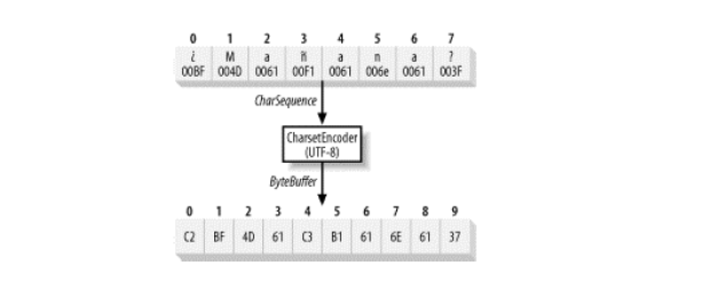

#   字符集

在 Java 平台上，需要处理多种语言以及组成这些语言的多个字符，Java 使用内在的 Unicode 来表示字符，Unicode 的固有支持大大的简化了字符数据处理，但决不是自动的处理字符。

##  字符集基础

先来定义一些与字符集和字符代码转换相关的术语。

-   Character set(字符集)

字符的集合，也就是，带有特殊语义的符号。

字母 "A" 是一个字符， "%" 也是一个字符，没有内在数字价值，在电脑产生前的很长一段时间内，符号就已经存在了。

-   Coded character set(编码字符集)

一个数值赋给一个字符的集合，把代码赋值给字符，这样他们就可以用特定的字符编码集表达数字的结果。

字符集映射通常是由标准组织确定的，例如：USASCII、Unicode

-   Character-encoding scheme（字符编码方案）

编码字符集成员到 8 位字节(8 bit 字节)的映射。

编码方案定义了如何把字符编码的序列表达为字节序列。

通常字符数据编码是用于网络传输或文件存储，编码方案不是字符集，他是映射，但是因为他们之间的紧密联系，大部分编码都与一个独立的字符集相关联。例如：UTF-8，仅用来编码 Unicode 字符集。

-   Charset（字符集）

他是编码字符集和字符编码方案的集合。

-   字符编码成 UTF-8

由java.nio.charset包组成的类满足了这个需求，java.nio.charset.spi包提供服务器供给接口（SPI），使编码器和解码器可以根据需要选择插入。

##  字符集

每个 JVM 实现都需要支持标准字符集，可以随意的支持额外的字符集，但是必须提供这个最大集。

尽管所有的 JVM 必须至少支持下列字符集，但是没有指定默认字符集，也没有要求是这些标准字符集之一。

在 JVM 启动时确定默认值。取决于潜在的操作系统环境、区域设置、JVM配置等等，最安全的办法是明确一个字符集。

字符集名称不区分大小写。

1.  字符集类

2.  字符集比较

3.  字符集编码器

4.  字符集解码器

##  字符集服务器供应者接口

1.  创建自定义字符集

2.  供给你的自定义字符集

##  总结

