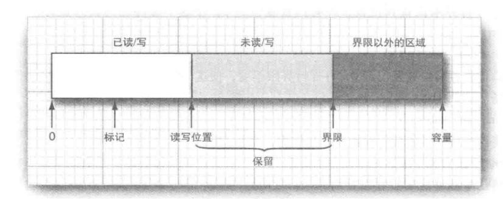

#   内存映射文件

>   这就是传说中的堆外内存

大多数操作系统都可以利用虚拟内存实现来将一个文件或者文件的一部分"映射"到内存中，然后，这个文件就可以当作是内存数组一样的访问，这比传统的文件操作要快得多。

##  内存映射文件的性能

对于中等尺寸文件的顺序读入没有必要使用内存映射。

使用内存映射的步骤：

-   从文件中获得一个通道(channel)

通道是用于磁盘文件的一种抽象，可以访问诸如内存映射、文件加锁机制以及文件间快速数据传递等操作系统特性。

```Java
FileChannel channel = FileChannel.open(path, options);
```

通过调用 FileChannel 类的 map 方法从这个通道中获得一个 ByteBuffer。

可以指定想要映射的文件区域与映射模式，支持的模式有三种：只读、可写(共享/私有)。

缓冲区支持顺序和随机数据访问，他有一个可以通过 get 和 put 操作来移动的位置。


##  缓冲区数据结构

>   Buffer对象上的操作

在使用内存映射时，创建了单一的缓冲区横块整个文件或感兴趣的文件区域。

缓存区是由具有相同类型的数值构成的数组，除了布尔类型之外的基本数据类型都有对应的子类。

最常用的是 ByteBuffer 和 CharBuffer。

-   每个缓冲区都具有：
    -   一个容量，他永远不能改变
    -   一个读写位置，下一个值将在此进行读写
    -   一个界限，超过他进行读写是没有意义的
    -   一个可选标记，用于重复一个读入或写出操作



这些值满足的条件： 0  <= 标记 <= 位置 <= 界限 <= 容量 

使用缓存区的主要目的是执行 "写，然后读入"循环。

##  文件加锁机制

有时会有多个程序需要同时修改同一个文件的情形，这需要以某种方式进行通信，文件锁可以解决这个问题，他可以控制对文件或文件中某个范围的字节的访问。

要锁定一个文件，可以调用 FileChannel 类的 lock 或 tryLock 方法：

```Java
FileChannel channel = FileChannel.open(path);
FileLock lock = channel.lock();
// FileLock lock = channel.tryLock()
```

第一个调用会阻塞直至可获得锁，而第二个调用将立即返回，要么返回锁，要么返回 null。

这个文件将保持锁定状态，直至这个通道关闭，或在在锁上调用了 release 方法。

文件加锁机制是依赖于操作系统的。

----