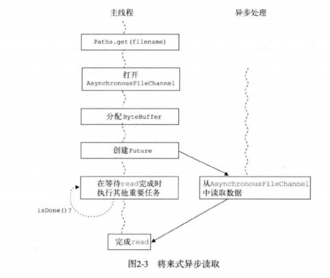
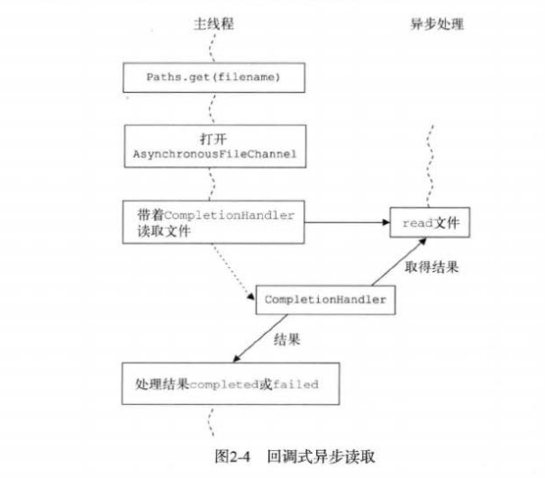

#   异步I/O操作

>   多个后台线程读写文件、套接字和通道中的数据

NIO.2 另一个新特性是异步能力，这种能力对套接字和文件I/O 都适用。

异步 I/O 其实只是一种在读写操作结束前允许进行其他操作的I/O处理。

三个新异步通道：

-   AsynchronousFileChannel --- 用于文件 I/O
-   AsynchronousSocketChannel --- 用户套接字I/O，支持超时
-   AsynchronousServerSocketChannel --- 用于套接字接受异步连接

##  将来式

当希望由主控线程发起I/O操作并轮询等待结果时，一般都会使用将来式异步处理，即 java.util.concurrent.Future 接口。

Future 接口用来保存异步操作的处理结果，这意味着当前线程不会因为较慢的I/O操作而停滞，相反，有一个单独的线程发起I/O操作，并在操作完成时返回结果，与此同时，主线程可以继续执行其他需要完成的任务。



```Java
// 异步I/O--将来式
    try {
      Path file = Paths.get("/usr/karianna/foobar.txt");

     // 异步打开文件
      AsynchronousFileChannel channel = AsynchronousFileChannel.open(file);

     // 读取 100000字节
      ByteBuffer buffer = ByteBuffer.allocate(100_000);
      Future<Integer> result = channel.read(buffer, 0);

      while (!result.isDone()) {
          // 其他什么事情
        ProfitCalculator.calculateTax();
      }

        // 获取结果
      Integer bytesRead = result.get();
      System.out.println("Bytes read [" + bytesRead + "]");

    } catch (IOException | ExecutionException | InterruptedException e) {
      System.out.println(e.getMessage());
    }

```
##  回调式

在异步事件刚一成功或失败并需要马上采取行动时，一般会用回调式。

其基本思想是主线程会派一个侦查员 CompletionHandler 到独立的线程中执行I/O操作，这个侦查员将带着I/O 操作的结果返回到主线程中，这个结果会触发他自己的 completed 或 faild 方法。

在异步I/O活动结束后，接口 java.nio.channels.CompletionHandler<V,A> 会被调用，其中 V 是结果类型，A 是提供结果的附着对象。此时必须已经有了该接口的 completed(V,A) 和 failed(V,A) 方法的实现，才能知道在异步I/O 操作成功完成或因某些原因失败时该如何处理。



```Java
// 异步I/O -- 回调式
    try {
      Path file = Paths.get("/usr/karianna/foobar.txt");

      // 以异步方式打开文件
      AsynchronousFileChannel channel = AsynchronousFileChannel.open(file);

      ByteBuffer buffer = ByteBuffer.allocate(100_000);

     // 从通道中读取数据
      channel.read(buffer, 0, buffer,
          new CompletionHandler<Integer, ByteBuffer>() {

             // 读取成功时
            public void completed(Integer result, ByteBuffer attachment) {
              System.out.println("Bytes read [" + result + "]");
            }

            // 读取失败时
            public void failed(Throwable exception, ByteBuffer attachment) {
              System.out.println(exception.getMessage());
            }
          });
    } catch (IOException e) {
      System.out.println(e.getMessage());
    }

```

上面两个例子都是基于文件的，但是将来式和回调式异步访问也使用于 AsynchronousSocketChannel 和 AsynchronousServerSocketChannel 。

----