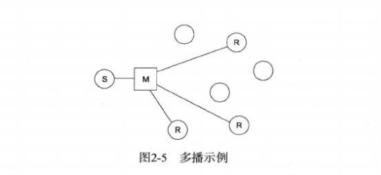

#   Socket 和 Channel 的整合

应用软件对网络接入的需求比以往任何时后都要迫切。

##  NetworkChannel

>   代表一个连接到网络套接字通道的映射，定义了一组使用的方法，比如查看及设置通道上可用的套接字选项等。

```Java
// NetworkChannel 选项
    SelectorProvider provider = SelectorProvider.provider();
    try {

        // 将 NetworkChannel 绑定到 3080 上
      NetworkChannel socketChannel = provider.openSocketChannel();
      SocketAddress address = new InetSocketAddress(3080);
      socketChannel = socketChannel.bind(address);

     // 检查套接字选项
      Set<SocketOption<?>> socketOptions = socketChannel.supportedOptions();

      System.out.println(socketOptions.toString());

      // 设置套接字的 ToS(服务条款)选项
      socketChannel.setOption(StandardSocketOptions.IP_TOS, 3);
      Boolean keepAlive = socketChannel.getOption(StandardSocketOptions.SO_KEEPALIVE);
    } catch (IOException e) {
      System.out.println(e.getMessage());
    }

```

##  MulticastChannel

>   代表一对多的网络通讯，通常用来指代IP多播

像 Bit 这样的对等网络程序一般都具备多播的功能。

术语多播(或组播)表示一对多的网络通讯，通常用来值代 IP多播。将一个包发送到一个组播地址，然后网络对该包进行复制，分发给所有接收端(注册到组播地址中)。



为了让新来的 NetworkChannel 加入多播组，Java 7 提供了一个新接口 java.nio.channels.MulticastChannel 及其默认实现类 DatagramChannel。

```Java
// NetworkChannel 选项
    try {
    
        // 选择网络接口
      NetworkInterface networkInterface = NetworkInterface.getByName("net1");

        // 打开 DatagramChannel
      DatagramChannel dc = DatagramChannel.open(StandardProtocolFamily.INET);

        // 将通道设置为多播
      dc.setOption(StandardSocketOptions.SO_REUSEADDR, true);
      dc.bind(new InetSocketAddress(8080));
      dc.setOption(StandardSocketOptions.IP_MULTICAST_IF, networkInterface);

        // 加入多播组
      InetAddress group = InetAddress.getByName("180.90.4.12");
      MembershipKey key = dc.join(group, networkInterface);
    } catch (IOException e) {
      System.out.println(e.getMessage());
    }

```

----