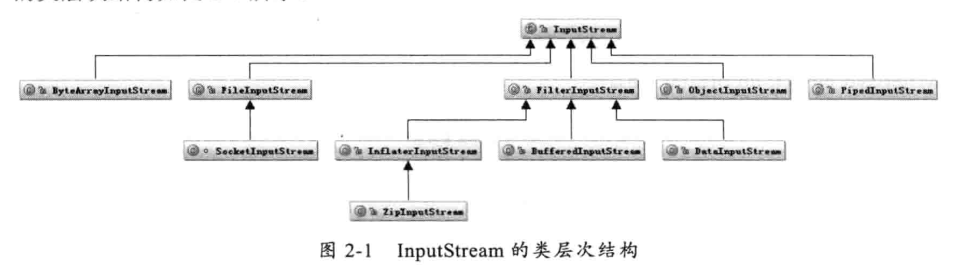
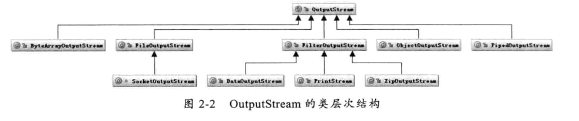
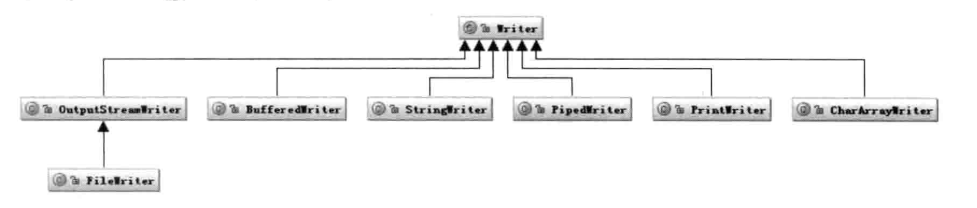
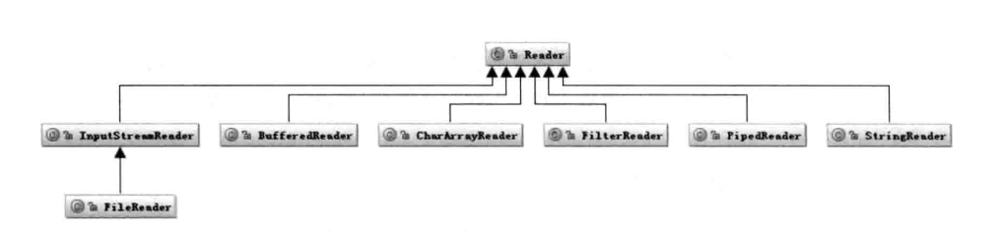
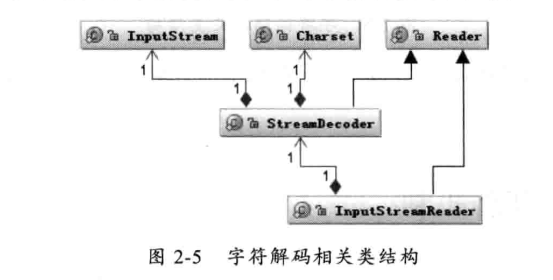
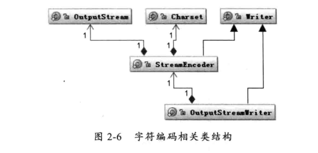

#   Java 的 I/O 类库的基本架构

I/O 问题是整个人机交互的核心问题，也是机器获取和交换信息的主要渠道。

Java 在I/O上一直在做持续的优化，如从 1.4 版开始引入了 NIO，提升了 I/O 的性能。

Java 的 I/O 操作类在包 java.io 下，大概有将近 80 个类，大概分为4组：

-   基于字节操作的 I/O 接口：InputStream 和 OutputStream
-   基于字符操作的 I/O 接口：Writer 和 Reader
-   基于磁盘操作的 I/O 接口：File
-   基于网络操作的 I/O 接口：Socket

前两组主要是传输数据的数据格式，后两组主要是传输数据的方式。

I/O 只是人与机器或在机器之间交互的手段，更关注的是如何提高他的运行效率。

##  基于字节的 I/O 操作接口

基于字节的 I/O 操作接口输入和输出分别是 InputStream 和 OutputStream 。

InputStream 的类层次结构是这样：



OutputStream 的类层次结构是这样：



重点：

-   操作数据的方式是可以组合使用
-   必须要指定流最终写到什么地方，如磁盘或网络

写网络实际上也是写文件，只是写网络还要进一步处理，就是让底层操作系统再将数据传送到其他地方而不是本地磁盘。

##  基于字符的 I/O 操作接口

不管是磁盘还是网络传输，最小的存储单元都是字节，而不是字符，所以 I/O 操作的都是字节而不是字符。

但是，在程序中通常操作的数据都是字符形式的，为了操作方便就自然提供了一个直接写字符的 I/O 接口。

从字符到字节必须要经过编码转换，而这个编码又非常耗时，还会乱码。

写字符 I/O 接口的类：



读字符 I/O 接口的类：



##  字节与字符的转化接口

数据持久化或网络传输都是以字节进行的，所以必须要有从字符到字节或从字节到字符的转化。

从字符到字节需要转化，其中读的转化过程：



InputStreamReader 类是从字节到字符的转化桥梁，从 InputStream 到 Reader 的过程要指定编码字符集。

StreamDecoder 正是完成从字节到字符的解码的实现类：

```Java
try {
    StringBuffer str = new StringBuffer();
    char[] buf = new char[1024];
    FileReader f = new FileReader("file");
    while (f.read(buf) > 0) {
        str.append(buf);
    }
    str.toString();
} catch (IOException e) {}

```

OutputStreamWriter 类完成从字符到字节的编码过程，由 StreamEncode 完成编码过程：



----