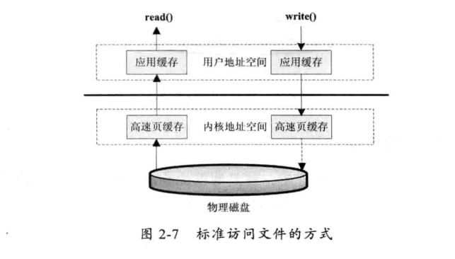
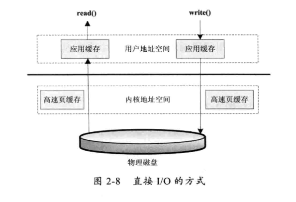
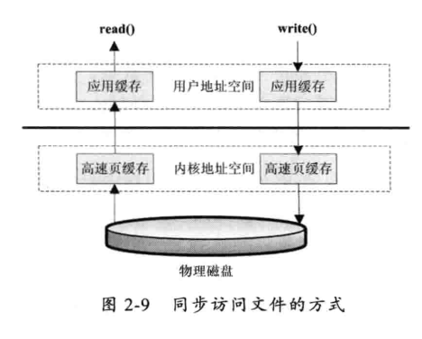
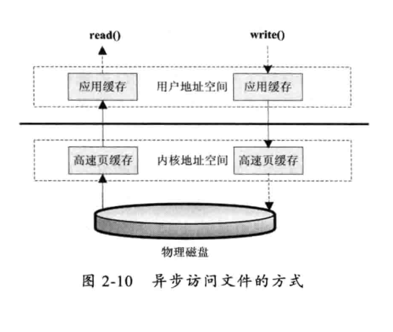
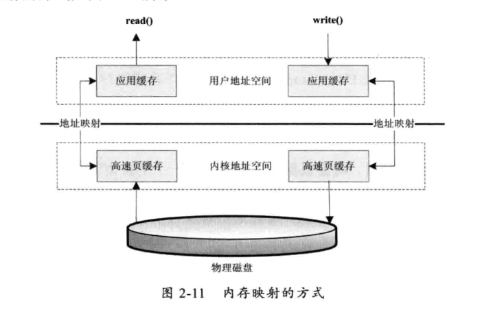
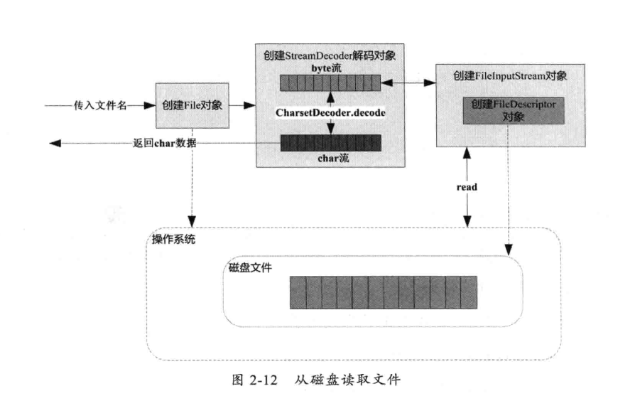

#   磁盘 I/O 工作机制

应用程序访问文件有那几种方式

##  几种访问文件的方式

读取和写入文件 I/O 操作都调用操作系统提供的接口，因为磁盘设备是由操作系统管理，应用程序要访问物理设备只能通过系统调用的方式来工作。

读和写分别对应 read() 和 write() 两个系统调用，而只要是系统调用就可能存在内核空间地址和用户空间地址切换的问题，操作系统为了自身运行安全，将内核程序运行使用的内存空间和用户程序运行的内存空间进行隔离，就存在数据需要从内核空间向用户空间复制的问题。

-   标准访问文件的方式

标准访问文件的方式就是当应用程序调用 read() 接口时，操作系统检查在内核的缓存中有没有需要的数据，没有就从磁盘中读取。

写入的方式是，用户的应用程序调用 write() 接口将数据从用户地址空间复制到内核地址空间的缓冲中，这是对用户程序来说写操作就完成，至于什么时后再写到磁盘由操作系统决定，除非显式的调用 sync 同步命令。

标准访问文件的方式：

-   直接 I/O 的方式

直接 I/O 的方式就是应用程序直接访问磁盘数据，而不经过操作系统内核数据缓冲区，这样的目的是减少一次从内核缓冲区到用户程序缓存的数据复制。

这种访问文件的方式通常是在对数据的缓存管理由应用程序实现的数据库管理系统中，如在数据库管理系统中，系统明确的知道应该缓存那些数据，应该失效那些数据，还可以对一些热点数据做预加载，提前将热点数据加载到内存，可以加速数据的访问效率。

-   同步访问文件的方式

同步访问文件的方式就是数据的读取和写入都是同步操作的，他与标准访问文件的方式不同的是，只有当数据被成功写到磁盘时才返回给应用程序成功的标志。

-   异步访问文件的方式

异步访问文件的方式就是当访问数据的线程发出请求之后，线程会接着去处理其他事情，而不是阻塞等待，当请求的数据返回后继续处理下面的操作，可以提高应用程序的效率，但是不会改变访问文件的效率。

-   内存映射的方式

内存映射的方式是指操作系统将内存中的某一块区域与磁盘中的文件关联起来，当要访问内存中的一段数据时，转换为访问文件的某一段数据，这种方式的目的是减少数据从内核空间到用户空间的复制操作，因为这两个空间的数据是共享的。

这里说的不好，应该是虚拟内存地址，用户空间和内核空间的虚拟内存地址映射到了同一块内存，这样就不会存在拷贝。

##  Java 访问磁盘文件

##  Java 序列化技术

在纯Java环境下，Java 序列化能够很好的工作，但是在多语言环境下，用Java 序列化存储后，很难用其他语言还原出来。在这种情况下，还是要尽量存储通用的数据结构，如 JSON 或 XML 结构数据。
