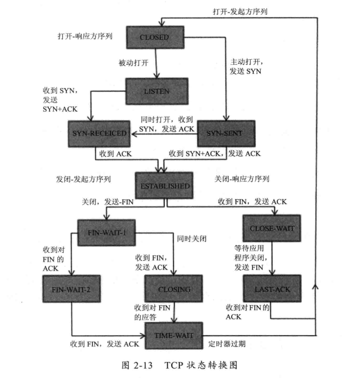
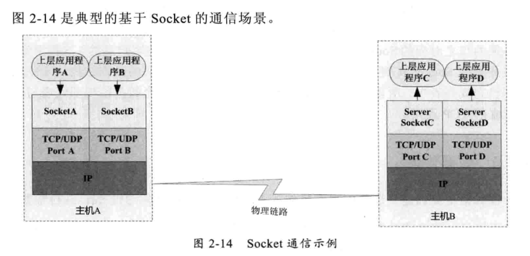

#   网络 I/O 工作机制

数据从一台主机发送到网络中的另一台主机需要经过很多步骤。

首先，需要有相互沟通的意向，其次要有能够沟通的物理渠道(物理链路)：是通过电话、还是直接面对面交流，再次，双方见面时语言要能够交流，而且双方说话的步调要一致，明白什么时后该自己说话，什么时候该对方说话(通信协议)。

##  TCP 状态变化

建立和关闭一个 TCP 连接，TCP 连接的状态转换：

##  影响网络传输的因素

将一份数据从一个地方正确地传输到另一个地方所需的时间就是响应时间

-   网络带宽：一条物理链路在 1s 内能够传输的最大比特数
-   传输距离：数据在光纤中要走的距离
-   TCP 拥塞控制：TCP传输是一个 "停-等-停-等"的协议，传输方和接受方的步调要一致，就要通过拥塞控制来调节。

##  Java Socket 的工作机制

Socket 没有对应到一个具体的实体，他描述计算机之间完成相互通信的一种抽象功能。

比如，Socket 比作两个城市之间的交通工具，可以在城市之间来回穿梭。交通工具有很多，每种交通工具也有相应的交通规则。Socket 也是，也有多种，但是大部分情况下使用的都是基于 TCP/IP 的流套接字，他是一种稳定的通信协议。

主机A的应用程序要能和主机B的应用程序通信，必须通过 Socket 建立通信。

Socket 连接 --> TCP连接 --> IP 寻址网络中的主机。

在一台主机上可能运行着多个应用程序，就需要端口号区分 TCP/UDP 的地址。

##  建立通信链路

当客户端与服务端通信时，客户端首先要创建一个 Socket 实例，操作系统将为这个 Socket 实例分配一个没有被使用的本地端口号，并创建一个包含本地地址、远程地址和端口号的套接字数据结构，这个数据结构将一直保存在系统中直到这个连接关闭。

服务端创建一个 ServerSocket 实例，操作系统也会为 ServerSocket 实例创建一个底层数据结构，这个数据结构中包含指定监听的端口号和包含监听地址的同配符，通常是 "*"，即监听所有地址。之后当调用 accept() 方法时，将进入阻塞状态，等待客户端的请求。当一个新的请求到来时，将为这个连接创建一个新的套接字数据结构，该套接字数据的信息包含的地址和端口号正是请求源地址和端口。

##  数据传输

当连接已经建立成功时，服务端和客户端都会拥有一个 Socket 实例，每个 Socket 实例都有一个 InputStream 和 OutputStream ，并通过这两个对象来交换数据。

网络 I/O 都是以字节流传输，当创建 Socket 对象时，操作系统会为 InputStream 和 OutputStream 分别分配一定大小的缓冲区，数据的写入和读取都是通过这个缓冲区完成的。

----