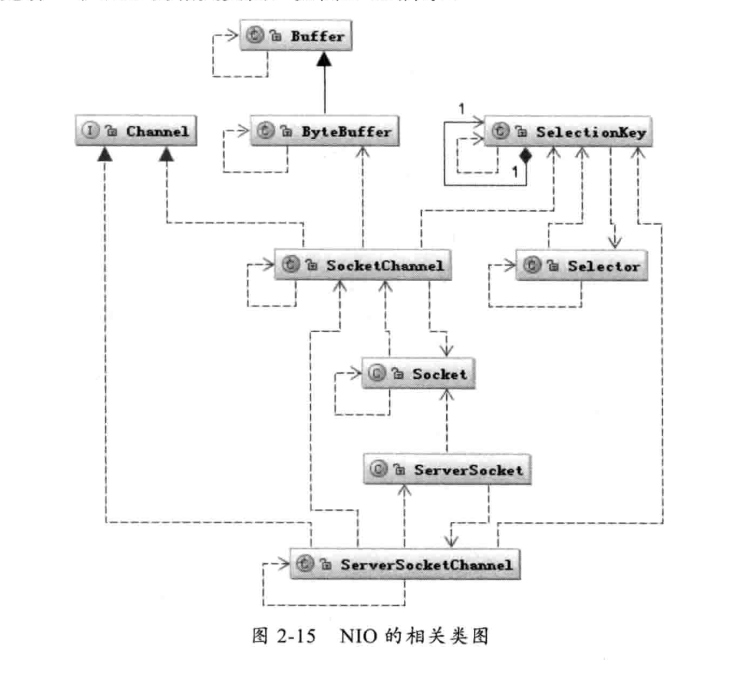
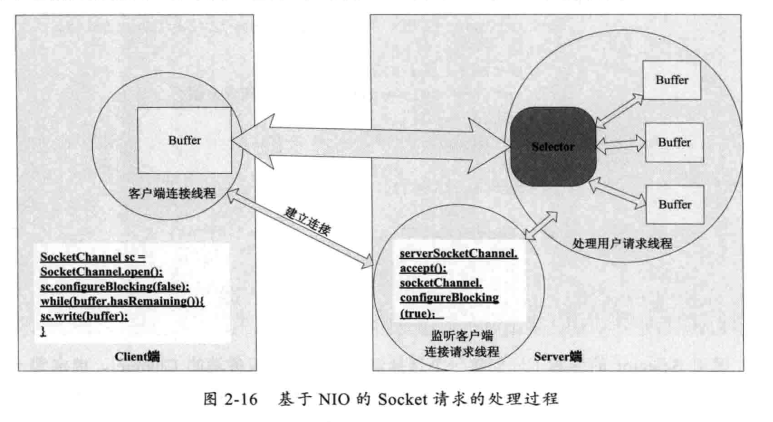

#   NIO的工作方式

##  BIO带来的挑战

BIO 即阻塞 I/O，不管是磁盘 I/O 还是 网络 I/O，数据在写入 OutputStream 或者从 InputStream 读取时都可能会阻塞，一旦有阻塞，线程将会失去 CPU 的使用权。

在短链接的场景下，可以通过 每个客户端对应一个处理线程或线程池等方式缓和一下。

长链接还是不合适

##  NIO 的工作机制

>   相关类图、典型的NIO代码



```Java
// 典型的 NIO 代码

public void selector() throws IOException {
        ByteBuffer buffer = ByteBuffer.allocate(1024);

        Selector selector = Selector.open();

        ServerSocketChannel ssc = ServerSocketChannel.open();
        ssc.configureBlocking(false);//设置为非阻塞方式
        ssc.socket().bind(new InetSocketAddress(8080));
        ssc.register(selector, SelectionKey.OP_ACCEPT);//注册监听的事件

        while (true) {
            Set selectedKeys = selector.selectedKeys();//取得所有key集合
            Iterator it = selectedKeys.iterator();

            while (it.hasNext()) {
                SelectionKey key = (SelectionKey) it.next();
                if ((key.readyOps() & SelectionKey.OP_ACCEPT) == SelectionKey.OP_ACCEPT) {
                    ServerSocketChannel ssChannel = (ServerSocketChannel) key.channel();
                    SocketChannel sc = ssChannel.accept();//接受到服务端的请求
                    sc.configureBlocking(false);
                    sc.register(selector, SelectionKey.OP_READ);
                    it.remove();
                } 
                
                if ((key.readyOps() & SelectionKey.OP_READ) == SelectionKey.OP_READ) {
                    SocketChannel sc = (SocketChannel) key.channel();
                    while (true) {
                        buffer.clear();
                        int n = sc.read(buffer);//读取数据
                        if (n <= 0) {
                            break;
                        }
                        buffer.flip();
                    }
                    it.remove();
                }
            }
        }
}
```



##  Buffer 的工作方式

Buffer 如何接受和写出数据。

可以把 Buffer 简单的理解为一组基本数据类型的元素列表，他通过几个变量来保存这个数据的当前位置状态，也就是有4个索引。

-   Buffer 中的索引及说明

|索引|说明|
|---|---|
|capacity|缓冲区数组的总长度|
|position|下一个要操作的数据元素的位置|
|limit|缓冲区数组不可操作的下一个元素的位置|
|mark|用于记录当前position的前一个位置或者默认是0|
|||

##  NIO 的数据访问方式

NIO 提供了比传统的文件访问方式更好的方法，一个是 FileChannel.transferTo、FileChannel.transferFrom；另一个是 FileChannel.map。

FileChannel.transferXXX 数据直接在内核空间中移动，没有复制。

FileChannel.map 将文件按照一定大小块映射为内存区域，适合大文件

----