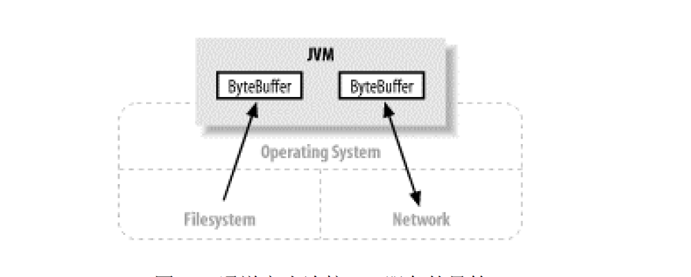
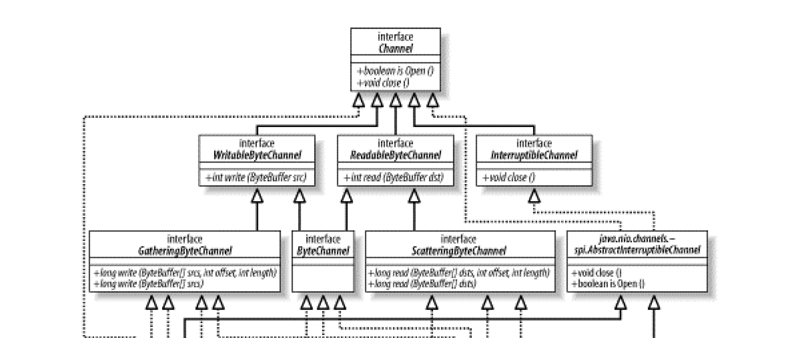
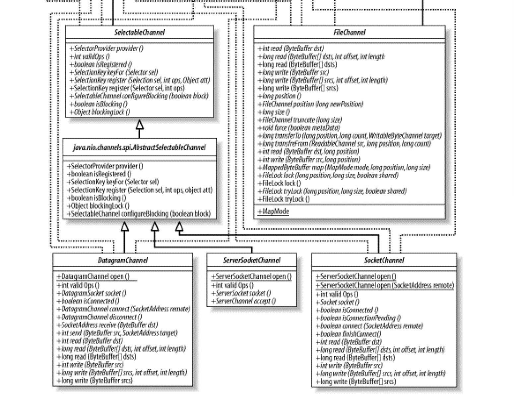
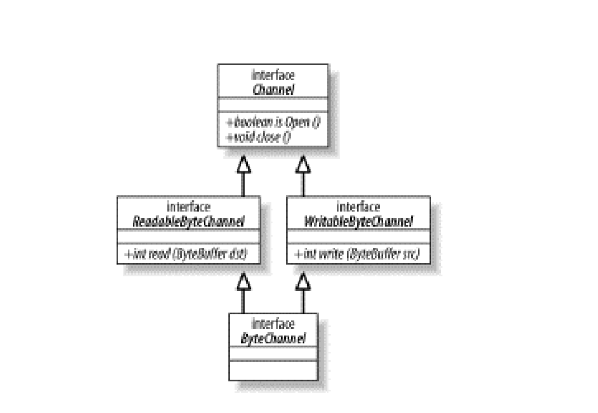
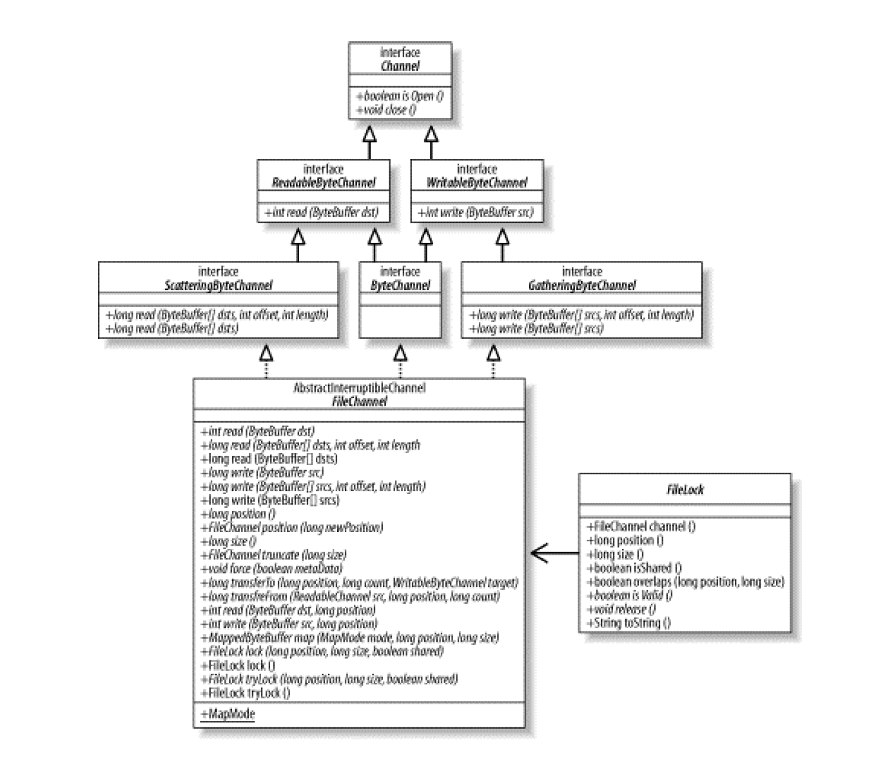

#   通道

通道(Channel) 是 java.nio 的第二个主要创新，是全新、极好的 Java I/O 示例，提供与 I/O 服务的直接连接。Channel 用于在字节缓冲区和位于通道另一侧的实体(通常是一个文件或套接字)之间有效地传输数据。

多数情况下，通道与操作系统的文件描述符和文件句柄有着一对一的关系。虽然通道比文件描述符更广义，但经常使用到的多数通道都是连接到开发的文件描述符。 Channel 类提供维护平台独立性所需的抽象过程，不过仍然会模拟现代操作系统本身的 I/O 性能。

通道是一种途径，借助该途径，可以用最小的总开销来访问操作系统本身的 I/O 服务。缓冲区则是通过内部用来发送和接收数据的端点。

-   通道充当连接 I/O 服务的导管



channel 类的继承关系要比 bugffer 类复制一些，而且部分 channel 类依赖于在 java.nio.channels.spi 子包中定义的类。

-   Channel 的类层次结构




##  通道基础

通道 API 主要由接口指定，不同的操作系统上通道实现会有根本性的差异，所以通道API 仅仅描述了可以做什么。

通道实现经常使用操作系统的本地代码，通道接口允许以一种受控且可移植的方式来访问底层的 I/O 服务。

顶层的 Channel 接口看到，对所有通道来说只有两种共同的操作：检查一个通道是否打开(IsOpen()) 和关闭一个打开的通道(close())。

InterruptibleChannel 是一个标记接口，当被通道使用时可以标示该通道是可以中断的，如果连接 可中断通道的线程 被中断，那么该通道会以特别的方式工作。

从 Channel 接口引申出的其他接口都是面向字节的子接口，包括 WritableByteChannel 和 ReadableByteChannel。通道只能在字节缓冲区上操作。层次结构表明其他数据类型的通道也可以从 Channel 接口引申而来。

类层次结构中有两个类位于一个不同的包： java.nio.channels.spi，这两个类是 AbstractInterruptibleChannel 和 AbstractSelectableChannel，他们分别是可中断(interruptible) 和可选择的(selectable)的通道实现提供所需的常用方法。尽管描述通道行为的接口都在 java.nio.channels 包中定义，不过具体的通道实现却都是从 java.nio.channels.spi 中的类引申来的，这使得他们可以访问受保护的方法，而这些方法普通的通道用户永远都不会调用。

SPI 包允许新通道实现以一种受控且模块化的方式被植入到JVM上。

1.  打开通道

通道是访问 I/O 服务的导管，I/O 可以分为广义的两大类别：File I/O 和 Stream I/O，就有文件(file)通道和套接字(socket)通道，有一个 FileChannel 类和三个 socket 通道类： SocketChannel、ServerSocketChannel 和 DatagramChannel。

socket 通道有可以直接创建新的 socket 通道的工厂方法。

FileChannel 对象只能通过在一个打开的 RandomAccessFile、FileInputStream 或 FileOutStream 对象上调用 getChannel() 方法来获取。

```Java
// 客户端 socket 通道
SocketChannel sc = SocketChannel.open( );
sc.connect (new InetSocketAddress ("somehost", someport));

// 服务端 socket 通道
ServerSocketChannel ssc = ServerSocketChannel.open();
ssc.socket( ).bind (new InetSocketAddress (somelocalport));

// 广播 socket 通道
DatagramChannel dc = DatagramChannel.open( );

// 文件通道
RandomAccessFile raf = new RandomAccessFile ("somefile", "r");
FileChannel fc = raf.getChannel();
```

2.  使用通道

通道将数据传输给 ByteBuffer 对象或从 ByteBuffer 对象获取数据进行传输。

-   ByteChannel 接口



通道可以是单向(实现 ReadableByteChannel 或 WritableByteChannel)的，也可能是双向(实现 ReadableByteChannel 和 WritableByteChannel)的。

实现 ByteChannel 接口的通道会同时实现 ReadableByteChannel 和 WritableByteChannel 两个接口，所以此类通道是双向的。

每一个 file 或 socket 通道对象都是双向的。

通道会连接一个特定 I/O 服务且通道实例的性能受它所连接的 I/O 服务的特征限制。一个连接到只读文件的 Channel 实例不能进行写操作，及时该实例所属的类可能有 write() 方法。

ByteChannel 的 read() 和 write() 方法使用 ByteBuffer 对象作为参数。

通道可以以 阻塞 或 非阻塞 模式运行，非阻塞模型的通道永远不会让调用的线程休眠，请求的操作要么立即完成，要么返回一个结果表明未进行任何操作。只有面向流的通道，如 socket 和 pipes 才能使用非阻塞模式。

3.  关闭通道

与缓冲区不同，通道不能被重复使用，一个打开的通道即代表与一个特定 I/O 服务的特定连接并封装该连接的状态。

当通道关闭时，那个连接会丢失，然后通道将不再连接任何东西。

调用通道的 close() 方法时，可能会导致在通道关闭底层 I/O 服务的过程中线程暂时阻塞，哪怕该通道处于非阻塞模式。通道关闭时的阻塞行为(如果有的话)是高度取决于操作系统或文件系统的。在一个通道上多次调用 close() 方法是没没有坏处的，但是如果第一个线程在 close() 方法中阻塞，那么在他完成关闭通道之前，任何其他调用 close() 方法都会阻塞，后续在该已关闭的通道上调用 close() 不会产生任何操作，只会立即返回。

通过 isOpen() 方法类测试通道的开放状态，如果返回 true 值，那么该通道可以使用。

当 I/O 操作线程被中断时总是关闭通道。

##  Scatter/Gatter

通道提供了一种被称为 Scatter/Gatter 的重要新功能(也被称为矢量I/O)。Scatter/Gatter 是一个简单却强大的概念，指在多个缓冲区上实现一个简单的 I/O 操作。

对于一个 write 操作而言，数据是从几个缓冲区按顺序抽取(称为Gatter)并沿着通道发送的，缓冲区本身并不需要具备这种 Gatter 的能力，该 Gatter 过程的效果就好比全部缓冲区的内容被连结起来，并在发送数据前存放到一个大的缓冲区中。

对于 read 操作而言，从通道读取的数据会按顺序被散步(称为Scatter)到多个缓冲区，将每个缓冲区填满直至通道中的数据或者缓冲区的最大空间被消耗完。

使用得当的话，Scatter/Gatter 会是一个极其强大的工具，他允许你委托操作系统来完成辛苦活：将读取到的数据分开存放到多个存储桶或者将不同的数据区块合并成一个整体。操作系统以及被高度优化来完成此类工作了，节省来回移动数据的工作，也就避免了缓冲区拷贝和减少需要编写、调试的代码数量。

##  文件通道

-   FileChannel 类层次结构



文件通道总是阻塞式的，因此不能被置于非阻塞模式。

现代操作系统都有复杂的缓存和预取机制，使得本地磁盘 I/O 操作延迟很少。网络文件系统一般而言延迟会多些，不过却也因该优化而受益。

面向流的 I/O 的非阻塞范例对于面向文件的操作并无多大意义，这是由文件 I/O 本质上的不同性质造成的。

对于文件 I/O，最强大之处在于异步 I/O，他允许一个进程可以从操作系统请求一个或多个 I/O 操作而不必等待这些操作的完成。发起请求的进程之后会收到他请求的 I/O 操作已完成的通知。

一个 FileChannel 实例只能通过在一个打开的file对象（RandomAccessFile、FileInputStream或FileOutputStream）上调用getChannel( )方法获取。

调用 getChannel() 方法会返回一个连接到相同文件的FileChannel对象且该FileChannel对象具有与file对象相同的访问权限，然后就可以利用强大的 FileChannel API 了。

从 getChannel() 方法获取的实际对象是一个具体子类的一个实例，该子类可能使用本地代码来实现 API 方法中的一些或全部。

FileChannel 对象是线程安全的。多个进程可以在同一个实例上并发调用方法而不会引起任何问题，不过并非所有的操作都是多线程的。影响通道位置或影响文件大小的操作都是单线程的，如果有一个线程已经在执行会影响通道位置或文件大小的操作，其他尝试进行此类操作之一的线程必须等待，并发行为也会受到底层的操作系统或文件系统影响。

FileChannel 是一个反应 JVM 外部一个具体对象的抽象.FileChannel 类保证同一个 JVM 上的所有实例看到的某个文件的视图均是一致的。但是 JVM 不能对超出他控制范围的因素提供担保。 通过一个 FileChannel 实例看到的某个文件的视图同通过一个外部的非 Java 进程看到的该文件的视图可能一致，也可能不一致。

多个进程发起的并发文件访问的语义高度取决于底层的操作系统和(或)文件系统，一般而言，由运行在不同的 JVM 上的 FileChannel 对象发起的对某个文件的并发访问和由非 Java 进程发起的对该文件的并发访问是一致的。

1.  访问文件

每个 FileChannel 对象都同一个文件描述符有一对一的关系，所以 API 方法与 POSIX(可移植操作系统接口)兼容的操作系统上的常用文件 I/O 系统调用紧密对应。

API 方法同 java.io 包中 RandomAccessFile 类的方法很相识。本质上讲， RandomAccessFile 类提供的是同样的抽象内容，在通道出现之前，底层的文件操作都是通过 RandomAccessFile 类的方法来实现的， FileChannel 模拟同样的 I/O 服务，因此它的 API 自然很相似。

-   position() 方法

position 值决定文件中那一处的数据接下来将被读或者写，同缓冲区很类似，并且 MappedByteBuffer 类使得可以通过 ByteBuffer API 来访问文件数据。

不带参数的 position 方法，返回当前文件的 position 指。

带一个 long 参数并将通过的 position 设置为指定值。

位置(position)是从底层的文件描述符获得的，该 position 同时被作为通道引用获取来源的文件对象共享，这就意味着一个对象对该 position 的更新可以被另一个对象看到。

-   force() 方法

告诉通道强制将全部待定的修改都应用到磁盘的文件上，多有的现代文件系统都会缓存数据和延迟磁盘文件更新以提高性能，调用 force()
 方法要求文件的所有待定修改立即同步到磁盘。

 如果文件位于一个本地文件系统，那么一旦 force() 方法返回，即可保证从通道被创建(或上次调用force)时起的对文件所做的全部修改已经被写入到磁盘，对于关键操作如事务处理来说，这一点非常重要，可以保证数据完整性和可靠的回复。

 如果文件位于一个远程的文件系统，如 NFS 上，那么不能保证待定修改一定能同步到永久存储器上，因为 JVM 不能做操作系统或文件系统不能实现的承诺。

 force() 方法的布尔型参数表示在方法返回值前文件的元数据是否也要被同步更新到磁盘。

2.  文件锁定

在集成许多其他非 Java 程序时，文件锁定显得尤其重要，此外，他在判优(判断多个访问请求的优先级)一个大系统的多个 Java 组件发起的访问时也很有价值。

锁(lock)可以是共享的或独占的，Java 文件锁定特定在很大程序上依赖本地的操作系统实现，并非所有的操作系统和文件系统都支持共享文件锁。

FileChannel 实现的文件锁定模型的一个重要注意项是：锁的对象是文件而并不是通道或线程，这意味着文件锁不适用于判优同一台 JVM 上的多个线程发起的访问。

如果一个线程在某个文件上获得了独占锁，然后第二个线程利用一个单独打开的通道来请求该文件的独占锁，那么第二个线程的请求会被批准。

如果两个线程运行在不同的 JVM 上，那么第二个线程会阻塞，因为锁最终是由操作系统或文件系统来判优的并且几乎总是在进程级而非线程级上判优。

锁都是与一个文件关联的，而不是与单个的文件句柄或通道关联。

文件锁旨在在进程级别上判优文件访问，比如在主要的程序组件之间或在集成其他供应商的组件时。


##  内存映射文件

新的 FileChannel 类提供了一个名为 map() 的方法，该方法可以在一个打开的文件和一个特殊类型的 ByteBuffer 之间建立一个虚拟内存映射。 在 FileChannel 上调用 map() 方法会创建一个由磁盘文件支持的虚拟内存映射并在那块虚拟内存空间外部封装一个 MappedByteBuffer 对象。

由 map() 方法返回的 MappedByteBuffer 对象的行为在多数方面类似一个基于内存的缓冲区，只不过该对象的数据元素存储在磁盘上的一个文件中。调用 get() 方法会从磁盘文件中获取数据，此数据反映该文件的当前内容，即使在映射建立之后文件已经被一个外部进程做了修改。

通过文件映射看到的数据同用常规方法读取文件看到的内容是完全一样的。

通过内存映射机制来访问一个文件会比使用常规方法读写高效得多，甚至比使用通道的效率都高，因为不需要做明确的系统调用，那会很消耗时间，更重要的是，操作系统的虚拟内存可以自动缓存内存页，这些页是用系统内存来缓存的，不会消耗 JVM 内存堆。

一旦一个内存页已经生效(从磁盘上缓存进来)，他就能以完全的硬件速度再次被访问而不需要再次调用系统命令来获取数据。那些包含索引以及其他需频繁引用或更新的内容的巨大而结构化文件能因内存映射机制受益非常多。

因为 MappedByteBuffer 也是 ByteBuffers，所以能够被传递 SocketChannel 之类通道的 read() 或 write() 以有效传输数据给被映射的文件或从被映射的文件读取数据。如能再结合 scatter/gather，那么从内存缓冲区和被映射文件内容中组织数据就变得很容易了。

大致意思：套接字里的数据直接写到磁盘，这是由操作系统完成，不经过JVM，效率非常高。

1.  Channel-to-Channel 传输

transferTo() 和 transferFrom() 方法允许将一个通道交叉连接到另一个通道，而不需要通过一个中间缓冲区来传递数据。只有 FileChannel 类有这两个方法，因此 channel-to-channel 传输中通道之一必须是 FileChannel。文件的内容可以用 transferTo() 方法传输给一个 socket 通道，或者也可以用 transferFrom() 方法将数据从一个 socket 通道直接读取到一个文件中。

Channel-to-channel传输是可以极其快速的，特别是在底层操作系统提供本地支持的时候。某些操作系统可以不必通过用户空间传递数据而进行直接的数据传输。对于大量的数据传输，这会是一个巨大的帮助

##  管道

java.nio.channels 包中含有一个名为 Pipe(管道)的类，广义上讲，管道就是一个用来在两个实体之间单向传输数据的导管。Unix 系统中，管道被用来连接一个进程的输出和另一个进程的输入，Pipe 类实现一个管道范例，不过他所创建的管道是进程内(JVM进程内部)而非进行间使用的。

Pipe 类创建一对提供环回机制的 Channel 对象，这两个通道的远端是连接起来的，以便任何写在 SinkChannel 对象上的数据都能出现在 SourceChannel 对象上。

管道可以被用来仅在同一个 JVM 内部传输数据，虽然有更加有效率的方式在线程之间传输数据，但是使用管道的好处在于封装性。生产者线程和用户线程都能被写到通用的 Channel API 中。

根据给定的通道类型，相同的代码可以被用来写数据到一个文件、socket或管道。

选择器可以被用来检查管道上的数据可用性，如同在 socket 通道上使用那样简单，这样就可以允许单个用户线程使用一个 Selector 来从多个通道有效的收集数据，并可任意结合网络连接或本地工作线程使用。

Pipe 的另一个有用之处是可以用来辅助测试，一个单元测试框架可以将某个待测试的类连接到管道的"写"端并检查管道的"读"端出来的数据，他也可以将被测试的类置于通道的"读"端并将受控的测试数据写进其中。

管道所能承载的数据量是依赖实现的，唯一可保证的是写到 SinkChannel 中的字节都能按照同样的顺序在 SourceChannel 上重现。

##  通道工具类

通道可能最终会改进加入到 java.io 类中，但是 java.io 流所代表的 API 和读写器却不会很快消失。

一个工具类(java.nio.channels.Channels)定义了几种静态的工厂方法以使通道可以更加容易的同流或读写器互联。

##  总结

通道组成了基础设施或者说管道设施，该设施在操作系统(或通道连接到的任意东西)的 ByteBuffers 和 I/O 服务之间传输数据。

-   基本的通道操作

使用所有通道都通用的 API 方法调用来打开一个通道以及完成操作时如何关闭通道

-   Scatter/Gather 通道

矢量化的 I/O 可以在多个缓冲区上自动执行一个 I/O 操作。

-   文件通道

文件锁定、内存映射文件以及 channel-to-channel 传输

-   Socket 通道

非阻塞模式

-   管道

Pipe 类，实现新循环机制

-   通道工具类

通道类中包含了工具方法，这些方法用于交叉连接通道和常规的字节流以及字符读写器对象

----
