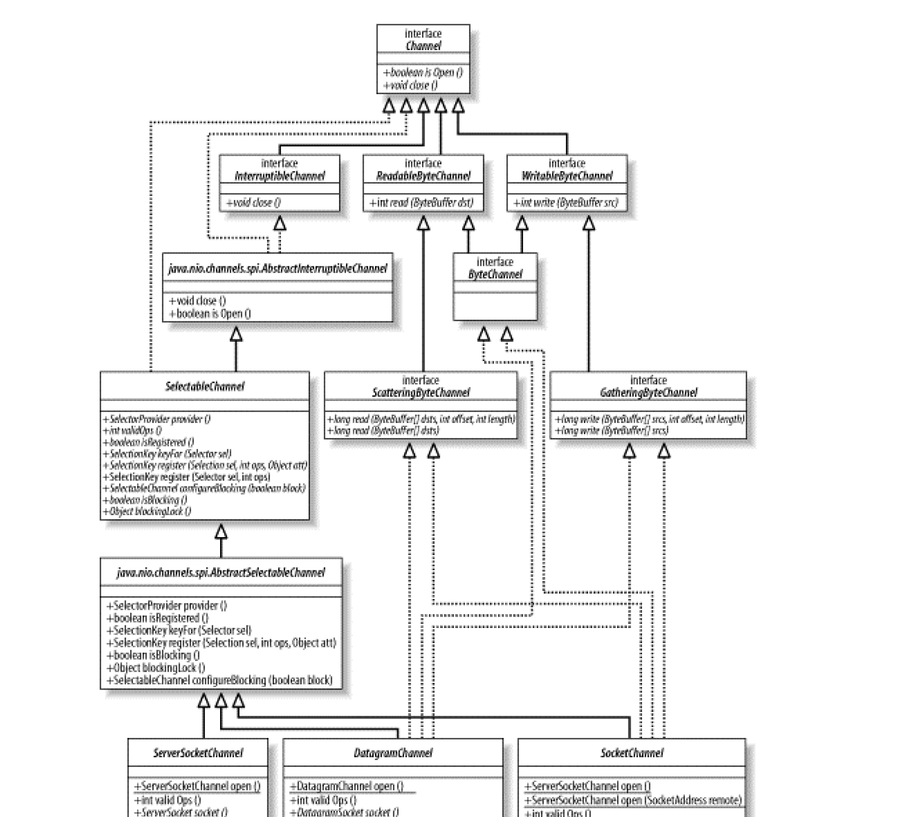

#   套接字：通道

socket 通道类可以运行`非阻塞模式`并且是`可选择`的。

没有必要为每个 socket 连接使用一个线程，也避免管理大量线程所需的上下文交换总开销，借助新的 NIO 类，一个或几个线程就可以管理成百上千的活动 soclet 连接并且只有很少甚至可能没有性能损失。

全部 socket 通道类(DatagramChannel、SocketChannel和ServerSocketChannel)都是位于 java.nio.channels.spi包中的 AbstractSelectableChannel 引用而来，意味着可以用一个 Selector 对象来执行 soclet 通道的有条件的选择。

-   socket 通道类层次结构



DatagramChannel 和 SocketChannel 实现定义读和写功能的接口而 ServerSocketChannel 不实现。 ServerSocketChannel 负责监听传入的连接和创建新的 SocketChannel 对象，它本身从不传输数据。

就某个 socket 而言，他不会再次实现与之对应的 socket 通道类中的 socket 协议 API，而 java.net 中已经存在的 socket 通道都可以被大多数协议操作重复使用。

全部 socket 通道类在被实例化时都会创建一个对等 socket 对象，这些是来自 java.net 的类，已经被更新以识别通道。

虽然每个 socket 通道(在 java.nio.channels 包中)都有一个关联的 java.net.socket 对象，却并非所有的 socket 都有一个关联的通道。如果用传统方式(直接实例化)创建了一个 Socket 对象，他就不会有关联的 SocketChannel 并且它的 getChannel() 方法将总是返回 null。

Socket通道委派协议操作给对等socket对象。如果在通道类中存在似乎重复的socket方法，那么将有某个新的或者不同的行为同通道类上的这个方法相关联。

##  非阻塞模式

Socket 通道可以在非阻塞模式下运行，非阻塞 I/O 是许多复杂、高性能的程序构建基础。

要把一个 socket 通道置于非阻塞模式，依赖所有 socket 通道类的公有超级类： SelectableChannel。

有条件的选择 是一种可以用来查询通道的机制，该查询可以判断通道是否准备好执行一个目标操作，如读或写。非阻塞 I/O 和可选择性是紧密相连的。

设置或重新设置一个通道的阻塞模式是很简单的，只要调用configureBlocking( )方法即可，传递参数值为true则设为阻塞模式，参数值为false值设为非阻塞模式。

服务器端的使用经常会考虑到非阻塞 socket 通道，因为他们使同时管理很多 socket 通道变得更容易，但是，在客户端使用一个或几个非阻塞模式的 socket 通道也是有益处的。

##  ServerSocketChannel

ServerSocketChannel 是一个基于通道的 socket 监听器，同 java.net.ServerSocket 执行相同的基本任务，不过他增加了通道语义，能够在非阻塞模式下运行。

用静态的 open() 工厂方法创建一个新的 ServerSocketChannel 对象，将会返回同一个未绑定的 java.net.ServerSocket 关联的通道。该对等 ServerSocket 可以通过在返回的 ServerSocketChannel 上调用 socket() 方法来获取。作为 ServerSocketChannel 的对等体被创建的 ServerSocket 对象依赖通道实现，这些 socket 关联的 SocketImpl 能识别通道，通道不能被封装在随意的 socket 对象外面。

由于 ServerSocketChannel 没有 bind() 方法，因此必须取出对等的 socket 并使用它来绑定到一个端口以开始监听连接。

```Java
// 创建一个新的 ServerSocketChannel 对象 --> 一个未绑定 java.net.ServerSocket 关联的通道
ServerSocketChannel ssc = ServerSocketChannel.open();

// 获取 ServerSocket
ServerSocket serverSocket = ssc.socket();

// 绑定监听的端口
serverSocket.bind (new InetSocketAddress (1234));
```

一旦创建了一个 ServerSocketChannel 并用对等 socket 绑定了它，就可以调用 accept()。

如果选择在 ServerSocket 上调用 accept() 方法，表现的行为是：总是阻塞并返回一个 java.net.Socket 对象。

如果选择在 ServerSocketChannel 上调用 accept() 方法，就会返回 SocketChannel 类型的对象，它能够在非阻塞模式下运行。

如果以非阻塞模式被调用，当没有传入连接在等待时，ServerSocketChannel.accept() 会立即返回 null。正是这种检查连接而不阻塞的能力实现了可伸缩性并降低了复杂性，可选择性也因此得到实现。

##  SocketChannel

Socket和SocketChannel类封装点对点、有序的网络连接，类似于我们所熟知并喜爱的TCP/IP网络连接。SocketChannel扮演客户端发起同一个监听服务器的连接。直到连接成功，它才能收到数据并且只会从连接到的地址接收。

每个 SocketChannel 对象创建时都是同一个对等的 java.net.Socket 对象串联的。静态的 open() 方法可以创建一个新的 SocketChannel 对象，而在新创建的 SocketChannel 上调用 socket() 方法能返回他对等的 Socket 对象；在该 Socket 上调用 getChannel() 方法则能返回最初的那个 SocketChannel。

新创建的 SocketChannel 虽已打开却是未连接的，可以通过在通道上直接调用 connect() 方法或在通道关联的 Socket 对象上调用 connect() 来将该 socket 通道连接，一旦一个 socket 通道被连接，他将保持连接状态直到被关闭，可以调用布尔型的 isConnected() 方法来测试某个 SocketChannel 当前是否已经连接。

与连接相关的方法可以对一个通道进行轮询并在连接进行过程中判断通道所处的状态。

Socket 通道是线程安全的，并发访问时无需特别措施来保护发起访问的多个线程，不过任何时候都只有一个读操作和一个写操作在进行中。 sockets 是面向流的而非包导向的。

##  DatagramChannel

正如SocketChannel对应Socket，ServerSocketChannel对应ServerSocket，每一个DatagramChannel对象也有一个关联的DatagramSocket对象。

正如SocketChannel模拟连接导向的流协议（如TCP/IP），DatagramChannel则模拟包导向的无连接协议（如UDP/IP）。

创建DatagramChannel的模式和创建其他socket通道是一样的：调用静态的open( )方法来创建一个新实例。新DatagramChannel会有一个可以通过调用socket( )方法获取的对等DatagramSocket对象。DatagramChannel对象既可以充当服务器（监听者）也可以充当客户端（发送者）。如果您希望新创建的通道负责监听，那么通道必须首先被绑定到一个端口或地址/端口组合上。绑定DatagramChannel同绑定一个常规的DatagramSocket没什么区别，都是委托对等socket对象上的API实现的：

```Java
// 服务端
DatagramChannel channel = DatagramChannel.open( ); 
DatagramSocket socket = channel.socket( ); 
socket.bind (new InetSocketAddress (portNumber));
```

DatagramChannel是无连接的。每个数据报（datagram）都是一个自包含的实体，拥有它自己的目的地址及不依赖其他数据报的数据净荷。与面向流的的socket不同，DatagramChannel可以发送单独的数据报给不同的目的地址。同样，DatagramChannel对象也可以接收来自任意地址的数据包。每个到达的数据报都含有关于它来自何处的信息（源地址）。

一个未绑定的DatagramChannel仍能接收数据包。当一个底层socket被创建时，一个动态生成的端口号就会分配给它。绑定行为要求通道关联的端口被设置为一个特定的值。

不论通道是否绑定，所有发送的包都含有DatagramChannel的源地址（带端口号）

未绑定的DatagramChannel可以接收发送给它的端口的包，通常是来回应该通道之前发出的一个包。已绑定的通道接收发送给它们所绑定的熟知端口（wellknown port）的包。

数据的实际发送或接收是通过send( )和receive( )方法来实现的。

receive( )方法将下次将传入的数据报的数据净荷复制到预备好的ByteBuffer中并返回一个SocketAddress对象以指出数据来源。如果通道处于阻塞模式，receive( )可能无限期地休眠直到有包到达。如果是非阻塞模式，当没有可接收的包时则会返回null。如果包内的数据超出缓冲区能承受的范围，多出的数据都会被悄悄地丢弃。

调用send( )会发送给定ByteBuffer对象的内容到给定SocketAddress对象所描述的目的地址和端口，内容范围为从当前position开始到末尾处结束。如果DatagramChannel对象处于阻塞模式，调用线程可能会休眠直到数据报被加入传输队列。如果通道是非阻塞的，返回值要么是字节缓冲区的字节数，要么是“0”。发送数据报是一个全有或全无（all-or-nothing）的行为。如果传输队列没有足够空间来承载整个数据报，那么什么内容都不会被发送

数据报协议的不可靠性是固有的，它们不对数据传输做保证。

send( )方法返回的非零值并不表示数据报到达了目的地，仅代表数据报被成功加到本地网络层的传输队列

传输过程中的协议可能将数据报分解成碎片。

已连接通道会发挥作用的使用场景之一是一个客户端/服务器模式、使用UDP通讯协议的实时游戏。

每个客户端都只和同一台服务器进行会话而希望忽视任何其他来源地数据包。

数据报socket的无状态性质不需要同远程系统进行对话来建立连接状态。没有实际的连接，只有用来指定允许的远程地址的本地状态信息。

DatagramChannel对象可以任意次数地进行连接或断开连接。每次连接都可以到一个不同的远程地址。调用disconnect( )方法可以配置通道，以便它能再次接收来自安全管理器（如果已安装）所允许的任意远程地址的数据或发送数据到这些地址上。

当一个DatagramChannel处于已连接状态时，发送数据将不用提供目的地址而且接收时的源地址也是已知的。这意味着DatagramChannel已连接时可以使用常规的read( )和write( )方法，包括 scatter/gather形式的读写来组合或分拆包的数据

-   一些选择数据报socket而非流socket的理由
    -   程序可以承受数据丢失或无序的数据
    -   “发射后不管”（fire and forget）而不需要知道您发送的包是否已接收
    -   数据吞吐量比可靠性更重要
    -   需要同时发送数据给多个接受者（多播或者广播）。
    -   包隐喻比流隐喻更适合手边的任

##  相关框架 
-   Netty