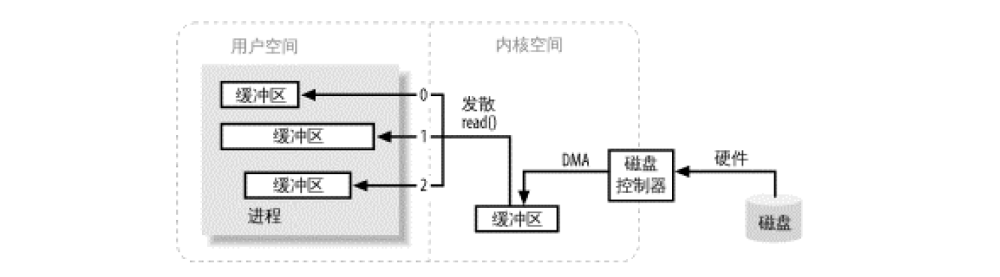
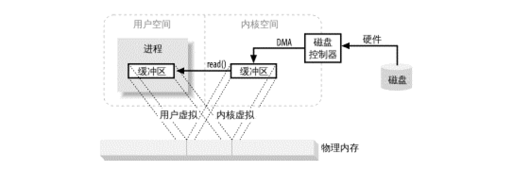
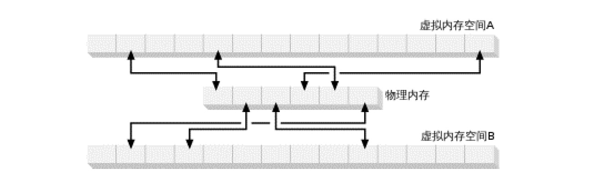
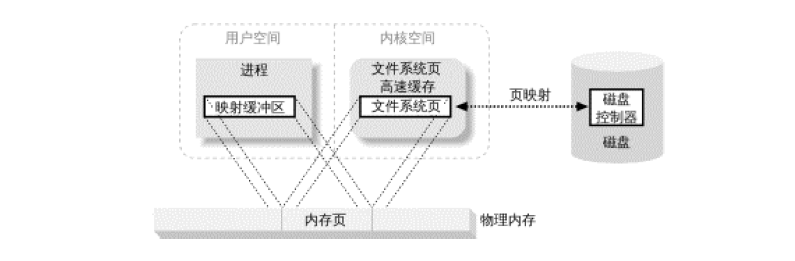
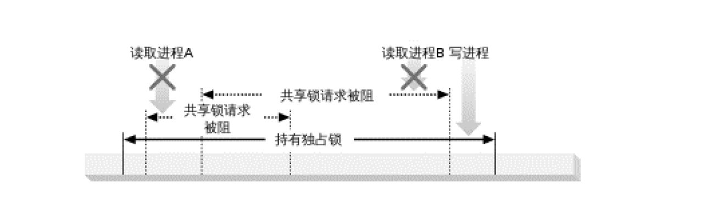

#   NIO概述

NIO API 是对 1.3 版 I/O 特性的补充而非取代。

##  I/O 与 CPU 时间的比较

I/O 操作比在内存中进行数据处理任务所需时间更长，差别要以数量级计。

在 I/O 性能上的小小投入就可换来可观的回报。

##  CPU 已不再是束缚

如今在运行时优化方面，JVM 已然前进了一大步。现在 JVM 运行字节码的速率已经接近本地编译代码，借助动态运行时优化，其表现甚至还有所超越，意味着，多数 Java 应用程序已不再受 CPU 的束缚，而更多是受 I/O 的束缚(等待数据传输)。

JVM 自身在 I/O 方面效率欠佳，操作系统与 Java 基于流的 I/O 模型有些不匹配。

操作系统要移动的是大块数据(缓冲区)，这往往是在硬件直接存储器存取(DMA)的协助下完成的，而 JVM 的 I/O 类喜欢操作小块数据 --- 单个字节、几行文本。结果，操作系统送来整缓冲区的数据，java.io 的流数据类再花大量时间把他们拆成小块，往往拷贝一个小块就要往返于基层对象。

操作系统喜欢整卡车地运来数据，java.io 类则喜欢一铲子一铲子地加工数据。有了 NIO，就可以轻松得把一卡车数据备份到能直接使用的地方(ByteBuffer对象)。

RandomAccessFile 类在移动大量数据方面的效率不低，只要坚持使用基于数组的 read() 和 write() 方法，这些方法与底层操作系统调用相当接近，只是需要至少保留一份缓冲区拷贝。

##  进入正题

JVM 是把双刃剑，提供了统一的操作环境，让Java程序员不用再为操作系统环境的区别而烦恼，隐藏操作系统的技术细节也意味着某些个性鲜明、功能强大的特性被挡在门外。

操作系统开发商只能提供符合一致性要求的JVM。

为了解决这一问题，java.nio 软件包提供了新的抽象，就是 Channel 和 Selector 类，他们提供了使用 I/O 服务的通用 API。

java.nio.channels.spi 还提供了新的服务提供接口(SPI)，允许接入新型通道和选择器，同时又不违反规范的一致性。

##  I/O 概念

NIO 抽象与现实中存在的实体有着非常直接真实的交互关系。

NIO 类模拟 I/O 函数，因此，必须掌握操作系统层面的处理细节，才能理解新的 I/O 模型。

### 缓冲区操作

缓冲区，以及缓冲区如何工作，是所有 I/O 的基础，所谓 "输入/输出" 讲得就是把数据移进或移出缓冲区。

进程执行 I/O 操作，归结起来，也就是向操作系统发出请求，让他要么把缓冲区里的数据排干(写)，要么用数据把缓冲区填满(读)。进程使用这一机制处理所有数据进出操作。

-   I/O 缓冲区操作简图：数据从外部磁盘向运行中的进程的内存区域移动的过程

进程使用 read() 系统调用，要求其缓冲区被填满。

内核随机向磁盘控制硬件发布命令，要求其从磁盘读取数据。磁盘控制器把数据直接写入`内核内存缓冲区`，这一步通过 DMA 完成，无需主 CPU 协助。

一旦磁盘控制器把缓冲区装满，内核即把数据从内核空间的临时缓冲区拷贝到`进程执行 read() 调用时指定的缓冲区`。

用户空间是常规进程所在区域，JVM 就是常规进程，驻守于用户空间。用户空间是非特权区域：比如，在该区域执行的代码就不能直接访问硬件设备。

内核空间是操作系统所在区域，内核代码有特别的权利：他能与设备控制器通讯，控制着用户区域进程的运行状态。

所有的 I/O 都直接或间接 通过内核空间。

当进程请求 I/O 操作的时候，他执行一个系统调用将控制权移交给内核。当内核以这种方式被调用，他随机采取任何必要步骤，找到进行所需数据，并把数据传送到用户空间内的指定缓冲区。内核试图对数据进行高速缓存或预读取，因此进程所需数据可能已经在内核空间里了。

把数据从内核空间拷贝到用户空间的原因。首先，硬件通常不能直接访问用户空间，其次，像磁盘这样基于块存储的硬件设备操作的是固定大小的数据库，而用户进程请求的可能是任意大小的或非对齐的数据块。在数据往来与用户空间与存储设备的过程中，内核负责数据的分解、再组合工作，充当中间人的角色。

-   发散/汇聚

许多操作系统能够把组装/分解过程进行得更加高效。

根据发散/汇聚的概念，进程只需一个系统调用，就能把一连串缓冲区地址传递给操作系统，然后，内核就可以顺序填充或排干多个缓冲区，读的时候就把数据发散到多个用户空间缓冲区，写的时候再从多个缓冲区把数据汇聚起来。

这样用户进程就不必多次执行系统调用(代价不菲)，内核也可以优化数据的处理过程，因为他已掌握待传输数据的全部信息，如果系统配有多个CPU，甚至可以同时填充或排干多个缓冲区。

### 虚拟内存

所有现代操作系统都使用虚拟内存。

虚拟内存意为使用虚假(或虚拟)地址取代物理(硬件RAM)内存地址。

-   主要好处
    -   一个以上的虚拟地址可指向同一个物理内存地址
    -   虚拟内存空间可大于实际可用的硬件内存

把内核空间地址与用户空间的虚拟地址映射到同一个物理地址，这样，DMA硬件(只能访问物理内存地址)就可以填充对内核与用户空间进程同时可见的缓冲区

-   内存空间多重映射：多个(虚拟)地址指向同一块内存

省去了内核与用户空间的往来拷贝。 

前提条件是，内核与用户缓冲区必须使用相同的页对齐，缓冲区的大小还必须是磁盘控制器块大小(通常为512字节磁盘扇区)的倍数。

操作系统把内存地址空间划分为`页`，即固定大小的字节组。内存页的大小总是磁盘块大小的倍数，通常为2次幂，典型的内存页为 1024、2048和4096字节。虚拟和物理内存页的大小总是相同的。

猜测一下，内存地址，指得应该是内存大小基本单位，每个基本单位大小即块都有编号，就是地址了

-   内存页：来自多个虚拟地址的虚拟内存页是如何映射到物理内存

### 内存页面调度

为了支持 寻址空间大于物理内存，就必须进行虚拟内存分页(称为交换，真正的交换是在进程层面完成)。

虚拟内存空间的页面能够继续存在于外部磁盘存储，这样就为物理内存中的其他虚拟页面腾出空间。

本质上说，物理内存充当了分页区的高速缓存；而所谓分页区，即从物理内存置换出来，转而存储与磁盘上的内存页面。

理解一下，虚拟内存空间=物理内存+外部硬盘，计算是在物理内存里发生，但是，其他状态数据暂存在了外部磁盘里了

-   用于分页区高速缓存的物理内存：四个进程的虚拟页面，每个进程都有属于自己的虚拟内存空间，进程 A 有五个页面，其中两个转入内存，其他存储于磁盘

把内存页大小设定为磁盘块大小的倍数，这样内核就可直接向磁盘控制硬件发布命令，把内存页写入磁盘，在需要时再重新装入。结果是，所有磁盘I/O 都在页层面完成，对于采用分页技术的现代操作系统而言，这是数据在磁盘与物理内存之间往来的唯一方式。

内存页与磁盘块大小兼容，磁盘正常写入数据，内存页可以接收。

现在 CPU 包含一个称为 内存管理单元(MMU)的子系统，逻辑上位于 CPU 与 物理内存之间。该设备包含虚拟地址向物理内存地址转换时所需映射信息，当 CPU 引用某内存地址时，MMU 负责确定该地址所在页(通过对地址值进行移位或屏蔽位操作实现)，并将虚拟页号转换为物理页号(硬件完成，速度极快)。

如果当前不存在与该虚拟页形成有效映射的物理内存页，MMU 会向 CPU 提交一个页错误。页错误随机产生一个陷阱(类似于系统调用)，把控制权移交给内核，附带导致错误的虚拟地址信息，然后内核采取步骤验证页的有效性。

一旦出错的页通过了验证，MMU 随机更新，建立新的虚拟到物理的映射，用户进程得以继续。

### 文件 I/O
 
文件 I/O 属文件系统范畴，文件系统与磁盘迥然不同。

磁盘把数据存在扇区上，通常一个扇区 512 字节，硬盘属硬件设备，对何谓文件一无所知，他只是提供了一系列数据存取窗口，在这点上，磁盘扇区与内存页颇有相识之处：都是统一大小，都可作为大的数组被访问。

文件系统是更高层次的抽象，是安排、解释磁盘(或其他随机存取块设备)数据的一种独特方式。所写代码几乎无一例外地要与文件系统打交道，而不是直接与磁盘打交道。是文件系统定义了文件名、路径、文件、文件属性等抽象概念。

所有 I/O 都是通过请求页面调度完成的，页面调度是非常底层的操作，仅发生于磁盘扇区与内存页之间的直接传输。

文件 I/O 则可以任意大小、任意定位，那么，底层的页面调度是如何转换为文件 I/O 的？

文件系统把一连串大小一致的数据块组织到一起，有些块存储元信息，如空闲块、目录、索引等的映射，有些包含文件数据。单个文件的元信息描述了那些块包含文件数据、数据在那里结束、最后一次更新是什么时候等等。

当用户进程请求读取文件数据时，文件系统需要确定数据具体在磁盘什么位置，然后着手把相关磁盘扇区读进内存。采用分页技术的现代操作系统则利用请求页面调度取得所需数据。

操作系统还有个页的概念，其大小或者与基本内存页一致，或者是其倍数。典型的操作系统页从 2048 到 8192 字节不等，且始终是基本内存页大小的倍数。

 -  采用分页技术的操作系统执行 I/O 的全过程可总结为以下几步：
    -   确定请求的数据分布在文件系统的那些页(磁盘扇区组)，磁盘上的文件内容和元数据可能跨越多个文件系统页，而且这些页可能也不连续
    -   在内核空间分配足够数量的内存页，以容纳得到确定的文件系统页
    -   在内存页与磁盘上的文件系统页之间建立映射
    -   为每一个内存页产生页错误
    -   虚拟内存系统俘获页错误，安排页面调入，从磁盘上读取内容，使页有效
    -   一旦页面调入操作完成，文件系统即对原始数据进行解析，取得所需文件内容或属性信息

这些文件系统数据也会痛其他内存页一样得到高速缓存，对于随后发生的 I/O 请求，文件数据的部分或全部可能仍旧位于物理内存当中，无需再从磁盘读取即可重复使用

类似的步骤在写文件数据时也会采用，这时，文件内容的改变(通过 write()) 将导致文件系统页变脏，随后通过页面调出，与磁盘上的文件内容保存同步。文件的创建方式是，先把文件映射到空闲文件系统页，在随后的写操作中，再将文件系统页刷新到磁盘。

1.  内存映射文件

传统的文件 I/O 是通过用户进程发布 read() 和 write() 系统调用来传输数据的，为了在内核空间的文件系统页与用户空间的内存区之间移动数据，一次以上的拷贝操作几乎总是免不了的，这是因为，在文件系统页与用户缓冲区之间往往没有一一对应关系。

-   内存映射 I/O 使用文件系统建立从用户空间直到可用文件系统页的虚拟内存映射，有几个好处：
    -   用户进程把文件数据当做内存，所以无需发布 read() 或 write() 系统调用
    -   当用户进程碰触到映射内存空间，页错误会自动产生，从而将文件数据从磁盘读进内存。如果用户修改了映射内存空间，相关项会自动标记为脏，随后刷新到磁盘，文件得到更新
    -   操作系统的虚拟内存子系统会对页进行智能高速缓存，自动根据系统负载进行内存管理
    -   数据总是按页对齐的，无需执行缓冲区拷贝
    -   大型文件使用映射，无需耗费大量内存，即可进行数据拷贝

虚拟内存和磁盘 I/O 是紧密关联的，从很多方面看来，他们只是同一件事物的两面，在处理大量数据时，尤其要记得这一点。

如果数据缓冲区是按页对齐的，且大小是内建页大小的倍数，那么，对大多数操作系统而言，其处理效率会大幅提升。

2.  文件锁定

文件锁定机制允许一个进程阻止其他进程存取某文件，或限制其存取方式。通常的用途是控制共享信息的更新方式，或用于事务隔离。在控制多个实体并行访问共同资源方面，文件锁定是必不可少的。

数据库等复杂应用严重信赖于文件锁定。

"文件锁定"从字面上看有锁定整个文件的意思(通常的确是那样)，但锁定往往可以发生在更为细微的层面，锁定区域往往可以细致到单个字节。锁定与特定文件相关，开始于文件的某个特定字节地址，包含特定数量的连续字节，这对于协调多个进程互不影响地访问文件不同区域，是至关重要的。

文件锁定有两种方式：共享的和独占的。多个共享锁可同时对同一文件区域发生作用；独占锁则不同，他要求相关区域不能有其他锁定在起作用。

共享锁和独占锁的经典应用，是控制最初用于读取的共享文件的更新。某个进程要读取文件，会先取得该文件或该文件部分区域的共享锁。第二个希望读取相同文件区域的进程也会请求共享锁。两个进程可以并行读取，互不影响。

假如有第三个进程要更新该文件，他会请求独占锁。该进程会处于阻滞状态，直到既有锁定(共享的、独占的)全部解除。一旦给予独占锁，其他共享锁的读取进程会处于阻滞状态，直到独占锁解除，这样，更新进程可以更改文件，而其他读取进程不会因为文件的更改得到前后不一致的结果。

-   共享锁阻断独占锁请求

-   独占锁阻断共享锁请求

文件锁有建议使用和强制使用之分，建议型文件锁会向提出请求的进程提供当前锁定信息，但操作系统并不要求一定这样做，而是由相关进程进行协调并关注锁定信息，大多数 Unix 和 类 Unix 操作系统使用建议型锁，有些也使用强制性锁或兼而有之。

强制型锁由操作系统或文件系统强行实施，不管进程对锁的存在知道与否，都会阻止其对文件锁定区域的访问。微软的操作系统往往使用的是强制型锁。假定所有文件锁均为建议型，并在访问共同资源的各个应用程序间使用一致的文件锁定，是明智之举，也是唯一可行的跨平台策略。依赖于强制文件锁定的应用程序，从根子上讲就是不可移植的。

### 流 I/O

I/O 字节流必须顺序存取，常见的例子有 TTY(控制台)设备、打印机端口和网络连接。

流的传输一般(也不必然如此)比块设备慢，经常用于间歇性输入。多数操作系统允许把流至于非块模式，这样，进程可以查看流上是否有输入，即便当时没有也不影响他干别的，这样一种能力使得进程可以在有输入的时候进行处理，输入流闲置时执行其他功能。

比非块模型再进一步，就是就绪性选择。就绪性选择与非块模式类似(常常就是建立在非块模式之上)，但是把查看流是否就绪的任务给了操作系统。操作系统受命查看一系列流，并提醒 进程那些流已经就绪。

仅仅凭借操作系统返回的就绪信息，进程就可以使用相同代码和单一线程，实现多活动流的多路传输。这一技术广泛用于网络服务器领域，用来处理数量庞大的网络连接，就绪性选择在大容量缩放方面是必不可少的。

##  小结

如果需要更加详尽了解 系统层面的 I/O，Avi Silberschatz 所著《操作系统概念》是本权威的操作系统教科书。

--- 