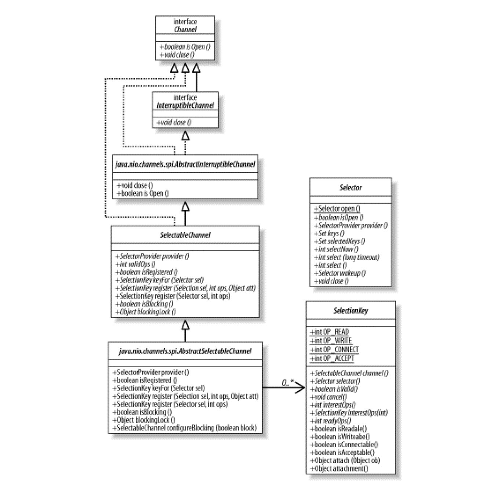
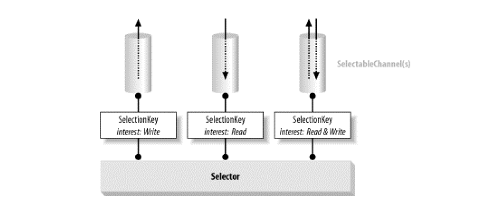

#   选择器

这是一个分工协作的范例：一个线程接收连接放进集合，一个线程便利集合找出符合条件的连接，多个线程处理准备好了的连接

选择器提供选择执行已经就绪的任务的能力，这使得多元 I/O 成为可能。

##  选择器基础

将创建的一个或多个可选择的通道注册到选择器对象中，一个表示通道和选择器的`键`将会被返回。

选择键会记住通道，并追踪对应的通道是否已经就绪。

当调用一个选择器对象的 select() 方法时，相关的键就会被更新，用来检查所有被注册到该选择器的通道。

可以获取一个键集合，从而找到当时已经就绪的通道。通过遍历这些键，可以选择出每个从上次调用 select() 开始直到现在，已经就绪的通道。

从最基础的层面来看，选择器提供了询问通道是否已经准备好执行每个 I/O 操作的能力。

就绪选择的真正价值在于潜在的大量的通道可以同时进行就绪状态的检查，调用者可以轻松的决定多个通道中的哪一个准备好药运行。

只有非阻塞模型是不够的，非阻塞模式同时还会执行请求的任务，或指出他无法执行这项任务，这与检查他是否能够执行某些类型的操作是不同的。

即使简单的询问每个通道是否已经就绪的方法是可行的，在某些代码需要遍历每一个候选的通道并按顺序进行检查的时候，仍然是有问题的。这会使得在检查每个通道是否就绪时都至少进行一次系统调用，这种代价十分昂贵。最主要的问题是，这种检查不是原子性的。列表中的一个通道都有可能在他检查之后就绪，但直到下一次轮询为止，不会察觉这种情况，更难的是，这种不断遍历列表别无选择，无法在某个感兴趣的通道就绪时得到通知。

真正的就绪选择必须由操作系统来做，操作系统的一项最重要的功能就是处理 I/O 请求并`通知`各个线程他们的数据已经准备好了。选择器类提供了这种抽象，使得 Java 代码能够以可移植的方式，请求底层的操作系统提供就绪选择服务。

1.  选择器，可选择通道和选择键类

-   就绪选择相关的类继承关系图

### 选择器(Selector)

选择器类管理着一个被注册的通道集合的信息和他们的`就绪状态`。

通道是和选择器一起被注册的，并且使用选择器来更新通道的就绪状态。

当这么做的时候，可以选择将被激发的线程挂起，直到有就绪的通道。

### 可选择通道(SelectableChannel)

提供了实现通道的可选择性所需要的公共方法，是所有支持就绪检查的通道类的父类。

FileChannel 对象不是可选择的，因为他没有继承 SelectableChannel，所有 socket 通道都是可选择的，包括从管道(Pipe)对象中获取的通道。

SelectableChannel 可以被注册到 Selector 对象上，同时可以指定对那个选择器而言，那种操作是感兴趣的。一个通道可以被注册到多个选择器上，但对每个选择器而言只能被注册一次。

### 选择键(SelectionKey)

选择键封装了特定的`通道`与特定的`选择器`的注册关系。

选择键对象被 SelectableChannel.register() 返回并提供一个表示这种注册关系的标记。

选择键包含了两个比特集(以整数的形式进行编码)，指示了该注册关系所关心的通道操作，以及通道已经准备好的操作。

-   就绪选择相关类的关系

调用可选择通道的 register() 方法会将他注册到一个选择器上。

选择器是提供管理功能的对象，对注册到他之上的通道执行就绪选择，并管理选择键。

2.  建立选择器

Selector 对象是通过调用静态工程方法 open() 来实例化的，数据从来没有通过他们进行传递。

当不再需要使用 Selector 时，需要调用 close() 方法来释放他可能占用的资源并将所有相关的选择键设置为无效。

在 JDK 1.4 中，有四种被定义的可选择操作：读(read)、写(write)、连接(connect)和接受(accept)。

选择器包含了注册到他们之上的通道的集合，在任意给定的时间里，对于一个给定的选择器和一个给定的通道而言，只有一种注册关系是有效的，但是，将一个通道注册到多于一个的选择器上是允许的。

##  使用选择键

一个键表示了一个特定的通道对象和一个特定的选择器对象之间的注册关系。

一个 SelectionKey 对象包含两个以整数形式进行编码的比特掩码：一个用于指示那些通道/选择器组合体所关心的操作，另一个表示通道准备好要执行的操作。

SelectionKey类定义了四个便于使用的布尔方法来测试这些比特值：isReadable( )，isWritable( )，isConnectable( )， 和isAcceptable()。

##  使用选择器

Selector 类是就绪选择的核心。

1.  选择过程

选择器维护着注册过的通道的集合，并且这些注册关系中的任意一个都是封装在 SelectionKey 对象中的。

-   每个 Selector 对象维护三个键的集合：
    -   已注册的键的集合：与选择器关联的已经注册的键的集合
    -   已选择的键的集合：已注册的键的集合的子类，这个集合的每个成员都是相关的通道被选择器判断为已经准备好的，并且包含于键 interest 集合中的操作
    -   已取消的键的集合：已注册的键的集合的子集，这个集合包含了 cancel() 方法被调用过的键，但他们还没有被注销

在一个刚初始化的 Selector 对象中，这三个集合都是空的。

Selector 类的核心是选择过程。基本上来说，选择器是对 select()、poll() 等本地调用或者类似的操作系统特定的系统调用的一个包装。

当三种形式的 select() 中的任意一种被选择器执行调用选择操作时，都会执行下面的步骤：

-   已取消的键的集合将会被检查

如果他是非空的，每个已取消的键的集合中的键将从另外两个集合中移除，并且相关的通道将被注销，这个步骤结束后，已取消的键的集合将是空的。

-   已注册的键的集合中的键的 interest 集合将被检查

在这个步骤中的检查执行过后，对 interest 集合的改动不会影响剩余的检查过程

一旦就绪条件被定下来，底层操作系统将会进行查询，以确定每个通道所关心的操作的真实就绪状态。

直到系统调用完成为止，这个过程可能会使调用线程睡眠一段时间，然后当前每个通道的就绪状态将确定下来。

对于那些还没准备好的通道将不会执行任何的操作，对于那些操作系统指示至少已经准备好 interset 集合中的一种操作的通道，将执行以下两种操作中的一种：

a. 如果通道的键还没有处于已选择的键的集合中，那么键的 ready 集合将被清空，然后表示操作系统发现的当前通道已经准备好的操作的比特掩码将被设置

b. 否则，也就是键已在选择的键的集合中，键的 ready 集合将被表示操作系统发现的当前已经准备好的操作的比特掩码更新。所有之前的已经不再是就绪状态的操作不会被清除

-   步骤 2 可能会花费很长时间，特别是激发处于休眠状态的线程需要很长时间时

与该选择器相关的键可能会同时被取消，当步骤2结束时，步骤1将重新执行，以完成任意一个在选择进行的过程中，键已经被取消的通道的注销。

-   select 操作返回的值是 ready 集合在步骤2中被修改的键的数量，而不是已选择的键的集合中的通道的总数。

返回值不是已经准备好的通道的总数，而是从上一个 select() 调用之后进入就绪状态的通道的数量。之前的调用中就绪的，并且在本次调用中仍然就绪的通道不会被计入，而那些在前一次调用中已经就绪但已经不再处于就绪状态的通道也不会被计入。

Selector 类的 select() 方法有三种不同的形式：仅仅在他们所注册的通道当前都没有就绪时，是否阻塞的方面有所不同。

2.  停止选择过程

是线程从被阻塞的 select() 方法中优雅的退出：wakeup()

-   唤醒在 select() 方法中睡眠的线程
    -   wakeup()：使得选择器上的第一个还没有返回的选择操作立即返回
    -   close()：任何一个在选择操作中阻塞的线程都将被唤醒，与选择器相关的通道将被注销，而键将被取消
    -   interrupt()：睡眠线程的返回状态将被设置

3.  管理选择键

选择是累计的，一旦一个选择器将一个键添加到它的已选择的键的集合中，他就不会移除这个键。

一旦一个键处理已选择的键的集合中，这个键的 ready 集合将只会被设置，而不会被清理。

合理的使用选择器的秘诀是理解选择器维护的`选择键集合`所扮演的角色。

清理一个 SelectKey 的 ready 集合的方式是将这个键从已选择的键的集合中移除。选择键的就绪状态只有在选择器对象在选择操作过程中才会修改。处理思想是只有在已选择的键的集合中的键才被认为是包含了合法的就绪信息，这些信息将在键中长久存在，直到键从已选择的键的集合中移除，以通知选择器已经看到并对他进行了处理。

通常的做法是在选择器上调用一次 select 操作(这将更新已选择的键的集合)，然后遍历 selectKeys() 方法返回的键的集合。在按顺序进行检查每个键的过程中，相关的通道也根据键的就绪集合进行处理，然后键将从已选择的键的集合中被移除，然后检查下一个键。完成后，通过再次调用 select() 方法重复这个循环。

3.  并发性

选择器对象是线程安全的，但他们包含的键集合不是。通过 keys() 和 selectKeys() 返回的键的集合是 Selector 对象内部的私有 Set 对象集合的直接引用，这些集合可能在任意时间被改变，已注册的键的集合是只读的。

如果在多个线程并发地访问一个选择器的键的集合的时候存在任何问题，可以采取一些步骤来合理的同步访问。

在多线程的场景中，如果需要对任何一个键的集合进行更改，不管是直接更改还是其他操作带来的副作用，都需要首先以相同的顺序，在同一对象上进行同步。锁的过程是非常重要的。如果竞争的线程没有以相同的顺序请求锁，就将会有死锁的潜在隐患。如果可以确保否其他线程不会同时访问选择器，那么就不必要进行同步了。

Selector 类的 close() 方法与 slect() 方法的同步方式是一样的，因此也有一定阻塞的可能性。在选择过程还在进行的过程中，所有对close() 的调用都会被阻塞，直到选择过程结束，或者执行选择的线程进入睡眠

##  异步关闭能力

任何时候都有可能关闭一个通道或者取消一个选择键，除非采取步骤进行同步，否则键的状态及相关的通道将发生意料之外的改变。

一个特定的键的集合中的一个键的存在并不保证键仍然是有效的，或者他相关的通道仍然是打开的。

当一个通道关闭时，他相关的键也就被取消了，这并不会影响正在进行的 select()，但这意味着在调用 select() 之前仍然是有效的键，在返回时可能变为无效。

总是可以使用由选择器的 selectKeys() 方法返回的已选择的键的集合，不要自己维护键的集合。

##  选择过程的可扩展性

使用一个线程来为多个通道提供服务，通过消除管理各个线程的额外开销，可能会降低复杂性并可能大幅提升性能，但只使用一个线程来服务所有可选择的通道是否是一个好主意???这要看情况。

对单CPU的系统而言这可能是一个好主意，因为在任何情况下都只有一个线程能够运行。通过消除在线程之间进行上下文切换带来的额外开销，总吞吐量可以得到提高。但对于一个多CPU的系统呢？在一个有n个CPU的系统上，当一个单一的线程线性地轮流处理每一个线程时，可能有n-1个cpu处于空闲状态。

在第一个场景中，如果您想要将更多的线程来为通道提供服务，请抵抗住使用多个选择器的欲望。

一个更好的策略是对所有的可选择通道使用一个选择器，并将对就绪通道的服务委托给其他线程。只用一个线程监控通道的就绪状态并使用一个协调好的工作线程池来处理和接收到的数据。根据部署的条件，线程池的大小是可以调整的。对可选择通道的管理仍然是简单的，而简单的就是好的。

第二个场景中，某些通道要求比其他通道更高的响应速度，可以通过使用两个选择器来解决：一个为命令连接服务，另一个为普通连接服务。

通道可以根据功能由不同的工作线程来处理。它们可能可以是日志线程池，命令/控制线程池，状态请求线程池，等等。

##  总结

-   就绪选择相关类

Selector、SelectableChannel 和 SelectionKey 这三个类组成了使得在 Java 平台上进行就绪检查变得可行的三驾马车。

-   选择键

SelectionKey 类封装了 Selector 对象和 SelectableChannel 之间的关系

-   选择器

选择器请求操作系统决定那个注册到给定选择器上的通道已经准备好指定感兴趣的 I/O 操作。

-   异步关闭能力

-   多线程

多线程用于为可选择通道提供服务，而不必借助多个选择器对象来实现

----