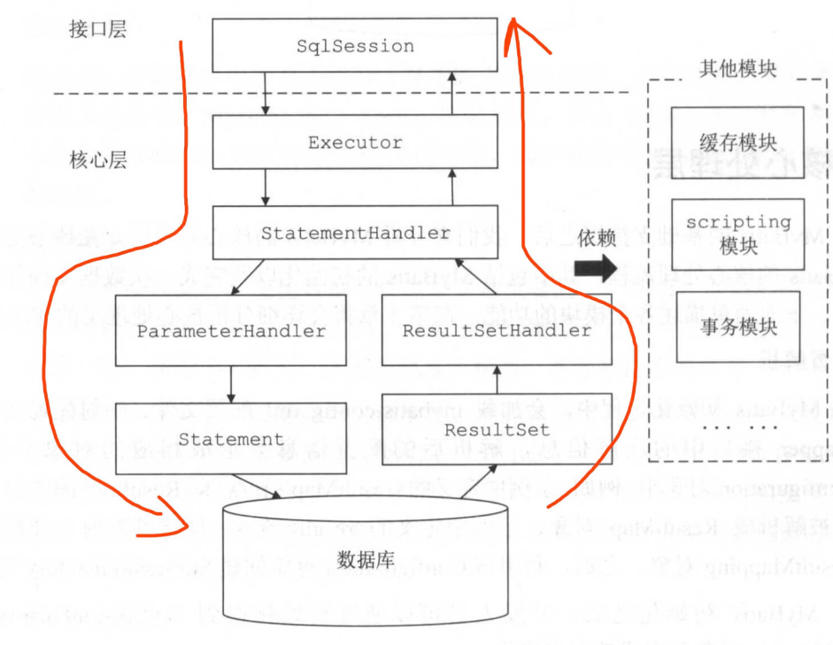

#   实现思路

##  启动初始化

框架运行所需的数据主要来自配置文件，需要在启动时解析XML文件转换成Java对象

-   框架配置文件

框架运行时全局设置，包括：数据源、扩展插件、日志、映射转换等等

-   SQL语句文件

管理SQL语句，特备是动态语句

SQL语句在XML文件里是节点层次树形体现

----

##  SQL执行

-   面向应用对象

提供简单接口供开发人员使用

对外表示框架的功能入口，对内表示与应用交互方式

-   JDBC流程类

因为是基于JDBC，就需要遵守它的规则

代表JDBC执行流程，协调框架组件执行逻辑

-   JDBC执行类

包装原始JDBC类，在包装类里添加逻辑

获取可执行SQL语句，SQL语句与Java方法绑定

----

##  基础支持

-   配置文件转Java对象工具

实现配置文件到Java对象的转换

-   获取Java实体类

解决JDBC第5步，转换JDBC对象和Java类型

请求参数设置到SQL语句里，响应结果转换到Java实体对象里，

-   扩展

Java领域里不能绕开的Spring，以及使用者根据实际情况实现自己的逻辑

----

##  整体结构

- MyBatis 执行组件

- MyBatis 三层结构

----