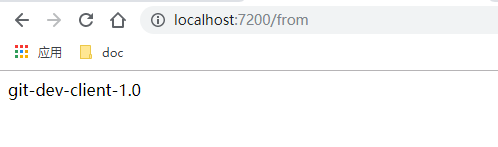
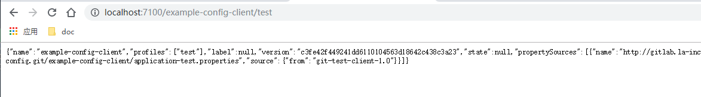

#   配置2：让配置服务作为应用

##  效果

让配置中心服务加入服务治理里面

##  项目列表
-   cloud-eureka-service：服务治理中心，第一个启动
-   cloud-config-service：服务配置中心服务端，其次启动
-   example-config-client：服务配置客户端示例，其次启动

##  访问
-   服务治理：http://localhost:1111/
    -   效果：
-   客户端REST查看配置信息：http://localhost:7200/from
    -   对应的是：application-dev.properties 里面的信息
    -   效果：
-   服务端查看：http://localhost:7100/example-config-client/test
    -   上述路径结尾是test，查看application-test.properties
    -   换成：dev、prod试试
    -   效果：

##  备注

example-config-client 没有把 cloud-config-service 地址给写死而是指定了服务名称，cloud-config-service 也可以启动多个实现可用性

