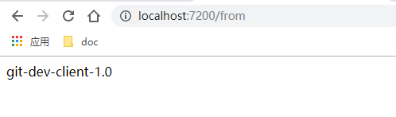
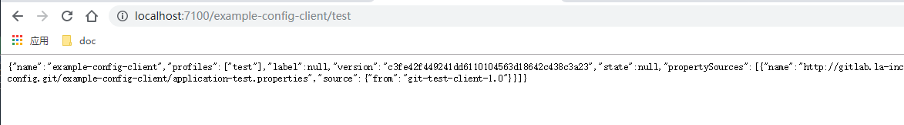

#   配置示例：Git

##  效果

把所有应用的配置信息放在Git上统一管理

##  项目列表
-   cloud-config-service：服务配置中心服务端，第一个启动
-   example-config-client：服务配置客户端示例，其次启动

spring cloud：
-   spring-cloud-config-server：配置管理中心服务端
-   spring-cloud-starter-config：配置管理客户端

##  访问

-   客户端REST查看配置信息：http://localhost:7200/from
    -   对应的是：application-dev.properties 里面的信息
    -   效果：
-   服务端查看：http://localhost:7100/example-config-client/test
    -   上述路径结尾是test，查看application-test.properties
    -   换成：dev、prod试试
    -   效果：

##  备注

配置中心客户端服务的配置文件：bootstrap.properties，会优于 application.properties 加载

放在 Git服务器 里面的配置文件可以当做普通文件被Git客户端工具修改，提交到Git服务器上面之后，刷新试试

配置文件存放在 Git服务器 上是其中一个存储方案，还可以 MySql，考虑得是不是很周到?

把 配置中心服务端 当做服务治理普通客户端加入进去，example-config-client 就不需要把 cloud-config-service 地址给写死了，另外配置应用客户端获得配置的方式除了直接拉去外，还可以通过消息中间件推过去，可以减少 配置中心服务端的压力

##  参考
-   [SpringBoot+Maven多模块项目（创建、依赖、打包可执行jar包部署测试）完整流程](https://blog.csdn.net/baidu_41885330/article/details/81875395)

----