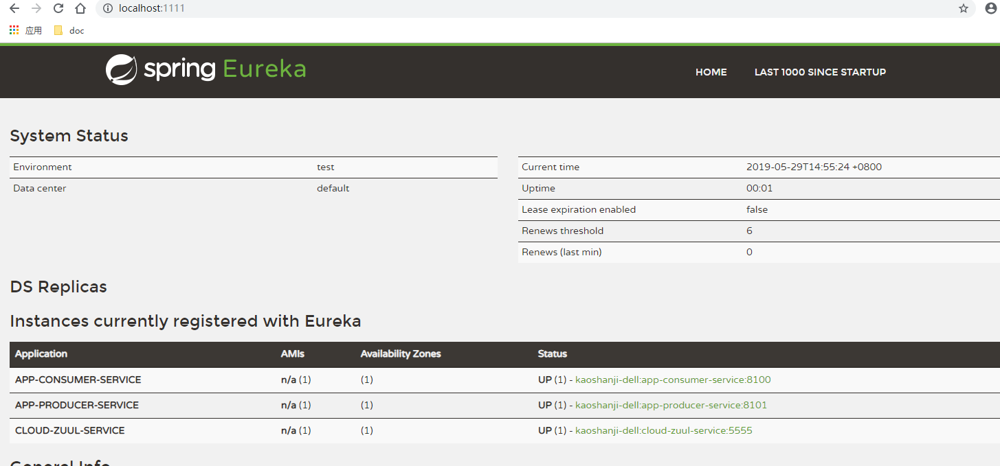
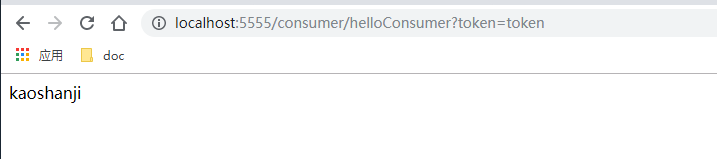
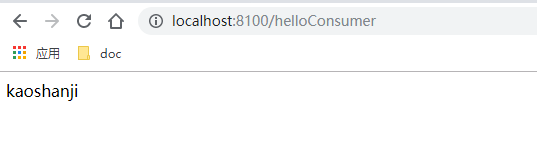

#   网关-zuul

使用 Spring Cloud Netflix 中的 Eureka 实现了服务注册中心以及服务注册与发现；而服务间通过 Ribbon 或 Feign 实现服务的消费以及均衡负载；通过 Spring Cloud Config 实现了应用多环境的外部化配置以及版本管理。为了使得服务集群更为健壮，使用 Hystrix 的融断机制来避免在微服务架构中个别服务出现异常时引起的故障蔓延。似乎一个微服务框架已经完成了。

还是少考虑了一个问题，外部的应用如何来访问内部各种各样的微服务呢？在微服务架构中，后端服务往往不直接开放给调用端，而是通过一个 API 网关根据请求的 URL，路由到相应的服务。当添加 API 网关后，在第三方调用端和服务提供方之间就创建了一面墙，这面墙直接与调用方通信进行权限控制，后将请求均衡分发给后台服务端。

##  效果

建立统一入口，代为转发请求，并添加权限验证等

##  项目列表

- cloud-eureka-service：服务治理中心，第一个启动
- app-producer-service：服务提供者，其次启动
- app-consumer-service：服务消费者，其次启动
- cloud-zuul-service：服务网关，其次启动

- spring cloud ：
  - spring-cloud-starter-netflix-zuul：网关

把网关服务也加入服务治理中心，配置的时候就可以直接使用服务名称

##  访问

访问服务治理：http://localhost:1111/

访问服务提供者：http://localhost:5555/consumer/helloConsumer?token=token

可以根据配置调整路径映射，阿里云服务器可以设置开放那些端口确保安全

直接访问服务提供者：http://localhost:8100/helloConsumer

##  备注

把一些与具体业务无关或具有全局性逻辑放在这里

