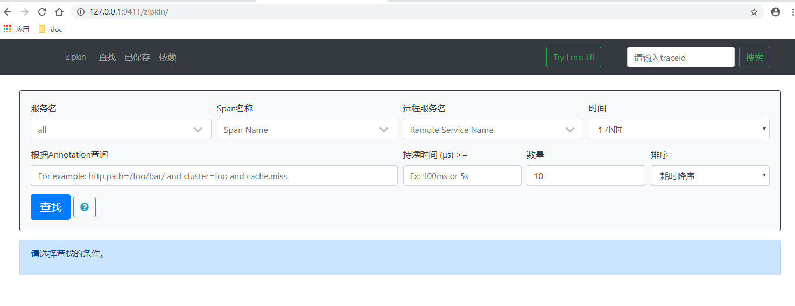

#   追踪服务调用过程-zipkin


##  效果

查看服务调用过程的信息


##  项目列表

**zipkin**

启动 [zipkin](https://zipkin.io/)，单独运行，不是在项目里构建

```bash
// 控制台直接执行
// 下载，可以在指定文件夹下执行
curl -sSL https://zipkin.io/quickstart.sh | bash -s

// 启动
java -jar zipkin.jar
```

**服务调用**
-   zipkin 第一个启动：地址：http://127.0.0.1:9411/zipkin/
    -   效果：
-   cloud-eureka-service：治理服务，第二个启动
-   app-producer-service：服务提供者，其次启动
-   app-consumer-service：服务消费者，再次启动

spring cloud：
-   spring-cloud-starter-sleuth：服务调用链路追踪
-   spring-cloud-starter-zipkin：集成zipkin，并展示追踪数据


##  访问
-   存在依赖调用的接口：http://localhost:8100/helloConsumer
-   刷新 9411 地址
    -   效果：


##  备注


当接口之间发生REST调用后，调用过程的信息就显示出来了，如果存在多级调用，也可以跟随下去

记录了每个节点执行的时间，这些信息默认放在内存中了，会对内存造成压力，重启之后也没有这些信息，可以放在MySql中

通过 HTTP 发送信息这是一种同步进行，阻塞了怎么办?消息中间件，也可以用在这里，把消息推送过去

