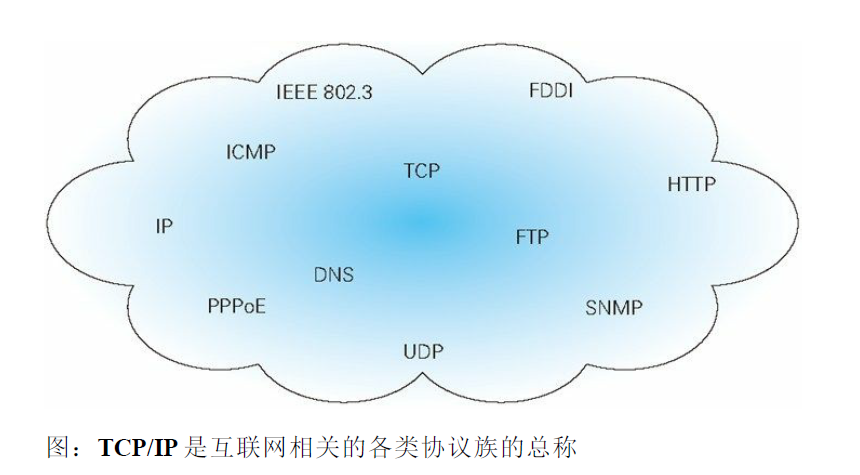

#   TCP/IP 协议族

计算机与网络设备要相互通信，双发就必须基于相同的方法。比如，如何探测到通信目标、由那一边先发起通信、使用那种语言进行通信、怎样结束通信等规则都需要事先确定。

不同的硬件、操作系统之间的通信，所有的这一切都需要一种规则，这种规则就称为协议。

协议中存在各式各样的内容，从电缆的规格到IP地址的选定方法、寻找异地用户的方法、双发建立通信的顺序，以及Web页面显示需要处理的步骤等等。

