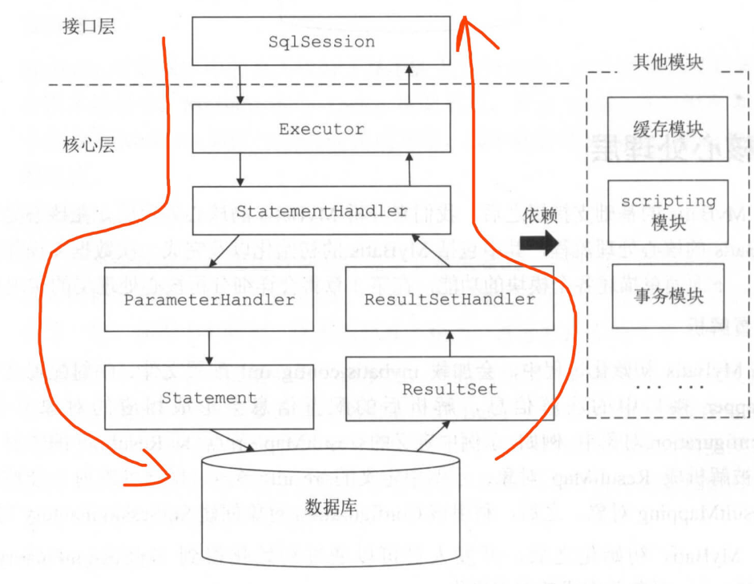

# mybatis 概述

##  定位

Java持久化框架，完成Java对象和数据库数据半自动化映射转换

- 理论背景

封装JDBC API，消除固定代码，简化SQL语句处理，提供一致性的接口。

JDBC执行流程：获取连接、执行SQL语句、关闭连接。

获取连接：可以从连接池获取或者自己实现，然后设置属性，以及事务

执行SQL语句：获取实际SQL语句，对输入参数和响应对象进行转换，不同的SQL语句执行方式和响应也是不同，这个流程可以优化和扩展，比如从缓存中获取查询数据，添加分页支持

关闭连接：连接是很重的资源，用完要归还或关闭。

##  描述 

1.  了解需求

JDBC 属于较底层原生API，并不适合直接在应用里面使用。

使用JDBC，SQL 语句通过Java代码拼接很不方便又分散在各处，特别是动态语句。转换结果集繁琐还容易出错，样板重复代码较多。

使用Java，要能更多的面对Java对象，不需要关注SQL太多细节。

目标是仅需要定义SQL语句，输入和输出都是对象，最好是能把SQL语句集中放置，并简单处理动态语句部分。

XML比较适合格式化的内容，定义SQL语句正好合适，通过标签可以分割各个语句，还处理了动态语句部分

XML里的节点信息需要与Java对象关联起来，比如SQL语句节点，对应的输入和输出对象，能够抽象到Java里。

主要技术：

- JDBC
- 解析XML
- 反射
- 动态代理

2.  业务流程

执行 SQL 语句，完成JDBC的流程。

- 初始化

实现各种配置或参数在系统里作为数据对象存在，作为数据支撑保证

对MapperConfig.xml、Mapper.xml等文件解析，或者接口扫描，目的是提取数据并保存到 Configuration 对象里，是MyBatis逻辑执行唯一数据来源，主要分为两类：全局参数和sql语句

以SQL语句为单位，关联执行相关对象，构建SQL语句，映射Java接口对象

- SQL执行

基于JDBC流程，但是把各个环节封装，Java对象与SQL字段映射，并且提供了一定的扩展

3.  一步一步

- 初始化

解析 MapperConfig.xml -> Mapper.xml -> Configuration

- SQL执行

SQL语句节点信息与Java接口方法是对应：输入参数、实际执行SQL语句、响应对象

输入参数需要转换，实际执行SQL语句可能动态拼接、响应对象需要转换

响应对象：获取SQL查询字段、对应类元数据、创建对象并设置值

生成代理执行对象

4.  对象元素

- Configuration：数据仓库，装有很多东西
- SqlSession：面向用户的接口，拥有Configuration
- Executor：实际执行流程导演，获取连接
- StatementHandler：SQL语句执行对象，JDBC里面的Statement接口
- TypeHandler：类型转换接口，类属性与SQL字段映射

5.  整体结构

- MyBatis 执行组件

- MyBatis 三层结构

